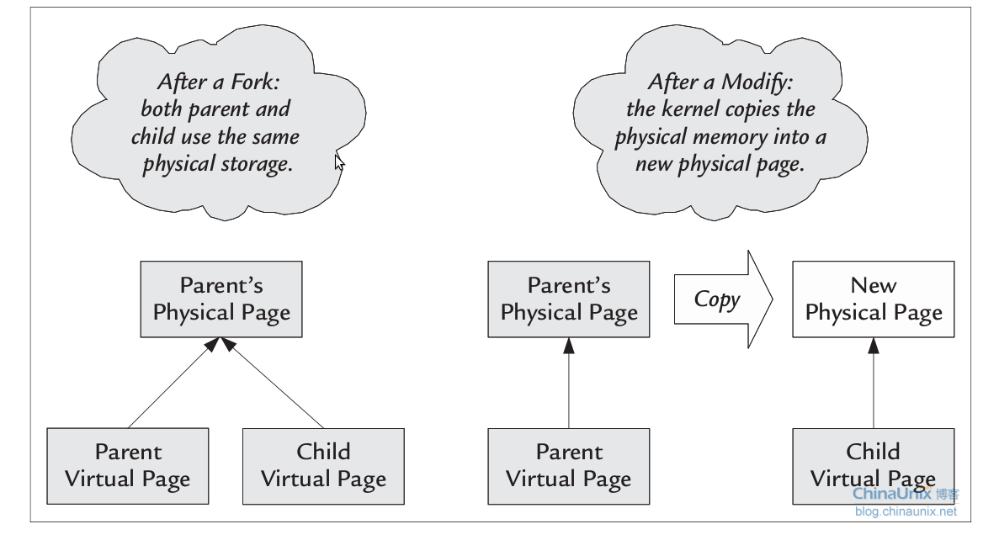

> CVE号是2016-5195，都过去好几年了这个漏洞，但是还是值得被拿出来学习，以此为切入点重新认识一下关于同步操作还有页分配机制上的安全问题


# `COW`
仅仅是从漏洞的名字上也可以看出来漏洞的触发点是`COW`机制上，那就从这个机制开始回顾，`写时拷贝`技术是通过`缺页异常`而衍生出来的机制，其意义在于使得地址空间上页的拷贝被推迟到了实际发生写入的时候，即直到发生写入时内核才会分配物理内存并拷贝数据到内存上，这个机制最显著的运用就在于`fork()`上面。


回顾到进程创建的流程里去，子进程在刚创建时候是和父进程完全相同的，那么这个相同该如何保证呢？数据都在物理内存上，而访问是依靠的虚拟内存，既然如此的话保持相同就可以有三种方式：
1. 直接为子进程开辟新的物理内存空间并把父进程的数据拷贝过去，并将子进程的虚拟内存映射过来
2. 将子进程的虚拟内存映射到父进程的物理内存上
3. 父子进程直接共享相同的虚拟内存和物理内存


第一种方式是远古时期的`fork()`实现，而第二种则是在引入了`cow`后的实现，第三种则是`vfork`的实现，那排开第三种不说，就来看看一二两种。传统的`fork()`直接为子进程分配了新的物理内存空间并增加了页映射，这就带来一个问题就是当前物理内存上的数据是完全拷贝自父进程的物理内存，然而很多情况下`fork()`以后紧接着就是通过`exec()`加载新的程序，这就导致先前的物理内存分配与拷贝完全都是无用功的，平白增加内核的工作，因此第二种方式被提出来也就是`写时拷贝`技术。





这是引用来的一张图，清晰地阐述了`fork()`之后的映射关系。把视线拉回来，既然知道了`copy`的意思，那接着就该谈论一下`on-write`的意义了。
既然在`fork()`完成后父子进程都是映射的相同的物理内存，那这样子进程写数据不会修改到父进程吗？这个进入到代码之中去看，子进程的创建大半工作其实都是由`copy_process`完成的。
```
    p = copy_process(clone_flags, stack_start, stack_size,
             child_tidptr, NULL, trace, tls, NUMA_NO_NODE);
```
而其中关于内存复制
```
    retval = copy_mm(clone_flags, p);
    if (retval)
        goto bad_fork_cleanup_signal;
```
子进程的内存映射是需要经过修改的，其相关实现在`dup_mm`中，其中`mm_init`是页表的相关设置，而`dup_mmap`则是相应的虚拟内存和页表映射。
```
        if (!(tmp->vm_flags & VM_WIPEONFORK))
            retval = copy_page_range(mm, oldmm, mpnt);
```
`copy_page_range`将父进程的页表结构整个复制给子进程，但是在最后一级页表中存放相同的页描述符，这样能保证子进程在写操作前和父进程共享相同的页，深入到这个函数中去看
`copy_page_range -> copy_p4d_range -> copy_pud_range -> copy_pmd_range -> copy_pte_range -> copy_one_pte`，在最后的函数中：
```
    /*
     * If it's a COW mapping, write protect it both
     * in the parent and the child
     */
    if (is_cow_mapping(vm_flags)) {
        ptep_set_wrprotect(src_mm, addr, src_pte);
        pte = pte_wrprotect(pte);
    }
```
做了一个写保护的，即对于父子进程来说这一片映射到的物理页都变成了只读，而在`mmap`中被标记为`shared`的内存则被标记为`wriable`，因为并不知道谁会先进行写操作，所以对于父子进程来说是都进`cow`机制。那这儿就有了一个问题，现在这个内存页是父子进程共同映射但是又都是只读的，那么如果父子进程都走`cow`的逻辑，就会造成一个物理页被`copy`两次，且这个原本的页会变得无进程使用，因此在这过程中增加了一个引用计数，即被`copy`则`cnt+1`，那么在缺页异常的处理中优先根据这个值判断一下是否跳过`copy`的过程。
```
/*
 * We can write to an anon page without COW if there are no other references
 * to it.  And as a side-effect, free up its swap: because the old content
 * on disk will never be read, and seeking back there to write new content
 * later would only waste time away from clustering.
 *
 * NOTE: total_map_swapcount should not be relied upon by the caller if
 * reuse_swap_page() returns false, but it may be always overwritten
 * (see the other implementation for CONFIG_SWAP=n).
 */
        if (reuse_swap_page(vmf->page, &total_map_swapcount)) {
            if (total_map_swapcount == 1) {
                /*
                 * The page is all ours. Move it to
                 * our anon_vma so the rmap code will
                 * not search our parent or siblings.
                 * Protected against the rmap code by
                 * the page lock.
                 */
                page_move_anon_rmap(vmf->page, vma);
            }
            unlock_page(vmf->page);
            wp_page_reuse(vmf);
            return VM_FAULT_WRITE;
        }
```
`COW`是一种思想与机制，即内存直到写时才进行拷贝(分配)，而并不是单单用于`fork`上面的一个实现。


# `Other COW`
`cow`的思想是好的，但是在不同的使用情况下总会有意料之外的情况发生，比如`get_user_pages()`这个函数针对`COW`的处理过程。
`get_user_pages`函数用于获取一个虚拟地址的物理页，既然是这个功能自然就应该有`COW`的过程参与其中，以`v4.5`的内核源码来跟踪一下。
```
long get_user_pages(struct task_struct *tsk, struct mm_struct *mm,
        unsigned long start, unsigned long nr_pages, int write,
        int force, struct page **pages, struct vm_area_struct **vmas)
{
    return __get_user_pages_locked(tsk, mm, start, nr_pages, write, force,
                       pages, vmas, NULL, false, FOLL_TOUCH);
}
EXPORT_SYMBOL(get_user_pages);
```
可以看到该函数会实际调用到`__get_user_pages_locked`跟入其中：
```
    if (pages)
        flags |= FOLL_GET;
    if (write)
        flags |= FOLL_WRITE;
    if (force)
        flags |= FOLL_FORCE;
```
首先会根据传入的参数来设置`flags(标志)`，其中`FOLL_WRITE`和`FOLL_FORCE`分别代表的写操作和读操作，接着就进入到一个死循环中，而第一行调用就是一个核心函数
```
    for (;;) {
        ret = __get_user_pages(tsk, mm, start, nr_pages, flags, pages,
                       vmas, locked);
```
跟入其中，其中需要关注的地方直接看这儿
```
retry:
        /*
         * If we have a pending SIGKILL, don't keep faulting pages and
         * potentially allocating memory.
         */
        if (unlikely(fatal_signal_pending(current)))
            return i ? i : -ERESTARTSYS;
        cond_resched();
        page = follow_page_mask(vma, start, foll_flags, &page_mask);
        if (!page) {
            int ret;
            ret = faultin_page(tsk, vma, start, &foll_flags,
                    nonblocking);
            switch (ret) {
            case 0:
                goto retry;
            case -EFAULT:
            case -ENOMEM:
            case -EHWPOISON:
                return i ? i : ret;
            case -EBUSY:
                return i;
            case -ENOENT:
                goto next_page;
            }
            BUG();
        } else if (PTR_ERR(page) == -EEXIST) {
            /*
             * Proper page table entry exists, but no corresponding
             * struct page.
             */
            goto next_page;
        } else if (IS_ERR(page)) {
            return i ? i : PTR_ERR(page);
        }
        if (pages) {
            pages[i] = page;
            flush_anon_page(vma, page, start);
            flush_dcache_page(page);
            page_mask = 0;
        }
```
`cond_resched()`这是一个线程调度函数，作用是主动放出权限，让CPU执行其他的线程，也就是允许延后执行的意思。主要看`page = follow_page_mask(vma, start, foll_flags, &page_mask);`
`follow_page_mask`的作用是根据虚拟地址查找其映射的物理内存页，但是如果是初次进行的操作来说，这儿显然应该是不能获得正确的结果，或者说内部会有一个`page fault`处理然后才获得正确的映射结果，跟进去看一下，是一个四层页映射的过程，最终调用的是`follow_page_pte(vma, address, pmd, flags)`
```
if (!pte_present(pte)) {
        swp_entry_t entry;
        /*
         * KSM's break_ksm() relies upon recognizing a ksm page
         * even while it is being migrated, so for that case we
         * need migration_entry_wait().
         */
        if (likely(!(flags & FOLL_MIGRATION)))
            goto no_page;
        if (pte_none(pte))
            goto no_page;
no_page:
    pte_unmap_unlock(ptep, ptl);
    if (!pte_none(pte))
        return NULL;
    return no_page_table(vma, flags);
```
可以看到因为第一次写是没有建设映射，所以`pte_present`返回结果`L_PTE_PRESENT = 0`即页不在内存中，而`pte_none(pte) = true`，`pte`不是一个有效的页表项，最终进入到`no_page`的过程返回一个空指针。因此回顾到之前可以说`follow_page_mask`只会返回一个`NULL`，因而进入`faultin_page`的过程中。
```
            int ret;
            ret = faultin_page(tsk, vma, start, &foll_flags,
                    nonblocking);
```
`faultin_page`的函数功能是处理`page fault`来建立映射关系，函数的前半部分是一系列的`flags`判断，根据其来决定`fault_flags`，这个标志会最终决定`handle_mm_fault`的处理方式
```
    /* mlock all present pages, but do not fault in new pages */
    if ((*flags & (FOLL_POPULATE | FOLL_MLOCK)) == FOLL_MLOCK)
        return -ENOENT;
    /* For mm_populate(), just skip the stack guard page. */
    if ((*flags & FOLL_POPULATE) &&
            (stack_guard_page_start(vma, address) ||
             stack_guard_page_end(vma, address + PAGE_SIZE)))
        return -ENOENT;
    if (*flags & FOLL_WRITE)
        fault_flags |= FAULT_FLAG_WRITE;
    if (nonblocking)
        fault_flags |= FAULT_FLAG_ALLOW_RETRY;
    if (*flags & FOLL_NOWAIT)
        fault_flags |= FAULT_FLAG_ALLOW_RETRY | FAULT_FLAG_RETRY_NOWAIT;
    if (*flags & FOLL_TRIED) {
        VM_WARN_ON_ONCE(fault_flags & FAULT_FLAG_ALLOW_RETRY);
        fault_flags |= FAULT_FLAG_TRIED;
    }


    ret = handle_mm_fault(mm, vma, address, fault_flags);
```
此时把`COW`的机制代入的话，这儿的`flags`会触发以下逻辑
```
    if (*flags & FOLL_WRITE)
        fault_flags |= FAULT_FLAG_WRITE;
```
和`kernel`的函数命名规范一样，真实起作用的函数依然是`handle_mm_fault -> __handle_mm_fault`，但是到了这儿为止，我们关注的只有`pte`，因此直接跟入到`return handle_pte_fault(mm, vma, address, pte, pmd, flags);`中
```
    if (!pte_present(entry)) {
        if (pte_none(entry)) {
            if (vma_is_anonymous(vma))
                return do_anonymous_page(mm, vma, address,
                             pte, pmd, flags);
            else
                return do_fault(mm, vma, address, pte, pmd,
                        flags, entry);
        }
        return do_swap_page(mm, vma, address,
                    pte, pmd, flags, entry);
    }
```
根据之前的信息，会直接进入到`if (vma_is_anonymous(vma))`的判断流程中，`vma_is_anonymous`用于判断`vma`是否为匿名映射，实际的检测方式就是查看操作集是否为空
```
static inline bool vma_is_anonymous(struct vm_area_struct *vma)
{
    return !vma->vm_ops;
}
```
这儿得详细说道一下，产生一个`page fault`的前提条件是访问的内存地址必须是合法的，即存在于进程的某个`VMA`中，不然将会产生的是一个`segmentation fault`，回归到`cow`的流程中去，初次访问的时候去建立页映射关系，是如下的两种方式：
1. 针对匿名映射调用`do_anonymous_page`分配页面
2. 针对非匿名调用`do_fault`分配页面


那这个`vma->vm_ops`到底怎么来的呢？如果按照简单的理解的话，就是若`vma`是对应的磁盘上的某个文件则为非匿名映射，其中这部分的内存叫做`page cache`用作加速文件读取。因此`stack`和`heap`等实际上都是属于匿名映射，因此通常情况下的`page fault`都会走到`do_anonymous_page`的流程中。然而针对这次要分析的`DirtyCow`来说问题却偏偏出在`do_fault`中。
```
/*
 * We enter with non-exclusive mmap_sem (to exclude vma changes,
 * but allow concurrent faults).
 * The mmap_sem may have been released depending on flags and our
 * return value.  See filemap_fault() and __lock_page_or_retry().
 */
static int do_fault(struct mm_struct *mm, struct vm_area_struct *vma,
        unsigned long address, pte_t *page_table, pmd_t *pmd,
        unsigned int flags, pte_t orig_pte)
{
    pgoff_t pgoff = (((address & PAGE_MASK)
            - vma->vm_start) >> PAGE_SHIFT) + vma->vm_pgoff;


    pte_unmap(page_table);
    /* The VMA was not fully populated on mmap() or missing VM_DONTEXPAND */
    if (!vma->vm_ops->fault)
        return VM_FAULT_SIGBUS;
    if (!(flags & FAULT_FLAG_WRITE))
        return do_read_fault(mm, vma, address, pmd, pgoff, flags,
                orig_pte);
    if (!(vma->vm_flags & VM_SHARED))
        return do_cow_fault(mm, vma, address, pmd, pgoff, flags,
                orig_pte);
    return do_shared_fault(mm, vma, address, pmd, pgoff, flags, orig_pte);
}
```
前两个判断都不用理会，而对于最后一个判断会引入一个新的概念叫做`私有映射`，这其实是源于`mmap`的两种映射方式，而`mmap`可以理解成是一种特殊的文件读写操作。
`共享映射`即多个进程共同映射了相同一份文件且内容修改相互可见，当然为了保证数据完整性自然存在同步机制，还有一种就是`私有映射`，即虽然映射了相同的文件但是不同的进程间无法看到对方的修改，其依靠`COW`来实现。当进程需要修改`私有映射`的内容时，内核会调用`COW`机制创建一个副本用于修改，而对于其余进程来说`映射`的内容还是原本的文件内容，因此这种修改是只存在于内存中的，不会也不能被同步到磁盘上，最典型的例子就是动态链接库。
那对于`DirtyCow`来说是需要进入到`do_cow_fault`中的，那就跟进去继续看
```
    new_page = alloc_page_vma(GFP_HIGHUSER_MOVABLE, vma, address);
    if (!new_page)
        return VM_FAULT_OOM;
...
ret = __do_fault(vma, address, pgoff, flags, new_page, &fault_page);
...
    if (fault_page)
        copy_user_highpage(new_page, fault_page, address, vma);
...
do_set_pte(vma, address, new_page, pte, true, true);
...
    if (fault_page) {
        unlock_page(fault_page);
        page_cache_release(fault_page);
```
回顾前面对于`私有映射`的讲解，这儿会先创建出一个`new_page`出来，然后调用`__do_fault`函数进行缺页处理， 它会调用`vma->vm_ops->fault()`将文件内容从`page cache`读取到`fault_page`里，然后再把文件内容复制到`new_page`中，建立`pte`和`new_page`的映射，最后把`fault_page`释放掉。
> 这个流程里`fault_page`就是充当的新的`page cache`的作用，而`new_page`则是文件副本，为什么要新的`page cache`，因为相同进程的不同线程去修改这个文件内容的话对于线程来说当然应该是修改相互可见的模式啊


进到最后一步的`do_set_pte`之中去
```
void do_set_pte(struct vm_area_struct *vma, unsigned long address,
        struct page *page, pte_t *pte, bool write, bool anon)
{
    pte_t entry;


    flush_icache_page(vma, page);
    entry = mk_pte(page, vma->vm_page_prot);
    if (write)
        entry = maybe_mkwrite(pte_mkdirty(entry), vma);
    if (anon) {
        inc_mm_counter_fast(vma->vm_mm, MM_ANONPAGES);
        page_add_new_anon_rmap(page, vma, address, false);
    } else {
        inc_mm_counter_fast(vma->vm_mm, mm_counter_file(page));
        page_add_file_rmap(page);
    }
    set_pte_at(vma->vm_mm, address, pte, entry);


    /* no need to invalidate: a not-present page won't be cached */
    update_mmu_cache(vma, address, pte);
}
```
这儿受限先生成了一个新的`pte entry`，然后进入判断如果是写操作的话，就会进入到`maybe_mkwrite`的流程里
```
static inline pte_t maybe_mkwrite(pte_t pte, struct vm_area_struct *vma)
{
    if (likely(vma->vm_flags & VM_WRITE))
        pte = pte_mkwrite(pte);
    return pte;
}
static inline pte_t pte_mkwrite(pte_t pte)
{
    return pte_set_flags(pte, _PAGE_RW);
}
```
倘若`vma->vm_flags`是`VM_WRITE`的话，即映射方式中包含了写，则会设置页属性为`_PAGE_RW`，但是若是原本的`vma`映射是没有包含写权限的话，则`entry`不会变化，然后被设置到`vma`中，最后返回`0`到`__get_user_pages`中然后重新跳转到`retry`进行上述的流程。


然而问题就在于此时的`vma`中的`pte`是新的`pte`是没有`_PAGE_RW`的且是在内存中的即`PRESENT=1`，因此在重新进入到`follow_page_pte`中的时候命中如下
```
    if ((flags & FOLL_WRITE) && !pte_write(pte)) {
        pte_unmap_unlock(ptep, ptl);
        return NULL;
    }
```
因为又是返回的`NULL`导致重新进入到`faultin_page()`最终进入到`handle_pte_fault`中命中如下
```
    if (flags & FAULT_FLAG_WRITE) {
        if (!pte_write(entry))
            return do_wp_page(mm, vma, address,
                    pte, pmd, ptl, entry);
```
同时因为`pte`的映射的是先前的`new_page`本质上是属于匿名页面仅有单进程使用，因此命中
```
        if (reuse_swap_page(old_page)) {
            /*
             * The page is all ours.  Move it to our anon_vma so
             * the rmap code will not search our parent or siblings.
             * Protected against the rmap code by the page lock.
             */
            page_move_anon_rmap(old_page, vma, address);
            unlock_page(old_page);
            return wp_page_reuse(mm, vma, address, page_table, ptl,
                         orig_pte, old_page, 0, 0);
        }
```
这儿的`wp_page_reuse`最终会返回一个`VM_FAULT_WRITE`，然后一直返回到`faultin_page`命中
```
    if ((ret & VM_FAULT_WRITE) && !(vma->vm_flags & VM_WRITE))
        *flags &= ~FOLL_WRITE;
```
`flags`被修改清除了`FOLL_WRITE`，继续返回到`__get_user_pages()`的`retry`，而这次由于`flags`被修改导致以只读方式调用`follow_page_mask()`。


# 竞争
说是竞争不如说是`CPU`的抢占，一个`cpu`在一定时间内只能做一件事，而其余的线程/进程则需要等待直到`cpu`空闲出来，这部分其实在`同步机制`中有过提及，`kernel`有成熟的`锁机制`来处理这个问题，但是如果说故意不去使用`锁`会怎样呢？就是要让进程之间产生竞争对`临界资源`进行使用，那最后的结果会是怎样？显然这是会超出预期的，有竞争自然就会有退让，`cond_resched()`就是一个典型的退让函数，其作用是当检测到有`抢占`发生时则让出`cpu`交由其他进程/线程先运行以用来防止`soft lockup`或者调度延迟。


# `DirtyCow`
目光停留在第二次进入到`retry`的时候，本来是一个针对只读`私有映射`的写操作会因为变更逐渐变成一个读操作。这儿就产生了著名的`DirtyCow`漏洞，方法也很简单，就是在第二次`retry`的时候进行抢占然后调用`madvise`解除页映射关系，此时`pte`将会失效且`L_PTE_PRESENT = 0`，再次进入到`page fault`的环节，然而相比于第一次来说此时是一个`读操作缺页中断`，继续流程进入到`do_fault`中命中
```
    if (!(flags & FAULT_FLAG_WRITE))
        return do_read_fault(mm, vma, address, pmd, pgoff, flags,
                orig_pte);
```
但是这次就没有`new_page`了，文件内容直接被复制到了`fault_page(page cache)`里，然后设置映射关系即`pte -> page cache`。既然设置好了映射就又会一路返回到`retry`的地方再次进入到`follow_page_mask`而这一次则是因为已经有了映射而返回一个`page`。


上述所有流程中获取到了一个`page`，那接下来漏洞能够顺利利用就需要修改这个`page`的内容并写回到原文件，这要从`DirtyCow`利用的最初的入口来看。
进程去写一个`mmap`的映射区域可以通过直接写入`/proc/self/mem`的方式，这会触发`proc_mem_operations->write`
```
static const struct file_operations proc_mem_operations = {
    .llseek        = mem_lseek,
    .read        = mem_read,
    .write        = mem_write,
    .open        = mem_open,
    .release    = mem_release,
};
```
跟踪一下函数到`get_user_pages`的调用是在`mem_write -> mem_rw -> access_remote_vm -> __access_remote_vm -> get_user_pages`
```
ret = get_user_pages(tsk, mm, addr, 1,
                write, 1, &page, &vma);
...
        } else {
            bytes = len;
            offset = addr & (PAGE_SIZE-1);
            if (bytes > PAGE_SIZE-offset)
                bytes = PAGE_SIZE-offset;


            maddr = kmap(page);
            if (write) {
                copy_to_user_page(vma, page, addr,
                          maddr + offset, buf, bytes);
                set_page_dirty_lock(page);
            } else {
                copy_from_user_page(vma, page, addr,
                            buf, maddr + offset, bytes);
            }
            kunmap(page);
            page_cache_release(page);
        }
```
`get_user_pages`正确获取了一个`page`，在`__access_remote_vm`中则会通过`kmap`对`物理页面`进行一次短时间映射以获得一个虚拟地址，接着进入到判断里，而在这个判断中`write = 1`因此会调用`copy_to_user_page`把修改的内容从`buf`拷贝到`maddr + offset`，然后把`page`设置成`dirty`，之后`kunmap(page);`解除映射。
至此为止获得了一个修改了内容的`page`且其被设置成`dirty`，接下来就是内核自身的`回写机制`发挥功能了，被标记为`dirty`的`page`会被加入到`dirty list`中，然后由`kernel`周期性地写回到磁盘上，使得磁盘上的数据与`page cache`数据保持一致，同样的如果是`dirty page`被释放，以也一样会先触发`回写`写回磁盘，无论怎样这都会使得磁盘文件内容发生变化。


# 参考资料
* [fork，你拿什么证明你的写时拷贝（COW）]([http://blog.chinaunix.net/uid-24774106-id-3361500.html](http://blog.chinaunix.net/uid-24774106-id-3361500.html))
* [详谈Linux写时拷贝技术(copy-on-write)必看篇]([http://www.cppcns.com/os/linux/195253.html](http://www.cppcns.com/os/linux/195253.html))
* [Linux下进程的创建过程分析(_do_fork/do_fork详解)--Linux进程的管理与调度（八）]([https://blog.csdn.net/gatieme/article/details/51569932](https://blog.csdn.net/gatieme/article/details/51569932))
* [do_fork和COW]([https://awakening-fong.github.io/posts/mm/do_fork_cow/](https://awakening-fong.github.io/posts/mm/do_fork_cow/))
* [Linux内核笔记--内存管理之用户态进程内存分配]([https://www.cnblogs.com/JaSonS-toy/p/4998936.html](https://www.cnblogs.com/JaSonS-toy/p/4998936.html))
* [C|内存管理|COW in Linux]([https://zhuanlan.zhihu.com/p/70779813](https://zhuanlan.zhihu.com/p/70779813))
* [Linux Kernel get_user_pages() 源码分析]([https://v1ckydxp.github.io/2020/04/22/2020-04-22-CVE-2016-5195%20%E6%BC%8F%E6%B4%9E%E5%88%86%E6%9E%90/](https://v1ckydxp.github.io/2020/04/22/2020-04-22-CVE-2016-5195%20%E6%BC%8F%E6%B4%9E%E5%88%86%E6%9E%90/))
* [什么是匿名内存]([http://blog.bytemem.com/post/what-is-anony-memory](http://blog.bytemem.com/post/what-is-anony-memory))
* [page fault时发生了什么]([https://zhuanlan.zhihu.com/p/66046257](https://zhuanlan.zhihu.com/p/66046257))
* [Linux 内核源码分析-内存请页机制]([http://www.leviathan.vip/2019/03/03/Linux%E5%86%85%E6%A0%B8%E6%BA%90%E7%A0%81%E5%88%86%E6%9E%90-%E5%86%85%E5%AD%98%E8%AF%B7%E9%A1%B5%E6%9C%BA%E5%88%B6/](http://www.leviathan.vip/2019/03/03/Linux%E5%86%85%E6%A0%B8%E6%BA%90%E7%A0%81%E5%88%86%E6%9E%90-%E5%86%85%E5%AD%98%E8%AF%B7%E9%A1%B5%E6%9C%BA%E5%88%B6/))
* [Linux中的Page Cache [一]]([https://zhuanlan.zhihu.com/p/68071761](https://zhuanlan.zhihu.com/p/68071761))
* [Linux中的mmap映射 [一]]([https://zhuanlan.zhihu.com/p/67894878](https://zhuanlan.zhihu.com/p/67894878))
* [__do_fault分析]([https://blog.csdn.net/CToday/article/details/25373689](https://blog.csdn.net/CToday/article/details/25373689))
* [Page Cache与Page回写详述]([https://m.linuxidc.com/Linux/2018-12/156117.htm](https://m.linuxidc.com/Linux/2018-12/156117.htm))