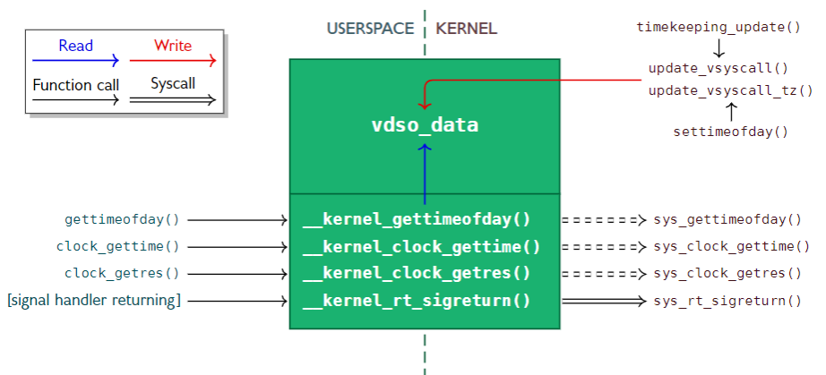
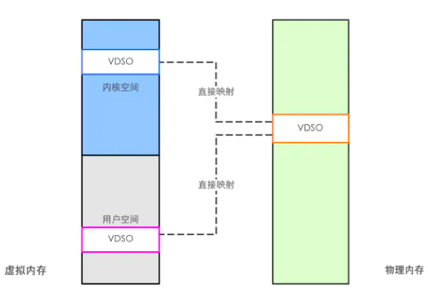

# vsyscall的来历
在2002年一个`patch`被打入了内核，其作用就是和标题写的一样[Add "sysenter" support on x86, and a "vsyscall" page.](https://lwn.net/Articles/18414/)，从此`vsyscall`才正式的被引入到`kernel`当中。


`vsyscall`到底是因何而产生的没有精力去考证了，但是大体原因有两个：
1. 为了和`glibc`解耦，但是这点从最终的实现上来说有些牵强，因此我更偏向于第二种原因
2. 高精度函数的使用


在早期的系统中所有的系统调用都是通过`int 0x80`的方式来调用，这个过程中涉及到了`用户态`到`内核态`的变化，因此需要耗费一定的时间，对于普通的系统调用来说当然是没有问题的，但是对于一些高精度函数比如`gettimeofday`这种获取到`毫秒`级别的函数来说太大的延迟是不能被接受的，那么对某些系统调用进行加速就被探讨了起来，其中诞生的一种想法就是`vsyscall`也就是`虚拟系统调用`。
既然传统的`系统调用`会有陷入内核态的操作，那如何才能在不陷入内核态的情况下就能获取到数据呢？内存共享是一个很好的选择，即一块内存区域内核态负责写入数据，而用户态可以直接读取，这就完全避免了模式切换的时间开销，那么当程序需要用到高精度函数的时候直接调用到`vsyscall`就可以快速获取到结果，当然`vsyscall`的代码自然不能放到`glibc`中而是由`kernel`实现，而用户态的逻辑以及映射数据的内存则都放在一个页当中，称为`vsyscall page`，定义好该页的映射起点，然后定义了4个高精度函数，每个函数间隔`1kb`，这都是约定好的地址，这样`glibc`只需要跳转到指定的地址就能调用到对应的函数，然而这终究是一个想法并没有得到实施。


后来`Intel`引入一个`sysenter/sysexit`指令用于实现系统调用的处理，这个指令本意上是用来取代`int 0x80`因为其有着更高的处理速度，但是第二个问题就来了那就是这个指令是`Intel`的而`AMD`也实现了自己的指令`syscall/sysret`，`AMD`在`64位`下不支持`sysenter`而同样的`intel`在`32位`下也不支持`syscall`，这就导致必须要有一个方案能够兼容二者，至此`vsyscall`被重新抬上了桌面。
> 不过在早期只有`int 0x80`和`sysenter`这两个选项，而按照现代的趋势，`syscall`因为其优越性而逐渐淘汰了`sysenter`成为系统调用的实现标准


`kernel`实现`vsyscall page`用来存放`系统调用`指令，而`glibc`的调用只需要指向这个地址就行，至于背后到底是`int 0x80`还是`sysenter`这个由`kernel`根据机器架构来决定。
```


static int __init sysenter_setup(void)
{
    static const char int80[] = {
    ........
    };
    static const char sysent[] = {
    ........
    };
    unsigned long page = get_zeroed_page(GFP_ATOMIC);


    __set_fixmap(FIX_VSYSCALL, __pa(page), PAGE_READONLY);
    memcpy((void *) page, int80, sizeof(int80));
    if (!boot_cpu_has(X86_FEATURE_SEP))
        return 0;


    memcpy((void *) page, sysent, sizeof(sysent));
    enable_sep_cpu(NULL);
    smp_call_function(enable_sep_cpu, NULL, 1, 1);
    return 0;
}


__initcall(sysenter_setup);
```
可以看到系统调用的实现被安排在`page`的首地址上，不过那时候还是`32位`时代所以不清楚约定的映射地址是什么。


# VDSO的时代
使用`vsyscall`自然会带来方便，问题也随之而来一个是调试一个是安全，程序崩溃会用到核心转储`core dump`来记录进程崩溃时的状态比如堆栈信息，然而`vsyscall`的实现是依靠的将代码直接映射到内存页上调用不存在`符号表`这种东西，这会为调试带来麻烦，而且因为`vsyscall`映射的地址是固定的无法被`ASLR`影响到这就带来了极大的安全隐患，这显然是不能被内核的开发者们接受的因此而开发出`vsyscall DSO`将原本页中的代码重做成了`ELF`程序的动态链接库，并且为了能用到`ASLR`将其移动到`user space`当中装载，这点用到了`辅助向量`的技术，在进程构建时由内核向用户空间传递了`vDSO`的起始地址。


但是实际上来说，此时`vsyscall`和`VDSO`是两个东西，而当到了`3.0`以后，`VDSO`完全实现了`vsyscall`上支持的系统调用从而导致开发者把移除`vsyscall`这档子事提上了日程，但是毕竟还有不少老程序还在用到`vsyscall`因此内核上在不是完全舍弃`vsyscall`的基础上重新实现了`vsyscall`的底层，即使是最大程度还原效果的`native`模式也只是正常的系统调用而非特制的`vsyscall`系的特定函数。
```
# cat /proc/26866/maps
    ........
7fff92acb000-7fff92ace000 r--p 00000000 00:00 0                          [vvar]
7fff92ace000-7fff92ad0000 r-xp 00000000 00:00 0                          [vdso]
ffffffffff600000-ffffffffff601000 r-xp 00000000 00:00 0                  [vsyscall]
```
`vvar`和`vdso`都是`VDSO`提供出来的功能，前者是只读变量区，而后者则是代码段。


# 具体实现
老时代的东西不再关注了，那就只关注一下新时代下`vsyscall`和`vDSO`的实现，首先是`vsyscall`的实现与映射的流程：
```
void __init map_vsyscall(void)
{
    extern char __vsyscall_page;
    unsigned long physaddr_vsyscall = __pa_symbol(&__vsyscall_page);


    if (vsyscall_mode != NONE) {
        __set_fixmap(VSYSCALL_PAGE, physaddr_vsyscall,
                 PAGE_KERNEL_VVAR);
        set_vsyscall_pgtable_user_bits(swapper_pg_dir);
    }


    BUILD_BUG_ON((unsigned long)__fix_to_virt(VSYSCALL_PAGE) !=
             (unsigned long)VSYSCALL_ADDR);
}
#define FIXADDR_TOP    (round_up(VSYSCALL_ADDR + PAGE_SIZE, 1<<PMD_SHIFT) - \
             PAGE_SIZE)
#define VSYSCALL_ADDR (-10UL << 20)
#define PAGE_SHIFT        12
VSYSCALL_PAGE = (FIXADDR_TOP - VSYSCALL_ADDR) >> PAGE_SHIFT
```


这是`4.17.18`版本的`kernel`，可以看到在这个版本下`vsyscall page`被设置成了`PAGE_KERNEL_VVAR`也就是可以通过`用户模式`只读模式访问该页，这实则对应了`emulate`模式也就是说以后也只有这个模式了，这个模式的系统调用发生很有意思，`page fault`处理：
```
static void
__bad_area_nosemaphore(struct pt_regs *regs, unsigned long error_code,
               unsigned long address, u32 *pkey, int si_code)
{
    ........
#ifdef CONFIG_X86_64
        /*
         * Instruction fetch faults in the vsyscall page might need
         * emulation.
         */
        if (unlikely((error_code & X86_PF_INSTR) &&
                 ((address & ~0xfff) == VSYSCALL_ADDR))) {
            if (emulate_vsyscall(regs, address))
                return;
        }
```
会检查错误地址是不是在`vsyscall page`里，是的话则调用到`emulate_vsyscall`来模拟执行。
接着是关于`vDSO`的实现，它实际上在核心功能上是完全照搬了`vsyscall`只不过是在表现形式上有所不同，如果说`vsyscall`的实现是将调用代码写入到一个页上并映射到`user space`中，那`vDSO`则要复杂一点，它在初始实现上就是通过把编译好的`vdso-image`映射到物理页面上，然后在`elf`装载时实现映射，这个功能主要依靠`map_vdso`函数实现，然后前者的映射对象是一个固定`page`，而后者则是根据一个`vdso_image`结构体的对象，这个结构体由初始化时创建。
```
void __init init_vdso_image(const struct vdso_image *image)
{
    BUG_ON(image->size % PAGE_SIZE != 0);


    apply_alternatives((struct alt_instr *)(image->data + image->alt),
               (struct alt_instr *)(image->data + image->alt +
                        image->alt_len));
}
```
因为是照搬的`vsyscall`，`vvar`就是之前`vsyscall`设想的`数据存储区域`，`vDSO`就是直接从这部分内存中读取到`内核`更新好的属于，达到高精度函数调用的目的。





这部分区域在内核中的实现被称为`vsyscall_gtod_data`，布局为一个`struct vsyscall_gtod_data`
```
struct vsyscall_gtod_data {
    unsigned seq;


    int vclock_mode;
    u64    cycle_last;
    u64    mask;
    u32    mult;
    u32    shift;


    /* open coded 'struct timespec' */
    u64        wall_time_snsec;
    gtod_long_t    wall_time_sec;
    gtod_long_t    monotonic_time_sec;
    u64        monotonic_time_snsec;
    gtod_long_t    wall_time_coarse_sec;
    gtod_long_t    wall_time_coarse_nsec;
    gtod_long_t    monotonic_time_coarse_sec;
    gtod_long_t    monotonic_time_coarse_nsec;


    int        tz_minuteswest;
    int        tz_dsttime;
};
```
这些都是代码上的解释，不如直接观察数据来的直观，因此可以从逆向的角度来分析一下`vDSO`的工作模式。首先是写一份`demo`代码来进行函数调用：
```
int main(int argc, char *argv[])
{
    struct timeval current_time;
    gettimeofday(&current_time, NULL);
    printf("seconds : %ld\nmicro seconds : %ld", current_time.tv_sec, current_time.tv_usec);
    return 0;
}
```
函数会调用到高精度函数`gettimeofday`，利用`gdb`运行起来并打印出`maps`
```
gef➤  i proc mappings 
process 203720
Mapped address spaces:


          Start Addr           End Addr       Size     Offset objfile
    ........    ........   ........    ........
      0x7ffff7fc6000     0x7ffff7fca000     0x4000        0x0 [vvar]
      0x7ffff7fca000     0x7ffff7fcc000     0x2000        0x0 [vdso]
      0x7ffff7fcc000     0x7ffff7fcd000     0x1000        0x0 /usr/lib/ld-2.33.so
      0x7ffff7fcd000     0x7ffff7ff1000    0x24000     0x1000 /usr/lib/ld-2.33.so
      0x7ffff7ff1000     0x7ffff7ffa000     0x9000    0x25000 /usr/lib/ld-2.33.so
      0x7ffff7ffb000     0x7ffff7ffd000     0x2000    0x2e000 /usr/lib/ld-2.33.so
      0x7ffff7ffd000     0x7ffff7fff000     0x2000    0x30000 /usr/lib/ld-2.33.so
      0x7ffffffde000     0x7ffffffff000    0x21000        0x0 [stack]
  0xffffffffff600000 0xffffffffff601000     0x1000        0x0 [vsyscall]
```
`vDSO`的代码段被映射到了`0x7ffff7fca000 - 0x7ffff7fcc000`将其提取出来，先放着等着后面分析。
```
gef➤  dumpmem vdso.so 0x7ffff7fca000 0x7ffff7fcc000
```
看一下`glibc`中的`gettimeofday`的实现方式
> 这个与`glibc`版本有很大关系，我本地测试的是`2.17`版本


```
   18 #include <sys/time.h>
   19 
   20 #ifdef SHARED
   21 
   22 # include <dl-vdso.h>
   23 
   24 # define VSYSCALL_ADDR_vgettimeofday    0xffffffffff600000ul
   25 
   26 void *gettimeofday_ifunc (void) __asm__ ("__gettimeofday");
   27 
   28 void *
   29 gettimeofday_ifunc (void)
   30 {
   31   PREPARE_VERSION (linux26, "LINUX_2.6", 61765110);
   32 
   33   /* If the vDSO is not available we fall back on the old vsyscall.  */
   34   return (_dl_vdso_vsym ("__vdso_gettimeofday", &linux26)
   35       ?: (void *) VSYSCALL_ADDR_vgettimeofday);
   36 }
   37 asm (".type __gettimeofday, %gnu_indirect_function");
   38 
   39 /* This is doing "libc_hidden_def (__gettimeofday)" but the compiler won't
   40    let us do it in C because it doesn't know we're defining __gettimeofday
   41    here in this file.  */
   42 asm (".globl __GI___gettimeofday\n"
   43      "__GI___gettimeofday = __gettimeofday");
   44 
   45 #else
   46 
   47 # include <sysdep.h>
   48 # include <errno.h>
   49 
   50 int
   51 __gettimeofday (struct timeval *tv, struct timezone *tz)
   52 {
   53   return INLINE_SYSCALL (gettimeofday, 2, tv, tz);
   54 }
   55 libc_hidden_def (__gettimeofday)
   56 
   57 #endif
   58 weak_alias (__gettimeofday, gettimeofday)
   59 libc_hidden_weak (gettimeofday)                                             
```
可以看到在`SHARED`的情况下，如果开启了`vDSO`则会调用到`_dl_vdso_vsym ("__vdso_gettimeofday", &linux26)`否则从`vsyscall`页面进行函数调用，这点实际上也符合`gdb`中追踪的预期
```
[-------------------------------------code-------------------------------------]
   0x7ffff7ac25fd <gettimeofday+29>:    mov    DWORD PTR [rsp+0x8],0x3ae75f6
   0x7ffff7ac2605 <gettimeofday+37>:    mov    QWORD PTR [rsp],rax
   0x7ffff7ac2609 <gettimeofday+41>:    mov    QWORD PTR [rsp+0x10],0x0
=> 0x7ffff7ac2612 <gettimeofday+50>:    call   0x7ffff7b4b010 <_dl_vdso_vsym>
   0x7ffff7ac2617 <gettimeofday+55>:    mov    rdx,0xffffffffff600000
   0x7ffff7ac261e <gettimeofday+62>:    test   rax,rax
   0x7ffff7ac2621 <gettimeofday+65>:    cmovne rdx,rax
   0x7ffff7ac2625 <gettimeofday+69>:    add    rsp,0x28
Guessed arguments:
arg[0]: 0x7ffff7b95d1f ("__vdso_gettimeofday")
arg[1]: 0x7fffffffd9a0 --> 0x7ffff7b94848 ("LINUX_2.6")
```
`__vdso_gettimeofday`这个函数的地址是`0x7ffff7ffae54`是落在`vdso`的范围之中的，那就说明确实是针对`VDSO`函数的调用，对之前获取到的`vdso.so`进行反汇编后发现这个函数反汇编的内容有点多，但是其实际逻辑不是很多，因此直接挂个源码吧
```
notrace int __vdso_gettimeofday(struct timeval *tv, struct timezone *tz)
{
    if (likely(tv != NULL)) {
        if (unlikely(do_realtime((struct timespec *)tv) == VCLOCK_NONE))
            return vdso_fallback_gtod(tv, tz);
        tv->tv_usec /= 1000;
    }
    if (unlikely(tz != NULL)) {
        tz->tz_minuteswest = gtod->tz_minuteswest;
        tz->tz_dsttime = gtod->tz_dsttime;
    }


    return 0;
}
int gettimeofday(struct timeval *, struct timezone *)
    __attribute__((weak, alias("__vdso_gettimeofday")));
```
就像之前所说的数据是获取自`vsyscall_gtod_data`，还是从逆向的角度说的话可以通过`gdb`找到这个`vsyscall_gtod_data`的地址然后来验证一下，这次挑一个逻辑少点的函数`__vdso_time`
```
0000000000000fc0 <__vdso_time@@LINUX_2.6>:
     fc0:    55                       push   %rbp
     fc1:    48 85 ff                 test   %rdi,%rdi
     fc4:    48 8b 05 dd c0 ff ff     mov    -0x3f23(%rip),%rax        # ffffffffffffd0a8 <__vdso_getcpu@@LINUX_2.6+0xffffffffffffc0b8>
     fcb:    48 89 e5                 mov    %rsp,%rbp
     fce:    74 03                    je     fd3 <__vdso_time@@LINUX_2.6+0x13>
     fd0:    48 89 07                 mov    %rax,(%rdi)
     fd3:    5d                       pop    %rbp
     fd4:    c3                       retq   
     fd5:    55                       push   %rbp
     fd6:    b8 60 00 00 00           mov    $0x60,%eax
     fdb:    0f 05                    syscall 
     fdd:    48 89 e5                 mov    %rsp,%rbp
     fe0:    5d                       pop    %rbp
     fe1:    c3                       retq   
```
直接从`ffffffffffffd0a8`的地址拿到了所需要的数据，通过`crash`查看一下内核中`vsyscall_gtod_data`的数据
```
# cat /proc/kallsyms|grep vsyscall_gtod_data
ffffffff826a7080 D vsyscall_gtod_data
crash> struct vsyscall_gtod_data 0xffffffff826a7080 -o
struct vsyscall_gtod_data {
  [ffffffff826a7080] unsigned int seq;
  [ffffffff826a7084] int vclock_mode;
  [ffffffff826a7088] u64 cycle_last;
  [ffffffff826a7090] u64 mask;
  [ffffffff826a7098] u32 mult;
  [ffffffff826a709c] u32 shift;
  [ffffffff826a70a0] u64 wall_time_snsec;
  [ffffffff826a70a8] gtod_long_t wall_time_sec;
  [ffffffff826a70b0] gtod_long_t monotonic_time_sec;
  [ffffffff826a70b8] u64 monotonic_time_snsec;
  [ffffffff826a70c0] gtod_long_t wall_time_coarse_sec;
  [ffffffff826a70c8] gtod_long_t wall_time_coarse_nsec;
  [ffffffff826a70d0] gtod_long_t monotonic_time_coarse_sec;
  [ffffffff826a70d8] gtod_long_t monotonic_time_coarse_nsec;
  [ffffffff826a70e0] int tz_minuteswest;
  [ffffffff826a70e4] int tz_dsttime;
}
SIZE: 104
```
结合内核源码的实现来看
```
notrace time_t __vdso_time(time_t *t)
{
    /* This is atomic on x86 so we don't need any locks. */
    time_t result = READ_ONCE(gtod->wall_time_sec);


    if (t)
        *t = result;
    return result;
}
time_t time(time_t *t)
    __attribute__((weak, alias("__vdso_time")));
```
用户态下的`ffffffffffffd0a8`地址应该就是映射的内核态中的`ffffffff826a70a8`


# 安全问题
`vdso`实质上还是一种内存映射且每个用户空间中都能看到，因为用户态针对该内存的权限只是`r-x`在平常的时候是没有问题的，但是倘若是系统有漏洞存在的话，`vdso`就很有可能成为利用点和突破点。





`vdso`是一块物理内存映射到多个虚拟内存以便各个进程调用，那么如果进程突破了`r-x`的限制能够写入这一块内存的话就代表其能够影响到全局的`vdso`调用，例如劫持了`_vdso_time`函数为自己的`shellcode`，这样当一个`root`进程调用`vdso`的函数的话就相当于在用`root`运行这段`shellcode`直接导致提权。
1. 通过内核`rop`布置栈来调用到set_memory_rw修改用户态下虚拟内存页的读写权限
2. 通过一个内核任意写漏洞直接修改到内核中的`vdso`，不过这个方法需要知道`vdso`在内核中的地址需要爆破
3. 利用类似`Dirty Cow`这种竞争漏洞强行将`shellcode`写入到`vdso`的只读页面中，然后等待root触发


# 参考文档
* [什麼是 Linux vDSO 與 vsyscall？——發展過程](https://alittleresearcher.blogspot.com/2017/04/linux-vdso-and-vsyscall-history.html)
* [On vsyscalls and the vDSO](https://lwn.net/Articles/446528/)
* [x86 架构下 Linux 的系统调用与 vsyscall, vDSO](https://vvl.me/2019/06/linux-syscall-and-vsyscall-vdso-in-x86/)
* [Implementing virtual system calls](https://lwn.net/Articles/615809/)
* [64位Linux下的系统调用](http://www.lenky.info/archives/2013/02/2199)