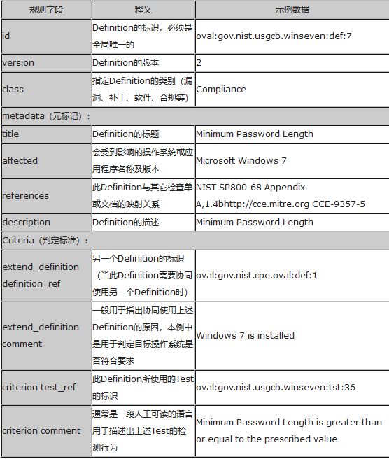
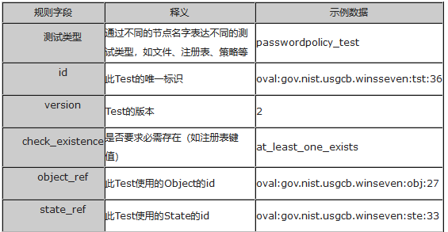
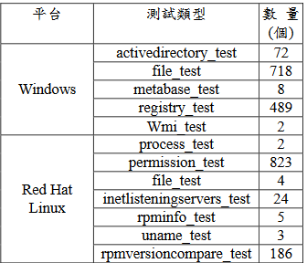

# 什么是OVAL
> 开放式漏洞与评估语言，一种用来定义检查项，脆弱点的描述语言，使用标准的XML格式组织内容，可以用于分析Windows，Linux，
Unix以及各种嵌入式操作系统的系统状态，漏洞，配置，补丁等情况。

## XML格式(Schema)
* OVAL定义格式
* OVAL系统特性格式
* OVAL结果格式

OVAL系统特性格式用于描述系统信息照，用来与OVAL定义文件进行匹配得出评估结果，OVAL结果格式用于描述评估结果。

**OVAL定义格式**最为重要，提供了一种机器可读的对系统进行安全评估的操作指南。

## OVAL定义格式
* 定义(Definition)
* 测试(Test)
* 对象(Object)
* 状态(State)
* 变量(Variable)

将各个要素以枚举方式列出。

### 定义(Definition)
这个是最重要的构成元素，它会引用一个或多个“测试”，根据“测试”的结果综合判定整体的结果。

如图：

对于Definition1来说，只有Test1与Test2都为True，才能为True

`定义`用于描述如何对某一个特定的安全问题进行检查，通常一个OVAL文档中包含了多个定义，主要有四类：
* 漏洞（Vulnerability）：描述如何根据系统状态判定系统中是否存在某个特定漏洞
* 补丁（Patch）：与漏洞定义类似，但它更关注如何判定系统中是否安装了某个特定补丁
* 软件（Inventory）：描述如何对系统中是否安装了某个特定的软件进行判定
* 合规（Compliance）：描述如何对系统是否满足某个特定的配置要求进行判定。

定义示例：
表1 “OVAL定义”示例数据

### 测试(Test)
通过定义一组OVAL对象(Object)和状态(State)执行

例子：windows和RedHat下的测试类型

### 对象(Object)
对象来描述测试的主题，测试主题类别很多(注册表，组策略，文件，软件包)，因此`Object`类型也很多，且每种类型结构不同。

### 状态(State)
用来描述测试主体的参考状态值，同OVAL对象类似，State也分为多种类型，每种类型的数据结构不相同。OVAL状态中可以使用var_ref引用一个OVAL变量表示OVAL状态的值，或者直接将值写入到value节点中。

### 变量(Variable)
定义了执行测试时State所需的值，其有三种类型：常量（constant_variable）、本地变量（local_variable）和外部变量（external_variable）。常量定义一个不能在运行时改变的值，本地变量定义在OVAL中直接使用的值，而外部变量通常用于将XCCDF的Value值传递到OVAL中。

## 英文技术文档

[Open Vulnerability and Assessment Language](https://oval.mitre.org/language/version5.4/ovaldefinition/documentation/oval-common-schema.html)

[OVAL技术文档](https://oval.mitre.org/language/version5.9/ovaldefinition/documentation/oval-definitions-schema.htm)

[Data Types Used In OVAL Definitions](http://www.itsecdb.com/oval/oval-datatypes.php)

## 答疑
* [关于check值中at least one和any_exist的区别答疑](http://making-security-measurable.1364806.n2.nabble.com/check-existence-difference-between-any-exist-and-atleast-one-exists-td23719.html)
* [RPM包版本比较](https://blog.csdn.net/rhel_admin/article/details/37592971)
> epoch:version-release ==> 1:5.0.6.2-15,The evr_string datatype represents the epoch, version, and release fields as a single version string. It has the form "EPOCH:VERSION-RELEASE". Comparisons involving this datatype should follow the algorithm of librpm's rpmvercmp() function。RPM沒有保證所有的不同版本編號方案都可以使用。通过EPOCH来判定，正常是没有的，默认为0(no value for epoch is set, defaulting to nil {:level=>:warn})

## OVAL实例
* [RedHat](https://www.redhat.com/security/data/oval/)
* [SUSE&openSUSE](https://support.novell.com/security/oval/)
* [debian](https://www.debian.org/security/oval/)
* [Ubuntu(待定)](https://people.canonical.com/~ubuntu-security/oval/)
* [All OVAL](https://oval.cisecurity.org/repository/download/5.11.2/vulnerability)

## RPM包格式

glibc-2.17.1-196.el7_4.2.x86_64
> name-version-relase.arch.rpm

软件名：glibc
主版本号：2
次版本号：17
修订号：1
release：196.el7_4.2
> rpm自身的发行号，与程序源码的发行号无关，仅用于标识对rpm包的不同制作的修订；同时，release还包含此包适用的OS

CPU架构：x86
系统位数：64