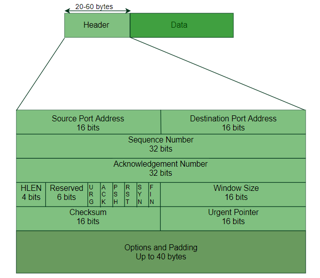
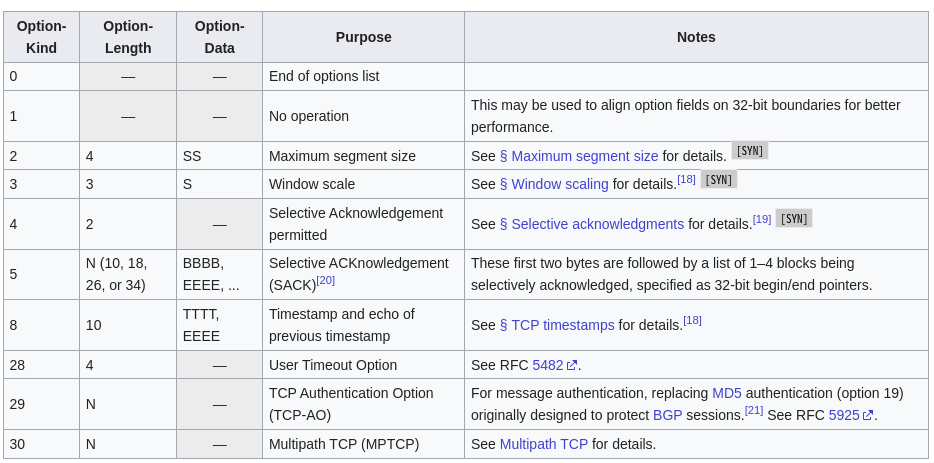
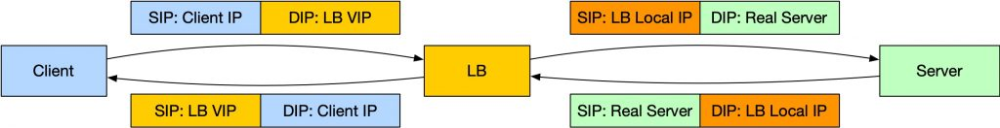

# 前言


> 很久没有写文章了，面试的时候遇到一个哥们，问他最近印象特别深刻的漏洞是什么，他说是`TOA伪造`，其实我当时挺尴尬的，因为这个东西我是真没研究过，所以赶紧补一下知识


`TOA`全称`Tcp Option Address`，这不是什么`Tcp`协议规范的字段，而是一种方案名称，相关的方案介绍可以查看[RFC7974](https://datatracker.ietf.org/doc/html/rfc7974)，大概的意思就是提出了在`Tcp option`中增加主机信息的方案，用于解决在某些场景下传递主机信息的问题，不过这个方案被明确拒绝了进入`Tcp`主线代码里，因此后面的大多数功能实现都是基于模块来支持。


好，接下来就是关注如下三个问题:
1. 什么是`Tcp Option`？
2.  `TOA`该怎么使用？
3. 风险是什么？


# 什么是`Tcp Option`





如上是一个`tcp header`的结构图，最大长度为`60 bytes`，而其中前`20 bytes`是固定长度，其中包含了`端口信息`,`序号`,`窗口`等信息，而第六层的区域就是`tcp option`区域，是一个最长是`40 bytes`长度的可变区域。


这块区域是干嘛用的呢？我们回顾一下`RFC793`也就是正式定义了`tcp`的那一份文档，可以看到当时已经有了`tcp option`的概念
```
https://datatracker.ietf.org/doc/html/rfc793#section-3.1
TCP Header Format


    0                   1                   2                   3


    0 1 2 3 4 5 6 7 8 9 0 1 2 3 4 5 6 7 8 9 0 1 2 3 4 5 6 7 8 9 0 1


   +-+-+-+-+-+-+-+-+-+-+-+-+-+-+-+-+-+-+-+-+-+-+-+-+-+-+-+-+-+-+-+-+


   |          Source Port          |       Destination Port        |


   +-+-+-+-+-+-+-+-+-+-+-+-+-+-+-+-+-+-+-+-+-+-+-+-+-+-+-+-+-+-+-+-+


   |                        Sequence Number                        |


   +-+-+-+-+-+-+-+-+-+-+-+-+-+-+-+-+-+-+-+-+-+-+-+-+-+-+-+-+-+-+-+-+


   |                    Acknowledgment Number                      |


   +-+-+-+-+-+-+-+-+-+-+-+-+-+-+-+-+-+-+-+-+-+-+-+-+-+-+-+-+-+-+-+-+


   |  Data |           |U|A|P|R|S|F|                               |


   | Offset| Reserved  |R|C|S|S|Y|I|            Window             |


   |       |           |G|K|H|T|N|N|                               |


   +-+-+-+-+-+-+-+-+-+-+-+-+-+-+-+-+-+-+-+-+-+-+-+-+-+-+-+-+-+-+-+-+


   |           Checksum            |         Urgent Pointer        |


   +-+-+-+-+-+-+-+-+-+-+-+-+-+-+-+-+-+-+-+-+-+-+-+-+-+-+-+-+-+-+-+-+


   |                    Options                    |    Padding    |


   +-+-+-+-+-+-+-+-+-+-+-+-+-+-+-+-+-+-+-+-+-+-+-+-+-+-+-+-+-+-+-+-+


   |                             data                              |


   +-+-+-+-+-+-+-+-+-+-+-+-+-+-+-+-+-+-+-+-+-+-+-+-+-+-+-+-+-+-+-+-+


                            TCP Header Format


          Note that one tick mark represents one bit position.


                               Figure 3.
```
不仅是如此，还明确规定了`options`的数据格式，以及明确了`TCP`必须实现所有的`options`，当时定义好的`options`仅有3个：
```
      Kind     Length    Meaning


      ----     ------    -------


       0         -       End of option list.


       1         -       No-Operation.


       2         4       Maximum Segment Size.
```
但是当我们回顾历史，翻阅最早的`tcp`的文献[《A Protocol for Packet Network Intercommunication》](https://www.cs.princeton.edu/courses/archive/fall06/cos561/papers/cerf74.pdf)，可以发现在当时的设想中并没有看到有关`options`这样自定义的部分存在
> 走马观花，完全没有生啃下来，所以如果有的话，当我没说


中间发生了什么并不是很清楚，只能是通过继续阅读大致猜测出来：
```
在早期，即协议规范确定以前，首部定义的数据就足以支撑计算节点之间的通信了，但是随着技术的发展，首部的基础信息就开始变得不够用了，但是这时候协议本身已经在世界上流行起来，通过更改预先定义的首部字段的方案基本不可能，所以规范上正式提出来将一个可选的字段定义在了当时首部的下面，然后通过选项字段来优化能力
```
目前来说已经被纳入规范并要求主线代码实现的`options`有如下：



# `TOA`该怎么使用


介绍完`Tcp Options`，那么就该回归到主题了 -- `TOA`，之前说过这是一个被拒绝的方案，也就是没有被当做是标准来实现。想知道怎么用，自然就要先知道这个方案到底是来解决什么问题的。
在之前的`rfc7974`中说明了该方案是用来尝试解决信息传递的问题，那么在实际场景中，会是什么样的情况我们会有这样的需求呢？


就以`LB`来说，当客户端发起请求的时候，目的地址是`LB`的ip，然后经过了`Full NAT`最终由`Rs(Real Server)`收到了来自`LB`的`tcp`报文





那么这样就有一个很明确的问题出来了，就是如果`Rs`想要知道客户端的真实`ip`怎么办？在并不修改上面的通信链路的情况下，最好的办法就是将`Clinet IP`塞到报文里，`Tcp Options`就正好能满足这个需求，只要`LB`在进行`Full NAT`时候将`Clinet IP`和`Client Port`放到`Tcp Options`中，当传递到`Rs`时候，再由`Rs`从报文中读取这一段信息，就能获取到客户端的真实地址信息，而这样的一套数据流转方案就被叫做`TOA`


可以明显看出来，这种方案对网络架构要求很低，但是缺点也就很明显了：
1. 中间层得支持`TOA`的实现
2. 因为`TOA`是一个非标方案，所以需要修改tcp逻辑来实现真实ip地址的提取


第一点在现在诸多云厂商上都是支持的，而第二点各家云厂商都各自实现了自己的`TOA`模块
* [Huawei/TCP_option_address](https://github.com/Huawei/TCP_option_address)
* [ALIYUN/TOA](https://ddos-toa-sdk.oss-cn-beijing.aliyuncs.com/toa_v2.zip)


但是这儿需要注意一点，我们先前说过在`Tcp Options`中的数据是需要满足一定的数据结构的
```
   +--------+--------+--------+--------+


   |  Kind  | Length |      data       |


   +--------+--------+--------+--------+
```
那么`LB`上设置的`Kind`自然需要和`Rs`上解析的`Kind`保持一致才行


# 风险点
从上面的流程里可以看出来，最大的问题就是`Rc`从`Tcp Options`中获取到这个客户端地址是否完全可信呢？
```
路人甲：啊！这个客户端地址是LB获取后写入的，怎么会不可信呢？
```
这么说没有错，但是如果在`LB`收到的`TCP`报文的时候，`Tcp Options`中就已经存在了客户端地址，会如何处理呢？


这就要看各家云厂商的中间件是怎么处理的了，如果是取了client ip以后直接塞到`tcp options`里面，无视已经被写入的`toa`还好说，但是如果当检测到有对应的`toa`以后就直接透传的话，就会导致`toa`外部可控，从而使得`RC`拿到的是外部指定的地址，从而 绕过某些ACL


# 参考
* [Tcp报文简介以及头部选项字段(Tcp Options字段)](https://blog.csdn.net/Hollake/article/details/89327474)
* [Options Field in TCP Header](https://www.geeksforgeeks.org/options-field-in-tcp-header/)
* [常用的TCP Option](https://blog.csdn.net/blakegao/article/details/19419237)
* [TRANSMISSION CONTROL PROTOCOL](https://datatracker.ietf.org/doc/html/rfc793)
* [A Protocol for Packet Network Intercommunication](https://www.cs.princeton.edu/courses/archive/fall06/cos561/papers/cerf74.pdf)
* [DDos 防护-获取客户端真实 IP（端口接入）](https://cloud.tencent.com/document/product/297/94816)
* [四层负载均衡漫谈](https://www.kawabangga.com/posts/5301)


