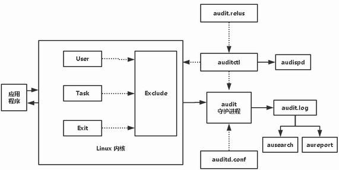

> audit是一种system，内核态的东西，而auditctl/auditd是使用audit system的application，是应用程序，用户态的东西

先说应用，这些应用用于linux系统的安全审计，能够将审计的记录写入日志文件，包括各种系统调用信息以及文件访问信息。
## 和syslog的区别
* `syslog`也是linux的日志系统，但是却又和`audit`有区别，`audit`主要是用于记录安全信息，而`syslog`则更杂，记录着各种警报以及软件的日志。
* `syslog`属于应用层，无法记录内核层的信息，`audit`是内核提供的日志时间记录能力，因此可以用来记录内核信息，如文件读写，权限改变，系统调用。
* `syslog`审计实现是内核函数`printk`将各种消息写入一个环境缓冲区，然后提供给上层的`sys_syslog`系统调用读取。而`audit`的实现则是内核其余线程通过`audit API`写入套接字缓冲区队列`audit_skb_queue`里，然后内核线程`kauditd`通过`netlink`将消息定向发送给用户空间的`auditd`的主线程，`auditd`再通过事件队列将消息传给应用的写log线程写入。
## 流程

内核的运行信息都会在`audit`中记录，然后按照规则传输给`auditd`，再有`auditd`进行其余操作，最后写入`log`文件，因为是`netlink`的通信机制，所以无需用户态主动发起请求。

## 主要目的
尽量少的消耗性能监控到系统调用以及各种安全事件，从而提供溯源追踪的能力。
## audit的内核实现
在内核初始化阶段时，会调用一个`audit_init`函数，这个函数能够初始化`audit系统`，首先会检查`audit_enable`，这个是内核引导时的命令参数，若为`0`则直接返回。
`audit_init`过程：
1. 通过`netlink_kernel_create()`创建一个`netlink`套接字`audit_sock`，并且注册了一个处理用户态数据的`audit_receive`函数，它负责接收处理用户态发送的netlink数据包。
2. 初始化链表还有变量信息，其中有`audit_skb_queue`用于保存`audit_buffer`
3. 通过`audit_log`生成本次初始化对应的日志
4. 初始化基于`inode`的审计规则对应的哈希链表
```
struct audit_buffer {
struct list_head list;
struct sk_buff *skb;/*格式化的套接字缓冲区，准备用于发送审计消息 */
 /*每个进程的审计上下文，包括进程的状态、时间和uid等，与进程上下文相关，可以为空 */
struct audit_context *ctx;
gfp_t gfp_mask;//缓存区的标识，如：__GFP_WAIT
};
```


`audit_receive()`函数的实现
这个函数封装了`audit_receive_skb`，实现过程：
1. 受限依照`netlink`协议获取数据报头和数据报文长度，给`audit_receive_msg`处理
2. 数据包处理完成，则通过`netlink_ack`向用户态发送响应
3. 获取下一个数据
`audit_receive_msg`：
这个函数是一个消息分发处理器，根据数据报头部的`nlmsg_type`进行分发处理，流程如下：
1. 获取到消息类型
2. 通过`audit_netlink_ok`检测消息类型是否合法，不合法则退出
3. 检查`kauditd`内核线程是否启动，煤气洞则通过`kthread_run()`启动该线程，此线程用于从`audit_skb_queue`发送消息
4. 根据当套接字缓冲区skb和当前进程获取审计所需的数据，如pid，uid等
5. 根据消息类型进行消息分发和处理

## audit处理用户层的规则
`audit_receive_filter`通过`audit_data_to_entry`将用户态发送的规则data转换成内核中使用的规则entry，然后将当前的规则添加到对应的规则链表里，一条规则就是一个`audit_entry`的一个元素
```
struct audit_entry {
struct list_headlist;
struct rcu_headrcu;
struct audit_krulerule;//规则
};
```
`audit_krule`
```
struct audit_krule {
intvers_ops;
u32flags;
/*加规则到链头或链尾，如：AUDIT_FILTER_PREPEND*/
u32listnr;             
/*规则链表标识，如：AUDIT_FILTER_EXIT */
u32action;             
/*操作域，为never或always，如：AUDIT_ALWAYS
u32mask[AUDIT_BITMASK_SIZE];
/*系统调用号计算成掩码位，如：open系统调用*/
u32buflen;    
/*链表规则上分配的缓冲区长度*/
u32field_count;       
/*规则域数组的成员个数*/
char*filterkey; 　  
/*当fields->type= AUDIT_FILTERKEY时的过滤关键字*/
struct audit_field*fields;        
/*规则域数组，定义规则的事件类型及比较运算符等*/
struct audit_field*inode_f; 　
/*对一个inode域的快速访问 */
struct audit_watch*watch;
/* 相关的watch */
struct list_headrlist;　
/*在audit_watch.rules链表上的入口 */
};
```
`audit`会接收所有的消息，按照规则输出符合规则的消息，而不符合的则被过滤掉

