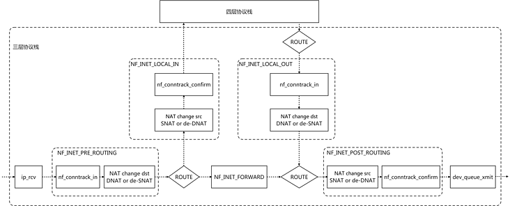

# 前言
写这篇文章的契机是因为最近在折腾`OpenWrt`，然后有好几个网络上的需求需要解决：
1. 科学上网
2. 游戏加速
3. acl隔离


诚然`OpenWrt`上有很多方案都可以实现，但是看了挺多资料，发现基本都是通过诸如`iptables`，`dnsmasq`，以及一些`TCP/UDP`转发来实现，但是却很少有资料会去提及到`ebpf`在此方面的应用，更别说是上`OpenWrt`了。


那么，就来研究一下我需要解决的问题以及对应的解决方案。


# 我的三大需求
## 科学上网
这也就是常说的`翻墙`，就是绕过`GFW`的封锁访问到国外的网站，首先就要搞明白你是怎么被`墙`的。
1. `DNS污染`
2. `IP封锁`


`GFW`通过检测国际出口的`DNS`请求，然后通过抢答(目前)的方式返回了虚假的`IP`，污染了你的`DNS`缓存，那么你就自然无法访问到想要访问的网站。
修改`/etc/hosts`是个好办法，但是不说你需要访问的外网域名何其繁多，需要一一对应，即便是你真的全都对应好了，也会因为该网站的`IP`在黑名单中而无法访问。


而目前常见的翻墙方式就可以归纳为以下三种：
1. 修改`/etc/hosts`
2. 代理软件
3. `VPN`


第一种不说了，只谈及后两种。
现在的代理软件很多，但是他们的工作模式都基本相同，都是通过将流量封装以后先发送到代理服务器上，然后再发送给真实请求地址，因为代理服务器的IP不在`GFW`的黑名单中且本身就在国外，所以才能让流量顺利出去。


`VPN`不仅能够实现代理软件的所有功能，相比起来也更加的安全且稳定，而且在能够封装的协议也更多，唯一的缺点就是部署麻烦或者是贵。


因而在大部分情况下，只是为了快速翻墙的人往往会选择代理的方式，便捷而且经济。


## 游戏加速
本来我的`Switch`上玩宝可梦，联机都是我个人的PC开了加速器，然后再修改主机网络将PC作为网关实现加速，但是最近搞上了软路由以后给我的网络结构发生了变化，我的加速器就突然变得没那么容易使用了。
其实说是游戏加速，本质上还是翻墙，因为我们无法联机的根本原因还是联机服务器被墙了


## acl隔离
这个其实本身是一个很简单的问题，就是因为我给自己家庭的不同设备划分了`vlan`，但是软路由上又跑了好几个业务，我并不想这些业务被某些`vlan`访问到，诚然用`iptables`就可以解决这个问题。


# 成熟方案
分析一下上述的三个需求，那么需要实现的就是这几个：
1. 流量控制：能够根据需求控制流量的转发或是丢弃
2. 代理：翻墙用
3. DNS防污染：返回正确的IP


这些在`OpenWrt`上其实都有了成熟的解决方案，在不谈及新技术的情况下，最简单的做法就是`dnsmasq`+`shadowsocks-libev`，前者负责`DNS防污染`，而后者则是作为透明代理来处理流量。


`DNS防污染`最要紧的一点就是需要有一个没有被污染的`域名解析服务`，如果你有自己的外网`vps`且速度不错，那当然是自己搭建一个`dns-server`最好，如果没有的话，恰好清华就有这么一台没被污染的公共`解析服务`，所以这儿我就是使用的它来用作解析被`GFW`拦截的域名。


但是我的网络是`南京电信`，如果是解析国内网站，运营商的服务器无疑是最快的，那么我自然是舍不得全局替换掉我的`DNS`的，因此这儿需要借助`dnsmasq`和`gfwlist`。
`dnsmasq`的解析顺序是：
1. `/etc/hosts`文件
2. `dnsmasq.d`下的`*.conf`文件
3. `dnsmasq.conf`
4. 自定义的上游解析器


而`gfwlist`则记录了被`gfw`所污染的外网域名，将这些按照一定的配置设置并存放到`dnsmasq.d`目录下，若遇到需要解析这些域名的情况，则会优先按照配置将域名转发到指定的`域名解析器`上解析，其余的则继续通过默认的上游解析器来解析。


既然已经获取到了域名的真实ip，那接下来考虑的就是让流量按照既定的规则，即`墙外IP`走代理，`墙内IP`则直接发送出去，`透明代理`无疑是最好的选择。
> `透明代理`是本文重点，因此划到下面讲，这儿直接说落地


`shadowsocks-libev`是一个很好用的`透明代理`工具，且同时支持`udp`和`tcp`的代理，配合`china-route.txt`(一份记录了国内IP范围的记录)可以让`目标ip`为国外的流量都走代理，至此便完成了整个翻墙和游戏加速的需求


而关于acl仅仅依靠`iptables`便可以解决，只需要将本地的服务端口对`vlan`网卡禁用即可，那么划分的`vlan`的机器自然也就无法访问到我软路由上的服务。


# 更`Geek`更`Hack`
> 我的软路由是`R86s`，`N5100`的芯片以及`16G`可用内存，如果只是跑个`OpenWrt`无疑是极大地浪费，那自然是更加折腾才好。


仔细回想一下上述的情况，既然是控制流量，那为什么不考虑使用`ebpf`呢？那就先看看`shadowsocks-libev`是怎么实现的。


## `ss-redir`
这是在透明代理方案中明确启动的一个进程，它会监听一个端口号，而后续我们使用的过程中，也可以明显发现我们的流量都会被转发到这个端口来。
> 我的实例是监听的1234这个端口


```
tcp        0      0 192.168.3.1:1234        192.168.3.119:54656     ESTABLISHED 4131/ss-redir
tcp        0      0 192.168.3.1:1234        192.168.3.119:54643     ESTABLISHED 4131/ss-redir
```
而这个工具最核心的功能就是获取到流量原本的`dst`和`port`，因为所有转发到这个端口的流量都是修改了这两个数据的，而后续封装传输之类的操作那是`ss-redir`本身的功能，因为不打算优化所以不做展开。
话扯回来，`ss-redir`是怎么实现这个功能的呢？
```
        if (mode != UDP_ONLY) {
            // Setup socket
            int listenfd;
            listenfd = create_and_bind(local_addr, local_port);
            if (listenfd == -1) {
                FATAL("bind() error");
            }
            if (listen(listenfd, SOMAXCONN) == -1) {
                FATAL("listen() error");
            }
            setnonblocking(listenfd);


            listen_ctx_current->fd = listenfd;


            ev_io_init(&listen_ctx_current->io, accept_cb, listenfd, EV_READ);
            ev_io_start(loop, &listen_ctx_current->io);
        }
```
`ss-redir`的流量有三种模式：`tcp_only`，`udp_only`，`tcp_and_udp`，对于接收到的非`udp`流量都会调用`accept_cb`来处理。
```
    err = getdestaddr(serverfd, &destaddr);
    if (err) {
        ERROR("getdestaddr");
        return;
    }
```
而`getdestaddr`则是获取到流量原本的`dst`和`port`的核心函数，跟入看一下：
```
static int
getdestaddr(int fd, struct sockaddr_storage *destaddr)
{
    socklen_t socklen = sizeof(*destaddr);
    int error         = 0;


    if (tcp_tproxy) {
        error = getsockname(fd, (void *)destaddr, &socklen);
    } else {
        error = getsockopt(fd, SOL_IPV6, IP6T_SO_ORIGINAL_DST, destaddr, &socklen);
        if (error) { // Didn't find a proper way to detect IP version.
            error = getsockopt(fd, SOL_IP, SO_ORIGINAL_DST, destaddr, &socklen);
        }
    }


    if (error) {
        return -1;
    }
    return 0;
}
```
可以看到，这儿借助了套接字函数获取到了原始数据，而`SO_ORIGINAL_DST`这个套接字选项在内核中是关联到`getorigdst`。
```
static struct nf_sockopt_ops so_getorigdst = {
    .pf        = PF_INET,
    .get_optmin    = SO_ORIGINAL_DST,
    .get_optmax    = SO_ORIGINAL_DST + 1,
    .get        = getorigdst,
    .owner        = THIS_MODULE,
};
```
先不谈这个函数，先说一下内核中的一个机制叫做`connection tracking(CT)`，也叫`连接跟踪`，主要的作用就是发现系统中的连接并跟踪记录下各种数据，实现的原理也并不困难：
1. 拦截（或称过滤）流经这台机器的每一个数据包，并进行分析
2. 根据这些信息建立起这台机器上的`连接信息数据库conntrack table`
3. 根据拦截到的包信息，不断更新数据库


在`CT`的概念里，只要是一个`元组tuple`定义的一条`数据流flow `就表示一条`连接connection`，因此`udp`甚至是`icmp`其实都是有连接记录的，那为什么说应用层没法直接通过这个方式获取到`udp`的`dst`和`port`呢？
这是因为`kernel`中关于`CT`的实现是基于`Netfilter`的，实际上来说我们可以从内核代码中`tuple`的类型看出来`netfilter`是支持`TCP`，`UDP`，`ICMP`，`DCCP`，`SCTP`，`GRE`这六类协议的。
```
/* This contains the information to distinguish a connection. */
struct nf_conntrack_tuple {
    struct nf_conntrack_man src;


    /* These are the parts of the tuple which are fixed. */
    struct {
        union nf_inet_addr u3;
        union {
            /* Add other protocols here. */
            __be16 all;


            struct {
                __be16 port;
            } tcp;
            struct {
                __be16 port;
            } udp;
            struct {
                u_int8_t type, code;
            } icmp;
            struct {
                __be16 port;
            } dccp;
            struct {
                __be16 port;
            } sctp;
            struct {
                __be16 key;
            } gre;
        } u;


        /* The protocol. */
        u_int8_t protonum;


        /* The direction (for tuplehash) */
        u_int8_t dir;
    } dst;
};
```
但是呢在`getorigdst`的实现上却只支持`tcp`和`sctp`，这就导致无法通过`SO_ORIGINAL_DST`获取到`udp`流量的原始信息。
```
/* Fast function for those who don't want to parse /proc (and I don't
 * blame them).
 * Reversing the socket's dst/src point of view gives us the reply
 * mapping.
 */
static int
getorigdst(struct sock *sk, int optval, void __user *user, int *len)
{
    ......
    /* We only do TCP and SCTP at the moment: is there a better way? */
    if (tuple.dst.protonum != IPPROTO_TCP &&
        tuple.dst.protonum != IPPROTO_SCTP) {
        pr_debug("SO_ORIGINAL_DST: Not a TCP/SCTP socket\n");
        return -ENOPROTOOPT;
    }
......
}
```
为什么不支持获取到`udp`的数据？
很简单，因为`getorigdst`的实现原理从连接的对端上获取到的原始信息，然而`udp`并非是`面向连接`的，这就产生了一个问题，如果强行从`监听套接字`中获取信息，会因为多个系统调用之间的延时，导致新的数据包进来刷新掉`连接信息`，因此关于`UDP`信息的提取需要用到另一个内核机制 -- `Transparent proxy` 。
> 从`2.2`被加入内核一直沿用至今


首先看一下`ss-redir`中关于`udp`的处理：
```
        // Setup UDP
        if (mode != TCP_ONLY) {
            LOGI("UDP relay enabled");
            char *host                       = remote_addr[0].host;
            char *port                       = remote_addr[0].port == NULL ? remote_port : remote_addr[0].port;
            struct sockaddr_storage *storage = ss_malloc(sizeof(struct sockaddr_storage));
            memset(storage, 0, sizeof(struct sockaddr_storage));
            if (get_sockaddr(host, port, storage, 1, ipv6first) == -1) {
                FATAL("failed to resolve the provided hostname");
            }
            struct sockaddr *addr = (struct sockaddr *)storage;
            init_udprelay(local_addr, local_port, addr,
                          get_sockaddr_len(addr), mtu, crypto, listen_ctx_current->timeout, NULL);
        }
```
交给了`init_udprelay`来处理，跟入进去看一下和`tcp`的处理有什么不同呢？
```
    // Bind to port
    int serverfd = create_server_socket(server_host, server_port);
    if (serverfd < 0) {
        return -1;
    }
    setnonblocking(serverfd);


    // Initialize cache
    struct cache *conn_cache;
    cache_create(&conn_cache, MAX_UDP_CONN_NUM, free_cb);


    server_ctx_t *server_ctx = new_server_ctx(serverfd);
```
通过`create_server_socket`绑定`UDP套接字`到`0.0.0.0`的代理端口上，并设置`IP_TRANSPARENT`，这样此套接字就能够接收目的地址为非本地的流量，这样配合上策略路由的设置，就可以将非本机地址的流量转发到此端口，然后再通过设置`IP_RECVORIGDSTADDR`把`dst`和`port`关联起来。
```
#ifdef MODULE_REDIR
        int sol    = rp->ai_family == AF_INET ? SOL_IP : SOL_IPV6;
        int flag_t = rp->ai_family == AF_INET ? IP_TRANSPARENT : IPV6_TRANSPARENT;
        int flag_r = rp->ai_family == AF_INET ? IP_RECVORIGDSTADDR : IPV6_RECVORIGDSTADDR;


        if (setsockopt(server_sock, sol, flag_t, &opt, sizeof(opt))) {
            ERROR("[udp] setsockopt IP_TRANSPARENT");
            exit(EXIT_FAILURE);
        }


        if (setsockopt(server_sock, sol, flag_r, &opt, sizeof(opt))) {
            FATAL("[udp] setsockopt IP_RECVORIGDSTADDR");
        }
#endif
```
然后再看`new_server_ctx`的处理：
```
server_ctx_t *
new_server_ctx(int fd)
{
    server_ctx_t *ctx = ss_malloc(sizeof(server_ctx_t));
    memset(ctx, 0, sizeof(server_ctx_t));


    ctx->fd = fd;


    ev_io_init(&ctx->io, server_recv_cb, fd, EV_READ);


    return ctx;
}
```
与`tcp`的处理一样，也有个和`accept_cb`对应的处理函数`server_recv_cb`：
```
    if (get_dstaddr(&msg, &dst_addr)) {
        LOGE("[udp] unable to get dest addr");
        goto CLEAN_UP;
    }
```
而在其中负责获取到原始`dst`的函数是`get_dstaddr`：
```
    for (cmsg = CMSG_FIRSTHDR(msg); cmsg; cmsg = CMSG_NXTHDR(msg, cmsg)) {
        if (cmsg->cmsg_level == SOL_IP && cmsg->cmsg_type == IP_RECVORIGDSTADDR) {
            memcpy(dstaddr, CMSG_DATA(cmsg), sizeof(struct sockaddr_in));
            dstaddr->ss_family = AF_INET;
            return 0;
        } else if (cmsg->cmsg_level == SOL_IPV6 && cmsg->cmsg_type == IPV6_RECVORIGDSTADDR) {
            memcpy(dstaddr, CMSG_DATA(cmsg), sizeof(struct sockaddr_in6));
            dstaddr->ss_family = AF_INET6;
            return 0;
        }
    }
```
可见通过先前设置了`IP_RECVORIGDSTADDR`关联的信息中提取到`dst`和`port`。
`ss-redir`只是一个应用层软件，即使是已经在监听的端口上做好了处理，依然面对着一个问题，就是谁来负责将流量转发到这个端口呢？


## `nftables`
`shadowsocks-libv`的流量转发是基于`nftables`实现的，其实这就是`iptables`的升级版，与`iptables`不同的是它可以通过文件管理规则，方便查看与修改。


依旧是先看`tcp`流量转发的实现
```
chain ss_rules_pre_tcp {                                                      
        type nat hook prerouting priority -1;                                 
        meta l4proto tcp iifname { eth1, eth1.100 } goto ss_rules_pre_src_tcp;
}
......
chain ss_rules_forward_tcp {                                                  
        meta l4proto tcp  redirect to :1234;                                  
}  
```
排除其他的一些规则，仅仅是上面的这一行，就可以将`eth1`和`eth1.100`两张网卡的`TCP`流量转发到`:1234`去，那么这点在内核中是怎么实现的呢？先前提到过`连接追踪`的机制，这儿就有引入了一个新的机制叫做`NAT`。
> `Network Address Translation`这种技术被普遍使用在有多台主机但只通过一个公有IP地址访问互联网的私有网络中。它是一个方便且得到了广泛应用的技术。当然，NAT也让主机之间的通信变得复杂，导致了通信效率的降低 -- 来自《维基百科》


这是一种在IP数据包通过路由器或防火墙时重写来源IP地址或目的IP地址的技术，而从技术运用上又可以分成如下：
1. `Static NAT`：是本地的IP永久映射成外网的IP
2. `Pooled NAT`：分配一个临时外网IP，当连接建立以后就分配下来，连接断开后则回收，常用于拨号
3. `Port-Level NAT`：将本地IP映射到外网的一个IP的不同端口上
    * `Source NAT(SNAT)`：修改源地址
    * `Destination NAT(DNAT)`：修改目的地址
        * `REDIRECT`：`DNAT`的一种特殊运用，将要转发的包目的地址修改到本地


而`REDIRECT`就是`tcp`流量转发的关键，正如在`linux`中`conntrack`是依靠`netfilter`来实现一样，`NAT`也是通过`netfilter`实现的。





可以通过上图很直观地看出流量的修改点位置，`tcp`流量在`PREROUTEING`中被修改了流量的目的地址。
> 因为不是专门去探讨`netfilter`的实现，所以不需要去深入内核源码


`tcp`的很简单，那`udp`的是否也可以这么干呢？
答案是不可以，因为正如先前所说的，`netfilter`中获取`源地址`的函数只支持了`TPC/SCTP`这两种，因此用户态下的程序是无法通过`netfilter`的相关函数获取到信息的，然而`linux`的`REDIRECT`又是基于`netfilter`实现的，所以你不能无视这个问题。


回看`ss-redir`关于`udp`原始流量端口的获取实现，可以看到它是直接获取到的当前数据包的`dst`和`port`，意思就是说这个数据包在转发到代理端口的时候，并没有被修改数据，怎么做到的？还记得上面介绍时候提到的`Transparent proxy`吗？
`shadowsocks-libv`在设置`udp`的转发上首先是添加了一个路由表`100`：
```
root@g0dA-route:~# ip rule list
0:      from all lookup local
32765:  from all fwmark 0x1 lookup 100
32766:  from all lookup main
32767:  from all lookup default
root@g0dA-route:~# ip route show table 100
local default dev lo scope host    
```
所有被标记了`0x1`的流量都会查询`100`这个表，而这个表中的策略是将所有流量路由到`lo`。
> `local`是一个路由类型，数据包交给本地协议栈处理，`default`就是`0.0.0.0/24`代表所有地址，具体可看[ip-route(8) — Linux manual page](https://man7.org/linux/man-pages/man8/ip-route.8.html)


```
chain ss_rules_pre_udp {                                                      
        type filter hook prerouting priority mangle;                          
        meta l4proto udp iifname { eth1, eth1.100 } goto ss_rules_pre_src_udp;
} 
....
chain ss_rules_forward_udp {                                                  
        meta l4proto udp  meta mark set 1 tproxy to :1234;                    
}
```
> 正常情况下`priority`后面应当是数字代表了优先级，但是后面添加了标准优先级名称


设置了`nftables`的规则让`eth1`和`eth1.100`的`udp`流量在`PREROUTING`中被添加了`0x1`的标记，然后通过`tproxy`转发到本地`:1234`。
如果说打标记没有疑问了，那么接下来唯一要解决的就是`tproxy`是怎么转发流量的。


## `TProxy`
> 其实这玩意也是由`netfilter`实现的


```
        .name        = "TPROXY",
        .family        = NFPROTO_IPV4,
        .table        = "mangle",
        .target        = tproxy_tg4_v1,
        .revision    = 1,
        .targetsize    = sizeof(struct xt_tproxy_target_info_v1),
        .checkentry    = tproxy_tg4_check,
        .hooks        = 1 << NF_INET_PRE_ROUTING,
        .me        = THIS_MODULE,
```
从`tproxy_tg_reg`就可以看出来这个技术也是在`mangle`中运行的，且仅仅适用于`TCP/UDP`
> `tproxy_tg4_check`是前置检查函数，会检查是否开启了`nf_defrag_ipv4`，也就是包重组功能，这确保了在`netfilter`中的包是完整的


剩余的源码我自己就懒得看了，[TProxy 探秘](https://blog.mmf.moe/post/tproxy-investigation/)这篇文章写得蛮清楚的，总结一下就是`Tproxy`通过修改`socket`的方式让流量到了指定的端口上。


## `ebpf`
至此关于`tcp/udp`的代理原理已经阐述清楚了，整套实现中涉及到了好几个配置，而且因为数据包的处理完全是由`netfilter`来处理，既然如此的话，为何不用`xdp`来处理这些呢？
> 关于`xdp`的好处不做阐述，自行了解或参照先前的文章


对于`ip封锁`这个需求，`xdp`无疑是性能最好的一个实现方式，那么唯一的疑问就是在`代理`这个环节上如何用`xdp`实现。
对于代理程序来说，最重要的就是获取到转发过来的流量的原始数据，如果使用`xdp`来转发`tcp/udp`的流量，就可以使用`map`的方式来存取数据，但是这儿就要注意一个问题，就是如果没有设计好`map`的话很有可能因为取的速度低于存的速度，从而导致代理产生问题。


第二点就是用户态的程序得支持`ebpf`才行，因为原先的`ss-redir`获取信息的方式是通过`netfilter`，而现在需要改成`map`，自然就要额外开发转发工具，这其中还需要把`ss`的部分也给实现了，显然有些不讨好。


emm，需要一定的时间来思考一下程序该怎么设计，所以文章待续，等整出来以后再继续写。


# 结语
失业三个月了，在家折腾这个折腾那个的，尽量让自己忙起来和充实起来，不然不安的情绪会让人十分烦躁。


# 参考资料
* [如何翻墙普及帖（几种代理的实现方式）](https://chinadigitaltimes.net/chinese/426827.html)
* [透明代理入门](https://xtls.github.io/document/level-2/transparent_proxy/transparent_proxy.html#%E4%BB%80%E4%B9%88%E6%98%AF%E9%80%8F%E6%98%8E%E4%BB%A3%E7%90%86)
* [什么是透明代理](https://switch-router.gitee.io/blog/transparent-proxy/)
* [深入理解GFW：DNS污染](https://blog.gd1214b.icu/post/H6XBza37Y/)
* [翻墙 - DNS污染的原理以及应对策略](https://dev.to/metalage303/fan-qiang-dnswu-ran-de-yuan-li-yi-ji-ying-dui-ce-lue-3em)
* [VPN 和代理的区别的有哪些？谁更好？| VPN 对比 Proxy](https://pandavpnpro.com/blog/zh-cn/vpn-vs-proxy-difference)
* [什么是 SSR、V2ray、Trojan、Clash，什么是机场？](https://young1lin.me/2020/10/30/GFW/#%E5%8E%9F%E7%90%86)
* [DNSmasq详细解析及详细配置](https://cloud.tencent.com/developer/article/1174717)
* [一键脚本将GFWList转换为dnsmasq规则实现路由器科学上网](https://ssr.tools/511)
* [/tproxy.txt](https://www.kernel.org/doc/Documentation/networking/tproxy.txt)
* [shadowsocks-libev/src/redir.c](https://github.com/shadowsocks/shadowsocks-libev/blob/master/src/redir.c)
* [连接跟踪（conntrack）：原理、应用及 Linux 内核实现](https://arthurchiao.art/blog/conntrack-design-and-implementation-zh/)
* [How to get original destination port of redirected UDP message?](https://stackoverflow.com/questions/5615579/how-to-get-original-destination-port-of-redirected-udp-message)
* [透明代理 UDP 为什么要用 TProxy？](https://www.jianshu.com/p/5393fb5e2c87)
* [L4(传输层)IP透明反向代理的实现(传递客户端真实IP)](https://zhensheng.im/tag/ip_transparent)
* [IP_TRANSPARENT usage](https://stackoverflow.com/questions/42738588/ip-transparent-usage)
* [Linux 网络 IP_TRANSPARENT 选项的内核实现](https://zhuanlan.zhihu.com/p/366767578)
* [[译] NAT - 网络地址转换（2016）](https://arthurchiao.art/blog/nat-zh/)
* [Linux网络协议栈-NAT原理介绍(图文详解)](https://zhuanlan.zhihu.com/p/422216523)
* [DNAT实现](https://github.com/hustcat/hustcat.github.io/blob/master/_posts/2016-03-10-linux-nat-internal.md)
* [Linux协议栈--NAT源码分析](http://cxd2014.github.io/2017/09/29/linux-nat/)
* [linux网络知识：路由策略（ip rule，ip route）](https://zhuanlan.zhihu.com/p/144585950)
* [nftables 简体中文](https://hezhiqiang8909.gitbook.io/nftables/)
* [Re: Weird priorities: priority filter, priority raw - 1, priority mangle, etc](https://www.spinics.net/lists/netfilter/msg58451.html)
* [nft(8)](https://manpages.debian.org/testing/nftables/nft.8.en.html)
* [nftables 速成](https://blog.wh2099.com/linux/nftables)
* [/iptables-tproxy-200710091749.diff](https://people.netfilter.org/hidden/tproxy/iptables-tproxy-200710091749.diff)
* [TProxy 探秘](https://blog.mmf.moe/post/tproxy-investigation/)