> 这个资料实际很早该写的，因为基本上所有其余的研究都绕不开内存。

不管是不是linux，先回归到计算机架构上，目前大部分架构都是`冯诺依曼结构`，也就是`指令`和`数据`都是在同一个存储器上的。但是再往前走的话就要说一下`图灵机`。
那不管是什么，这样一个存放数据的东西就是要说的`内存`。

计算机中的所有程序的运行都是在内存中进行的，其中包含了一个程序所需要用到的`指令`和`数据`，`内存`在`CPU`空闲时会传输给`CPU`完成`处理`和`运算`。更多的内容应该要学习下`《计算机组成原理》`。

# Linux上的内存
既然任何`指令`和`数据`都是在内存的，那么实际上是可以在运行过程控制到内存的数据。`CPU`是用来`运算`的，而`内存`提供相关的资源，那`CPU`是怎么获取到`内存`上的资源的呢？
这部分就不提及`总线`了，因为这部分实际上来说并不是要去控制的东西，着重学习`寻址`。

## `地址`与`寻址`
首先就是如何去看待`内存`，最简单来说就是把它视为一个存放信息的`表格`，那既然是`表格`就会有`编号`，这样才能方便寻找，这样的`编号`就是`内存地址`，而`CPU`的`寻址`就很麻烦了，因为从早期到现在变了不少东西，最典型的就是`物理地址`，`虚拟地址`，`线性地址`的引入。
* `物理地址`：`内存`中每个`内存单元`的编号，`内存单元`可以理解为一个`表格`的单个格子。
* `虚拟地址`：程序产生的由`段选择符`和`段内偏移地址`组成的地址，简单来说就是`偏移地址`(逻辑地址)
* `线性地址`：在没有`分页机制`的情况下，`线性地址`就是`物理地址`，不然就是`物理`和`虚拟`的中间层。
> 物理分页得线性，线性分段得虚拟

以前编程都是直接访问`物理地址`进行编程，然后只要程序出错了，整个系统就崩溃了，或者只要一个程序写错了内存区域，可能另一个程序就崩溃了，这样的情况下，就提出了各种保护机制，其中包括一点就是`程序使用虚拟地址访问内存，处理器负责虚拟地址到物理地址的映射`，这保证了`程序`不会直接接触到`物理内存`，有了一个缓冲可以作各种操作，比如`寻址出错后挂起错误进程`。

那在这种情况下，`cpu`是根据`物理地址`拿数据，而`进程`接触到的是`虚拟地址`。
> 世事无绝对

## `内核态`和`用户态`
本来说直接就整`寻址`了，但是就以`Linux`来说，就必然绕不过`非对称访问机制`，也就是把一整个内存空间划分为`用户空间`和`内核空间`，这样设计主要还是安全性的考虑，两种空间相互独立，且权限并不相同。那就要先把内存布局给整一下，毕竟`内存`硬件就那么一个，怎么使用就必然是一个问题。

先讲32位的Linux，其`CPU`的寻址能力是`4GB`，那么就`4GB`的虚拟内存是怎么分配的呢(不是指物理内存大小，单单指的是cpu的处理能力上限)？这儿用的是`3：1划分法`，也就是`用户空间`用3GB，`内核空间`用`1GB`。但是先前说过了`非对称访问机制`的问题，`内核空间`的权利是远高于`用户空间`的，这个权利表现在何处呢？那就是`用户空间`的`3GB`内存是实打实的`3GB`，`用户态程序`最多只能访问`3GB`虚拟内存，就算计算机上的内存条是`8GB`大小，`用户空间`也只能用到其中的`3GB`，即最大可用空间，至于不够用那就自己做内存数据交换吧。然而`内核空间`虽然值有`1GB`的大小却要求能够访问到所有物理内存。
> 内核需要具有对所有内存的寻址能力


接着说怎么划分呢？从`内核空间`开始谈。
这玩意的划分是写在内核代码里的`/arch/x86/include/asm/page_32_types.h`：
```
/*
 * This handles the memory map.
 *
 * A __PAGE_OFFSET of 0xC0000000 means that the kernel has
 * a virtual address space of one gigabyte, which limits the
 * amount of physical memory you can use to about 950MB.
 *
 * If you want more physical memory than this then see the CONFIG_HIGHMEM4G
 * and CONFIG_HIGHMEM64G options in the kernel configuration.
 */
#define __PAGE_OFFSET _AC(CONFIG_PAGE_OFFSET, UL)
```
首先要明白程序接触到的都是`逻辑地址`，不管是`内核空间`还是`用户空间`，如上的话`用户空间`的起始地址是`0x00000000`，`内核空间`的起始地址是`0xc0000000`，先前也说过`逻辑地址`实际上就是基于`基地址`的`偏移地址`。
`物理地址 = 逻辑地址 – 0xC0000000`？
并非如此，如果单纯是地址映射的话，`0xffffffff`对应的`物理地址`就是上限了，无法访问`上限`后的内存，因此在这个需求下`物理地址空间`又做了划分，即`ZONE_NORMAL`和`ZONE_DMA`之上又引入了`高端内存(ZONE_HIGHMEM)`的概念，范围是`0xF8000000 ~ 0xFFFFFFFF`，折算一下也就是`128MB`，至于使用方法就是`用时映射，用完释放`。
> 借一段地址空间，建立临时地址映射，用完后释放，达到这段地址空间可以循环使用，访问所有物理内存

也就是`物理地址空间`布局如下：

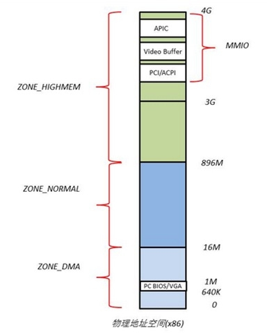

但是呢，`64位`则是没有这些东西的，因为`64位`的寻址能力特别大，而关于`内核空间`和`用户空间`的划分直接看内核文档：
[/x86/x86_64/mm.txt](https://elixir.bootlin.com/linux/v4.15/source/Documentation/x86/x86_64/mm.txt)

* `0xffff800000000000`之后就是`内核空间了`，大概`128TB`，而且目前的`x86_64`架构的CPU其实都遵循`AMD`的`Canonical Form`，即只有`虚拟地址`的最低`48`位才会在地址转换时被使用，且任何`虚拟地址`的`48-63`位必须与`47`位的一致，一般用户模式地址下高16bit都是`0x0`,而内核模式的地址则都是`0xf`。

`用户空间`的内存就比较奇特了，就是`32位`下每个`进程`都有一个`3GB`的`用户空间`，`子进程`共享/继承`与父进程`相同的`线性地址`到`物理地址`映射关系，但是并非共享`父进程`的用户空间。

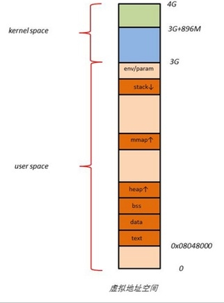

其中用户空间看到的那部分`kernel space`是C运行库的内容，用户无法访问，否则会段错误。
这又是关于`虚拟内存管理`的东西(来自百度)：
```
当程序的存储空间要求大于实际的内存空间时，就使得程序难以运行。虚拟存储技术就是利用实际内存空间和相对大的多的外部储存器存储空间相结合构成一个远远大于实际内存空间的虚拟存储空间，程序就运行在这个虚拟存储空间中。能够实现虚拟存储的依据是程序的局部性原理，即程序在运行过程中经常体现出运行在某个局部范围之内的特点．在时间上，经常运行相同的指令段和数据（称为时间局部性），在空间上，经常运行与某一局部存储空间的指令和数据(称为空间局部性），有些程序段不能同时运行或根本得不到运行。
```
## `地址转换`(全部基于64位)
先前都说过了，为了安全性的问题，虽然数据是实际保存在`物理地址`上的，但是`进程`接触到的都是`虚拟地址`，那自然得有一个虚实转换的过程。

然而对于`内核空间`来说，`逻辑地址`和`物理地址`就是一个单纯的线性映射关系，而为什么不用分页管理主要有两个原因：
1. 不用分页
2. 不能分页

不用分页是因为`linux`内核中并不需要分配大内存，功能上完全由用户程序来决定，因此内核本身不需要针对内存有太多的需求。而不能分页是因为内核内存是不可被交换到二级存储中的。先前研究启动机制的时候就说明过，linux本身可以看作是一个大进程，但是这个进程能够直接操作硬件，管理内存，例如中断实现上的指针啊，数据啊都是在内核内存中的，如果这部分内存交换到二级存储中的话，无疑是繁琐了中断处理的过程，倘若缺页中断的函数被交换到二级存储中，且内核发生缺页中断，那就没有相应的处理方式了。对于分页管理道理是相同的，如果分页函数被交换到二级存储中的话，内核本身就失去了分页机制。所以linux内核是没有分页内存的。

因此`内核内存`的转换也很有意思，当然在32位的情况下因为存在`高端内存`，那实际上来说是分为两种的转换方式的，一个是针对`低端内存`的直接映射关系，也被称为`线性映射区域`，另一种就是针对`高端内存`的映射关系，但是鉴于`x86_64`没有`高端内存`，就放在以后研究吧。

回到`内核内存`的映射，内核中直接映射`物理地址`的区域称为`线性映射区域`，这一区域的`虚拟地址`和`物理地址`相差一个`PAGE_OFFSET`，这是`kernel image`的`起始虚拟地址`，当然还需要加上`kernel image`的`起始物理地址`，即`PHYS_OFFSET`。

也就是`PHYS_ADDR = VIRT_ADDR - PAGE_OFFSET + PHYS_OFFSET`，这部分常驻内存中，然而在`Linux 2.0`后内核开始支持模块化，即只有在需要时才载入，这种内核模块机制让内核保持小体积，模块被加载到内核后，内核会为模块分配一块虚拟地址空间，在`4.x`下模块被放置到`VMALLOC`区域，所以模块申请的数据等虚拟地址都是在`VMALLOC`空间中，用`MODULE_VADDR`指定为`MODULE`虚拟内存区起始的地址，`MODULE_END`为终止地址
```
#define MODULES_VADDR (__START_KERNEL_map + KERNEL_IMAGE_SIZE)
/* The module sections ends with the start of the fixmap */
#define MODULES_END _AC(0xffffffffff000000, UL)
```
其中`__START_KERNEL_map + KERNEL_IMAGE_SIZE`的值是`0xffffffffc0000000`，而这一部分的`物理地址`和`虚拟地址`的转换需要建立新的页表，推后再说。

而对于`用户内存`来说，地址转换要复杂得多，用到了`4级页表`：
* `逻辑地址` -- `线性地址` -- `物理地址`

1. `段机制`
2. `页机制`

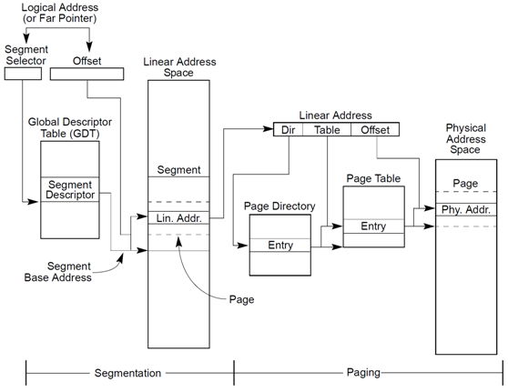

```
#define PAGE_SIZE (_AC(1,UL) << PAGE_SHIFT)
```
首先是`页机制`，内核将内存分成了很多`4kb`大小的`页`，这是`标准页`大小，以后内存管理关于内存的分配和回收的基本单位都是`内存页`，然后涉及到连续性问题又引入了一个`伙伴算法`，就是把`页面`添加到`伙伴系统`中适当的`free_area链表`里，然后释放时查看相邻内存块是否空闲，如果空闲就合并成更大的然后放到更高一阶的链表里，如此重复，这样就自然能获取连续的大`内存块(页框块)`。
但是一页这么大，然而`内核`一次要用到的内存可能远小于一页，是一个非常小的内存块，这些又会频繁的生成和销毁，为了满足`内核`对小内存的需求，就引入了一种`slab分配器`。这是基于`伙伴系统`基础上的一种内存分配方式，就是把`空闲链表`中的页撕碎成众多校内存块，用完后也不是直接释放而是放在`存储池`中，留着以后再用。

> 关于`地址转换`：
[64位Linux下的地址映射](https://blog.csdn.net/hhhanpan/article/details/80548687)这个文章讲的挺好的，处理器默认 CS， DS， ES， SS的段基址为 0，所以我们下面就不讨论逻辑地址到线性地址的转换了，因为基址为0，经过运算后线性地址和逻辑地址是一样的。

转化顺序：
a) 找到vmalloc虚拟内存对应的页表，并寻找到对应的页表项。
b) 获取页表项对应的页面指针。
c) 通过页面得到对应的内核物理内存映射区域地址。

## 实际测试
> 通过一个程序，把一个数据的`逻辑地址`，`线性地址`和`物理地址`都输出出来吧。

逻辑地址其实很好说，如果不考虑之前说的`段基址=0`的情况，还是存在`逻辑地址`到`线性地址`的转换过程的：
> IA-32情况下的图

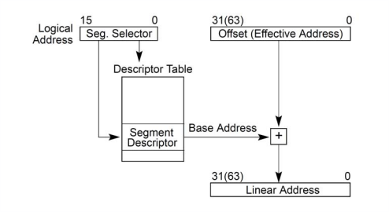

`Offset+段基址=线性地址`，然而`Linux`其实基本就不用`分段机制`，因为这个机制在`Linux`上也只是为了兼容下`IA-32`的硬件而已，但是呢`IA-32`的设计上`段机制`是不能够避免的，所以才会出现上面所说的`段基址=0`的情况，至于为什么是四个`段寄存器`这还是因为`IA-32`规定`代码段`和`数据段`必须是分开创建的不同的段，然而又因为`ring 0`和`ring 3`最终就导致了有四个`段寄存=0`。
这儿实际就按照实际去算一下`Base Address`便是，先看内核的代码：
```
static void
start_thread_common(struct pt_regs *regs, unsigned long new_ip,
      unsigned long new_sp,
      unsigned int _cs, unsigned int _ss, unsigned int _ds)
{
 WARN_ON_ONCE(regs != current_pt_regs());

 if (static_cpu_has(X86_BUG_NULL_SEG)) {
  /* Loading zero below won't clear the base. */
  loadsegment(fs, __USER_DS);
  load_gs_index(__USER_DS);
 }

 loadsegment(fs, 0);
 loadsegment(es, _ds);
 loadsegment(ds, _ds);
 load_gs_index(0);

 regs->ip = new_ip;
 regs->sp = new_sp;
 regs->cs = _cs;
 regs->ss = _ss;
 regs->flags = X86_EFLAGS_IF;
 force_iret();
}

void
start_thread(struct pt_regs *regs, unsigned long new_ip, unsigned long new_sp)
{
 start_thread_common(regs, new_ip, new_sp,
       __USER_CS, __USER_DS, 0);
}
EXPORT_SYMBOL_GPL(start_thread);
```
可以看下面的传参就明白了，其实内容就两个：
1. `__USER_DS` 数据段
2. `__USER_CS` 代码段

再去翻一翻定义：
```
#define GDT_ENTRY_DEFAULT_USER_DS 5
#define GDT_ENTRY_DEFAULT_USER_CS 6
#define __USER_DS (GDT_ENTRY_DEFAULT_USER_DS*8 + 3)
#define __USER_CS (GDT_ENTRY_DEFAULT_USER_CS*8 + 3)
```
> `+3`表示无特权

换算二进制，这儿二进制就是`段选择码`：

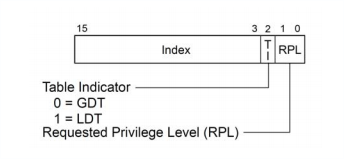

而`TI`位就是选择的`段描述符表`，大家都是`0`因此都是`GDT表`，也就是`cpu_gdt_table`，然后这个`cpu_gdt_table`的`基址`在内存管理寄存器`GDTR`中，`段选择码`的高13位就是`index`，也就是`5`这个`index`是`cpu_gdt_table`的下标，即该`DS段描述符`的`基址`，不过这个`基址`在源码中是`硬编码`的：
```
 [GDT_ENTRY_DEFAULT_USER_DS] = GDT_ENTRY_INIT(0xc0f3, 0, 0xfffff),
```
看函数：
```
#define GDT_ENTRY_INIT(flags, base, limit) { { { \
  .a = ((limit) & 0xffff) | (((base) & 0xffff) << 16), \
  .b = (((base) & 0xff0000) >> 16) | (((flags) & 0xf0ff) << 8) | \
   ((limit) & 0xf0000) | ((base) & 0xff000000), \
 } } }
```
这儿直接就说明了，`DS段`的base值为0。

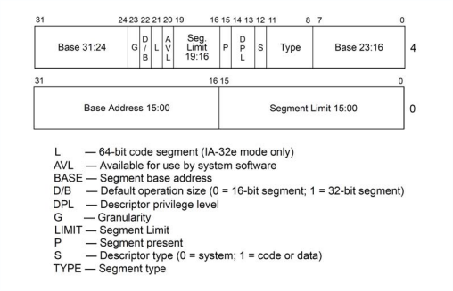

* `Base Address` = `Base 15:00` + `Base 23:16` + `Base 31:24`

这个可以通过代码看出来：
```
/* 8 byte segment descriptor */
struct desc_struct {
	u16	limit0;
	u16	base0;
	u16	base1: 8, type: 4, s: 1, dpl: 2, p: 1;
	u16	limit1: 4, avl: 1, l: 1, d: 1, g: 1, base2: 8;
} __attribute__((packed));

#define GDT_ENTRY_INIT(flags, base, limit)			\
	{							\
		.limit0		= (u16) (limit),		\
		.limit1		= ((limit) >> 16) & 0x0F,	\
		.base0		= (u16) (base),			\
		.base1		= ((base) >> 16) & 0xFF,	\
		.base2		= ((base) >> 24) & 0xFF,	\
		.type		= (flags & 0x0f),		\
		.s		= (flags >> 4) & 0x01,		\
		.dpl		= (flags >> 5) & 0x03,		\
		.p		= (flags >> 7) & 0x01,		\
		.avl		= (flags >> 12) & 0x01,		\
		.l		= (flags >> 13) & 0x01,		\
		.d		= (flags >> 14) & 0x01,		\
		.g		= (flags >> 15) & 0x01,		\
	}
```
那就再从代码层反过来走一遍：
* `ds` --> `selector` --> `gdtr` --> `cpu_gdt_table` --> `user_ds` --> `base`

> 然而问题是需要使用`特权指令`来保存寄存器信息，因此用户态下是没法编写的，只能用内核模块的方式解决这个问题。

准备下结构体：
`gdtr`:
```
struct gdtr {
 long int limite;
 char base;
} __attribute__ ((packed));
```
`cpu_gdt_table`:
```
struct gdt_page {
 struct desc_struct gdt[GDT_ENTRIES];
} __attribute__((aligned(PAGE_SIZE)));
```
通过`gdtr`提取`USER_DS`的地址，最终通过拼接`base`获取到`Base Address`为`00000000`，因此这儿就可以证明`逻辑地址`=`线性地址`。

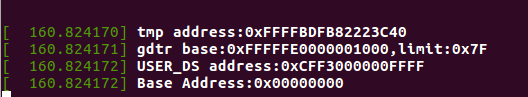

已经获取到了`线性地址`，那接下来就再去找对应的`物理地址`。
这儿是一个`页式`过程，过程比`段式`更为繁琐。

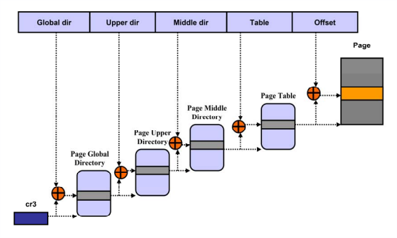

首先从`CR3寄存器`中获取到`页目录(Page Directory)`的基地址，然后通过`线性地址`中的`Directory位`在`页目录`中找到`页表(Page Table)`的基地址，接着根据`线性地址`中的`Table位`在`页表`中找到`页面(Page)`基地址，最后这个`基址` + `Offset位` = `物理地址`。
按照`64位`的模型来(9,9,9,9,12)：

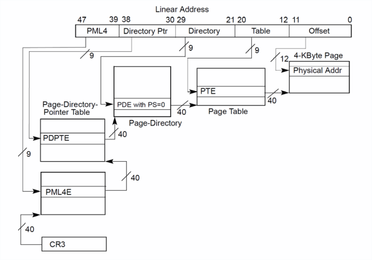

首先就是关于`CR3`的获取，内核中有这样的一串函数：
```
static inline void load_cr3(pgd_t *pgdir)
{
 write_cr3(__sme_pa(pgdir));
}
```
这个函数是加载`页目录`地址到`cr3`中的，去找`pgd_t`这个类型最后定位到的是`typedef unsigned long pgdval_t;`
关于获取就直接用`api`就行就不用写汇编了
```
unsigned long cr3;
cr3 = read_cr3_pa();
```
> `x86_64`的`线性地址`并不是`64bit`而是`48bit`，同时`物理地址`是`40bit`。这厮因为CPU最高`物理地址`是`52bit`，而实际支持的物理内存地址总线宽度是`40bit`。

从`cr3`之后获取的信息，如`页面目录`，`页表`等信息都保存在物理内存中，这就需要到物理内存访问，然而虽然内核模块能够访问到物理地址，但是代码本身是无法访问，代码访问的都是逻辑地址，因此还需要作转换才能提取值，具体的可以看这个:[Linux用户程序如何访问物理内存](http://ilinuxkernel.com/?p=1248)

而关于每一级获取到的物理映射地址，要注意一点的就是在`4级`转换过程中都要把低`12bit`置为0,因为这部分是页属性，并不需要。

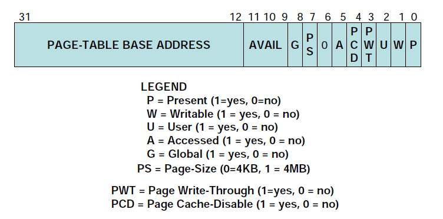

用户态下的代码就借助[study-linux-vm-64bit](https://github.com/chyyuu/study-linux-vm-64bit)稍微修改一点用起来就行了。然后手动提取下物理地址的值就行，为什么不用代码全自动提取呢？因为这部分用户态不可做得用内核模块来处理，而且涉及到新建页关系，所以就没深入研究。

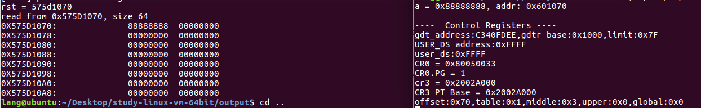

这儿需要注意的是每个数据项是`8字节`，所以都要`*8`。
例如第一级映射：
```
0x2002a000+0x0*8
最终这个地址中的值的`base address`就是页面表起始地址。
```
> 关于代码上有个坑点，就是C语言中地址是一个`unsigned`的类型，这儿需要注意，否则前面会被填充。等后面用空时候再重写一下这个工具的代码，让它能全自动输出映射地址还有值。

# 参考资料
* [Linux用户空间与内核空间（理解高端内存）](https://www.cnblogs.com/wuchanming/p/4360277.html)
* [Linux 内存](https://www.ibm.com/developerworks/cn/linux/l-kernel-memory-access/)
* [浅谈CPU寻址内存机制](https://blog.csdn.net/qq_21792169/article/details/82956472)
* [详解：物理地址，虚拟地址，内存管理，逻辑地址之间的关系](https://blog.csdn.net/bjbz_cxy/article/details/78508795)
* [虚拟地址、逻辑地址、线性地址、物理地址的区别](https://blog.csdn.net/qiuchaoxi/article/details/79616220)
* [Linux 从虚拟地址到物理地址](http://blog.chinaunix.net/uid-24774106-id-3427836.html)
* [在64位的linux划分用户空间与内核空间大小](http://blog.chinaunix.net/uid-7187477-id-6818.html)
* [深入浅出内存管理-虚拟地址和物理地址转换](https://blog.csdn.net/rikeyone/article/details/84672000)
* [LINUX程序(进程)在内存中的布局](https://blog.csdn.net/chenyijun/article/details/79441108)
* [linux下逻辑地址-线性地址-物理地址转换](https://www.jianshu.com/p/22ea1135ee16)
* [Linux x86_64线性地址空间布局(Why Does X86_64 Not Have ZONE_HIGHMEM)](https://blog.csdn.net/junmuzi/article/details/18056115)
* [在 Linux x86-64 模式下分析内存映射流程](https://www.linuxidc.com/Linux/2015-02/113078.htm)
* [64位Linux下的地址映射](https://blog.csdn.net/hhhanpan/article/details/80548687)
* [章节六 GDT全局描述表](https://github.com/iodocs/makeos/blob/master/Chapter-6/README.md)
* [特权指令](https://blog.csdn.net/bfboys/article/details/52400581)
* [Linux kernel学习-内存寻址](https://zohead.com/archives/linux-kernel-learning-memory-addressing/?lang=en)
* [IA-32 内存模型与地址映射](http://0x4c43.cn/2018/0617/ia32-memory-model-and-address-mapping/)
* [Linux内存管理实践-虚拟地址转换物理地址](http://edsionte.com/techblog/archives/1966)
* [linux内核中没有分页内存](https://blog.csdn.net/dog250/article/details/5303615)
* [Linux内核中的内存都不分页（unpagable）](https://blog.csdn.net/htjacky/article/details/13023177)
* [关于ioremap 和 phys_to_virt](http://blog.chinaunix.net/uid-15887868-id-2758330)
* [操作系统——分页式内存管理](https://blog.csdn.net/misayaaaaa/article/details/77622202)
* [Linux内存描述之高端内存--Linux内存管理(五)](https://blog.csdn.net/gatieme/article/details/52384791)
* [yangfurong/tool_phyaddr_access](https://github.com/yangfurong/tool_phyaddr_access)
* [Linux用户程序如何访问物理内存](http://ilinuxkernel.com/?p=1248)
* [linux-内存布局](https://www.byteisland.com/linux-%E5%86%85%E5%AD%98%E5%B8%83%E5%B1%80/)
* [[内存管理]linux X86_64处理器的内存布局图](https://blog.csdn.net/younger_china/article/details/16829687)
* [Linux 4.x 内核空间 MODULE 虚拟内存地址](https://biscuitos.github.io/blog/MMU-Linux4x-MODULE/)