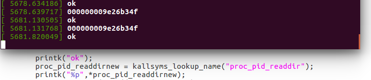
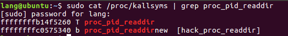
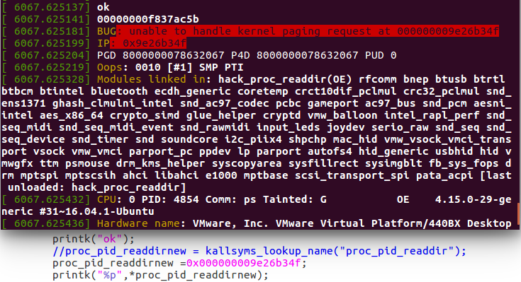
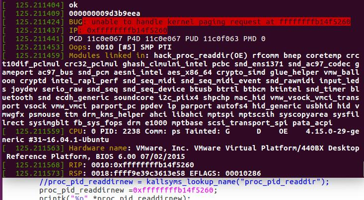
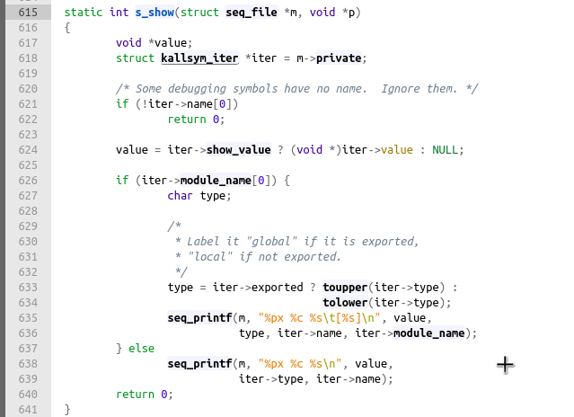
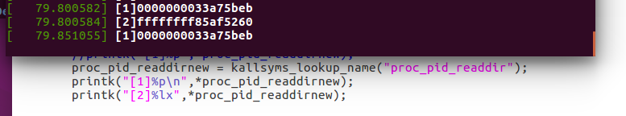
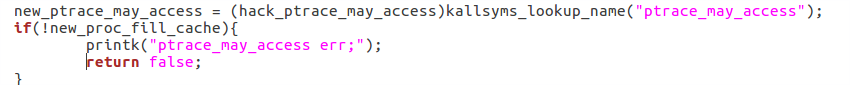
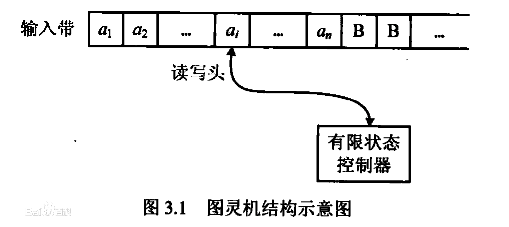

# 万恶之源
> 为后续的linux内存技术作铺垫
问题的来源在哪呢？在于做`Inline hook`时候用到了一个函数`kallsyms_lookup_name`，这个函数会返回一个内核符号地址，我想有没有方法能够直接通过函数地址来调用函数呢？。
当时写了这样的代码：
```
int (*proc_pid_readdirnew)(struct file *, struct dir_context *);
proc_pid_readdirnew = kallsyms_lookup_name("proc_pid_readdir");
printk("%p",*proc_pid_readdirnew);
```
输出的结果是这样的



但是呢，通过`/proc/kallsyms`直接获取到的地址是怎样的呢？



## 做个实验
```
int (*proc_pid_readdirnew)(struct file *, struct dir_context *);
proc_pid_readdirnew =0x000000009e26b34f;
printk("%p",*proc_pid_readdirnew);
```
这样的结果就是内核`Oops`了，但是依然输出了地址



可以看到此刻输出的地址是`00000000f837ac5b`，而不是我们填写的`000000009e26b34f`，接着再做一个实验，把地址修改成`ffffffffb14f5260`



又`Oops`了，那么问题就来了，为什么呢？抱着这个问题开始了Linux内存问题的学习。
首先先解决的问题是`%p`的输出地址怎样才能和`/proc/kallsyms`一样，这就得先看下`kallsyms`的输出
> 内核编译需要开启`CONFIG_KALLSYMS=y`



从内核源码可以看出，`kallsyms`输出的是十六进制的符号地址，同时也能够输出人类可读的符号名称等。因此最前面实验的代码改成这样
```
int (*proc_pid_readdirnew)(struct file *, struct dir_context *);
proc_pid_readdirnew = kallsyms_lookup_name("proc_pid_readdir");
printk("[1]%p\n",*proc_pid_readdirnew);
printk("[2]%lx",*proc_pid_readdirnew);
```
结果就很明显了，能够顺利输出我们想要的结果



两个问题：
1. 为什么要用`lx`形式来输出(这个不重要，暂时先不管了)
2. `符号地址`的产生以及作用

## 符号地址的产生
先前有学习过提取内核函数地址的方法，主要介绍下`/proc/kallsyms`的方法，这是一个动态文件，在内核启动过程中创建并实时更新，其中记录了当前系统的情况，包含了内核符号的地址，但是同样的这是属于内核提供的功能，主要是为了方便开发者调试内核，`kallsyms`抽取了内核用到的所有的`函数地址`和`非栈数据变量地址`生成数据块，也就相当于内核中再存了一个`System.map`
> 为了启用此功能，需要内核编译时支持`CONFIG_KALLSYMS`，这个代表所有的`内核函数地址`，`CONFIG_KALLSYMS_ALL`则包含了所有的`非栈数据变量地址`

那其实调用也是非常简单了，因为已经得到地址的关系，只需要把`函数地址`强转成`函数指针`我们就可以自由调用相应的内核函数了。



## 内存寻址技术
> 图灵机概念

1. 有一个向两端无限延伸的带子，可以在上面记录内容
2. 有一个可以在带子上擦除/写入的读写头，可以在带子上任意移动
3. 有一个控制器，控制读写头的移动和擦除/写入操作



而`图灵机`对应于现代计算机的体系结构：
1. 带子对应于一个内存(内存大小取决于硬件，因此这就决定了计算机的处理能力是有上限的)
2. 读写头在输入带上任意移动读写对应了内存的随机存取(Random Access Memory)
3. 控制器对应了中央处理器(CPU,Central Process Unit)

`内存寻址`就是在内存上找到正确的位置以便进行存取。在`图灵机`中，读写头可以按照要求立即在`输入带`上找到正确的位置，但是在实际的计算机结构中，这却是需要竭力解决并提高效率的问题，即如何有效的进行`内存寻址`。

## 安全机制
* 从用户空间内存分离出内核内存

这个的核心观念就在于`内核必须永远不能执行用户空间的内存。内核也必须永远不能在没有显式预期的情况下访问用户空间内存`。但是这并不是问题的关键，因为真正的问题在于`KASLR`，也就是俗称的`内核地址空间布局随机化`

# 参考资料
* [内存寻址](https://liam.page/2016/05/01/Introduction-to-Memory-Addressing/)
* [Linux内存管理1---内存寻址](https://www.cnblogs.com/smartjourneys/p/7153166.html)
* [Linux用户空间与内核地址空间](https://blog.csdn.net/hanzy0823/article/details/11979407)
* [Linux内存管理--内存地址空间分布](https://www.jianshu.com/p/cc0c0c550ce1)
* [Linux slab 分配器剖析](https://www.ibm.com/developerworks/cn/linux/l-linux-slab-allocator/index.html)
* [探索 Linux 内存模型](https://www.ibm.com/developerworks/cn/linux/l-memmod/index.html)
* [物理内存布局](http://guojing.me/linux-kernel-architecture/posts/physical-memory/)
* [进程页表页和内核页表](http://guojing.me/linux-kernel-architecture/posts/thread-page-table-and-kernel-page-table/)
* [程序内存地址==>虚拟内存==>物理内存](https://github.com/Durant35/durant35.github.io/issues/24)
* [对抗栈帧地址随机化/ASLR的两种思路和一些技巧](https://www.cnblogs.com/liqiuhao/p/7783688.html?utm_source=debugrun&utm_medium=referral)
* [Linux内核对内存的使用方法](https://www.cnblogs.com/hongzg1982/articles/2112278.html)
* [【转】Linux内存管理（最透彻的一篇）](https://www.cnblogs.com/ralap7/p/9184773.html)
* [初探——内存读写内核达到提权](https://blog.csdn.net/qq_28018283/article/details/79615345)
* [内核模块直接通过kallsyms获得的地址调用export 函数](http://tieba.baidu.com/p/4163586794)
* [编译问题文档](http://irclogs.linaro.org/2014/09/23/%23linaro-android.txt)
* [inux内核之内存管理图解](https://my.oschina.net/fileoptions/blog/968320)
* [Linux 内核自防护项目 KSPP](https://linux.cn/article-7411-1.html)
* [内核符号表详解——如何在module中利用内核符号](https://blog.csdn.net/trochiluses/article/details/9446955)
* [linux内核符号表kallsyms](https://blog.csdn.net/hunanchenxingyu/article/details/8467606)
* [内核模块编程遇到的一些问题](http://www.10tiao.com/html/606/201706/2664604268/1.html)