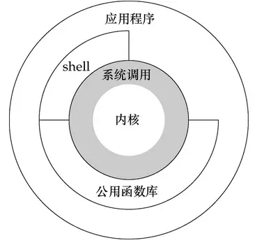

`系统调用`是内核提供的一个接口，是应用程序访问内核功能的入口点，而非具体某个函数，应用程序一般是通过系统提供的`API`来进行编程而非直接使用`系统调用`，但并非不行。
一个应用程序的用户态到内核的过程是这样的：


1. 程序本身使用了`getpid()`函数，这个是`glibc`提供的一个函数，实际上是`getpid`这个系统调用的一个封装，也就是一个系统调用的API。
2. c函数将封装好的`系统调用号`圧入`EAX`寄存器中，`系统调用号`才是`系统调用`的具体表现，是每个`系统调用`唯一的标识，`getpid`的`系统调用号`是`_NR_getpid`，其中为了`syscall`函数还为`系统调用号`创建了索引，通常格式为`SYS_常量符号`，比如`_NR_getpid`的索引是`SYS_getpid`。
3. 后调用一个软中断(0x80中断)进入内核态
4. 内核中执行`system_call`根据`系统调用号`在`system_call_table(系统调用表)`中查找到相应的`内核函数`，专业点说就是`系统调用服务例程`，这是一个汇编程序
5. 执行这个`内核函数`
> 4,5两个步骤是真正的系统调用

6. 返回值后执行`syscall_exit`再调用`resume_userspace`返回到用户态，继续在C库中执行。

## 系统调用方式
一. `glibc`库函数
这种方式也就是常用的`API`方式，即调用封装好的C函数
1. 此种方式下可以一个`API`封装一个`系统调用`，如`open`
2. 也可以一对多封装如`printf`
3. 也可以多对一封装，比如`maloc`，`caloc`等都是封装了`brk`

二. `syscall`调用
这是一个封装好的系统调用，函数原型是
```
#define _GNU_SOURCE /* See feature_test_macros(7) */
#include <unistd.h>
#include <sys/syscall.h> /* For SYS_xxx definitions */
long syscall(long number, ...);
```
其中传入的`number`就是`系统调用号`，也就是`<sys/syscall.h>`中的`宏定义`，就是调用号的索引，后续参数则依照对应`内核函数`的需要传入

三. `int`指令
用户态程序进入内核态关键的一个步骤就是`int 0x80`，然后`eax`寄存器存的是`系统调用号`，之后`ebx`，`ecx`，`edx`，`esi`，`edi`依次传递至多5个参数，这个可以看[系统调用约定](https://introspelliam.github.io/2017/08/06/pwn/%E7%B3%BB%E7%BB%9F%E8%B0%83%E7%94%A8%E7%BA%A6%E5%AE%9A/)最下面的表。
程序通过内联的汇编代码直接操作寄存器。
例：
```
#include <stdio.h>
#include <sys/types.h>
#include <sys/syscall.h>
#include <errno.h>

int main()
{
        long rc;
        char *file_name = "/etc/passwd";
        unsigned short mode = 0444;
        asm(
                "int $0x80"
                : "=a" (rc)
                : "0" (SYS_chmod), "b" ((long)file_name), "c" ((long)mode)
        );
        if ((unsigned long)rc >= (unsigned long)-132) {
                errno = -rc;
                rc = -1;
        }
        if (rc == -1)
                fprintf(stderr, "chmode failed, errno = %d\n", errno);
        else
                printf("success!\n");
        return 0;
}
```
如果 eax 寄存器存放的返回值（存放在变量 rc 中）在 -1~-132 之间，就必须要解释为出错码（在/usr/include/asm-generic/errno.h 文件中定义的最大出错码为 132），这时，将错误码写入 errno 中，置系统调用返回值为 -1；否则返回的是 eax 中的值。

# 结语：
`系统调用`是`用户态`请求`内核服务`一种有效的方法，但是控制上也较为严谨，因此更简单的方式是增加一个新的`/proc文件系统项`来提供交互，就比如`ps`之类的。

# 参考
* [系统调用约定](https://introspelliam.github.io/2017/08/06/pwn/%E7%B3%BB%E7%BB%9F%E8%B0%83%E7%94%A8%E7%BA%A6%E5%AE%9A/)
* [Linux 下系统调用的三种方法](https://www.cnblogs.com/hazir/p/three_methods_of_syscall.html)
* [使用 Linux 系统调用的内核命令](https://www.ibm.com/developerworks/cn/linux/l-system-calls/index.html)
* [linux下系统调用、API、系统命令，内核函数的区别与联系](https://blog.csdn.net/liuwei271551048/article/details/39318253)
* [一张图看遍linux](http://makelinux.net/kernel_map/)