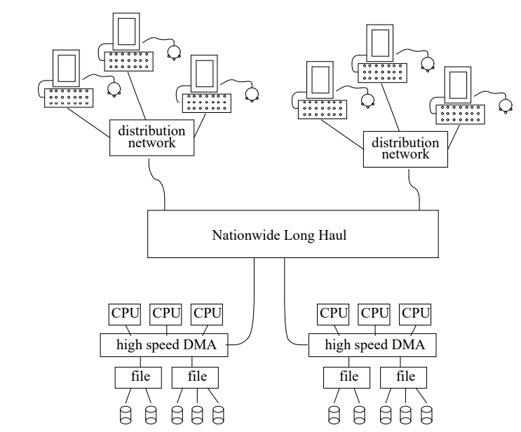
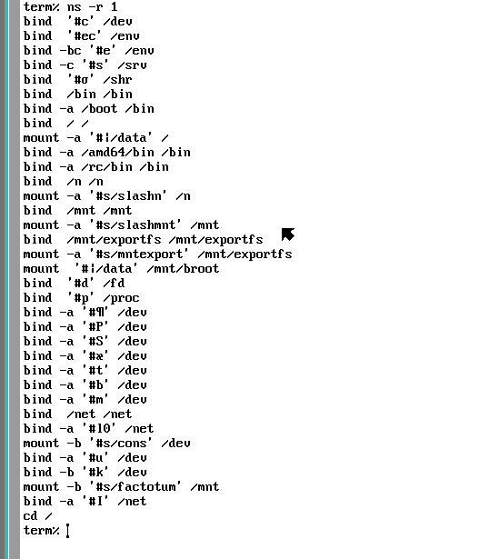

# Abstract
云越来越火了，大公司小公司逐渐逐渐的放弃了传统机房转而建设私有云或者将自己的业务都放到了公有云上，在这股潮流里，`k8s`和`docker`这两个词愈发频繁的出现在大众面前。
然而本篇文章不想谈论`k8s`，因为在业界有一群`布道师`在积极推广，也不想谈论`Docker`这个被众多巨头分食殆尽的优秀作品，而是想聊一聊存在于云背后的技术`Namespace`。


# Container
对于`Service Oriented Coder`来说，其中的99%对于系统环境的要求仅仅为能够支持自身服务稳定安全地运行，除非是一些写了大量`system()`的垃圾代码。然而对于底层支持的运维来说，即使是提供了一个安全可靠的系统出来，然而将多个服务运行在一起的话，一个服务被入侵可能影响到所有服务，一个服务`oom`就导致所有服务全都异常，这无疑就是灾难与折磨，为了解决这些问题而出现了`隔离`的需求，也就是`虚拟化`技术的诞生，`Vmware`，`VirtualBox`都是一些很好的`虚拟化`工具，但是同样的也带来了极大的开销。一个非常典型的问题就是一个`Hello World`想要运行起来真的要为其提供一整套系统环境吗？


在这样的情况下，一个迫切的需求就摆到了世人的面前：有没有能够提供出尽可能多的系统环境却又不产生重新创建系统环境的开销，并且能够让其上运行的服务互不干扰的技术？在当时的时代答案就是`容器(Container)`。而正是因为对于`Container`的大力支持且提出了多种新的概念，`Docker`于08年刚登上世界舞台就在`容器`领域叱咤风云。
> 其实不管是`虚拟化`还是`容器`其本质需求都是`Isolation`。


但是回首过去，`Container`是怎样一步一步发展起来的？这个问题其实与这篇文章无关，这完全可以新开一篇文章了没什么必要，因此只提一下其中的`FreeBSD Jails`和`LXC`。前者通过一系列手段诸如`chroot`，`rctl`，`vnet`，`sysctl`来创造出一个隔离环境出来，而这个环境就是`Container`而在那时候被称为`Jails`，而后者则基本依靠于`Namespace`和`Cgroup`就完成了对于前者功能的覆盖。
> `Namespace`是实现`Container`的一种技术手段，但并不代表所有的`Container`都是依靠`Namespace`实现的。


# What is Namespace?
> 一个新的功能的诞生可能来源于需求，也可能来源于灵感，而`Namespace`无疑就是后者。


依照`Container`的功能来看，`Namespace`无疑是能够做到各种资源的隔离，那它是什么？怎么实现的？这个其实大部分人都不会去考虑，然而对于安全来说还是得细细考究一下，不管是为了更安全还是为了能够逃逸，这都是绕不开的一步。
依旧是来阐述历史，先理解`一切皆文件`这个概念。
在`Unix`看来，不管是文本还是程序还是硬件他们都是资源，都可以打开关闭读取写入，那么为什么不能把他们都抽象成一个拥有统一操作接口的抽象对象呢？这就是`文件`的由来。但是光有文件并不可行，因为他们只是磁盘上的地址块，对于人来说无法做到直观的交互。在最初的版本的`Unix`中只有三种类型的文件：
1. 普通文件：各种文本，程序，链接库等。
2. 目录：通过匹配`Inode`提供文件名和文件本身的映射，从而形成`树型结构`，而最上级的目录文件被称为`/(根目录)`
> `目录`和`文件夹`是两回事
3. 特殊文件：诸如一些`I/O`设备


`Unix`采用了一种`树型结构`的分层存储方法管理这三种文件，上述的三种文件在逻辑上被组成了一个以`/`为根并向下呈现分支状态的结构，而这种针对文件的命名以及分层存储的方法则叫做`文件系统`。


这儿我实际挺晕的，因为非常多的资料都在这儿就已经提到了`Namespace`，但是我翻完了`The UNIX TimeSharing System (1974)`都没有在初期的设计中找到关于`Namespace`的说法，只能去翻阅多个资料，他们是这么阐述的：
* `A Comparison of three Distributed


File System Architectures:


Vnode, Sprite, and Plan 9 (1994)`
```
File system objects are named in a hierarchical name space that is distributed among multiple servers. 
The name space for the UNIX file system is a hierarchy of directories and leaf nodes.
```
* `Linux Kernel Development Second Edition (2005)`
```
In Unix, filesystems are mounted at a specific mount point in a global hierarchy known as a namespace
```
* `In UNIX Everything is a File (2009)`
```
This global namespace is often viewed as a hierarchy of files and directories.
```
三篇论文的含义都是默认存在`Name Space`这个概念且具有相同的含义，即`name space = hierarchy`，那么以最早的论文为参考的话，显然这个时候`Unix`中还是没有`Namespace`的概念，此点实际也契合`wiki`上`Linux Namespace`最早来源于`Plan 9`的说法，按照后续的资料来看也确实如此。


`Plan 9`是`Bell Labs`在二十世纪八十年代中期开始研究的`分布式操作系统`，是`Everything is a File`的继承者和超越者， `Plan 9`通过`9P`来解决本地和远程文件的差异化对文件的概念得到了进一步扩展，不再是传统意义上的`磁盘存储单元`，而是指的一切计算机资源，而其哲学理念则成了`Everything looks like a file(Everything is a filesystem)`



```
the foundations of the system are built on two ideas: a per-process name space and a simple message-oriented file system protocol. -- `Plan 9, A Distributed System (1991)`


Finally, wherever possible the system is built around two simple ideas: every resource in the system, either local or remote, is represented by a hierarchical file system; and a user or process assembles a private view of the system by constructing a file name space that connects these resources. [Needham]
```
`Plan 9`上将一切计算机资源看成是文件，因为这些资源主观实现上仿照了`Unix`的`文件系统`便从此被称呼为`文件系统`(原话是这样说的:` Simply stated, all resources are implemented to look like file systems and, henceforth, we shall call them file systems`)，他们可以是传统意义上的磁盘上的永久存储，也可以是物理设备或者是抽象概念比如进程，这也代表着这些`文件系统`得由不同的地方实现，比如`内核驱动`，`用户态程序`甚至是`远程服务器`。`Plan 9`将除了`program memory`以外进程能够访问的所有资源都组织到一个`name space`当中且能够统一访问，这个`Name Space`是一个单一根目录的文件名分层结构，从这儿后世常用的`linux namespace`概念才被正式提出，当然也不是凭空创造的，而是来源于一篇更早的文章：`Names in Distributed Systems (1989)`：
```
name space
the collection of valid names recognised by a name service a precise specification is required, giving the structure of names
e.g. ISBN-10: 1-234567-89-1 namespace identifier: namespace-specific string
 /a/b/c/d filing system, variable length, hierarchical
 puccini.cl.cam.ac.uk DNS machine name, see later for DNS
 e.g. Mach OS 128-bit port name (system-wide UID) 
```
这个概念被`Rob Pike`和`Ken Thompson`用到了`Plan 9`上用来统一`Unix`上所有的绑定思想，在`The Use of Name Spaces in Plan 9`中有详细的介绍，直接看一下实现：
```
当用户启动终端或者连接到cpu服务器的时候，将为其进程创建一个新的进程组，然后会准备一个初始namespace，其中至少提供了一个root(/)，一些进程需要的二进制文件(/bin/*)和一些本地设备(/dev/*)，然后进程组中的进程可以通过`mount`和`bind`这两个系统调用自己添加或者或者编排资源，系统提供了一个系统调用叫做rfork，其中一个参数决定了父子进程的name space是共享还是复制，前者相互影响，后者相互独立。
```
其中`bind`和`mount`同时还实现了`plan 9`的另一个特性 -- `union directories`用来取代了`search paths`，直观地看一下`Plan 9`中的1号进程的`Name Space`空间视图:





从这个图上就应该能够感受出在`Plan 9`上`Name Space`的含义，这是一个`资源集`的概念，而空间视图表现上则是一个分层树型目录树，因此这也是为什么后来的非常多的文章都直接把`Unix`的`hierarchy`看作是一个`Global Namespace`。


受到`Plan 9`上`Name Space`的启发，`Al Viro`提出了以下两点并着手改进`Linux VFS`，从`一切皆文件`逐渐转向了`一切文件都是挂载点`：
1. `A bind mount allows any file or directory to be accessible from any other location.`
2. `Filesystem namespaces are completely separate filesystem trees associated with different processes.`


上述两点是分时间线完成的，前者在`2.4.11-pre4`中加入，而后者则一直等到`2.4.19`的时候才完成，鉴于前者主要是解决的不同类型`file system`的问题实际上和本篇关系不是很大就只看后者的引入。
在`Unix`上每个进程看到的都是相同的目录结构，而到了`Plan 9`中因为每个进程都有自己的`name space`导致不同进程看到的目录结构可能是不同的，而这样的做的目的实际上是因为`Minimalism`和`Distributed`，但是在表现上来说却又实现了`Isolated`，因此这个能力就被移植到了`linux`上实现，这也是为什么`Mount Namespace`直接就被称为`CLONE_NEWNS`：
1. 继承自`Plan 9`，实现的就是`Plan 9`针对`file system`空间视图的隔离能力
2. 这是第一个在`linux`上被实现的`namespace`也没想过会再加入其余类型的`namespace`


而关于这次能力的引入，社区还是挺兴奋的：[[PATCH][CFT] per-process namespaces for Linux](https://static.lwn.net/2001/0301/a/namespaces.php3)。


# Linux Namespace
> 终于到了近现代不用再考古了，项目的初期其实大家的想法也并不是统一的各有各的理解，这就导致要反复对比揣摩文献着实累人。


最初我在想为什么`Linux`不直接沿用`Plan 9`的方式去实现视图空间的隔离，后来想想也是因为在`/proc/*/ns`下面一看`进程`的资源一目了然，这还谈什么`Isolated`和`Secure`，那自然还是把相关信息放在内核里的好，在`2.4.19`下`Linux`的第一个`Namespace`是这么实现的：
```
struct namespace {
    atomic_t        count; //此namespace引用数量，防止被释放
    struct vfsmount *    root;  //root mount
    struct list_head    list;   // lists of mount points
    struct rw_semaphore    sem;
};
```
然后进程结构体`task_struct`中增加了一个`namespace`指针：
```
/* namespace */
    struct namespace *namespace;
```
那么主要关注的点就是第一个`namespace`的创建和新的`namespace`的创建，`namespace`随着进程产生，那就得直接从`kernel`初始化那儿开始：
```
start_kernel -> vfs_caches_init -> mnt_init -> init_mount_tree


init_mount_tree ()
{
    ...
mnt = do_kern_mount("rootfs", 0, "rootfs", NULL);    
namespace = kmalloc(sizeof(*namespace), GFP_KERNEL);
namespace->root = mnt;
init_task.namespace = namespace;
    ...
}
```
等再有进程被通过`do_fork`创建的时候，会通过`copy_namespace()`校验`flag`，如果有`CLONE_NEWNS`的话则会进入到新建`namespace`的流程，否则还是单纯的复制。不过细看`copy_namespace`的时候就会发现，其实这个函数本身是没有提供新的分层结构的，而是复制父进程的空间视图：
```
struct namespace *namespace = tsk->namespace;
struct namespace *new_ns;
new_ns = kmalloc(sizeof(struct namespace *), GFP_KERNEL);
new_ns->root = copy_tree(namespace->root, namespace->root->mnt_root);
tsk->namespace = new_ns;
```
`linux`上虽然实现的方式变了但是本质上没有变，依然是由`mount`集合而成的空间视图，那意思就是说只要没对`mount`做修改的话`new namespace`和`old namespace`中的空间视图是一致的，而修改`mount`则是应用层应该关心的事情，这个从内核源码里的`kmalloc(sizeof(struct namespace *), GFP_KERNEL);`也应该来看出来是开辟了新的内存空间，只是这个新的内存空间的内容是复制来的而已。
这儿要注意的隔离的是`mount`，并不是在你不修改任何`mount`的情况下直接修改或者创建文件而不对其余`namespace`产生影响，这也是为什么称呼`CLONE_NEWNS`为`Mount Namespace`而不是`File Namespace`，而从创建新的`namespace`到能够真正隔离文件则涉及到`rootfs`的隔离，`Docker`的实现方式是`pivot_root`，粗略看了一下`Docker`的源码后直接挂个它的`Demo`：
```
#define STACK_SIZE (1024*1024) /* Stack size for cloned child */
#define errExit(msg)    do { perror(msg); exit(EXIT_FAILURE); \
                               } while (0)
int parent_uid;
int parent_gid;
char *rootfs = "/home/lang/Desktop/newrootfs";
 static int
pivot_root(const char *new_root, const char *put_old)
{
    return syscall(SYS_pivot_root, new_root, put_old);
}
static char child_stack[STACK_SIZE];
int child_main(){
    printf("进入子进程:%d\n",getpid());
    if (mount(NULL, "/", NULL, MS_REC | MS_PRIVATE, NULL) == -1)  //标记
        errExit("mount-MS_PRIVATE");  
    if (mount(rootfs, rootfs, NULL, MS_BIND | MS_REC | MS_PRIVATE, NULL) == -1)
        errExit("mount-MS_BIND");
    if (chdir(rootfs) == -1)
        errExit("chdir1");
    if (pivot_root(".", ".") == -1)
        errExit("pivot_root");
    if (umount2(".", MNT_DETACH) == -1)
        perror("umount2");
    if (chdir("/") == -1)
        perror("chdir2");
    if (mount("proc", "/proc", "proc", 0, NULL) == -1)
        errExit("mount-proc");
    char *arg[] = {"/bin/bash", NULL};
    execv("/bin/bash", arg);
    return 1;
}
int main(void){
    printf("创建子进程\n");
    parent_uid = getuid();
    parent_gid = getgid();
    int child_pid = clone(child_main, child_stack + STACK_SIZE, CLONE_NEWNS | CLONE_NEWPID | SIGCHLD, NULL);
    waitpid(child_pid, NULL, 0);
    printf("退出子进程\n");
    return 0;
}
```
> 其中写上了`标记`的那行参照[Mount namespaces, mount propagation, and unbindable mounts](https://lwn.net/Articles/690679/)，如果不将`new namespace`中的`/`重新挂载成`PRIVATE`的话，就会影响到相同`peer group`中的`namespace`，这是`2.6.15`中引入的`shared subtree`特性，用来解决新资源挂载的问题。

# Other Namespace
随着技术的发展，慢慢的又有新的类型的`namespace`被加入到内核中来，那再在`task_struct`中用`namespace`这个指针就有点不合适了，因此在`2.6.19`里面更换了结构体为`nsproxy`:
```
v4.20
struct nsproxy {
    atomic_t count;
    struct uts_namespace *uts_ns;
    struct ipc_namespace *ipc_ns;
    struct mnt_namespace *mnt_ns;
    struct pid_namespace *pid_ns_for_children;
    struct net          *net_ns;
    struct cgroup_namespace *cgroup_ns;
};
```
把新加入的`namespace`又聚合了一层，这样不管是复制还是修改的都是`nsproxy`使得逻辑变得更加合理，同样增加了新的`CLONE_NEWXX`来决定新创建的`namespace`类型，其中还需要单独拿出来说一说的就是`PID Namespace`，从这儿开始才是正式构成了容器的基础。
`PID Namespace`是`OpenVZ team`和`IBM`的人在`2.6.24`搞出来的一个新的特性，依旧是一个`分层结构`但是却和先前的`namespace`有所不同，即当前`PID namespace`的`tasks`可以看到新的`namespace`中的`tasks`反之不行，有一种半透镜的感觉，那这就意味着一个`task`可以具备多个`PID`。
为了实现这个需求，内核里面的`PID`结构需要有相应的改变才行，在`2.6.24`以前的实现：
```
struct pid
{
    atomic_t count;
    /* Try to keep pid_chain in the same cacheline as nr for find_pid */
    int nr;
    struct hlist_node pid_chain;
    /* lists of tasks that use this pid */
    struct hlist_head tasks[PIDTYPE_MAX];
    struct rcu_head rcu;
};
```
而到了以后的实现：
```
struct upid {
    /* Try to keep pid_chain in the same cacheline as nr for find_pid */
    int nr;
    struct pid_namespace *ns;
    struct hlist_node pid_chain;
};
struct pid
{
    atomic_t count;
    /* lists of tasks that use this pid */
    struct hlist_head tasks[PIDTYPE_MAX];
    struct rcu_head rcu;
    int level;
    struct upid numbers[1];
};
```
在结构中多了`level`层级号和`ns`指针，而原本的`PID`号移到了`upid`中，即不同的`namespace`中不同，但是实际上的修改却不止这么点，毕竟`进程`算是操作系统的核心功能，只是这么一点变动就导致需要更改的地方非常多，尤其多了`namespace`的概念后如果不加注意就非常容易造成逃逸或者是`BUG`，最典型的莫过于`Docker`中针对`孤儿进程`的处理逻辑与`V4.4`的冲突导致自身失去了收割能力，换句话说就是在`PID Namespace`上应该还有相当一部分的逻辑漏洞等待着被发掘。


# Conclusion
如果说这个时代已经借助`Namespace`等种种底层隔离技术正式进入了`云时代`的话，那随着`5G`的到来，或许`分布式时代`也将来临甚至说是`去中心化`也会在大世之中分一杯羹，也许就在不久的将来`PC`将慢慢的从硬件的集合转向`虚拟硬件`或者说`云硬件`，诸如`intel`，`NVIDIA`这样的厂商也从`挤牙膏``秀刀法`慢慢地转变成贩卖`计算资源`这也说不准，而隔离的概念经过`编排`能力的提高也逐渐智能化？逐渐逐渐的挡在落地之前最大的阻碍大概就是`技术菜`了吧 : )


说一句心里话`5ZWG5Zy65aaC5oiY5Zy677yM5oiY5LqJ6IO95aSf5o6o5Yqo5oqA5pyv55qE6L+b5q2l77yM5L2G5piv5Zyo6I+c5biC5Zy655u45LqS5Y+r6aqC552A5oqi55Sf5oSP5Y+v5LiN5Lya`


# 参考资料
* [Plan 9, A Distributed System](https://citeseerx.ist.psu.edu/viewdoc/summary?doi=10.1.1.41.9192)
* [The Use of Name Spaces in Plan 9](https://dl.acm.org/doi/10.1145/506378.506413)
* [编程珠玑番外篇-K. Plan 9 的故事（修订版）](https://blog.youxu.info/2011/03/21/story-of-plan-9-revised/#comment-9456)
* [The Plan-9 Effect or why you should not fix it if it ain't broken](http://www.di.unipi.it/~nids/docs/the_plan-9_effect.html)
* [9front 手册](http://fqa.9front.org/)
* [Linux 容器是什么？Linux Container 简介](https://www.redhat.com/zh/topics/containers/whats-a-linux-container)
* [Linux LXC vs FreeBSD jail](https://unix.stackexchange.com/questions/127001/linux-lxc-vs-freebsd-jail)
* [Linux 容器技术史话：从 chroot 到未来](https://linux.cn/article-6975-1.html)
* [Plan 9 from Bell Labs](https://en.wikipedia.org/wiki/Plan_9_from_Bell_Labs)
* [What aspects of Plan 9 have made their way into Unix?](https://unix.stackexchange.com/questions/8337/what-aspects-of-plan-9-have-made-their-way-into-unix)
* [In UNIX Everything is a File](https://web.archive.org/web/20120320050159/http://ph7spot.com/musings/in-unix-everything-is-a-file)
* [The UNIX Time-Sharing System](https://people.eecs.berkeley.edu/~brewer/cs262/unix.pdf)
* [The Organization of Networks in Plan 9 (1993)](https://9p.io/sys/doc/net/net.pdf)
* [Unix filesystem](https://en.wikipedia.org/wiki/Unix_filesystem)
* [A Comparison of three Distributed File System Architectures:Vnode, Sprite, and Plan 9](https://citeseerx.ist.psu.edu/viewdoc/summary?doi=10.1.1.46.2817)
* [Linux Kernel Development Second Edition](http://books.gigatux.nl/mirror/kerneldevelopment/0672327201/toc.html)
* [Names in Distributed Systems](https://www.cl.cam.ac.uk/teaching/0809/DistSys/5-naming.pdf)
* [Plan 9 from User Space](http://cs-exhibitions.uni-klu.ac.at/index.php?id=214)
* [Mount namespaces and shared subtrees](https://lwn.net/Articles/689856/)
* [Namespaces in operation, part 1: namespaces overview](https://lwn.net/Articles/531114/)
* [[PATCH][CFT] per-process namespaces for Linux](https://static.lwn.net/2001/0301/a/namespaces.php3)
* [Mount namespaces, mount propagation, and unbindable mounts](https://lwn.net/Articles/690679/)
* [runc/libcontainer/rootfs_linux.go](https://github.com/opencontainers/runc/blob/master/libcontainer/rootfs_linux.go)
* [pivot_root(2) — Linux manual page](https://man7.org/linux/man-pages/man2/pivot_root.2.html)
* [pivot_root](https://zhuanlan.zhihu.com/p/101096040)
* [PID namespaces in the 2.6.24 kernel](https://lwn.net/Articles/259217/)