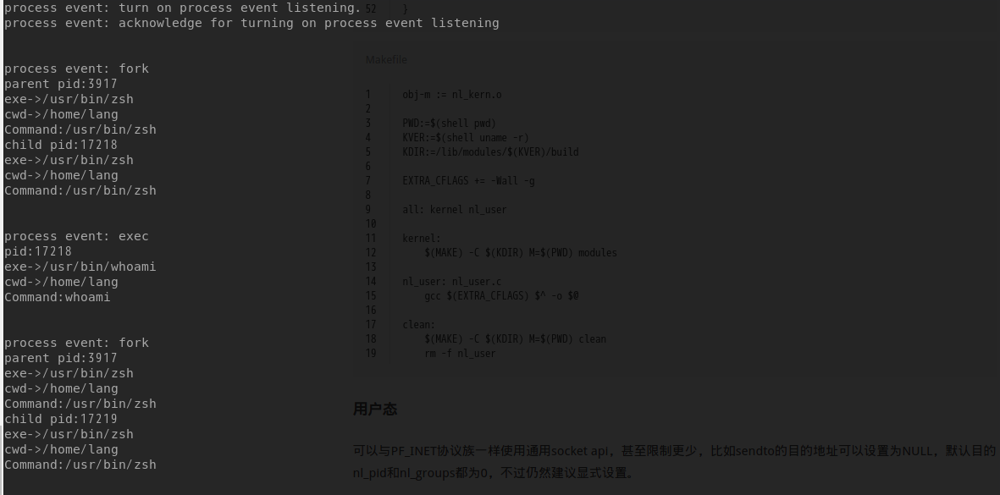

`Netlink Connect`在用户态下是`netlink`的`11`号协议族，是一个新的`内核态`<->`用户态`通信方式，与一般的`netlink`相比，提供的接口更为方便。

用户态下使用只需要当成一般的`netlink`使用即可：
```
s = socket(PF_NETLINK, SOCK_DGRAM, NETLINK_CONNECTOR);
```
但是使用上却又并非像是普通的那么简单，用户态进程想要接收到内核的进程事件信息：
* 打开进程事件连接器需要先打开报告开关
> 退出进程后，必须关闭进程事件连接器的报告开关，否则进程事件连接器将继续报告进程事件，尽管没有一个监视进程对这些事件感兴趣，这将造成不必要的系统开销，同时因为缓存这些事件浪费了宝贵的系统内存。

## 写了代码，主要说说坑点，当作备忘：
要想开启报告开关，就得先用户态发送一个`进程事件连接器`能够处理的`netlink`消息，而一个`netlink`消息结构如下：
* netlink消息头
* 连接器消息头
* 控制操作指令

因此先分配三个内存空间：
```
nlhdr = (struct nlmsghdr *)malloc(NLMSG_SPACE(MAX_MSGSIZE));  //消息头
memset(nlhdr, 0, sizeof(NLMSG_SPACE(MAX_MSGSIZE)));

cnmsg = (struct cn_msg *)NLMSG_DATA(nlhdr);  //连接器消息头

connector_mode = (int *)cnmsg->data; //控制操作指令
* connector_mode = mode;
```
打开关闭报告主要依靠`控制指令`来决定，预定义也只有两个：
``` 
//cn_proc.h
enum proc_cn_mcast_op {
 PROC_CN_MCAST_LISTEN = 1,
 PROC_CN_MCAST_IGNORE = 2
};
```
将`控制指令`作为`连接器消息头`的`data`信息即可，主要坑点在于`nlhdr`与`cnmsg`的构造。
```
//netlink.h
struct nlmsghdr {
 __u32 nlmsg_len; /* Length of message including header */
 __u16 nlmsg_type; /* Message content */
 __u16 nlmsg_flags; /* Additional flags */
 __u32 nlmsg_seq; /* Sequence number */
 __u32 nlmsg_pid; /* Sending process port ID */
};
```
对应的代码是
```
nlhdr->nlmsg_len = NLMSG_LENGTH(sizeof(struct cn_msg) + sizeof(enum proc_cn_mcast_op));
nlhdr->nlmsg_pid = getpid();
nlhdr->nlmsg_flags = 0;
nlhdr->nlmsg_type = NLMSG_DONE;
nlhdr->nlmsg_seq = 0;
```
而连接器的消息头则是：
```
connector.h
struct cn_msg {
 struct cb_id id;
 __u32 seq;
 __u32 ack;
 __u16 len; /* Length of the following data */
 __u16 flags;
 __u8 data[0];
};
```
其中`cb_id`的结构是：
```
struct cb_id {
 __u32 idx;
 __u32 val;
};
```
这个看官方定义，大概意思就是这两个必须被定义好，而且后面有资料说，针对于`进程事件连接器`，两个值必须为`CN_IDX_PROC`和`CN_VAL_PROC`，否则消息无法分派给此连接器：
```
/*
 * idx and val are unique identifiers which 
 * are used for message routing and 
 * must be registered in connector.h for in-kernel usage.
 */
```
这样对应出来的代码就是：
```
cnmsg->id.idx = CN_IDX_PROC;
cnmsg->id.val = CN_VAL_PROC;
cnmsg->seq = 0;
cnmsg->ack = 0;
cnmsg->len = sizeof(enum proc_cn_mcast_op);
```
然后向内核发送消息的话，用`sendmsg()`，因为可以同时发送多个消息，发送数据是一个结构体，因此用struct iovec 来组织所有要发送的消息。


代码结果：



# 参考文档
* [Linux netlink socket](http://www.hyuuhit.com/2018/08/22/netlink/#%E5%86%85%E6%A0%B8%E6%80%81-netlink-socket-%E5%88%9B%E5%BB%BA-1)
* [Linux 系统内核空间与用户空间通信的实现与分析](https://www.ibm.com/developerworks/cn/linux/l-netlink/index.html)
* [连接器（Netlink Connector）及其应用](https://www.ibm.com/developerworks/cn/linux/l-connector/#icomments)
* [code_snippets](https://github.com/ikem-krueger/code_snippets/blob/7a7e59ac602ad85f3ee67d33c595b0ac2655013f/c/cn_proc.c)
* [Kernel Connector](https://www.kernel.org/doc/Documentation/connector/connector.txt)
