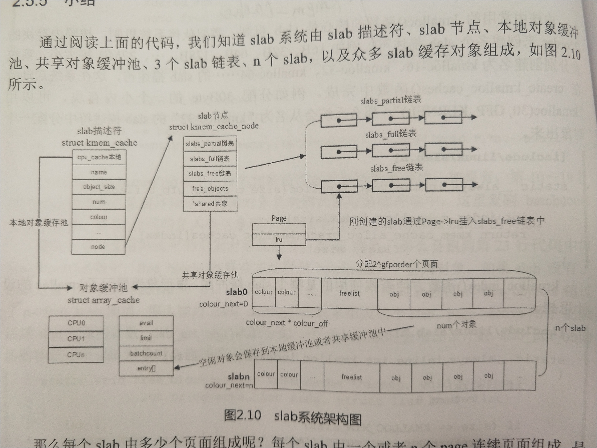

> `UAF`从名称上翻译过来就是`释放后重用`，这个漏洞的产生主要取决于内存管理机制，因此扯来扯去，还是得先了解一下内存管理方面的东西才行。


我自己注重的是`kernel`相关的安全，而`linux用户态`下的大部分`uaf`其实来源于`C`的`内存管理机制`，虽然和`kernel`相似，但也着实是两种不同的东西，因此还是要以`kernel`为主来了解。


# `SLAB`机制
> `slub`可以理解为`slab`的升级简化版本，从`2.6.22`开始引入，在实际的设计理念上倒是没有什么太大的区别，但是却又有着明显的性能优化，而这些优化的点就是着重注意的部分


先前简单研究过`kernel`的内存相关的东西，知道了`kernel`采用了内存分页模型来管理内存，将内存划分为一个个页，通过`伙伴系统`来分配，那随之而来的问题就是最小分配单元是`页(4kb)`，然而非常多的时候需要分配的仅仅是一片很小的内存，如果依旧按照`伙伴系统`来分配的话，显然会造成极大的浪费
> 比如仅仅需要申请一个`4b`的内存，然而却分配来一个`4kb`的页，而这一页中的`4kb - 4b`大小的内存就被浪费了，这部分被浪费的内存可以称为`内部碎片`


为了解决这种问题而引入了针对小内存的管理方式`slab系统`。如果是`伙伴系统`的最基础单元是一个个`page`的话，那`slab`系统的最基础单元就是`object`，说起来可能有点抽象，什么是`object`？实际上这儿可以理解成`kernel`中使用度非常频繁的`数据结构`，例如进程结构`task_struct`，索引结构`inode`。这些`object`往往占用内存并不到一个`page`，但是却会被频繁的创建销毁，如果每一次都是`0 - 1 - 0`的流程的话，显然会带来极大的开销，相同`object`之间的内存结构是相同的，那如果一个`object`在使用完成后，并非是立马将其回收，而是成为一个`cache`，这样在有一个新的`object`需求进来的时候就能立马用上，极大的提高了`内存分配`的速度，这也是为什么`slab分配器`又被当作`高速缓存`来用。


从整体结构上来说，一整个`slab`的运作模型如下





`kmem_cache`是`slab描述符`，很多描述符组成了全局链表`slab_cashes`，其最直观的表现可以通过`/proc/slabinfo`的`name`感知出来，不同的`name`就代表了不同的`kmem_cache`，例如`task_struct`的`kmem_cache`中所有的`object`都是一个个的`struct task_struct`结构，而其中比较特殊的就是`kmalloc-*`类型的`kmem_cache`，这个可以被称作是`通用缓存`，没什么特殊的用途和结构，目的就是为了能够快速提供这样大的一块内存出来而已，而这个描述符中最重要的数据结构是`kmem_cache_node`，组织了各个具体的`slab`。


内存的分配的最基础单元还是`page`，这儿是不是有些晕，`slab`不是能管理比`page`更小的内存吗？其实`slab`的内存管理是指在已经分配的`page`上再做的管理，而不是直接从无到有管理一个`< page_size`的内存，因此在这个基本约束下，虽然`slab分配器`的分配单位是`object`，但是其整个结构上依然有一个`>= page_size`的结构作为中转也就是上图中的`slab`，一个`slab`的所占页面个数为`2^cachep->gfporder`个，这个值的确定流程在`kmem_cache_create`中，也是`kmem_cache`的一个属性，而真正使用起来则是在`slab对象`的分配流程中，
```
kmem_cache_alloc -> slab_alloc -> __do_cache_alloc -> __cache_alloc
```
这个函数的大致流程是：
1. 获取本地缓冲池`arrar_cache`并判断其中是否有空闲对象，这是一个只用于当前`CPU`的指向`空闲object`的指针集合，减少了访问链表的锁开销。
2. 有的话则直接通过`ac_get_obj`来分配对象，获取的是`ac->entry[--ac->avail]`，也就是最后一个对象
3. 没有则通过`cache_alloc_refill`来分配对象


一个`kmem_cache`刚创建的时候不存在空闲对象一说，因此直接走`流程3`，而在`流程3`的函数中，则会引入三个队列的判断和操作
1. `slabs_partial`，部分空闲链表
2. `slabs_full`，不空闲
3. `slabs_free`，全部空闲链表


优先检查`共享缓冲池`，如果有对象的话就移到`本地缓冲池`里，然后重来一遍，如果`共享缓冲池`为空的话，则会检查`slabs_partial`和`slabs_free`，如果两者不为空的话，则说明存在空闲的`object`可以分配出来，将其放到`本地缓冲池中`，在分配完`object`后再去把所属的`slab`移动到应该去的链表上，但按照刚创建的时候来说，所有的链表都是空的因为完全还没有对象，所以第一个`slab`是通过`cache_grow`来创建的，占用了`gfporder`个物理页面，将其放入`free`链表后再走`retry`流程，此时因为有了空闲对象，所以就肯定能分配出`object`。


到此为需要的`object`就已经分配完了，那么在用完之后自然就涉及到了回收的问题，先前说过`slab`并非仅仅是一个`小内存分配器`，也是一个`高速缓存器`，这是因为其释放模式的设计上能够实现缓存的功能。一个对象调用`kmem_cache_free`时候，会通过`cache_from_obj`根据`obj`的虚拟地址找到对应的`kmem_cache`，然后调用`__cache_free`在`kmem_cache`内作操作，其逻辑就是如果本地对象缓冲池的空闲对象数量没有超过`ac->limit`，那就直接调用`ac_put_object`把对象释放到缓冲池里`ac->entry[ac->avail++] = object`，但是如果超过的话，则会调用`cache_flusharray()`来处理一些`slab`把位置空出来，同时还要处理一下该`object`所在的`slab`，将其移动到应该去的链表上。


其实这个机制和`C`的内存管理的机制十分的相似，都是在页式管理的基础上再做的一层内存管理，不过我也说的不一定对，因为`C`的内存管理我没有细心了解过，只是粗略的知道`fastbin`之类的东西。


# `SLUB`机制
从最开始的`kmem_cache`创建上来说，相比于`slab`的无脑创建新的`kmem_cache`带来的开销，`slub`引入了`对象重用`的机制，即在请求创建新的`kmem_cache`时，分配器会根据`size`搜索已有的`kmem_cache`，若相等或是略大于(sizeof(void *)范围)则不去创建而是重新已有的`kmem_cache`，将其`refcount + 1`，实现函数为`__kmem_cache_alias`，在后续初始化上也有变化，用`kmem_cache_cpu`取代以前的`array_cache`。
```
struct kmem_cache_cpu {
 void **freelist; /* Pointer to next available object */
 unsigned long tid; /* Globally unique transaction id */
 struct page *page; /* The slab from which we are allocating */
#ifdef CONFIG_SLUB_CPU_PARTIAL
 struct page *partial; /* Partially allocated frozen slabs */
#endif
#ifdef CONFIG_SLUB_STATS
 unsigned stat[NR_SLUB_STAT_ITEMS];
#endif
};
```
而针对`kmem_cache_node`也只保留了`partial`一条链表，这就导致后面关于`内存分配`的流程上出现了简化。
```
struct kmem_cache_node {
 spinlock_t list_lock;
 unsigned long nr_partial;
 struct list_head partial;
#ifdef CONFIG_SLUB_DEBUG
 atomic_long_t nr_slabs;
 atomic_long_t total_objects;
 struct list_head full;
#endif
};
```
从内存分配的角度看，原本的`slab`的顺序是`本地缓冲池 -> 共享缓冲池 -> 部分空闲链表 -> 全部空闲链表`，而`slub`则极大的简化了这个步骤，取消了`共享缓冲池`且只保留了`部分空闲链表`。在第一次进行内存分配的时候还是一样是没有`slab`的，这时候就要为当前`cpu`创建一个`slab`称为`本地活动slab`，并将`kmem_cache_cpu`的`freelist`指向第一个`object`，这样再次`retry`时则只需要使用指向的`object`然后移动指针即可分配出一个可用的`object`出来，而如果`本地活动slab`已经没有`空闲object`的话，则从`kmem_cache_cpu->partial`取新的`slab`重新装到`freelist`上，其中`kmem_cache_cpu->page`就指向的当前在用的`slab`，如果此时`kmem_cache_cpu->partial`上没有了空闲的`slab`则从`kmem_cache_node->partial`上取`slab`装到`freelist`上，还会多取几个放到`kmem)_cache_cpu->partial`上，为下次寻找节省时间，这种方式比起`slab`机制来说要简单高效了很多，当然如果都没有`object`的话则直接申请新的`slab`。
> `CONFIG_SLUB_CPU_PARTIAL`属于选配，如果没开启的话，则在分配上忽略这个流程。让SLUB内存分配器使用基于每个CPU的局部缓存,这样可以加速分配和释放属于此CPU范围内的对象,但这样做的代价是增加对象释放延迟的不确定性.因为当这些局部缓存因为溢出而要被清除时,需要使用锁,从而导致延迟尖峰.对于需要快速响应的实时系统,应该选"N",服务器则可以选"Y"，同样还有`CONFIG_SLUB_DEBUG`配置决定了`node`上是否有`full`链表。


最后再看一下回收机制，如果要释放的`object`正是`本地活动slab`上的话，则直接将其添加到当前`freelist链表`的头部，然后将`freelist`移动到该`object`，但是如果要释放的`object`属于其余`slab`中的话，则将其释放后加入到`slab`的空闲队列里，然后还要判断释放后的`slab`状态，然后再根据情况整个销毁掉`全空闲slab`或者移动到不同的链表中。
> 并不针对`slab`的变化多作解释，因为对于漏洞研究上主要关注的还是`object`的分配和释放


整个`slub`的结构如下图：


# `kmalloc`
`kernel`中的`kmalloc`和核心就是`slab`机制，在系统启动的时候，就有`create_kmalloc_caches`创建了一堆`slab描述符`，其实这部分直接看源码要更好理解点：
```
static __always_inline void *kmalloc(size_t size, gfp_t flags)
{
 if (__builtin_constant_p(size)) {
  if (size > KMALLOC_MAX_CACHE_SIZE)
   return kmalloc_large(size, flags);
#ifndef CONFIG_SLOB
  if (!(flags & GFP_DMA)) {
   unsigned int index = kmalloc_index(size);


   if (!index)
    return ZERO_SIZE_PTR;


   return kmem_cache_alloc_trace(kmalloc_caches[index],
     flags, size);
  }
#endif
 }
 return __kmalloc(size, flags);
}
```
其实代码的核心思路还是那个`index`，这取决了最终分配的内存来源于哪个`cache`
```
static __always_inline unsigned int kmalloc_index(size_t size)
{
 if (!size)
  return 0;


 if (size <= KMALLOC_MIN_SIZE)
  return KMALLOC_SHIFT_LOW;


 if (KMALLOC_MIN_SIZE <= 32 && size > 64 && size <= 96)
  return 1;
 if (KMALLOC_MIN_SIZE <= 64 && size > 128 && size <= 192)
  return 2;
 if (size <= 8) return 3;
 if (size <= 16) return 4;
 if (size <= 32) return 5;
 if (size <= 64) return 6;
 if (size <= 128) return 7;
 if (size <= 256) return 8;
 if (size <= 512) return 9;
 if (size <= 1024) return 10;
 if (size <= 2 * 1024) return 11;
 if (size <= 4 * 1024) return 12;
 if (size <= 8 * 1024) return 13;
 if (size <= 16 * 1024) return 14;
 if (size <= 32 * 1024) return 15;
 if (size <= 64 * 1024) return 16;
 if (size <= 128 * 1024) return 17;
 if (size <= 256 * 1024) return 18;
 if (size <= 512 * 1024) return 19;
 if (size <= 1024 * 1024) return 20;
 if (size <= 2 * 1024 * 1024) return 21;
 if (size <= 4 * 1024 * 1024) return 22;
 if (size <= 8 * 1024 * 1024) return 23;
 if (size <= 16 * 1024 * 1024) return 24;
 if (size <= 32 * 1024 * 1024) return 25;
 if (size <= 64 * 1024 * 1024) return 26;
 BUG();


 /* Will never be reached. Needed because the compiler may complain */
 return -1;
}
```


# `Use-After-Free`
> 这是在内存分配上一个绕不开的安全问题


如`slab&slub`这样一套内存管理模式中是否有安全问题呢？
```
int main(int argc, char *argv[])
{
 char *p1;
 p1 = (char *)malloc(sizeof(char) * 10);
 memcpy(p1, "hello", 10);
 printf("before free: p1 address = %p\n", p1);
 free(p1);
 printf("after free: p1 address = %p\n", p1);
 return 0;
}
```
输出结果：
```
before free: p1 address = 0x55cfa68fa2a0
after free: p1 address = 0x55cfa68fa2a0
```
可以看到虽然分配的内存被release了，但是指针指向的地址依然没有变，意思就是说`p1`这个指针依然指向的这一块内存，这是`C`中经典的`悬垂指针`问题。再去回顾之前的`object分配`的原则，在一个`object`被释放后紧接着立马申请一块相同大小的`object`，最终分配过来的就会是刚被释放的那一个。那以上二者结合起来就会导致一个问题，就是`悬垂指针`在逻辑以外突然变得再次有效起来，并且还指向的是一个正在被合法使用的内存地址。


简单来说`uaf`漏洞的产生取决于`悬垂指针`的使用上，当一个`悬垂指针`产生后但是不再被引用了，那就是从程序逻辑中已经被忽略掉了便也无所谓了，但是如果这个`指针`在release后依然被使用到了就满足了`uaf`的条件，若在`free`后到下一次使用的过程中若`悬垂指针`指向的那一块内存又被申请到了，这就有可能导致程序逻辑发生了意想不到的变化。


这样说可能还是不够直白，程序为什么会这么写呢？这还是需要从实际的例子上阐述这个问题。


## 用户态的`uaf`
> 既然要从内核态分析这个问题，那就只能靠lkm解决了，又要写代码了真麻烦，这儿需要明确的一点是`uaf`漏洞的利用是在`用户态`，然而生效是在`内核态`，因此对于一个内核中的`uaf`漏洞来说，怎么都得有提供到`用户态`的接口或者与`用户态`数据有关联的逻辑才行，因此优先写的是`用户态`下的问题代码，也是抄来的


```
#include <stdlib.h>
#include <unistd.h>
#include <string.h>
#include <sys/types.h>
#include <stdio.h>


struct auth {
  char name[32];
  int auth;
};
struct auth *auth;
char *service;
int main(int argc, char **argv)
{
  char line[128];
  while(1) {
      printf("[ auth = %p, service = %p ]\n", auth, service);
      if(fgets(line, sizeof(line), stdin) == NULL) break;
      if(strncmp(line, "auth ", 5) == 0) {
          auth = (struct auth *)malloc(sizeof(struct auth));
          memset(auth, 0, sizeof(struct auth));
          if(strlen(line + 5) < 31) {
              strcpy(auth->name, line + 5);
          }
      }
      if(strncmp(line, "reset", 5) == 0) {
          free(auth);
      }
      if(strncmp(line, "service", 7) == 0) {
          service = strdup(line + 8);
      }
      if(strncmp(line, "login", 5) == 0) {
          if(auth->auth) {
              printf("you have logged in already!\n");
          } else {
              printf("please enter your password\n");
          }
      }
  }
}
```
> 第21行的代码是被我修改过的，原本的写法是`auth = malloc(sizeof(auth));`但是这儿涉及到了`sizeof`的特性问题，按照上下逻辑的意思应该是这儿会开辟一个内存空间用来存`struct auth`的数据，但是因为`struct auth *auth`的原因所以`sizeof(auth)`的结果是`8`是一个指针的大小在逻辑上有点说不通顺，因此修改成`sizeof(struct auth)`表示明确分这么多内存，其中关于`sizeof`存在各种坑点，值得研究注意一下。


这是抄来的一份题目的代码，存在明显的`uaf`漏洞，甚至明显到`vim`会提醒你代码存在问题:
```
Use of memory after it is freed [clang-analyzer-unix.Malloc]
```
但是这个`uaf`和上述的`slub&slab`没多大关系，因为用户态上`C程序`的`malloc`使用的内存来源于`C`自身的内存池，有一套自我实现的内存分配机制不过大概逻辑上却又和`slub&slab`机制相似，所以拿出来作为`uaf`认识和利用的基础。
如上的代码在运行后输入`auth a`后，内存情况是这样的：
```
gef➤ x &auth
0x555555558090 <auth>: 0x0000555555559ac0
gef➤ p auth
$1 = (struct auth *) 0x555555559ac0
gef➤ p &auth->name
$3 = (char (*)[32]) 0x555555559ac0
gef➤ p &auth->auth
$4 = (int *) 0x555555559ae0
gef➤ x/5 auth
0x555555559ac0: 0x0000000000000a61 0x0000000000000000
0x555555559ad0: 0x0000000000000000 0x0000000000000000
0x555555559ae0: 0x0000000000000000
```
可以看到`auth->auth`这一段的数据是`0x0`，因此不管我们怎么`login`都会因为验证不通过而失败，而纵观全局逻辑来说，是没有正常逻辑能够修改`auth->auth`的。
下一个循环的时候输入`reset`这会调用`free(auth)`，之后的内存情况如下：
```
gef➤ x &auth
0x555555558090 <auth>: 0x0000555555559ac0
gef➤ p auth
$8 = (struct auth *) 0x555555559ac0
gef➤ p &auth->name
$9 = (char (*)[32]) 0x555555559ac0
gef➤ p &auth->auth
$10 = (int *) 0x555555559ae0
gef➤ x/5 auth
0x555555559ac0: 0x0000000000000000 0x0000555555559010
0x555555559ad0: 0x0000000000000000 0x0000000000000000
0x555555559ae0: 0x0000000000000000
```
虽然内存空间已经被release了，但是从指针访问的话依然可以获取到相对位置上的内存数据，看到`service`的逻辑里面是`strdup(line + 7)`，`strdup`其实是`malloc`的封装，而内存大小则来取决于参数的长度+1
```
char * __strdup(const char *s)
{
   size_t len = strlen(s) +1;
   void *new = malloc(len);
   if (new == NULL)
      return NULL;
   return (char *)memecpy(new,s,len);
}
```
那么只要给`service`申请的内存大小和`struct auth`的一致(或者稍微小点)，这样的话`service`申请的内存就是前一次`auth`的内存空间，而`service`的后几位就可以控制`auth->auth`，从而绕过判断，那么利用流程：
1. `auth a`
2. `reset`
3. `service aaaaaaaaaaaaaaaaaaaaaaaaaaaaaaaaaaaa` //35个`a`，因为会在`strdup`中长度加一
4. `login`


这是在`用户态`下一个很典型的`uaf`漏洞，那情况放到`内核态`里会如何呢？虽然都是`内核态`但是漏洞的爆发点也可以分成是`子系统/子模块`或者是`驱动`上，`驱动`上的漏洞的逻辑上一般来说比前者更为明显直白，那就从`驱动`开始分析问题。


## 驱动上的`uaf`
> 这得专门准备一个存在漏洞的驱动出来，还好国内各种`ctf`考`linux`相关的都喜欢内核层的`uaf`，大概是显得高端吧:)，因此有大量的代码可以抄过来作为样例


## 子系统的`uaf`


# 参考资料
* [Linux内存管理中的slab分配器](https://www.cnblogs.com/pengdonglin137/p/3878552.html)
* [Kernel那些事儿之内存管理(7) --- Slab（上）](https://blog.51cto.com/richardguo/1673269)

* [linux内核slab机制分析](https://www.jianshu.com/p/95d68389fbd1)

* [slab分配器--Linux内存管理(二十二)](https://blog.csdn.net/gatieme/article/details/52705552)

* [binary-源码分析-Linux-kernel-内存管理机制](https://hitworld.github.io/posts/ee6cd918/)
* [【linux内存源码分析】slub分配算法（3）](https://www.jeanleo.com/2018/09/07/%E3%80%90linux%E5%86%85%E5%AD%98%E6%BA%90%E7%A0%81%E5%88%86%E6%9E%90%E3%80%91slub%E5%88%86%E9%85%8D%E7%AE%97%E6%B3%95%EF%BC%883%EF%BC%89/)
* [图解slub](https://richardweiyang-2.gitbook.io/kernel-exploring/00-memory_a_bottom_up_view/09-slub_in_graph)
* [linux 内核 内存管理 slub算法 （一） 原理](https://blog.csdn.net/lukuen/article/details/6935068)
* [利用Linux内核里的Use-After-Free（UAF）漏洞提权](https://www.freebuf.com/vuls/95708.html)
* [Protostar-堆溢出学习-UAF(use after free)](http://4ch12dy.site/2017/04/21/Protostar-%E5%A0%86%E6%BA%A2%E5%87%BA%E7%B3%BB%E5%88%97%E5%AD%A6%E4%B9%A0-heap%202/Protostar-%E5%A0%86%E6%BA%A2%E5%87%BA%E7%B3%BB%E5%88%97%E5%AD%A6%E4%B9%A0-heap%202/)
* [C/C++刁钻问题各个击破之细说sizeof](https://blog.csdn.net/w57w57w57/article/details/6626840)
* [linux kernel pwn notes](https://www.secshi.com/17013.html)