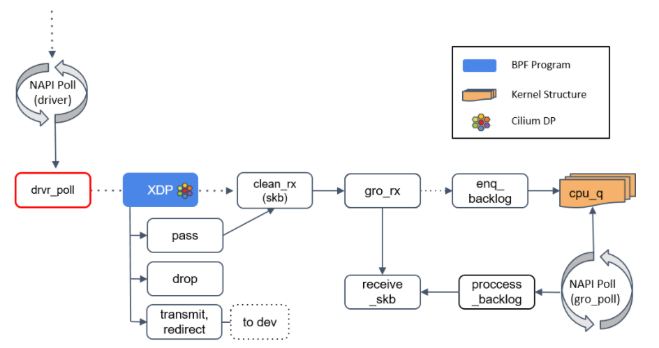

# 前言
> 写在最前面，首先要明确一点的是，`ebpf`是快速变化的，所以有可能上一个版本内核中存在的函数，到了下一个内核中就不存在了，因此`ebpf`其实是一项和内核版本高度关联的技术，因此当你在编写或是加载程序的时候遇到了麻烦，可以去质疑一下是否是内核本身的问题，而非你自己的！！


写这玩意完全就是因为最近要搞`ebpf`却发现我忘了该怎么编译了，甚至连怎么写都给忘了，所以想了想还是写个记录出来，也当是我的备忘录了


# 编译和运行
`ebpf`有多种编译和运行方式，就只挑选最为常用的几种方式来记录一下。


## `sample/bpf`
因为`ebpf`代码是运行在内核里面的，所以有引用到不少内核代码，而且又因为和内核版本高度相关，所以直接通过内核源码来编译是最简单最高效的。
内核源码中有专门的一个目录，里面是各种`ebpf`的代码例子，学习`ebpf`的编写基本都可以从这个目录入手。
首先就是下载对应版本的内核源码，你需要跑在什么版本的内核就下载什么版本。
下载下来以后，到源码目录下先执行如下命令，验证一下`bpf`的编译是没有问题的：
```
make menuconfig
make headers_install
make modules_prepare
make VMLINUX_BTF=/sys/kernel/btf/vmlinux -C samples/bpf
```
为什么要做这一步验证呢？因为内核源码更新过程中会产生不少`BUG`，这些问题又会导致编译失败，因此要首先确认一下你的编译环境是没问题的，才能继续下去。
验证以后将你编写的`ebpf`代码放到`sample/bpf`的目录下，然后修改`Makefile`，只余添加的位置需要看你的代码究竟是怎么写的，如果是类似如下这种仅仅是运行在内核态的纯`ebpf`代码，就需要在`always-y += `的最后一行添上你的代码文件名，并将后缀修改成`xxx.o`
```
#include <linux/bpf.h>
#include <bpf/bpf_helpers.h>
#include <bpf/bpf_tracing.h>
#include <bpf/bpf_core_read.h>


SEC("kprobe/security_socket_connect")
int hello(struct pt_regs *ctx) {
    char msg[] = "Hello eBPF!";
    bpf_trace_printk(msg, sizeof(msg));
    return 0;
}
char _license[] SEC("license") = "GPL";
```
然后重新执行`make VMLINUX_BTF=/sys/kernel/btf/vmlinux -C samples/bpf`，这样就能在这个目录下获得一份编译好的`ebpf执行文件`
但是光有执行文件还不行，`ebpf`代码是运行在内核中的，需要有一个`加载器`将这份代码加载到内核中才行：
```
#include <stdio.h>
#include <unistd.h>
#include <string.h>
#include <errno.h>
#include <fcntl.h>


#include <linux/bpf.h>
#include <bpf/libbpf.h>


#define DEBUGFS "/sys/kernel/debug/tracing/"


void read_trace_pipe(void)
{
    int trace_fd;
    trace_fd = open(DEBUGFS "trace_pipe", O_RDONLY, 0); //打开/sys/kernel/debug/tracing/trace_pipe文件
    if (trace_fd < 0)
        return;
    while (1) { //循环输出文件内容
        static char buf[4096];
        ssize_t sz;
        sz = read(trace_fd, buf, sizeof(buf) - 1);
        if (sz > 0) {
            buf[sz] = 0;
            puts(buf);
        }
    }
}


int main(int argc, char *argv[]) {
    struct bpf_link *link = NULL;
    struct bpf_program *prog;
    struct bpf_object *obj;
    obj = bpf_object__open_file("hello_kern.o", NULL);
    if (libbpf_get_error(obj)) {
        fprintf(stderr, "ERROR: open BPF object file failed\n");
        return 0;
    }
    prog = bpf_object__find_program_by_name(obj, "hello");
    if (!prog) {
        fprintf(stderr, "ERROR: finding a prog in obj file failed\n");
        return 0;
    }
    if (bpf_object__load(obj)) {
        fprintf(stderr, "ERROR: loading BPF object file failed\n");
        return 0;
    }
    link = bpf_program__attach(prog);
    if (libbpf_get_error(link)) {
        fprintf(stderr, "ERROR: bpf_program__attach failed\n");
        link = NULL;
        goto cleanup;
    }
    read_trace_pipe();
cleanup:
    bpf_link__destroy(link);
    bpf_object__close(obj);
    return 0;
}
```
用户态用`gcc`编译即可：
```
gcc -o hello hello_user.c -lbpf -g -lelf
```


## `clang + llvm`
这是第二种方式，这种编译方式不需要去下载内核源码，也是我自己常用的编译方式，而问题就是这种编译方式与你库文件高度相关，很有可能在其余版本的内核上无法运行。
```
clang -target bpf -nostdinc -isystem /usr/lib64/gcc/x86_64-suse-linux/10/include -I/usr/include -g -D__x86_64__ -O2 -emit-llvm -Xclang -disable-llvm-passes -c hello_kernel.c -o - | opt -O2 -mtriple=bpf-pc-linux | llvm-dis | llc  -march=bpf -filetype=obj -o hello_kern.o
```
简洁版
```
clang -O2 -g -target bpf -c hello_kernel.c -o hello_kern.o
```
## `CO-RE`
上面的两种编译方式都存在一个问题，就是你实际使用到的是两份执行文件，那是否有办法只需要一个文件就能把用户态和内核态都兼容呢？
这有两种方式，一种是在编写代码的时候就使用`ebpf字节码`来实现，而另一种就是`CO-RE`。
> 虽然我不太喜欢这种，觉得并没有那么好用


首先你需要导出一份`VMLINUX_H`，这份文件包含了当前内核中各种类型定义，然后在编写`ebpf`代码时候引用这个文件
```
bpftool btf dump file /sys/kernel/btf/vmlinux format c > vmlinux.h


// inf file hello_kernel.c
#include "vmlinux.h"
```
> 引用了`vmlinux.h`就不需要再引用`bpf.h`了


通过`clang`编译成`*.o`文件后，再通过`bpftool gen`将编译好的文件转换成头文件，并自动创建对应的加载API，接着再在用户态加载代码中引用这个头文件
```
bpftool gen skeleton hello_kern.o > hello_kern.skel.h


// in file hello_user.c
#include "hello_kern.skel.h"
```
最后在用户态程序中使用创建好的加载函数即可
```
#include <stdio.h>
#include <unistd.h>
#include <string.h>
#include <errno.h>
#include <fcntl.h>


#include "hello_kern.skel.h"


#define DEBUGFS "/sys/kernel/debug/tracing/"


void read_trace_pipe(void)
{
    int trace_fd;


    trace_fd = open(DEBUGFS "trace_pipe", O_RDONLY, 0); //打开/sys/kernel/debug/tracing/trace_pipe文件
    if (trace_fd < 0)
        return;


    while (1) { //循环输出文件内容
        static char buf[4096];
        ssize_t sz;


        sz = read(trace_fd, buf, sizeof(buf) - 1);
        if (sz > 0) {
            buf[sz] = 0;
            puts(buf);
        }
    }
}


int main(int argc, char *argv[]) {
    struct hello_kern *skel;
    int i;


    skel = hello_kern__open_and_load();
    if (!skel) {
        fprintf(stderr, "ERROR: open and load prog failed.\n");
        goto cleanup;
    }


    i = hello_kern__attach(skel);
    if (i < 0) {
        fprintf(stderr, "ERROR: attach obj failed.\n");
        hello_kern__detach(skel);    
        goto cleanup;
    }
    read_trace_pipe();


cleanup:
    hello_kern__destroy(skel);
    return 0;
}
```
不过从我个人的角度来说，我不太喜欢使用这种方式，一个是因为麻烦，另一个就是因为我说过`ebpf`是一项和内核高度相关的技术，但是`CORE`的方法却一定程度上屏蔽了因为内核变化而导致失败的信息，并不利于我们的学习与开发，因此我也是很少使用这种方式来进行编程。


再说一下字节码的方式，使用这种方式进行`ebpf`开发的无非两种人：
1. 研究者
2. 追求高性能


# 第一个`ebpf`程序
## `xdp`
### `模式`





`xdp`有三种运行模式：
1. `xdpdrv`：`NATIVE XDP`，也就是默认模式，运行在网卡驱动的`poll`函数中，需要网卡驱动支持才行，内核主线中`10G+`的驱动基本都支持了。
2. `xdpoffload`：`OFFLOAD XDP`，将`xdp`译成智能网卡原生指令运行在网卡上，需要有硬件支持，不过很多函数和`map`都不支持。
3. `xdpgeneric`：`GENERIC XDP`，前两种模式都不支持，最终`xdp`会运行在`receive_skb`中，基本作为测试模式使用。


> 从[kernel-versions.md](https://github.com/iovisor/bcc/blob/master/docs/kernel-versions.md#xdp)可以看到有哪些驱动支持`xdp`


### `加载`
一份简单的`xdp`程序：
```
#include <bpf/bpf.h>
/*
 * Comments from Linux Kernel:
 * Helper macro to place programs, maps, license in
 * different sections in elf_bpf file. Section names
 * are interpreted by elf_bpf loader.
 * End of comments


 * You can either use the helper header file below
 * so that you don't need to define it yourself:
 * #include <bpf/bpf_helpers.h> 
 */
#define SEC(NAME) __attribute__((section(NAME), used))


SEC("xdp")
int xdp_drop_the_world(struct xdp_md *ctx) {
    // drop everything
  // 意思是无论什么网络数据包，都drop丢弃掉
    return XDP_PASS;
}
char _license[] SEC("license") = "GPL";
```
`xdp`有三种运行模式，且和网卡相关，因此常用的加载方式都是用过`ip link`的方式将`xdp`程序加载到相应的网卡上，这也是最便捷的方式
```
sudo ip link set dev enp0s31f6 xdp obj xdpsocks.o sec xdp
```
当驱动不支持``xdpdrv的方式的话，则会自动使用`xdpgeneric`的方式加载。当然`xdp`也是可以像普通的`ebpf`程序一样通过自己写加载器来加载的，但是说实话有些麻烦，因为你要在代码中指定网卡，那还不如`ip link`的方式来的方便。


## `tc`
我对`tc`暂时没什么兴趣，所以按住不表。