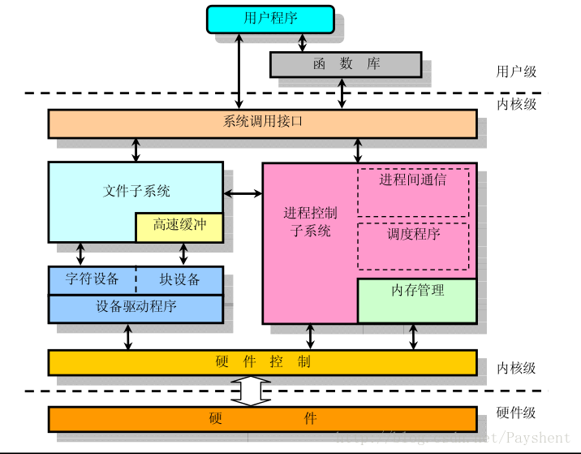
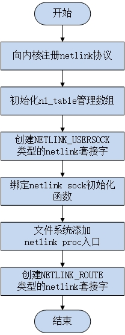
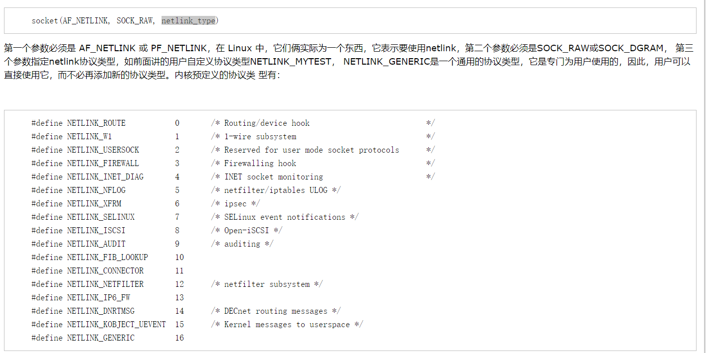

* 内核态:控制计算机的硬件资源，并提供上层应用程序运行的环境
* 用户态:上层应用程序的活动空间，应用程序的执行需要内核提供资源
* 系统调用:内核为上层应用提供的访问资源的接口

内核态提供所有的`资源`，并提供相应的调用接口，而上层应用在用户态下执行，通过公用函数库(封装了`系统调用`)实现对资源的调用。用户态是非特权状态，代码的运行受限，属于底层安全机制，防止给操作系统带来安全隐患。

linux有提供一定数量的系统调用，但是有些系统调用非常危险，所以CPU将指令划分为特权指令和非特权指令，普通应用程序无法调用这些指令
> Ring0-3 0是内核态，3是用户态

不同特权状态下的程序权利不同，比如`fork()`是调用的`sys_fork()`，但是一个工作在用户态下，一个工作在内核态下，用户态下的程序无法自己去`消耗系统的物理资源`，`分配物理内存`，`拷贝父进程信息`等等，这些操作都需要特权较高的程序去操作，而用户态的程序是没法直接调用的，因此有一个封装了`系统调用`的公用函数库，也就是`fork()`触发了`sys_fork()`

> 应用程序能直接通过系统调用编程

库函数是对`系统调用`的封装，分为两类:
1. 操作系统提供
2. 第三方提供
而用户态到内核态的切换，有以下三种情况:
1. 系统调用(本质上是软中断)
2. 设备中断(硬中断)
3. 异常(缺页)

## 内核态和用户态的通信，数据交换
只看netlink，双工，不阻塞(因为是把消息存到接收端的socket缓存接收队列中)，主动发起通信，多播1:N(一个内核进程对多个用户态进程)
>经常用于一个内核进程和多个用户进程之间的1:N的数据通信。内核作为会话的发起者，用户空间的应用程序是接收者。为了实现这个功能，内核空间的程序会创建一个多播组，然后所有用户空间的对该内核进程发送的消息感兴趣的进程都加入到该组即可接收来自内核发送的消息了。

缺点:但是因为是UDP封包，所以只管发
至于想获取到什么样的信息，就自己加入什么样的协议族

## netlink创建
内核Netlink的初始化在系统启动阶段完成，初始化代码在af_netlink.c的netlink_proto_init()函数中，整个初始化流程如下：

[资料](https://blog.csdn.net/luckyapple1028/article/details/50839395)

## 用户态的netlink编程

[Linux环境下纯Python无第三方库读写Netlink](https://blog.csdn.net/shajunxing/article/details/79755996)