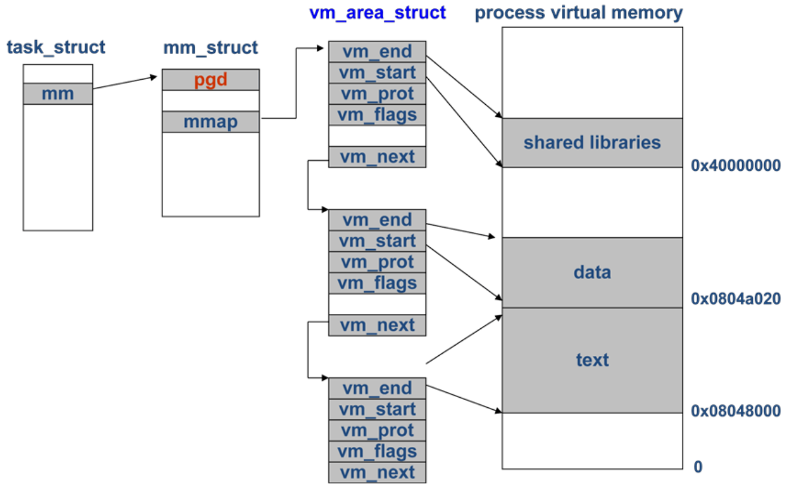
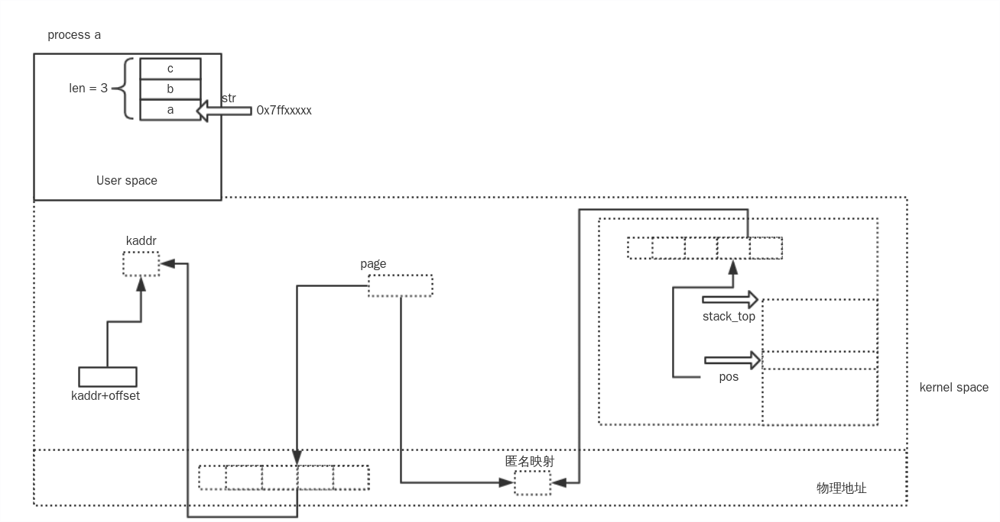
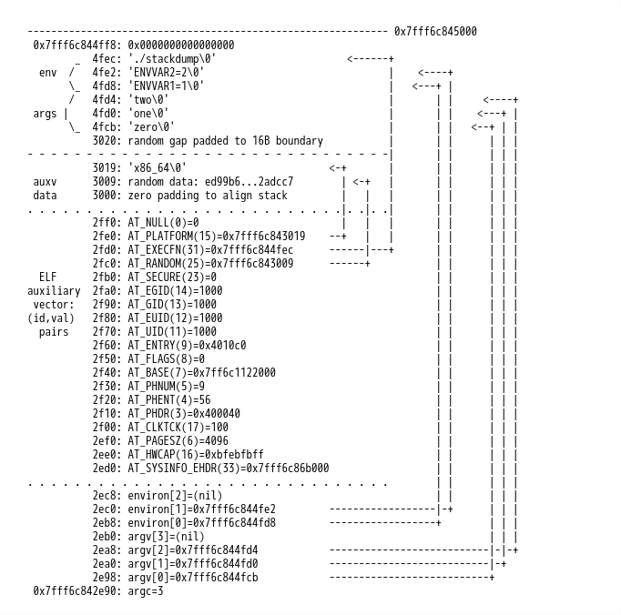
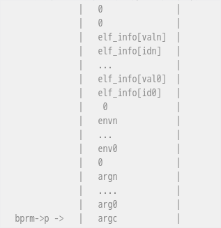

> 真的没想到，我会在2020.1.10的时候翻出2016.8.3写的这篇笔记，这篇文章照着当时乌云社区学习做的记录，是的当时乌云还没倒。只是隐约记得我晚上在宿舍搞这玩意搞到了一两点，但也还是一知半解的，不知道今天怎么了，就突发奇想在这个老记录的基础上再写点新的东西，也算是枯木逢春了。  -- 2020.1.10


故事的起源是自己写了一份代码
```
#include<string.h>
#include <stdio.h>
//主函数
int main()
{
char str[10];
int rete;
gets(str); //定义字符数组并赋值
char buffer[10]; //开辟 10 个字节的局部空间
strcpy(buffer,str);


rete=strcmp( buffer ,"key");


if(rete == 0){
    printf("Good!\n");
}else{
    printf("Loser\n");
}
return 0;
}
```
然后去尝试`缓冲区溢出`，当时刚刚接触这玩意的我最后给这段程序下的定义是：
```
能溢出，但是不会执行shell
```
现在翻过来`2020`年了，就又编译了一次这个程序，顺便记录一下当年没有记录的东西。
一个程序运行起来会是什么样子的呢？这个有相当一部分都是`elf`加载的知识。`elf`的装载就是一个在`头信息`的指引下各个区段装入进程用户空间等一系列操作的过程。
当程序经过编译后运行起来，进入到用户态内存之中，那首先要知道的就是从程序的视角来说，运行起来的程序与程序之间的内存空间相互独立，都认为自身占用的是整个`memory`，并且都从相同的`STACK_TOP`(排除`aslr`)加载且有相同的内存布局，：


如果说整个系统中所有的执行程序加载起始位置都相同的话，会引起冲突吗？
显然不会，因为这些对于各程序本身来说完全相同的起始地址都是虚拟地址，是由物理地址经过页表转换映射出来的地址，在实际物理地址上其实是不同的。
> 由于`elf`是`静态链接`还是`动态链接`的区别，所以在最终加载的时候都存在一些区别


先前其实做过`elf`加载的相关研究，但是第一次接触非常多的认识不到位，只能照猫画虎，这次过了一段时间后再去补全一点知识，我没有看过`《程序员的自我修养》`一类的书籍，所以有非常多的地方描述不到位，但是鉴于大部分都是简单的记录自己的理解，自己能看懂就好了：）。


上面说了运行的程序之间内存空间相互独立，但是又都认为独占空间，那么这样的效果是怎么产生的呢？`elf`加载的核心函数是`static int load_elf_binary(struct linux_binprm *bprm)`，如果认为这个传参就是这个`elf`的话，就必然已然存在一些属性，因为一个程序进程化是存在过程的，内存也不能凭空变出来，重新回到最外层的`do_execve`的部分再去看，去探寻`bprm`的诞生到执行。
```
bprm = kzalloc(sizeof(*bprm), GFP_KERNEL);
retval = prepare_bprm_creds(bprm);
check_unsafe_exec(bprm);
retval = bprm_mm_init(bprm);
retval = prepare_binprm(bprm);
retval = copy_strings_kernel(1, &bprm->filename, bprm);
retval = copy_strings(bprm->envc, envp, bprm);
retval = copy_strings(bprm->argc, argv, bprm);
retval = exec_binprm(bprm);
```
第一条分配`struct linux_binprm`结构体的内核内存。
第二条则设置了`bprm->cred`其中包括了各种`gid`，`uid`信息等权限信息。
第三条则是安全检查，不过好像不会做什么操作，略过。
第四条看名字就很像是内存初始化的步骤，明说了就是建立内存管理的`mm`结构，也就值最终进程的`mm_struct`。
第五条是调用了`bprm_fill_uid`设置了即将运行的进程的`uid`和`gid`，再通过`kernel_read`将`file`内容读入`bprm`的缓存中。
第六，七，八都是关于内存数据拷贝的东西，后面再看
第九条就是执行了
> `task_struct->mm`是一个进程的`内存描述符`，代表了一个进程的虚拟地址空间信息。


跟入`bprm_mm_init`，上面的注释写的意思大概就是创建了一个临时的堆栈`vm_area_struct`用来填充`mm_struct`，这个原因是因为现有的数据不足以设置`stack_flag`，`权限`，`偏移`所以用临时值代替一下，等调用`setup_arg_pages()`时候会全都更新掉。
```
/*
 * Create a new mm_struct and populate it with a temporary stack
 * vm_area_struct. We don't have enough context at this point to set the stack
 * flags, permissions, and offset, so we use temporary values. We'll update
 * them later in setup_arg_pages().
 */
struct mm_struct *mm = NULL;
bprm->mm = mm = mm_alloc();
```
`mm_alloc()`初始化了一个`mm_struct`出来，并调用了`mm_aloc_pgd`分配了一个`pgd`给`mm->pgd`，这是进程的`页目录`指针，指向当前进程的页目录表，大小为`4kb`，且此刻的`mm->mmap = NULL`。
> 详情见`kernel/fork.c`的`mm_init()`


其中`mm->mmap`是一个链表结构的数据`vm_area_struct`，代表了一个进程虚拟地址区间，这点往后再接着说才能看明白。





第一个`vm_area_struct`是在`__bprm_mm_init`中定义，其中的`vm_end`是`STACK_TOP_MAX`，`vm_start`是`vm_end - PAGE_SIZE`
```
//64下STACK_TOP_MAX就是TASK_SIZE_MAX
#define TASK_SIZE_MAX ((1UL << 47) - PAGE_SIZE)
```
`vm_end = 0x00007ffffffff000`，`vm_start = 0x00007fffffffe000`，接着再调整当前的`top of mem`，即堆栈起始指针，这也是`bprm->exec`用到的地址。
其中`- PAGE_SIZE`是为用户空间的一个保护页预留的大小，内核文档中规定了`0x0000000000000000 -- 0x00007fffffffffff`为用户空间，而`0xffff800000000000`以上为内核空间，其中的空洞部分是留着扩展用。
这一段的思想就是把`stack`放在架构支持的最大`stack address`上，之后再慢慢调整到适合的位置，至于用`STACK_TOP_MAX`而不是`STACK_TOP`是因为它可能因为配置而改变：
```
 /*
  * Place the stack at the largest stack address the architecture
  * supports. Later, we'll move this to an appropriate place. We don't
  * use STACK_TOP because that can depend on attributes which aren't
  * configured yet.
  */
```
设置`栈起始虚拟地址`，这儿需要减去一个指针的大小。
```
bprm->p = vma->vm_end - sizeof(void *); //0x00007fffffffeff8
```
> 临时栈`vm_area_struct`大小是一个`page`，但只是硬编码定义好的虚拟地址区间，并没有映射到物理内存上。


在`copy_strings_kernel`上面写着一段注释，说明数据来源于`内核内存`，不过`cpoy`的方式还是调用的`copy_strings`，而能够从`内核内存`复制数据是因为`set_fs(KERNEL_DS)`修改了数据段，这是因为`copy_strings`会检测地址是否小于当前进程的`addr_limit`，而`内核空间`比`用户空间`更高，所以要修改：
```
/*
 * Like copy_strings, but get argv and its values from kernel memory.
 */
```
同样的在`copy_strings`上也有一段注释，写的很明白就是从旧程序的内存中复制数据到新程序的栈上：
```
/*
 * 'copy_strings()' copies argument/environment strings from the old
 * processes's memory to the new process's stack. The call to get_user_pages()
 * ensures the destination page is created and not swapped out.
 */
```
首先要知道源数据地址是这样定义的：
```
const char __user *str;
str = get_user_arg_ptr(argv, argc);
```
`__user`宏代表`str`指向的是一个`用户空间地址`，在`内核空间`没有意义，但是`kernel`的运行环境是`内核空间`，因此想要拷贝到这个数据，就需要使用`copy_from_user`这样的函数：
```
copy_from_user(kaddr+offset, str, bytes_to_copy)
```
`kaddr+offset`是要复制过去的`目标线性地址`，是一个`内核空间线性地址`，实际的数据拷贝用的都是两个`线性地址`所映射的`物理地址`，而个中转换方式还有可能影响直接摘抄：
```
在cpu进行访址的时候，内核空间和用户空间使用的都是线性地址，cpu在访址的过程中会自动完成从线性地址到物理地址的转换[用户态、内核态都得依靠进程页表完成转换]，而合理的线性地址意味着：该线性地址位于该进程task_struct->mm虚存空间的某一段vm_struct_mm中，而且建立线性地址到物理地址的映射，即线性地址对应内容在物理内存中。如果访存失败，有两种可能：该线性地址存在在进程虚存区间中，但是并未建立于物理内存的映射，有可能是交换出去，也有可能是刚申请到线性区间[内核是很会偷懒的]，要依靠缺页异常去建立申请物理空间并建立映射；第2种可能是线性地址空间根本没有在进程虚存区间中，这样就会出现常见的坏指针，就会引发常见的段错误[也有可能由于访问了无权访问的空间造成保护异常]。如果坏指针问题发生在用户态，最严重的就是杀死进程[最常见的就是在打dota时候出现的大红X，然后dota程序结束]，如果发生在内核态,整个系统可能崩溃。
```
然而在设计上来说，这个数据是要复制到一个`新进程`的指定`用户空间`的`线性地址`上，但是这个`新进程`此刻还全都在内核空间中，这样的问题就产生了，`str`的`线性地址`到`物理地址`的映射是在完好的，然而目标地址其实是不完整的，那就需要做这些事情：
* 通过相对位移计算出新进程用户空间线性地址值`pos`
数据需要从临时栈的`stack_top`开始往下增加，但是要复制的数据是从低地址向高地址读的，所以通过数据长度来计算出相对偏移，然后在用栈顶去减去偏移量计算出最终数据的线性地址值：(0x00007fffffffeff8 - len(数据长度)) 


* 为`pos`的值表示的地址映射一个`物理内存`
因为内存的最小管理单元是`页`，因此并不能说只映射一个地址，而是需要映射整个内存页。所以先算一下`pos`的页内偏移量。然后找到`pos`在`bprm->mm`中的所在页线性地址(因为是内核使用，所以`__get_user_pages`函数中会自带一层映射关系，其中如果缺页的话将会创建匿名页映射，将`用户空间线性地址`映射到一个`内核空间线性地址`上)这个地址就是`kmapped_page = page`，然后用`kmap(kmapped_page)`临时映射出一个`物理页`的`线性地址`出来，然后计算`pos`的`页号kpos`，通过`flush_arg_page()`刷新一下`bprm->mm`的`页表信息`，记录新的映射关系，也就是页号中的物理地址。
```
    page = get_arg_page(bprm, pos, 1); 
    kmapped_page = page;
    kaddr = kmap(kmapped_page);  
    kpos = pos & PAGE_MASK;
    flush_arg_page(bprm, kpos, kmapped_page); 
```
大概的过程图就是这样：





复制完数据后，会下移`bprm->p`的地址，指向`栈顶`。
之后经过`search_binary_handler()`调用`load_elf_binary()`加载整个`bprm`，`elf`的整个文件信息被保存在`bprm->buf`中，如果是动态编译的程序，是需要有`动态链接库解释器`参与其中的，那意思就是说`bprm`中需要把解释器加载进来。
先手动给一些以后会用到的段地址赋值。
```
 elf_ppnt = elf_phdata;
 elf_bss = 0;  //bss段
 elf_brk = 0; 
 start_code = ~0UL;  //0xffffffffffffffff
 end_code = 0;
 start_data = 0;
 end_data = 0;
```
清空初始化`bprm`的地址空间后加载权限信息。
```
retval = flush_old_exec(bprm);
setup_new_exec(bprm);
install_exec_creds(bprm);
```
这儿要注意一下`flush_old_exec`其中有这样的操作：
```
retval = exec_mmap(bprm->mm);
   |_ tsk = current;
   |_ tsk->mm = mm;

bprm->mm = NULL;
current->personality &= ~bprm->per_clear;
```
> personality用來兼容linux的旧版或者BSD等其他版本。


这儿为止就把`current->mm`替换成之前的`bprm->mm`，也就是完全脱离了父进程，且所有的用户空间页面全都释放，即获取了一个全新的用户空间。


然后在`setup_new_exec`中调用`arch_pick_mmap_layout`确认内存的布局方式，也就是内存地址增长方向：
```
void arch_pick_mmap_layout(struct mm_struct *mm, struct rlimit *rlim_stack)
{
 if (mmap_is_legacy())
  mm->get_unmapped_area = arch_get_unmapped_area;
 else
  mm->get_unmapped_area = arch_get_unmapped_area_topdown;


 arch_pick_mmap_base(&mm->mmap_base, &mm->mmap_legacy_base,
   arch_rnd(mmap64_rnd_bits), task_size_64bit(0),
   rlim_stack);
```
其中关于`mmap_is_legacy`的实现：
```
static int mmap_is_legacy(void)
{
 if (current->personality & ADDR_COMPAT_LAYOUT)
  return 1;
 return sysctl_legacy_va_layout; //0
}
```
为`1`的话选用经典布局，为`0`的话则用新布局，现在默认都是新布局，所以内存是自上而下从`mmap_base`增长。
最后调用函数返回`mmap_base`的值
```
arch_pick_mmap_base(&mm->mmap_base, &mm->mmap_legacy_base,
   arch_rnd(mmap64_rnd_bits), task_size_64bit(0),
   rlim_stack);
    |_ mmap_base(random_factor, task_size, rlim_stack);
```
其中`random_factor`是`arch_rnd(mmap64_rnd_bits)`，`task_szie`是`task_size_64bit(0)`，`rlim_stack`是`&bprm->rlim_stack(8MB)`
这儿有些历史原因值得说一下，在`2.6`内核中，`mmap_base`的赋值并没有那么麻烦，它的实现如下：
```
/*
 * Top of mmap area (just below the process stack).
 *
 * Leave an at least ~128 MB hole.
 */
#define MIN_GAP (128*1024*1024)  //128MB
#define MAX_GAP (TASK_SIZE/6*5)
static inline unsigned long mmap_base(struct mm_struct *mm)
{
 unsigned long gap = current->signal->rlim[RLIMIT_STACK].rlim_cur;
 if (gap < MIN_GAP)
  gap = MIN_GAP;
 else if (gap > MAX_GAP)
  gap = MAX_GAP;
 return TASK_SIZE - (gap & PAGE_MASK);
}
```
这种情况下可以轻易的算出`mmap_base`的地址，因而在后来更新了代码为加了一个随机数进去，成了`页对齐(用户态最高可用地址 - 可能的栈空间大小 - 随机值)`：
```
+ return PAGE_ALIGN(TASK_SIZE - gap - mmap_rnd());
- return TASK_SIZE - (gap & PAGE_MASK);
```
> `#define PAGE_ALIGN(addr) ALIGN(addr, PAGE_SIZE)`，作用是给一个地址返回一个页对齐的地址，例如`PAGE_ALIGN(1) = 4096`，`PAGE_ALIGN(5000) = 8192`，这样操作的理由是因为`CPU`高速缓存是按照页缓存物理页面的，将地址对齐到页边界可以更好的利用处理器高速缓存资源。


看起来仿佛没有什么问题了，然而并不是，因为极端情况下，`mmap_rnd()`的值可能为`0`，这样的话`mmap_base`的取值就成了`TASK_SIZE - gap`，然而当`栈地址随机化`参与进来后，`栈`的起始地址产生变动，偏移范围是[0, stack_maxrandom_size()]，这就导致`栈增长`越界到了`mmap`的地址空间，因为发布了新的`patch`解决这个问题：
[x86: Increase MIN_GAP to include randomized stack](https://git.kernel.org/pub/scm/linux/kernel/git/stable/linux.git/commit/arch/x86/mm/mmap.c?id=80938332d8cf652f6b16e0788cf0ca136befe0b5)，即修改`MIN_GAP`为`栈地址随机化`预留空间。
至此为止整个`mmap`地址空间布局完成，顺便再提一个`CVE-2016-3672`的漏洞，这个漏洞的结果是导致`mmap_base`的随机化失效，怎么做到的呢？
翻回`4.5.2`以前的内核，函数`mmap_is_legacy`的判断条件如下：
```
static int mmap_is_legacy(void)
{
 if (current->personality & ADDR_COMPAT_LAYOUT)
  return 1;
 if (rlimit(RLIMIT_STACK) == RLIM_INFINITY)
  return 1;
 return sysctl_legacy_va_layout;
}
```
这比现在多一个关于`rlimit(RLIMIT_STACK)`的判断，即`线程栈大小`无限制的话，直接返回`1`，这个通过`ulimit -s unlimited`可以设置。那如果为`1`后，`mm->mmap_base = mm->mmap_legacy_base;`，而这个版本`mm->mmap_legacy_base`的来源如下：
```
unsigned long random_factor = 0UL;
if (current->flags & PF_RANDOMIZE)
  random_factor = arch_mmap_rnd();
mm->mmap_legacy_base = mmap_legacy_base(random_factor);
```
看起来还是有随机数是不是，然而跟入到`mmap_legacy_base`函数中去就能发现问题：
```
/*
 * Bottom-up (legacy) layout on X86_32 did not support randomization, X86_64
 * does, but not when emulating X86_32
 */
static unsigned long mmap_legacy_base(unsigned long rnd)
{
 if (mmap_is_ia32())
  return TASK_UNMAPPED_BASE;
 else
  return TASK_UNMAPPED_BASE + rnd;
}
```
针对`32位`的程序，根本没有用到随机数，那么`mmap_base = TASK_UNMAPPED_BASE`直接固定。
> 重新把话题转回来，继续回到主线剧情上


完成`mmap`的内存地址布局后，确定`user space process size`。
``` 
/* Set the new mm task size. We have to do that late because it may
  * depend on TIF_32BIT which is only updated in flush_thread() on
  * some architectures like powerpc
  */
 current->mm->task_size = TASK_SIZE;  //0x00007ffffffff000
```
> 这儿的定义当时我整了好久没明白，怎么好多文章都说道这个就是`用户空间`大小，但是`kernel`的文档划分的大小又和算出来的这个不对应，因此去看一下在源码中的定义


```
//这是TASK_SZIE，在64位下就是TASK_SIZE_MAX
#define TASK_SIZE (test_thread_flag(TIF_ADDR32) ? \
     IA32_PAGE_OFFSET : TASK_SIZE_MAX)
```
再去查`TASK_SIZE_MAX`，上面的注释这样写道：
```
/*
 * User space process size. This is the first address outside the user range.
#define TASK_SIZE_MAX ((1UL << __VIRTUAL_MASK_SHIFT) - PAGE_SIZE)
```
> 再次回归主线剧情，回到`load_elf_binary`中


处理完`mmap`的内存布局和确定了`TASK_SIZE`后，调用`setup_arg_pages`处理`栈`相关的事情。
```
retval = setup_arg_pages(bprm, randomize_stack_top(STACK_TOP),
     executable_stack);
```
`executable_stack`记录的是否可执行，说实话不咋影响略过，主要看第二个参数
```
randomize_stack_top(STACK_TOP)
```
这儿先记一些数值，`vm_start = 0x00007fffffffe000`，`vm_end == STACK_TOP == TASK_SIZE_MAX == TASK_SIZE == 0x00007ffffffff000`。
```
/*64位 
* STACK_RND_MASK = 0x3fffff
* PAGE_SHIFT = 12
*/
static unsigned long randomize_stack_top(unsigned long stack_top)
{
 unsigned long random_variable = 0;
 if (current->flags & PF_RANDOMIZE) {
  random_variable = get_random_long();
  random_variable &= STACK_RND_MASK; //random_variable确定为一个22bit的随机数
  random_variable <<= PAGE_SHIFT;
 }
#ifdef CONFIG_STACK_GROWSUP //这是需要额外配置的内核宏
 return PAGE_ALIGN(stack_top) + random_variable;
#else
 return PAGE_ALIGN(stack_top) - random_variable; //页边界对齐后 - random_variable
#endif
}
```
`random_variable`是一个`22bit`的随机数左移`12`位，那么范围是`0 -- 0x3fffff000`，那随机化后的`stack_top`的值在`0x00007ffc00000000 -- 0x00007ffffffff000`之间，接着进入到`setup_arg_pages()`中。
> 挑出关键逻辑来说。


```
stack_top = arch_align_stack(stack_top);
stack_top = PAGE_ALIGN(stack_top);
```
这两行操作会对`stack_top`减去随机`0 ～ 8192`，然后`& ~0xf`，再进行页对齐。
那至此位置，本来是一个固定值`0x00007ffffffff000`的`stack_top`经过的随机化过程有：
`页对齐` -- `- [0, 0x3fffff000]` -- `- [0, 8192]` -- `& ~0xf` -- `页对齐`
> 在某些体系结构中，首先要完成从逻辑地址到物理地址的转换，然后才能去cache中查找该物理地址是否已经在cache当中。这样，cache命中的代价较高。一种常用的技巧是，在L1中，逻辑地址索引-物理地址比较（virtually indexed, physically tagged）。思路是，利用逻辑地址与物理地址的页内偏移一样的特点，用页内偏移进行索引，页号通过TLB转换成物理页号进行tag比较。这样，可以不经转换，就先索引，从而加快速度。这样，如果两个逻辑地址的块页内偏移一样，它们索引的cache行也就一样，所以需要随机化页内偏移来减少L1的竞争。其缺点是，L1的set大小，不能超过页的大小。换言之：`L1的大小 <= 相联度 * 块的大小 * 页的大小`


```
 stack_shift = vma->vm_end - stack_top;
 bprm->p -= stack_shift;
 mm->arg_start = bprm->p; 
if (bprm->loader)
  bprm->loader -= stack_shift;
 bprm->exec -= stack_shift;
```
`vma->vm_end`的值是`STACK_TOP_MAX`，那`stack_shift`就是经过随机化以后的位移量，而`bprm->p`也减去相同位移量，然后设置`内存描述符`中的命令行参数的起始地址，相同的`bprm->exec`也要减去相同的位移量。
> 这儿产生的疑问有：
 为什么计算`stack_shift`是用`vma->vm_end`去减去现在的`stack_top`而不是直接用`STACK_TOP`去减？
个人猜测是因为`STACK_TOP`还是有可能因为自定义配置而改变掉，因为先前的各种配置都是依据`临时stack`设置的，所以要保持一致。


```
 /* Move stack pages down in memory. */
 if (stack_shift) {
  ret = shift_arg_pages(vma, stack_shift);
  if (ret)
   goto out_unlock;
 }
```
`shift_atg_pages`这个函数的作用可以从注释上就明显看出来：
```
/*
 * During bprm_mm_init(), we create a temporary stack at STACK_TOP_MAX. Once
 * the binfmt code determines where the new stack should reside, we shift it to
 * its final location. The process proceeds as follows:
 *
 * 1) Use shift to calculate the new vma endpoints.
 * 2) Extend vma to cover both the old and new ranges. This ensures the
 * arguments passed to subsequent functions are consistent.
 * 3) Move vma's page tables to the new range.
 * 4) Free up any cleared pgd range.
 * 5) Shrink the vma to cover only the new range.
 */
```
正如注释所说的，关于`vm_area`的修改并不是直接修改值就可以了，而是涉及到了内存区域的合并，同时涉及了内存管理树的修改，同时也要修改`页表`信息：
```
 /*
  * cover the whole range: [new_start, old_end)
  */
 if (vma_adjust(vma, new_start, old_end, vma->vm_pgoff, NULL))
  return -ENOMEM;
 /*
  * move the page tables downwards, on failure we rely on
  * process cleanup to remove whatever mess we made.
  */
 if (length != move_page_tables(vma, old_start,
           vma, new_start, length, false))
  return -ENOMEM;
vma_adjust(vma, new_start, new_end, vma->vm_pgoff, NULL);
```
设置完`真实栈地址`后就需要调整栈空间了，因为现在的`栈`大小只有一个`page`，扩展大小有一个默认值是`stack_expand = 131072UL; /* randomly 32*4k (or 2*64k) pages */`。
```
rlim_stack = bprm->rlim_stack.rlim_cur & PAGE_MASK;
 if (stack_size + stack_expand > rlim_stack)
  stack_base = vma->vm_end - rlim_stack;
 else
  stack_base = vma->vm_start - stack_expand;
 current->mm->start_stack = bprm->p;
 ret = expand_stack(vma, stack_base);
```
此刻的内存空间中其实已经设置好了`mmap`，只是为`stack`预留的空间，因此扩展的大小不能超过之间的空洞部分。
最后设置一下现在的`bprm->p`，然后扩展一下栈空间，就又返回到了`load_elf_binary`中，现在的`stack`一共有`34`个page。
数据在`bprm->file`中，就需要将其加载进内存里，循环找`PT_LOAD`的段，当第一次加载的时候` elf_brk == elf_bss = 0`，`vaddr = elf_ppnt->p_vaddr`，所以直接查看一下加载的数据类型是否为`ET_EXEC(可执行文件)`或者是`ET_DYN(共享文件)`，如果是后者的话，则需要从`ELF_ET_DYN_BASE`开始映射，不过其中也需要加上一个随机偏移。
```
* Therefore, programs are loaded offset from
    * ELF_ET_DYN_BASE and loaders are loaded into the
    * independently randomized mmap region (0 load_bias
    * without MAP_FIXED).
    */
   if (elf_interpreter) {

    load_bias = ELF_ET_DYN_BASE; //  2/3 TASK_SIZE
    if (current->flags & PF_RANDOMIZE)
     load_bias += arch_mmap_rnd();
    elf_flags |= elf_fixed;


   /*
    * Since load_bias is used for all subsequent loading
    * calculations, we must lower it by the first vaddr
    * so that the remaining calculations based on the
    * ELF vaddrs will be correctly offset. The result
    * is then page aligned.
    */
load_bias = ELF_PAGESTART(load_bias - vaddr); //地址按照页大小向前对齐，这是一个偏移量
```
看一下这个`vaddr`的来源是`vaddr = elf_ppnt->p_vaddr;`，这个地址是一个`__user`地址，不过第一个段肯定是`0`，通过如此方式确定了一段数据要加载到内存中的位置，接着通过`elf_map`进行加载，把数据从文件中映射到对应的`用户空间内存区间`中。
> 这儿可以很明显的看出来，第一段的加载地址实际上就是页对齐后的`load_bias`


```
static unsigned long elf_map(struct file *filep, unsigned long addr,
  struct elf_phdr *eppnt, int prot, int type,
  unsigned long total_size)
{
 unsigned long map_addr;
 unsigned long size = eppnt->p_filesz + ELF_PAGEOFFSET(eppnt->p_vaddr);
 unsigned long off = eppnt->p_offset - ELF_PAGEOFFSET(eppnt->p_vaddr);
 addr = ELF_PAGESTART(addr);
 size = ELF_PAGEALIGN(size);
```
传入的参数中，`filep`是文件指针，`addr`是要加载的`线性地址`，`size`是要加载的文件内容大小，`off`是在文件中的偏移量。其实这个函数本质是还是`do_map`，会分配`vm_area_struct`来表示一个虚拟区间。
且设置完第一个段的加载地址后，会设置`load_addr_set=1`，从而跳开很多流程。
<font color=red size=3>这边我其实本身是有疑问的，就是一开始的内存布局是从高地址到低地址的，但是这边关于段加载的顺序是从低地址到高地址的，那关于`vm_area_struct`其实是一个链表形式，它最后是怎么串联起来的呢？</font>


待到加载完所有的段后，调整各段的开始和结束位置：
```
 loc->elf_ex.e_entry += load_bias;
 elf_bss += load_bias;
 elf_brk += load_bias;
 start_code += load_bias;
 end_code += load_bias;
 start_data += load_bias;
 end_data += load_bias;
```
`elf_map`是按照`p_filesz`做的`map`，但是如果`p_memsz > p_filesz`这种情况，是说明有一部分的`bss`需要被`map`的，因此需要最后兜底一下：
```
retval = set_brk(elf_bss, elf_brk, bss_prot);
```
> `p_memsz`是内存中段所占的内存大小，而`p_files`是文件中段的字节大小，所以`p_files <= p_memsz`是必须的，其中多出来的部分很有可能是包含了一个`.bss`部分，在`set_brk`后会把和`bss`段中对应的那部分清零


设置程序入口，这也得看有没有`elf_interpreter`
```
if (elf_interpreter) {
    unsigned long interp_map_addr = 0;
    
    elf_entry = load_elf_interp(&loc->interp_elf_ex,
                interpreter,
                &interp_map_addr,
                load_bias, interp_elf_phdata);
    /* 入口地址是解释器映像的入口地址 */
    } else {
    /* 入口地址是目标程序的入口地址 */
    elf_entry = loc->elf_ex.e_entry;
    }
}
```
如果有解释器就是解释器入口，没有的话就是程序映像本身的入口。
调用`create_elf_tables`填写程序的各种参数环境变量栈顶地址等信息。
> 这个函数之中各种注释，写的很好很高效


```
 /*
  * In some cases (e.g. Hyper-Threading), we want to avoid L1
  * evictions by the processes running on the same package. One
  * thing we can do is to shuffle the initial stack for them.
  */
 p = arch_align_stack(p);
```
先前就分析过这个函数，结果现在又来了，就是针对栈顶地址做了一个`查找优化？`
```
 /*
  * If this architecture has a platform capability string, copy it
  * to userspace. In some cases (Sparc), this info is impossible
  * for userspace to get any other way, in others (i386) it is
  * merely difficult.
  */
 u_platform = NULL;
 if (k_platform) {
  size_t len = strlen(k_platform) + 1;


  u_platform = (elf_addr_t __user *)STACK_ALLOC(p, len);
  if (__copy_to_user(u_platform, k_platform, len))
   return -EFAULT;
 }
 /*
  * If this architecture has a "base" platform capability
  * string, copy it to userspace.
  */
 u_base_platform = NULL;
 if (k_base_platform) {
  size_t len = strlen(k_base_platform) + 1;


  u_base_platform = (elf_addr_t __user *)STACK_ALLOC(p, len);
  if (__copy_to_user(u_base_platform, k_base_platform, len))
   return -EFAULT;
 }
```
把`platform`字符串从`内核空间`复制到`用户空间`，比如`x86_64`
```
 /*
  * Generate 16 random bytes for userspace PRNG seeding.
  */
 get_random_bytes(k_rand_bytes, sizeof(k_rand_bytes));
 u_rand_bytes = (elf_addr_t __user *)
         STACK_ALLOC(p, sizeof(k_rand_bytes));
 if (__copy_to_user(u_rand_bytes, k_rand_bytes, sizeof(k_rand_bytes)))
  return -EFAULT;
```
生成一个随机的`16字节`内容用作是`用户空间`的`伪随机数发生器`的`种子`，复制到`stack`上。
```
 /* Create the ELF interpreter info */
 elf_info = (elf_addr_t *)current->mm->saved_auxv;
```
获取解释器信息，这个可以通过`/proc/self/auxv`可以看到内容，这是一些辅助向量。
将一些向量内容放到`stack`中：
```
 NEW_AUX_ENT(AT_HWCAP, ELF_HWCAP);
 NEW_AUX_ENT(AT_PAGESZ, ELF_EXEC_PAGESIZE);
 NEW_AUX_ENT(AT_CLKTCK, CLOCKS_PER_SEC);
 NEW_AUX_ENT(AT_PHDR, load_addr + exec->e_phoff);
 NEW_AUX_ENT(AT_PHENT, sizeof(struct elf_phdr));
 NEW_AUX_ENT(AT_PHNUM, exec->e_phnum);
 NEW_AUX_ENT(AT_BASE, interp_load_addr);
 NEW_AUX_ENT(AT_FLAGS, 0);
 NEW_AUX_ENT(AT_ENTRY, exec->e_entry);
 NEW_AUX_ENT(AT_UID, from_kuid_munged(cred->user_ns, cred->uid));
 NEW_AUX_ENT(AT_EUID, from_kuid_munged(cred->user_ns, cred->euid));
 NEW_AUX_ENT(AT_GID, from_kgid_munged(cred->user_ns, cred->gid));
 NEW_AUX_ENT(AT_EGID, from_kgid_munged(cred->user_ns, cred->egid));
 NEW_AUX_ENT(AT_SECURE, bprm->secureexec);
 NEW_AUX_ENT(AT_RANDOM, (elf_addr_t)(unsigned long)u_rand_bytes);
#ifdef ELF_HWCAP2
 NEW_AUX_ENT(AT_HWCAP2, ELF_HWCAP2);
#endif
 NEW_AUX_ENT(AT_EXECFN, bprm->exec);
 if (k_platform) {
  NEW_AUX_ENT(AT_PLATFORM,
       (elf_addr_t)(unsigned long)u_platform);
 }
 if (k_base_platform) {
  NEW_AUX_ENT(AT_BASE_PLATFORM,
       (elf_addr_t)(unsigned long)u_base_platform);
 }
 if (bprm->interp_flags & BINPRM_FLAGS_EXECFD) {
  NEW_AUX_ENT(AT_EXECFD, bprm->interp_data);
 }
```
这些`辅助向量`中包含了大量程序信息，如`AT_ENTRY`达标了程序`.text`段的入口，`AT_PLATFORM`代表了平台信息就是先前的`x86_64`。，这些信息是从低地址向高地址方向存入到elf_info中，最后结尾设置一个`AT_NULL = 0`来结束。
```
 /* AT_NULL is zero; clear the rest too */
 memset(&elf_info[ei_index], 0,
        sizeof current->mm->saved_auxv - ei_index * sizeof elf_info[0]);
```
先前已经把`argv`，`envp`等数据放到了栈里，然而那是数据本身，现在则需要在`stack`中放入指向这些数据的指针，最终的情况大概就是这样：





而`bprm->p`是`栈顶`地址，那现在在哪呢？
```
sp = STACK_ADD(p, ei_index);
items = (argc + 1) + (envc + 1) + 1;
bprm->p = STACK_ROUND(sp, items); //宏STACK_ROUND就是对齐，实际上就是`(((unsigned long) (sp - items)) &~ 15UL)`
```
> `&～15UL`的意思实际就相当于是将地址最后一位清零，意义就是向下十六字节对齐，


`el_index`可以理解成整个`elf_info`的长度，那最终的`bprm->p`是在这个位置：





等做完这些后，调整当前内存的各项数据：
```
 /* N.B. passed_fileno might not be initialized? */
 current->mm->end_code = end_code;
 current->mm->start_code = start_code;
 current->mm->start_data = start_data;
 current->mm->end_data = end_data;
 current->mm->start_stack = bprm->p;
``` 
然后设置随机的`brk`，数值在[start, start + range]，其中`range`的值是`0x02000000`：
```
current->mm->brk = current->mm->start_brk =
   arch_randomize_brk(current->mm);
```
启动：
```
finalize_exec(bprm);
start_thread(regs, elf_entry, bprm->p);
```
其中`*regs = current_pt_regs()`，也就是当前进程的`寄存器`地址。`elf_entry`是程序入口，也是后面寄存器中的当前指令地址。


# 认识一个没运行起来的程序
一个动态链接的程序的入口是`解释器`的入口，原因是需要先由`解释器`加载动态库，将其加载到内存形成一个链表，然后再把控制权交由程序本身。


# 参考资料
* [手把手教你栈溢出从入门到放弃（上）](https://zhuanlan.zhihu.com/p/25816426)
* [内存管理之用户空间](https://blog.csdn.net/Tanswer_/article/details/78764778)
* [Linux内核装载和启动一个可执行文件](https://www.jianshu.com/p/84d96a6385b0)
* [理解 Linux Kernel (13) - 虚拟内存](https://www.ffutop.com/posts/2019-07-17-understand-kernel-13/)
* [加载地址对于linux中的所有C程序都是通用的](http://www.cocoachina.com/articles/80799)
* [通过elf各种重定位类型理解链接过程](http://www.360doc.com/content/17/1204/19/7377734_709898612.shtml)
* [GOT & PLT (1)](https://www.guildhab.top/?p=621)
* [linux内核exec过程](https://www.cnblogs.com/likaiming/p/11193697.html)
* [Linux程序装载与运行流程分析](https://zhuanlan.zhihu.com/p/53001768)
* [内核中进程的执行流程](https://www.cnblogs.com/wangzahngjun/p/4889816.html)
* [内存-用户空间](https://jin-yang.github.io/post/kernel-memory-management-from-userspace-view.html)
* [sys_execv源碼分析](https://www.twblogs.net/a/5b8798032b71775d1cd7f0ff)
* [c - ELF64 / x86_64和内存映射段的起始地址（用于共享对象）](https://mlog.club/article/238976)
* [new_layout.jpg](https://github.com/novelinux/linux-4.x.y/blob/master/mm/mmap.c/res/new_layout.jpg)
* [Linux X86-64 进程内存空间布局（续）](http://www.lenky.info/archives/2012/04/1424)
* [segfault at 7fff6d99febc ip 0000003688644323 sp 00007fff6d99fd30 error 7 in libc.so.6[3688600000+175000]](https://www.cnblogs.com/svking/)
* [linux内存布局和ASLR](https://zsummer.github.io/2019/11/04/2019-11-04-aslr/)
* [ASLR(Address Space Layout Randomization) - StackTop](https://emmetzc.github.io/2016/11/22/ASLR-StackTop/)
* [Linux上的ASLR限制](https://stackoverflow.com/questions/12734679/aslr-limitations-on-linux)
* [Linux kernel ASLR Implementation](https://xorl.wordpress.com/2011/01/16/linux-kernel-aslr-implementation/)
* [Linux中为什么要随机函数栈的起始地址](https://blog.csdn.net/rrerre/article/details/6729542)
* [Linux ASLR的实现](https://www.cnblogs.com/wangaohui/p/7122653.html)
* [在Linux上开始堆栈](https://stackoom.com/question/3grHX/在Linux上开始堆栈)  
* [init_post](http://heguangyu5.github.io/my-linux/html/20-init_post.html)
* [linux进程管理之可执行文件的加载和运行](https://wenku.baidu.com/view/7f1f1e30b90d6c85ec3ac615.html)
* [Linux中的kmap](https://zhuanlan.zhihu.com/p/69329911)
* [get-user-pages函数详解](https://liujunming.top/2017/07/03/get-user-pages%E5%87%BD%E6%95%B0%E8%AF%A6%E8%A7%A3/)
* [Linux内存管理实践-虚拟地址转换物理地址](http://edsionte.com/techblog/archives/1966)
* [初学者关于模块编程由虚址找物理地址怎么办](http://www.mysql5.com/thread-71516-1-1.html)
* [PAGE_MASK](http://www.voidcn.com/article/p-rrhytmca-bbx.html)
* [CVE-2019-9213：Linux内核用户空间0虚拟地址映射漏洞分析](https://www.secrss.com/articles/9074)
* [copy_from_user分析](https://www.cnblogs.com/rongpmcu/p/7662749.html)
* [LINUX内核中计算页面号](https://blog.csdn.net/chdhust/article/details/8889368)
* [Dirty-COW（CVE-2016-5195）漏洞分析](http://pwn4.fun/2017/07/14/Dirty-COW%EF%BC%88CVE-2016-5195%EF%BC%89%E6%BC%8F%E6%B4%9E%E5%88%86%E6%9E%90/)
* [系统调用之mprotect源码分析（基于linux1.2.13）](https://zhuanlan.zhihu.com/p/75389533)
* [进程地址空间 find_vma()](https://blog.csdn.net/u013592097/article/details/51564646)
* [与虚拟内存区域有关的操作（2）-合并内存区域](http://edsionte.com/techblog/archives/3586)
* [Linux内存管理 (9)mmap(补充)](https://www.cnblogs.com/arnoldlu/p/9367253.html)
* [load_elf_binary中使用的内存映射机制](https://blog.csdn.net/edwardlulinux/article/details/7998433)
* [[转]linux中ELF加载过程分析](https://www.iteye.com/blog/u010837360-2068750)
* [Linux内核中ELF可执行文件的装载/load_elf_binary()函数解析](https://blog.51cto.com/2ndmoon/1283730)
* [Elf32_Phdr的p_filesz和p_memsz之间的差异](http://cn.voidcc.com/question/p-upmfdvyi-bme.html)
* [C 加载过程](https://jin-yang.github.io/post/program-c-load-process.html)
* [[翻譯] 程式是如何啟動的（下）：ELF 二進位檔](https://alittleresearcher.blogspot.com/2016/12/how-programs-get-run-elf-binaries.html)
* [linux elf加载过程](https://www.twblogs.net/a/5b84705b2b71775d1cd0beca/zh-cn)