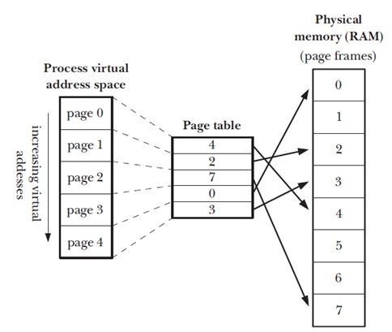

直接展开，探讨一下内存管理中重要的`page fault`流程，在很多书中将其翻译成`缺页中断`，但是就我个人来说更喜欢直译的`缺页异常`这一说法，这主要是为了和一般`中断`区别开来。
两者的区别在于什么呢？
* 一般中断: 发生中断时保护现场上下文环境，然后跳转到需要立马进行处理的地方，然后返回执行下一条指令
* 缺页中断: 发生缺页时保护好上下文环境，然后判断内存是否有足够的空间存储需要的页/段，然后进行调页，结束后返回到发生缺页的指令


如果要谈论`page fault`的发生就需要先谈一下它的诞生。
这个其实需要从分页机制说起，这一部分先前有详细探讨过并还进行过代码的实验，因此这次要说的其实单单就是分页本身的意义，这又要谈及`虚拟内存`和`物理内存`的关系，众所周知`虚拟内存`带来的优势很多，比如`共享内存`，`对物理内存的保护`，`内存空间隔离`等等，这些先前聊过，因为数据最终都是写在`物理内存`上的，所以如何快速通过某种方式将`物理内存`和`虚拟内存`关联起来？那么最终的结果就很明显了，`页机制`其实是为了高效地翻译虚拟内存地址。


如果说单纯地将地址的对应关系记录在内存中的某张表里，这其实没什么问题，但是造成的结果就是极度消耗资源，因为如果内存中的每一个字节都有记录的话，那么表的本身就会超过内存的大小，最终直接导致系统瘫痪掉。那么将内存划分成一个4kb的`page`的集合就显得比较合理了，`物理内存`就用`物理页`，`虚拟内存`就用`虚拟页`，而二者的对应关系则采用`页号:页内偏移`的方式记录，这样就极大地减少了记录的条目数量。





但是新的问题就来了，即时关系记录已经缩减了上千倍，但是如果表内容太多还是会占用巨大的内存，这就又有了技术上的缓解手段：
1. `分段`+`分页`结合
2. `多级页表`


> 这个我觉得记录起来还是蛮有意义的，因为先前只阐述过技术上的实现，而没有去阐述技术诞生的原因，这显然是不够合理的


`分段`的方式的`分页`对象是一个`段`，这样每一个`页表`的大小就减少了，`段`是独立管理，那么不同`段`的也`页表`访问频繁度也不同，这样就提高了访问效率，但是并没有解决`页表`过大这样一个实质性的问题，因此`操作系统`并没有采用这样的方式，而是多采用`多级页表`，其思想就是倘若`页表`中所有的页表项都是无效的`页`那就完全不需要为这一段空间的页维护`页表`，这样就能减少`页表`的大小。


## `一级页表`
就是如上图所示，也可以称为`线性页表`，因为最初的设计上适用的是`4GB`的内存空间，而每页的大小是`4kb`，因此一个`pgt`的大小是`4G/4K = 1M`个页面，上面说了十分浪费内存，因为每一个进程都需要维护一个`4MB`大小的`页表`提供给自身查询。


## `二级页表`
为了减少内存开销，又引入了一个新的表叫做`page directory(页目录)`，可容纳`1k`个`4b`大小的表项，那么其本身为`4kb`大小，存放在一个`4kb页`中，其中的每一个表项指向一个`4kb`大小的`页表`，里面依然是`1k`个表项，而每一个表项代表一个`page`，这样算起来的覆盖范围是`1k * 1k * 4k = 4G`，但是问题是不是需要`4MB + 4kb`来存放表吗，这样占用的内存不是更多了？
其实不是，`页目录`中确实是记录了所有的`页表`，占用了`4kb`的内存空间，但是会标记其中的表项即`页表`是否有效，如果无效的的话则不需要维护该页表。因为`页表`是可以分散在不同的页面上，这样的话就无需维持一个`4MB`的连续内存，而且有相当多的`虚拟内存`是没有被使用的，所以这些都不需要`页表`。


## `三级页表`
新的问题又来了，`x86`引入了`物理地址扩展`后，可以支持大于`4G`(36位)的物理内存，但是碍于`32位`的原因，`虚拟地址`依然还是`4G`，那这样对应关系实际就遭到了破坏，因此为了解决这个问题，再次引入了新的一张表叫做`page middle directory(页中间目录，简称pmd)`，不过这个并没有持续多久，因为硬件在发展


## `四级页表`
x86_64时代代表着`64`位的`CPU`，然而问题在于`CPU`地址总线宽度只有`40bit`，所以`内核地址`也只有`40bit`而已，而`虚拟地址`则为`48bit`，不过这依然需要再次引入页表也就是`page upper director(页上级目录，简称pud)`。


不过不管多级页表怎么变，核心道理就是：对于连续无效页组成的页表，没有必要去记录。


# 关于`页表`与`页`
首先是`页`，`内核内存`和`虚拟内存`之间的映射是`页`与`页`的映射，而这个对应关系不管中间经过了怎样的翻译过程，最终都是需要在页表中表现出来的，而进程之间的用户态内存是相互独立的，你可以有一个`0x2223`的地址，我也可以有一个`0x2223`的地址，然而二者对应的`物理地址`却是不同的，而要做到这样就得需要有不同的页表参与其中，而从`task_struct`的属性中看出来，这张不同的表是`页目录`，存放在进程当中:
```
mm->pgd;
```
其实是有两张表，可以称为`内核页表`和`进程页表`，`内核页表`唯一存在于内核中的`页全局目录`里，被所有进程共享，而`进程页表`就是上述的东西了，其中映射的`虚拟地址`既包括`内核态地址`又包含`用户态地址`，而二者`虚 - 实`的方式并不相同，因此`内核态虚拟地址`这部分的映射就需要用到`内核页表`，这儿用到的方式是每个进程的`进程页表`中的`内核态地址`相关表项都是`内核页表`的拷贝，对于地址转换来说，其实`虚拟页`并没有什么意义。


# 缺页
终于说到`缺页`了，上面说了一大通，那么问题在哪呢？很简单，因为`虚拟内存`机制的引入使得大部分程序无法直接读写`物理内存`，一切行为都会过一层审核，这样极大的保护了操作系统不容易遭到破坏，那么自然的，从程序的读写数据都是通过`虚拟内存`，而又因为`物理内存`映射了这段`虚拟内存`，所以才使得能够和`物理内存`交互，而导致`缺页异常`发生的情况有如下：
1. 地址不在`虚拟地址空间`中
2. 地址在`虚拟地址空间`中，但是其访问权限不够，例如写`只读`区间
3. 还有和`物理地址`建立映射关系
4. 映射的`物理页`已经不在内存中
5. 映射的`物理页`访问权限不够
6. `内核态`下，通过`vmalloc`获取线性地址引起的异常，主要是因为延迟更新的问题，导致`进程页表`还没有更新


而通过这些`缺页异常`而衍生出多种linux特性出来，例如`COW`，`延迟分配`，`内存回收中磁盘和内存交换`等，具体形式如下：
1. `COW`，著名的`Dirty COW`漏洞就是爆发在这儿，意义在于使得地址空间上页的拷贝被推迟到实际发生写入的时候，举个简单的例子就是`fork()`出来的进程往往都是父子进程共享数据，但是对于子进程来说页只读，因此直到发生写入时，内核才会为其分配物理内存并拷贝数据到这个内存上供子进程写入。
2. `请求调页`，这个往往发生在`malloc`之类的函数上，这些函数在调用时其实仅仅分配了一段连续的`虚拟内存`，而并没有分配`物理内存`，直到实际访问的时候才去分配`物理页框`，同样的在`内存回收`时也会发生`请求调页`，当分配的`物理页`上的数据已经写到了磁盘上后就会被系统回收掉，当需要读写的时候再分配`物理页框`。这种机制使得程序运行时不必将整个程序加载进内存，而是采用`惰性交换器`，直到需要时才加载。


`缺页异常`的处理步骤：
1. 陷入内核态。
2. 保存用户寄存器和进程状态。
3. 确定中断是否为缺页错误。
4. 检查页面引用是否合法，并确定页面的磁盘位置。
5. 从磁盘读入页面到空闲帧：
. 在该磁盘队列中等待，直到读请求被处理。
. 等待磁盘的寻道或延迟时间。
. 开始传输磁盘页面到空闲帧。
6. 在等待时，将 CPU 分配给其他用户（CPU 调度，可选）。
7. 收到来自 I/O 子系统的中断（I/O 完成）。
8. 保存其他用户的寄存器和进程状态（如果执行了第 6 步）。
9. 确认中断是来自上述磁盘的。
10. 修正页表和其他表，以表示所需页面现在已在内存中。
11. 等待 CPU 再次分配给本进程。
12. 恢复用户寄存器、进程状态和新页表，再重新执行中断的指令。


# 编程中的缺页
上面有很多其实都是`内核特性`一样的东西，而真正到了编程中，因为`page fault`而导致的出人意料的情况比较直观的就在于`内存分配`上，如果实际去测试`malloc`时候就会发现，在`内存管理`上面`C库`有自己的一套想法，`malloc`是`C`库函数，当第一次向申请小于`128kb`内存时，`C库`会通过`sys_brk`调整`brk`的值，算作是扩大`heap`的范围，将这一段内存交给`C库`来管理，这部分内存的管理算是一种从大到小的链表结构。`malloc`在分配虚拟内存时其实会往内存写入`元数据`，这实际上是`C库内存管理`中需要用到的`边界标记`，这导致的结果是什么呢？就是当利用`malloc`分配一个内存时就已经发生了调页，而再`touch`的时候就可能不再调页了。
> 这儿的问题就在于假设你申请的是一个`16byte`大小的空间，然而`malloc`实际去占用的大小为`32byte`，因为`元数据`的原因分配小内存会造成浪费。


这儿的调页情况涉及到一个`chunk`的结构问题：
```
struct malloc_chunk {
  INTERNAL_SIZE_T mchunk_prev_size; /* Size of previous chunk (if free). */
  INTERNAL_SIZE_T mchunk_size; /* Size in bytes, including overhead. */
  struct malloc_chunk* fd; /* double links -- used only if free. */
  struct malloc_chunk* bk;
  /* Only used for large blocks: pointer to next larger size. */
  struct malloc_chunk* fd_nextsize; /* double links -- used only if free. */
  struct malloc_chunk* bk_nextsize;
};
```
不同的`chunk`的结构不太相同，但是大部分都有首位部分，简单来讲就是会在一个申请到的`线性内存`前后写入数据，这就造成了调页产生，而中间的部分如果是在空白页中的就是没有被`mapped`的，但是如果你访问了，就会统一映射到一个`page`，这点可以从`crash`中看出来地址是完全一样的一个`page`。
> 这一点调试方式建议`crash(vtop)`+`gdb`+`maps`一起调试，可以比较直白的看出来


# 总结
针对新分配的内存，如果不进行`touch`的话，确实不会有任何`物理页面`的映射，而如果第一次行为为`read`的话，则是触发一次`page fault`然后调入一个`zero page`进行映射，而如果第一次是`write`的话则是直接从物理池中分配`物理页`映射，而如果是先读后写的话，则是发生`COW`，分配新的`物理页`映射后拷贝信息。
内核代码参考：
```
static int do_anonymous_page(struct mm_struct *mm, struct vm_area_struct *vma,
        unsigned long address, pte_t *page_table, pmd_t *pmd,
        unsigned int flags)
{
    ...
    /* Use the zero-page for reads */
    if (!(flags & FAULT_FLAG_WRITE)) {
        // 只读情况直接从zeropage里拿即可。
        entry = pte_mkspecial(pfn_pte(my_zero_pfn(address),
                        vma->vm_page_prot));
        page_table = pte_offset_map_lock(mm, pmd, address, &ptl);
        if (!pte_none(*page_table))
            goto unlock;
        goto setpte;
    }
    ...
    // 非只读，才会实际从物理池里分配页面
    page = alloc_zeroed_user_highpage_movable(vma, address);
    ...
    // 如果读fault映射了zeropage，将不会递增AnonRSS计数器。
    inc_mm_counter_fast(mm, MM_ANONPAGES);
    page_add_new_anon_rmap(page, vma, address);
setpte:
    ...
}
```


# 参考资料
* [缺页中断相比一般的中断存在哪些区别？](https://blog.csdn.net/bigbaojian/article/details/104070180)
* [Linux的内存分页管理](https://www.cnblogs.com/vamei/p/9329278.html)
* [分页和页表](https://www.cnblogs.com/liujunjun/p/12404498.html)
* [页表机制](https://www.cnblogs.com/argenbarbie/p/5401453.html)
* [内核页表和进程页表](http://blog.chinaunix.net/uid-14528823-id-4334619.html)
* [Chapter 3 Page Table Management](https://www.kernel.org/doc/gorman/html/understand/understand006.html)
* [copy on write(写时复制）](https://blog.csdn.net/weixin_39554266/article/details/82835478)
* [请求调页（请求页面调度）原理及性能详解](http://c.biancheng.net/view/1271.html)
* [Linux系统下深究一个malloc/brk/sbrk新内存后的page fault问题](https://blog.csdn.net/dog250/article/details/80331590)
* [zero page](https://blog.csdn.net/longxj04/article/details/3897432)
* [Understanding glibc malloc](https://sploitfun.wordpress.com/2015/02/10/understanding-glibc-malloc/comment-page-1/)
* [Syscalls used by malloc.](https://sploitfun.wordpress.com/2015/02/11/syscalls-used-by-malloc/)
* [Malloc碎碎念](https://www.cnblogs.com/wangaohui/p/5190889.html)
* [glibc malloc学习笔记之fastbin](https://paper.seebug.org/445/)
* [Linux堆内存管理深入分析（下）](https://introspelliam.github.io/2017/09/15/Linux%E5%A0%86%E5%86%85%E5%AD%98%E7%AE%A1%E7%90%86%E6%B7%B1%E5%85%A5%E5%88%86%E6%9E%90%EF%BC%88%E4%B8%8B%EF%BC%89/)
* [GLIBC2.23 malloc内存分配原理分析](https://www.fandazh.cn/glibc2-23-malloc内存分配原理分析/)
* [Browse the source code of glibc/malloc/malloc.c](https://code.woboq.org/userspace/glibc/malloc/malloc.c.html#malloc_chunk)