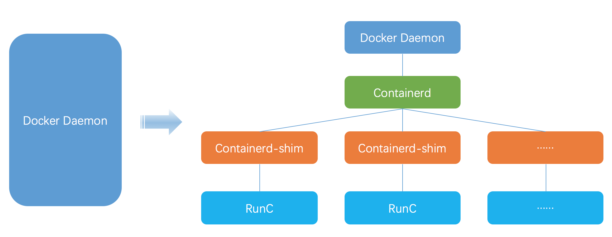

> 本以为这么成熟的东西应该很简单，但是没想到，坑深不见底，所以只从用法来，原理层得有更多的沉淀才能写出来。


完全搞定的话起码得掌握如下知识：
1. `golang`
2. `namespace`
3. `cgroup`
4. `capabilities`
5. `桥接网络`
6. `unionfs(overlay)`


## `namespace`
这个是`虚拟化`的核心知识，也是`kernel`中关于资源隔离的实现，内核中提供的隔离方式有如下几种：
```
#define CLONE_NEWNS 0x00020000 /* New mount namespace group */ 文件系统
#define CLONE_NEWCGROUP 0x02000000 /* New cgroup namespace */  物理资源限制
#define CLONE_NEWUTS 0x04000000 /* New utsname namespace */   主机名和域名
#define CLONE_NEWIPC 0x08000000 /* New ipc namespace */    信号量，消息队列和共享内存
#define CLONE_NEWUSER 0x10000000 /* New user namespace */    用户和用户组
#define CLONE_NEWPID 0x20000000 /* New pid namespace */    进程号
#define CLONE_NEWNET 0x40000000 /* New network namespace */    网络设备，网络栈，端口等网络资源
```
简单来阐述一下就是，`namespace`可以看作是进程的一个属性，进程享有当前`namespace`中的资源，而一个`namespace`中可以有多个进程，他们共享这个`namespace`的资源，而当你修改了`namespace`中的资源后，也只会影响当前`namespace`下的进程。


为了控制`namespace`linux自然提供了相应的API用在开发时使用：
1. `clone()`
2. `setns()`
3. `unshare()`


三种API分别对应了三种情况：
1. 创建进程时同时创建新的`namespace`
2. 将进程加入到一个已经存在的`namespace`
3. 在一个已经存在的进程上进行`namespace`隔离


写一份代码简单测试一下：
```
/*==============================================================================


# Author: lang lyi4ng@gmail.com
# Filetype: C source code
# Environment: Linux & Archlinux
# Tool: Vim & Gcc
# Date: 2019.09.17
# Descprition: namespace learning


================================================================================*/


#define _GNU_SOURCE
#include <sched.h>
#include <stdio.h>
#include <sys/types.h>
#include <sys/wait.h>


#define STACK_SIZE (1024*1024) /* Stack size for cloned child */


static char child_stack[STACK_SIZE];


int child_main(){
 printf("进入子进程\n");


 char *arg[] = {"/bin/bash",NULL};
 char *newhostname = "UTSnamespace";
 sethostname(newhostname,sizeof(newhostname));


 execv("/bin/bash",arg);
	
 return 1;
}


int main(void){


 printf("创建子进程\n");
 int child_pid = clone(child_main,child_stack+STACK_SIZE,CLONE_NEWUSER | CLONE_NEWIPC | CLONE_NEWCGROUP | CLONE_NEWNET | CLONE_NEWNS | CLONE_NEWPID | CLONE_NEWUTS | SIGCHLD,NULL);
 waitpid(child_pid,NULL,0);
 printf("退出子进程\n");


 return 0;


}
```
按照最后的效果来说，实际上也只有`network`和`rootfs`上有些问题，可以通过执行`ifconfig`和`ps`来验证这两个问题。
但是继续使用的时候就会发现`user`其实也是一个问题，因为按照道理来说，一个虚拟化空间中，使用的初始用户应该是`root`才是，也就是一个在虚拟化进程中具有所有资源访问权限的用户，但是为了安全，这个用户在其`父user namespace`应该为一个普通权限。但是就像如上代码运行的结果一样，只是单纯的新建一个`user namespace`，会导致`虚拟化进程user namespace`中的`user`为如下这种情况：
```
[nobody@g0dA lang]$ id
uid=65534(nobody) gid=65534(nobody) 组=65534(nobody)
```
> 现在很多发行版默认禁用了非特权用户命名空间：`kernel.unprivileged_userns_clone`，因此可以执行`sysctl kernel.unprivileged_userns_clone=1`


此刻的`userid`和`groupid`因为没有映射，使用的是由`/proc/sys/kernel/overflowuid(overflowgid)`提供出来的默认映射ID。


首先要知道linux当进程要去读取/写入文件的时候，内核都会检查该进程`user namespace`的`uid`和`gid`，以确认是否具有权限，简单来说内核注重的是`uid`和`gid`，而只有通过`映射`后，才能控制一个`user namespace`的用户在其余`user namespace`中的权限，这点的重要性主要体现在诸如`给其余user namespace中进程发送信号`或者是`访问其余user namespace`的文件。


关于进程的`user namespace`的映射需要用到`/proc/PID/uid_map(gid_map)`，两个内容格式相同：
```
ID-inside-ns ID-outside-ns length
```
为了安全性考虑，对于两个文件的写入也有着严格的权限限制：
1. 两个文件只允许拥有该`user namespace`中`CAP_SETUID`权限的进程写入一次且不允许修改
2. 写入的进程必须是`user namespace`的`父namespace`或者是`子namespace`
3. 最后一个字段通常填`1`表示只映射一个，如果填写大于1则按照顺序一一映射


那如果用宿主机的`root`映射`user namespace`中的`root`会有问题吗？
答案是不会，其实`docker`就是这种映射方式，然而当`子user namespace`的用户访问`父user namespace`的资源的时候，启动进程的`capabilities`都为空，所以虽然是`root`映射，然而`子user namespace`的`root`在`父user namespace`中只相当于一个普通用户。


> Linux 3.19后对`gid_map`做了更改，需要先向`/proc/PID/setgroups`文件中写入`deny`才能修改`gid_map`，这点是为了安全性考虑。因为在`user namespace`中，一个普通的帐号的新的`user namespace`中有了所有的`capabilities`，就可以通过调用`setgroups`让自己获取更大的权限


修改一下代码：
```
/*==============================================================================
# Author: lang lyi4ng@gmail.com
# Filetype: C source code
# Environment: Linux & Archlinux
# Tool: Vim & Gcc
# Date: 2019.09.17
# Descprition: namespace learning
================================================================================*/
#define _GNU_SOURCE
#include <sched.h>
#include <stdio.h>
#include <sys/types.h>
#include <sys/wait.h>
#include <sys/capability.h>


#define STACK_SIZE (1024*1024) /* Stack size for cloned child */


int parent_uid;
int parent_gid;


static char child_stack[STACK_SIZE];
//[...]
void set_uid_map(pid_t pid, int inside_id, int outside_id, int length) {
    char path[256];
    sprintf(path, "/proc/%d/uid_map", pid);
    FILE* uid_map = fopen(path, "w");
    fprintf(uid_map, "%d %d %d", inside_id, outside_id, length);
    fclose(uid_map);
}
void set_gid_map(pid_t pid, int inside_id, int outside_id, int length) {
 /* 3.19之后需要先修改/proc/PID/setgroups
  * 将内容从allow修改为deny
  * 否则无法修改gid_map的内容
  * */
    char path2[256];
    sprintf(path2,"/proc/%d/setgroups",pid);
    FILE* setgroups = fopen(path2,"w");
    fprintf(setgroups, "deny");
    fclose(setgroups);
    char path[256];
    sprintf(path, "/proc/%d/gid_map", pid);
    FILE* gid_map = fopen(path, "w");
    fprintf(gid_map, "%d %d %d", inside_id, outside_id, length);
    fclose(gid_map);
}
int child_main(){
 printf("进入子进程:%d\n",getpid());
 cap_t caps;
 set_uid_map(getpid(), 0, parent_uid, 1);
    set_gid_map(getpid(), 0, parent_gid, 1);
 caps = cap_get_proc();
 printf("capabilities: %s\n",cap_to_text(caps,NULL));
 char *arg[] = {"/bin/bash",NULL};
 char *newhostname = "UTSnamespace";
 //sethostname(newhostname,sizeof(newhostname));
 execv("/bin/bash",arg);	
 return 1;
}
int main(void){
 printf("创建子进程\n");
 parent_uid = getuid();
 parent_gid = getgid();
 int child_pid = clone(child_main,child_stack+STACK_SIZE,CLONE_NEWUSER | CLONE_NEWIPC | CLONE_NEWCGROUP | CLONE_NEWNET | CLONE_NEWNS | CLONE_NEWUTS | SIGCHLD,NULL);
 waitpid(child_pid,NULL,0);
 printf("退出子进程\n");
 return 0;
}
```
> 当`user namespace`被创建后，第一个`进程`被认定为`init`进程，需要被赋予该`namespace`中的全部`capabilities`，这样才能完成所有必要的初始化工作。


# 文件系统
这个点得结合`mount namespace`一起说。`mount namespace`会隔离文件系统的挂载点，使得不同的`mount namespace`拥有独立的挂载信息，并且不会相互影响，当`clone`或者`unshare`创建新的`mount namespace`的时候，新创建的`namespace`会拷贝一份老`namespace`的挂载列表，从此之后相互之间的挂载卸载不会相互影响，这些对于构建专属文件系统目录非常有用。


这儿得引入`docker`的一个文件系统技术原理 -- `UnionFS`，将多个目录内容联合挂载到相同的目录下，而目录的物理位置是分开的。
`UnionFS`的实现也有很多技术：
1. `aufs`
2. `overlay`
3. `DeviceMapper`


具体是用哪一种，其实还要看一下你自己的系统支持，因为这些实际上这是挂载格式而已，那么看一下系统支持的文件系统类型是有必要的。
```
/lib/modules/kernl-version/kernel/fs/
```
到此目录下查看当前内核版本支持的文件系统。不过也可以看一下`docker`使用的情况：
```
$docker info | grep Storage
Storage Driver: overlay2
```
因此一个虚拟化容器启动后，最好的方式是通过`pivot_root`的方式切换当前根目录，挂载到全新的`rootfs`上。而这个全新的`rootfs`可以通过`overlayfs`创建出来，这样可以达到一个读写分层的效果。
```
sudo mount -t overlay overlay -olowerdir=LLL,upperdir=UUU,workdir=WWW MMM
```
> 其中还有关于aufs的一段轶事， [aufs不能进入内核的原因](https://www.iteye.com/blog/leniks-1987200)很有意思


而关于`文件系统`的分层还有一个比较重要的原因就是很多用户态工具都是配合`文件系统`来使用，因此如果还是用`host`的`文件系统`就无法达成隔离的效果。


# 网络
这部分是虚拟化容器里非常有意思的一点，倘若只是单纯的做了网络隔离，那么新的`network namespace`会有一个本地环回接口，而且还是默认关闭的，需要手动开启。
> 网络这一块我是真的差，unix网络这一块还没开始学习，很烦


就解决方案来说，最广泛的就是`docker`本身在用的方法，用`bridge`和`veth-pair`结合做出来的容器网络。


# capabilities
普通用户执行某些管理员才有权限的操作，有三种方法：
1. sudo
2. SUID
3. capabilities


关于capabilities的机制很简单，就是在权限检查时，当执行线程的身份是非root时，会检查该线程是否具有特权操作对应的capabilities然后决定是否继续执行。


<div class="wiz-table-container" style="position: relative; padding: 0px;"><div class="wiz-table-body"><table class="confluenceTable wrapped"><colgroup><col><col></colgroup><thead><tr><th class="confluenceTh mceSelected" data-mce-style="text-align: left;" style="background-color:rgb(240, 240, 240);">capability 名称</th><th class="confluenceTh mceSelected" data-mce-style="text-align: left;" style="background-color:rgb(240, 240, 240);">描述</th></tr></thead><tbody><tr><td class="confluenceTd mceSelected" style="background-color:rgb(237, 245, 255) !important;">CAP_AUDIT_CONTROL</td><td class="confluenceTd mceSelected" style="background-color:rgb(237, 245, 255) !important;">启用和禁用内核审计；改变审计过滤规则；检索审计状态和过滤规则</td></tr><tr><td class="confluenceTd mceSelected" style="background-color:rgb(237, 245, 255) !important;">CAP_AUDIT_READ</td><td class="confluenceTd mceSelected" style="background-color:rgb(237, 245, 255) !important;">允许通过 multicast netlink 套接字读取审计日志</td></tr><tr><td class="confluenceTd mceSelected" style="background-color:rgb(237, 245, 255) !important;">CAP_AUDIT_WRITE</td><td class="confluenceTd mceSelected" style="background-color:rgb(237, 245, 255) !important;">将记录写入内核审计日志</td></tr><tr><td class="confluenceTd mceSelected" style="background-color:rgb(237, 245, 255) !important;">CAP_BLOCK_SUSPEND</td><td class="confluenceTd mceSelected" style="background-color:rgb(237, 245, 255) !important;">使用可以阻止系统挂起的特性</td></tr><tr><td class="confluenceTd mceSelected" style="background-color:rgb(237, 245, 255) !important;">CAP_CHOWN</td><td class="confluenceTd mceSelected" style="background-color:rgb(237, 245, 255) !important;">修改文件所有者的权限</td></tr><tr><td class="confluenceTd mceSelected" style="background-color:rgb(237, 245, 255) !important;">CAP_DAC_OVERRIDE</td><td class="confluenceTd mceSelected" style="background-color:rgb(237, 245, 255) !important;">忽略文件的 DAC 访问限制</td></tr><tr><td class="confluenceTd mceSelected" style="background-color:rgb(237, 245, 255) !important;">CAP_DAC_READ_SEARCH</td><td class="confluenceTd mceSelected" style="background-color:rgb(237, 245, 255) !important;">忽略文件读及目录搜索的 DAC 访问限制</td></tr><tr><td class="confluenceTd mceSelected" style="background-color:rgb(237, 245, 255) !important;">CAP_FOWNER</td><td class="confluenceTd mceSelected" style="background-color:rgb(237, 245, 255) !important;">忽略文件属主 ID 必须和进程用户 ID 相匹配的限制</td></tr><tr><td class="confluenceTd mceSelected" style="background-color:rgb(237, 245, 255) !important;">CAP_FSETID</td><td class="confluenceTd mceSelected" style="background-color:rgb(237, 245, 255) !important;">允许设置文件的 setuid 位</td></tr><tr><td class="confluenceTd mceSelected" style="background-color:rgb(237, 245, 255) !important;">CAP_IPC_LOCK</td><td class="confluenceTd mceSelected" style="background-color:rgb(237, 245, 255) !important;">允许锁定共享内存片段</td></tr><tr><td class="confluenceTd mceSelected" style="background-color:rgb(237, 245, 255) !important;">CAP_IPC_OWNER</td><td class="confluenceTd mceSelected" style="background-color:rgb(237, 245, 255) !important;">忽略 IPC 所有权检查</td></tr><tr><td class="confluenceTd mceSelected" style="background-color:rgb(237, 245, 255) !important;">CAP_KILL</td><td class="confluenceTd mceSelected" style="background-color:rgb(237, 245, 255) !important;">允许对不属于自己的进程发送信号</td></tr><tr><td class="confluenceTd mceSelected" style="background-color:rgb(237, 245, 255) !important;">CAP_LEASE</td><td class="confluenceTd mceSelected" style="background-color:rgb(237, 245, 255) !important;">允许修改文件锁的 FL_LEASE 标志</td></tr><tr><td class="confluenceTd mceSelected" style="background-color:rgb(237, 245, 255) !important;">CAP_LINUX_IMMUTABLE</td><td class="confluenceTd mceSelected" style="background-color:rgb(237, 245, 255) !important;">允许修改文件的 IMMUTABLE 和 APPEND 属性标志</td></tr><tr><td class="confluenceTd mceSelected" style="background-color:rgb(237, 245, 255) !important;">CAP_MAC_ADMIN</td><td class="confluenceTd mceSelected" style="background-color:rgb(237, 245, 255) !important;">允许 MAC 配置或状态更改</td></tr><tr><td class="confluenceTd mceSelected" style="background-color:rgb(237, 245, 255) !important;">CAP_MAC_OVERRIDE</td><td class="confluenceTd mceSelected" style="background-color:rgb(237, 245, 255) !important;">忽略文件的 DAC 访问限制</td></tr><tr><td class="confluenceTd mceSelected" style="background-color:rgb(237, 245, 255) !important;">CAP_MKNOD</td><td class="confluenceTd mceSelected" style="background-color:rgb(237, 245, 255) !important;">允许使用 mknod() 系统调用</td></tr><tr><td class="confluenceTd mceSelected" style="background-color:rgb(237, 245, 255) !important;">CAP_NET_ADMIN</td><td class="confluenceTd mceSelected" style="background-color:rgb(237, 245, 255) !important;">允许执行网络管理任务</td></tr><tr><td class="confluenceTd mceSelected" style="background-color:rgb(237, 245, 255) !important;">CAP_NET_BIND_SERVICE</td><td class="confluenceTd mceSelected" style="background-color:rgb(237, 245, 255) !important;">允许绑定到小于 1024 的端口</td></tr><tr><td class="confluenceTd mceSelected" style="background-color:rgb(237, 245, 255) !important;">CAP_NET_BROADCAST</td><td class="confluenceTd mceSelected" style="background-color:rgb(237, 245, 255) !important;">允许网络广播和多播访问</td></tr><tr><td class="confluenceTd mceSelected" style="background-color:rgb(237, 245, 255) !important;">CAP_NET_RAW</td><td class="confluenceTd mceSelected" style="background-color:rgb(237, 245, 255) !important;">允许使用原始套接字</td></tr><tr><td class="confluenceTd mceSelected" style="background-color:rgb(237, 245, 255) !important;">CAP_SETGID</td><td class="confluenceTd mceSelected" style="background-color:rgb(237, 245, 255) !important;">允许改变进程的 GID</td></tr><tr><td class="confluenceTd mceSelected" style="background-color:rgb(237, 245, 255) !important;">CAP_SETFCAP</td><td class="confluenceTd mceSelected" style="background-color:rgb(237, 245, 255) !important;">允许为文件设置任意的 capabilities</td></tr><tr><td class="confluenceTd mceSelected" style="background-color:rgb(237, 245, 255) !important;">CAP_SETPCAP</td><td class="confluenceTd mceSelected" style="background-color:rgb(237, 245, 255) !important;">参考 capabilities man page</td></tr><tr><td class="confluenceTd mceSelected" style="background-color:rgb(237, 245, 255) !important;">CAP_SETUID</td><td class="confluenceTd mceSelected" style="background-color:rgb(237, 245, 255) !important;">允许改变进程的 UID</td></tr><tr><td class="confluenceTd mceSelected" style="background-color:rgb(237, 245, 255) !important;">CAP_SYS_ADMIN</td><td class="confluenceTd mceSelected" style="background-color:rgb(237, 245, 255) !important;">允许执行系统管理任务，如加载或卸载文件系统、设置磁盘配额等</td></tr><tr><td class="confluenceTd mceSelected" style="background-color:rgb(237, 245, 255) !important;">CAP_SYS_BOOT</td><td class="confluenceTd mceSelected" style="background-color:rgb(237, 245, 255) !important;">允许重新启动系统</td></tr><tr><td class="confluenceTd mceSelected" style="background-color:rgb(237, 245, 255) !important;">CAP_SYS_CHROOT</td><td class="confluenceTd mceSelected" style="background-color:rgb(237, 245, 255) !important;">允许使用 chroot() 系统调用</td></tr><tr><td class="confluenceTd mceSelected" style="background-color:rgb(237, 245, 255) !important;">CAP_SYS_MODULE</td><td class="confluenceTd mceSelected" style="background-color:rgb(237, 245, 255) !important;">允许插入和删除内核模块</td></tr><tr><td class="confluenceTd mceSelected" style="background-color:rgb(237, 245, 255) !important;">CAP_SYS_NICE</td><td class="confluenceTd mceSelected" style="background-color:rgb(237, 245, 255) !important;">允许提升优先级及设置其他进程的优先级</td></tr><tr><td class="confluenceTd mceSelected" style="background-color:rgb(237, 245, 255) !important;">CAP_SYS_PACCT</td><td class="confluenceTd mceSelected" style="background-color:rgb(237, 245, 255) !important;">允许执行进程的 BSD 式审计</td></tr><tr><td class="confluenceTd mceSelected" style="background-color:rgb(237, 245, 255) !important;">CAP_SYS_PTRACE</td><td class="confluenceTd mceSelected" style="background-color:rgb(237, 245, 255) !important;">允许跟踪任何进程</td></tr><tr><td class="confluenceTd mceSelected" style="background-color:rgb(237, 245, 255) !important;">CAP_SYS_RAWIO</td><td class="confluenceTd mceSelected" style="background-color:rgb(237, 245, 255) !important;">允许直接访问 /devport、/dev/mem、/dev/kmem 及原始块设备</td></tr><tr><td class="confluenceTd mceSelected" style="background-color:rgb(237, 245, 255) !important;">CAP_SYS_RESOURCE</td><td class="confluenceTd mceSelected" style="background-color:rgb(237, 245, 255) !important;">忽略资源限制</td></tr><tr><td class="confluenceTd mceSelected" style="background-color:rgb(237, 245, 255) !important;">CAP_SYS_TIME</td><td class="confluenceTd mceSelected" style="background-color:rgb(237, 245, 255) !important;">允许改变系统时钟</td></tr><tr><td class="confluenceTd mceSelected" style="background-color:rgb(237, 245, 255) !important;">CAP_SYS_TTY_CONFIG</td><td class="confluenceTd mceSelected" style="background-color:rgb(237, 245, 255) !important;">允许配置 TTY 设备</td></tr><tr><td class="confluenceTd mceSelected" style="background-color:rgb(237, 245, 255) !important;">CAP_SYSLOG</td><td class="confluenceTd mceSelected" style="background-color:rgb(237, 245, 255) !important;">允许使用 syslog() 系统调用</td></tr><tr><td class="confluenceTd mceSelected" style="background-color:rgb(237, 245, 255) !important;">CAP_WAKE_ALARM</td><td class="confluenceTd mceSelected" style="background-color:rgb(237, 245, 255) !important;">允许触发一些能唤醒系统的东西(比如 CLOCK_BOOTTIME_ALARM 计时器)</td></tr></tbody></table></div></div>


而`Linux capabilities`分为`进程capabilities`和`文件capabilities(文件扩展属性)`。
线程的有5种`capabilities`集合：
1. Permitted：定义了线程`capabilities`的上限，`Effectice`和`Inheritable`集合中的`capabilities`必须包含在此集合中。
2. Effective：线程执行时内核会检查的`capabilities`集合，决定线程是否能执行特权操作
3. Inheritable：执行`exec()`调用后，能够被继承的`capabilities`，但是此集合中的`capabilities`是被添加到新线程的`Permitted`集合中，而不是添加到`Effective`
4. Bounding：`Inheritable`的超集，如果`capabilities`不在此集中，即使是在`Permitted`中存在线程也不能把`capabilities`添加到`Inheritable`中，执行`fork()`会传递给子进程该集合，并且在`execve`后依然保持不变。
5. Ambient：`4.3 kernel`之后的特性，简单来说在此集合中的`capabilities`会被自动继承下去。


`文件capabilities`需要有文件系统的支持，如果挂载时使用了`nouuid`，则所有`capabilities`会被忽略。
直接引用别人整理的公式：
我们用 P 代表执行 execve() 前线程的 capabilities，P' 代表执行 execve() 后线程的 capabilities，F 代表可执行文件的 capabilities。那么：
```
P’(ambient) = (file is privileged) ? 0 : P(ambient)
P’(permitted) = (P(inheritable) & F(inheritable)) |
                      (F(permitted) & P(bounding))) | P’(ambient)
P’(effective) = F(effective) ? P’(permitted) : P’(ambient)
P’(inheritable) = P(inheritable) [i.e., unchanged]
P’(bounding) = P(bounding) [i.e., unchanged]
```
1. 如果用户是 root 用户，那么执行 execve() 后线程的 Ambient 集合是空集；如果是普通用户，那么执行 execve() 后线程的 Ambient 集合将会继承执行 execve() 前线程的 Ambient 集合。
2. 执行 execve() 前线程的 Inheritable 集合与可执行文件的 Inheritable 集合取交集，会被添加到执行 execve() 后线程的 Permitted 集合；可执行文件的 capability bounding 集合与可执行文件的 Permitted 集合取交集，也会被添加到执行 execve() 后线程的 Permitted 集合；同时执行 execve() 后线程的 Ambient 集合中的 capabilities 会被自动添加到该线程的 Permitted 集合中。
3. 如果可执行文件开启了 Effective 标志位，那么在执行完 execve() 后，线程 Permitted 集合中的 capabilities 会自动添加到它的 Effective 集合中。
4. 执行 execve() 前线程的 Inheritable 集合会继承给执行 execve() 后线程的 Inheritable 集合。


不过如果是通过`fork()`的话，子进程则完全复制父进程的`capabilities`。


# `Init`进程
> 首先记录一个好用的命令: `ps xf -o pid,ppid,stat,args`


在真实系统下当`孤儿进程`产生后，内核会按照如下的方式去收养在其退出时去回收`PCB`，以免产生僵尸进程，这是`init进程`程序提供的功能：
1. 找到相同线程组里其它可用线程
2. 沿着它的进程树向祖先进程找一个最近的`child_subreaper`并且运行着的进程
> kernel 3.4以后支持`prctl`系统调用，将调用进程标记为`child subreaper`属性，获取到`收养能力`，但是仅限于`收养`，资源回收方面还需要自己写逻辑，这是`pid_namespace`的一个属性


3. 该namespace下进程号为1的进程


这涉及到`kernel`中的两个函数：
1. `forget_original_parent()`
2. `find_new_reaper()`


然而在`docker容器`内部，`1号`进程极大可能是一个`无init`能力的进程，即`entrypoint进程`，简单来说，就是最终被内部的`1号进程`接管，然后又因为此进程没有调用`wait/waitpid`获取该进程状态信息从而导致该`孤儿进程`在`结束/退出`时变成`僵尸进程`，长期驻留在系统中，最后占用所有的进程号从而导致系统无法产生新进程返回`EAGAIN`。


说段历史，`docker`在`1.11`版本以后更改了架构





`Runc`进程会在创建容器后自动退出，然后容器的初始进程被`Containerd-shim`进程领养，因为`shim`设置了`child_subreaper`，其后代(`runc`)产生的`孤儿进程`都会被该进程领养，而有因为`containerd-shim`进程在容器的`PID namespace`中不可见，所以在容器中是属于`0号进程`。
但是这儿却有了BUG产生，也或许是`docker`和`kernel`的不合，那就是在`kernel 4.4`以前，`find_new_reaper`函数在查找祖先进程的`child_subreaper`属性，并没有限制`ns_level`，这就导致容器内部的所有`进程拖孤`都会查找到`containerd-shim`进程，而又恰好`containerd-shim`有拖孤能力，就完美的解决了僵尸进程的产生。
然而`kernel 4.4`以上打了一个`patch`
```
From c6c70f4455d1eda91065e93cc4f7eddf4499b105 Mon Sep 17 00:00:00 2001
From: Oleg Nesterov <oleg@redhat.com>
Date: Mon, 30 Jan 2017 19:17:35 +0100
Subject: exit: fix the setns() && PR_SET_CHILD_SUBREAPER interaction
 
find_new_reaper() checks same_thread_group(reaper, child_reaper) to
prevent the cross-namespace reparenting but this is not enough if the
exiting parent was injected by setns() + fork().
 
Suppose we have a process P in the root namespace and some namespace X.
P does setns() to enter the X namespace, and forks the child C.
C forks a grandchild G and exits.
 
The grandchild G should be re-parented to X->child_reaper, but in this
case the ->real_parent chain does not lead to ->child_reaper, so it will
be wrongly reparanted to P's sub-reaper or a global init.
 
Signed-off-by: Oleg Nesterov <oleg@redhat.com>
Signed-off-by: Eric W. Biederman <ebiederm@xmission.com>
---
 kernel/exit.c | 13 ++++++++-----
 1 file changed, 8 insertions(+), 5 deletions(-)
 
diff --git a/kernel/exit.c b/kernel/exit.c
index 8f14b86..5cfbd59 100644
--- a/kernel/exit.c
+++ b/kernel/exit.c
@@ -578,15 +578,18 @@ static struct task_struct *find_new_reaper(struct task_struct *father,
   return thread;
 
  if (father->signal->has_child_subreaper) {
+ unsigned int ns_level = task_pid(father)->level;
   /*
    * Find the first ->is_child_subreaper ancestor in our pid_ns.
- * We start from father to ensure we can not look into another
- * namespace, this is safe because all its threads are dead.
+ * We can't check reaper != child_reaper to ensure we do not
+ * cross the namespaces, the exiting parent could be injected
+ * by setns() + fork().
+ * We check pid->level, this is slightly more efficient than
+ * task_active_pid_ns(reaper) != task_active_pid_ns(father).
    */
- for (reaper = father;
- !same_thread_group(reaper, child_reaper);
+ for (reaper = father->real_parent;
+ task_pid(reaper)->level == ns_level;
        reaper = reaper->real_parent) {
- /* call_usermodehelper() descendants need this check */
    if (reaper == &init_task)
     break;
    if (!reaper->signal->is_child_subreaper)
-- 
```
`reaper`查找的流程中限制了`ns_level`，这就导致docker本来处理`僵尸进程`的能力又失去了，因此在`1.13`后又产生了大的改动，就是在`docker run`的启动参数中加了一个`--init`的传参，会生成一个`/sbin/docker-init`程序并启动。这样在docker启动后其实先启动的是`init`程序，然后由`init`程序去拉起`entrypoint`进程，这样容器内再有`孤儿进程产生`会被直接挂载到`init`进程下，而此`init进程`又是真正具有处理能力的程序，从而避免了`僵尸进程`的产生，且`1号进程`被`kill`时，会销毁该`pid namespace`，相同`pid namespace`中的所有进程都将收到`SIGKILL`信号而销毁掉，就此`docker`和`kernel`又回到了一个相互和谐的时代。
> 这个`docker-init`是tini，很好用的一个容器内init程序


# 参考资料
* [深入理解Docker容器引擎runC执行框架](http://www.sel.zju.edu.cn/?p=840)
* [Docker背后的内核知识——Namespace资源隔离](http://www.sel.zju.edu.cn/?p=556)
* [RunC 是什么？](https://www.cnblogs.com/sparkdev/p/9032209.html)
* [runc source code——network](http://newto.me/runc-network/)
* [managing-containers-runc](https://blog.selectel.com/managing-containers-runc/)
* [master/config.md](https://github.com/opencontainers/runtime-spec/blob/master/config.md)
* [Linux的capability深入分析（2）](https://blog.csdn.net/wangpengqi/article/details/9821231)
* [runc 启动容器过程分析(附 CVE-2019-5736 实现过程)](https://imkira.com/a28.html)
* [linux-capabilities机制](http://rk700.github.io/2016/10/26/linux-capabilities/)
* [Docker技术原理之Linux UnionFS（容器镜像）](https://www.jishuwen.com/d/26Ps)
* [理解Docker（3）：Docker 使用 Linux namespace 隔离容器的运行环境](https://www.cnblogs.com/sammyliu/p/5878973.html)
* [Linux Namespace系列（07）：user namespace (CLONE_NEWUSER) (第一部分)](https://segmentfault.com/a/1190000006913195)
* [linuxea:了解uid和gid如何在docker容器中工作](https://www.linuxea.com/2295.html)
* [linux namespace](https://xiazemin.github.io/MyBlog/linux/2018/04/29/namespace.html)
* [Linux Namespaces in operation記錄 - part 5](https://www.twblogs.net/a/5d66e301bd9eee5327fec739)
* [aufs不能进入内核的原因](https://www.iteye.com/blog/leniks-1987200)
* [把玩overlay文件系统](http://blog.lucode.net/linux/play-with-overlayfs.html)
* [Docker存储驱动之--overlay2](https://www.jianshu.com/p/3826859a6d6e)
* [Linux Capabilities 入门教程：概念篇](https://www.yangcs.net/posts/linux-capabilities-why-they-exist-and-how-they-work/)
* [谁是Docker容器的init(1)进程](http://shareinto.github.io/2019/01/30/docker-init(1)/)
* [PID namespace与Docker容器init进程](http://hustcat.github.io/pid-namespace-and-init/)
* [进程托孤](https://blog.csdn.net/wennuanddianbo/article/details/101305653)