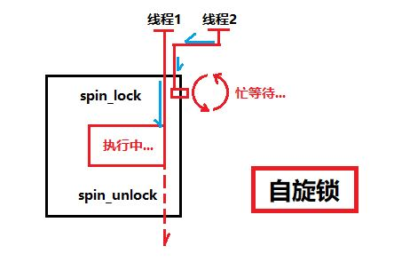
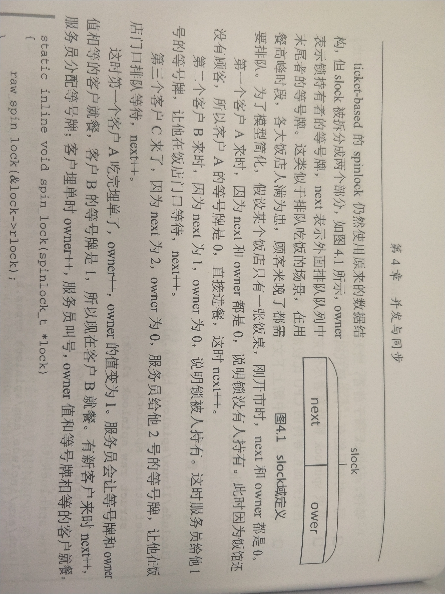
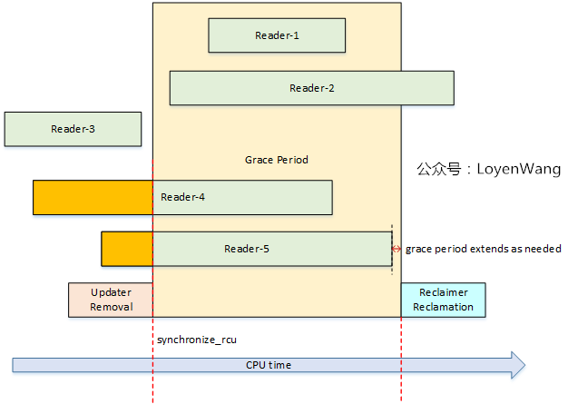
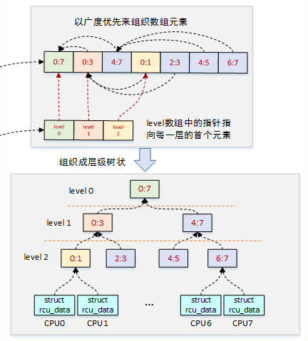

> 写这个完全就是因为遇到了死锁问题知识不够无法快速解决，因此才来稍微积攒一点，因此只是浅尝辄止不会过分深入，以后有机会再反过来详细研究一遍


术语了解：
* `临界区`： 访问和操作共享数据的代码段，这些代码可能被多个使用者同时操作，比如自加自减，而设计上应当进行保护防止同时被多个`执行线程`访问。
* `并发源`：访问`临界区`的代码路径或者`执行线程`。
* `同步机制`：用于实现控制多个`执行线程`按照一定规则和顺序访问系统资源的机制。
* `互斥机制`：用于实现控制某系统资源在任意时刻值允许一个`执行线程`访问的机制。


导致`并发`的原因：
1. `中断和异常`，中断发生后中断处理程序和被中断的进程间可能发生并发访问。
2. `软中断和tasklet`，软中断和tasklet随时可能被执行调度，从而打断当前正在执行的进程上下文。
3. `内核抢占`，调度器支持可抢占特性导致进程之间的并发访问，例如更高优先级的进程访问了之前进程要访问的某个临界资源。
4. `多处理器并发执行`，多个处理器运行的多个进程，有可能同时针对某资源进行访问。


这个可能有些抽象，举一个例子来说明一下：
```
static int i = 0;


void thread_A_func()
{
    i++;

}


void thread_B_func()
{
    i++;

}
```
这个最终`i`的结果可能是`2`也可能是`1`，这是因为`i`就是一个`临界资源`，两个线程分别在不同的`cpu`上完全有可能发生并发访问，最终导致意料意外的结果。Linux是一个典型的多用户，多任务，抢占式内核调度的操作系统，并发情况是不可避免的情况，而为了确保任务的正确性和系统稳定性，必须要有一套机制能够优雅的进行调度解决资源抢占的冲突问题，这就是`同步和互斥`。
> 按照个人理解，同步是一种宏观目的，而互斥是一种具体的手段


# 保护机制
在上述的背景下，内核提供了多种并发访问的保护机制
1. `原子操作`
2. `spinlock(自旋锁)`
3. `信号量`
4. `mutex互斥体`
5. `rwlock(读写锁)`
6. `RCU`


这些都可以被统称为`锁机制`，其中各个各的优势同样也各有各的劣势，就一一简单说明一下。


## `原子操作`
这是`linux`中最简单的同步方法，所谓原子操作就是该操作是最小执行单位，不会在执行完毕前被任何其他任务或者事件打断，但是`C`其实并不能实现原子操作，因此需要依靠底层架构来提供这个能力，但也因为足够底层，这就导致该操作主要用于实现资源计数，比如在`TCP/IP协议栈`中就大量使用了原子操作。只针对现代多处理器/多核系统来说，原子操作的实现有两个机制，一个是指令前缀`LOCK`实现的总线锁，能够阻塞其余处理器对相关内存地址缓存的访问，还有一个机制是缓存锁，即处理器直接修改内部的内存地址，通过缓存一致性保证操作原子性。
> 这儿涉及到内存屏障的一些知识支撑，但是我没学所以跳过。


## `spinlock自旋锁`
`linux`的锁的等待机制一般有两种，一种是`睡眠等待`，一种就是`轮询等待`，`spinlock`的就是后者，在无法获取`spinlock`锁时会不断的尝试直到获取到位置，正因为其特性所以设计的初衷就是适用于一个能够尽快执行完毕的`临界区`，这是一个轻量级锁，因此也被在内核中大量使用。





老版本例如`2.6.0`的自旋锁实现可以关注一个结构体
```
typedef struct {
    volatile unsigned int lock;  //volatile表示改变后立马更新到内存而不进行缓存
#ifdef CONFIG_DEBUG_SPINLOCK
    unsigned magic;
#endif
} spinlock_t;
```
其余线程在执行代码时首先会尝试对临界区`进行加锁操作，如果加锁失败，则会进入到一段`do-while`的抢占循环中，直到自己加锁成功，但是这儿存在一个问题，就是有多个线程都在自旋等待的时候，下次获取自旋锁是通过抢占的方式来实现，这就导致老线程直到最后才能获得自旋锁从而等待了很久，因此在新版本中加入了`队列`实现先到先得的情况实现`排队自旋`。
```
typedef struct {
#ifdef __AARCH64EB__
 u16 next;
 u16 owner;
#else
 u16 owner;
 u16 next;
#endif
} __aligned(4) arch_spinlock_t;
```
关于这一段的关系书上讲的特别好：





```
只有 Next 域与 Owner 域相等时，才表明锁处于未使用状态（此时也无人申请该锁）。排队自旋锁初始化时 slock 被置为 0，即 Owner 和 Next 置为 0。内核执行线程申请自旋锁时，原子地将 Next 域加 1，并将原值返回作为自己的票据序号。如果返回的票据序号等于申请时的 Owner 值，说明自旋锁处于未使用状态，则直接获得锁；否则，该线程忙等待检查 Owner 域是否等于自己持有的票据序号，一旦相等，则表明锁轮到自己获取。线程释放锁时，原子地将 Owner 域加 1 即可，下一个线程将会发现这一变化，从忙等待状态中退出。线程将严格地按照申请顺序依次获取排队自旋锁，从而完全解决了“不公平”问题。
```
而关于`spinlock`的死锁问题很大程度上来源于中断，例如一个`临界区`被`自旋锁`保护了，而当前进程被中断暂停，假设中断处理程序也要访问该`临界区`，自然需要进入`自旋等待`的环节，但又由于先前的程序被暂停而无法释放锁，从而导致死锁的产生，因此`spin_lock_irq`在加锁的同时还会关闭本地处理器中断，确保在获取`spinlock`锁时不会发生中断避免死锁，但是有一点需要特别注意的是，使用了`spinlock`就要保证`临界区`代码是原子执行，不能休眠或者主动调度。
> `kmalloc`在资源不足的时候会进入到睡眠等待，而`CPU`在检测到当前执行线程进入睡眠时会主动进行调度，导致死锁问题。


## `信号量`和`互斥体`
`信号量`其实比较特殊，只是因为其特性可以当作锁来使用，其本质是一个资源计数器，记录对某个资源的存取情况，支持`PV`操作，即`减少`和`增加`。
> 美国人将其改成了`down`和`up`，也就对应了函数`down()`和`up()`


1. 进程调用`down()`检查信号量是否大于0
2. 如果大于的话则将信号量减一，如果不大于0则掉执行睡眠等待行为
3. 睡眠等待行为是把当前进程放到信号量的`wait_list`链表里，然后进入睡眠模式让出CPU
4. 释放信号量时调用`up()`检测当前的等待队列`sem->wait_list`
5. 为空则直接把信号量加一，不为空则按照顺序唤醒进程，并从链表上删除该进程


与其余的锁相比，信号量明显更注重资源统计而非访问控制，它可以让多个进程持锁，而这完全取决于`sema_init`的`count`值。
而`mutex`则是一种类似的实现，如果说`信号量`是对多个处理器访问某个公共资源的保护机制的话，`mutex`则完全是为了互斥操作，其只允许受保护资源被单一访问，有点类似于`信号量`的值为1的情况，但是单独设计`mutex`的目的是在于`mutex`的语义更为轻便，适用于锁争用激烈的测试场景下。(`mutex作者自己说的`)
```
struct mutex {
 atomic_long_t owner;
 spinlock_t wait_lock;
#ifdef CONFIG_MUTEX_SPIN_ON_OWNER
 struct optimistic_spin_queue osq; /* Spinner MCS lock */
#endif
 struct list_head wait_list;
#ifdef CONFIG_DEBUG_MUTEXES
 void *magic;
#endif
#ifdef CONFIG_DEBUG_LOCK_ALLOC
 struct lockdep_map dep_map;
#endif
};
```
和`信号量`一样，`wait_list`是一个睡眠等待队列，而`wait_lock`则是保护读写该队列的`spinlock`锁，其中`owner`是锁持有者的`task_struct`，但是得开`CONFIG_MUTEXT_SPIN_ON_OWNER`，而`osq`则是一个`MCS`锁机制，这是在原生的`spinlock`更为优化的一种自旋锁方案，主要解决的是大量自旋锁在共享变量上自旋而导致的`cpu cacheline`颠簸的问题，但是因为数据结构的问题，所以还没有直接用在自旋锁上，只是用在了小部分地方。
不过对于`mutex`来说，其高效和简洁带来的问题就是使用场景严格，仅适用与线程之间，且同一时刻只有一个线程可以持有`mutex`，但是相较于`信号量`，还是优先选择`mutex`，除非不满足场景。


## `rwlock`
之前的几种锁机制都知识单纯的对`临界区`进行保护，但是并没有区分`临界区`的读写属性，多处理器系统允许多个读者同时访问共享资源，是因为对于读操作来说，读者进入`临界区`并不会改变资源本身，也就不会对其余读者产生影响，而写者则是排他的，即读写锁具有如下特性：
1. 允许多个读者同时进入`临界区`，但是同时刻写者不能进入。
2. `临界区`中同一时刻只能有一个写者
3. `临界区`中不能同时存在读者和写者
4. `临界区`是`写模式`加锁时，所有尝试加锁的线程都会被阻塞


读写锁适用于数据结构读远大于写的情况，因为这样能够提高并行性，极大提高效率。读写锁的实现略微复杂，需要分别从`读锁`和`写锁`两方面来阐述，而在解锁上又需要按照队列中的读写属性再细分唤醒的机制，着实麻烦，但是从源码的实现上来看，其关于锁的判定还是源于一个`sem`
```
struct rw_semaphore {
 atomic_long_t count;
 struct list_head wait_list;
 raw_spinlock_t wait_lock;
#ifdef CONFIG_RWSEM_SPIN_ON_OWNER
 struct optimistic_spin_queue osq; /* spinner MCS lock */
 /*
  * Write owner. Used as a speculative check to see
  * if the owner is running on the cpu.
  */
 struct task_struct *owner;
#endif
#ifdef CONFIG_DEBUG_LOCK_ALLOC
 struct lockdep_map dep_map;
#endif
};
```
这个倒是和`mutex`的结构很像，只不过访问控制上做了读写识别而已，而其判定依据则是`count`的值，这是一个高低域组成的值，低16bit表示读者或者写者的个数，而高16bit代表有一个或者pending状态的写者，以及睡眠等待队列中有人在睡眠等待。
1. 0x00000000 [0, 0]代表无读无写无等待
2. 0x0000000x [0, x]有x个读者或者正在申请的读者
3. 0xffff000x [-1, x]有x个活跃读者，但是有写者在睡眠等待，或者有一个写者，有多个读者在睡眠等待
4. 0xffff0001 [-1, 1]有一个写者，或者只有一个读者或者申请中的读者但是有写者在睡眠等待
5. 0xffff0000 [-1, 0]有读者或者写者在睡眠等待，但是还没人持锁


## `RCU`
> 终于到了这个，实际上我遇到的死锁问题好像就是`rcu`上的问题，但是根本不知道怎么分析，只能从头到尾把同步机制整个看一遍了，实惨 : )，`RCU`真的是一个大坑，这个世界上只有两个人能完全看懂`RCU`，一个是上帝，另一个就是作者本人。


在说明各种原理之前，首先就得知道`RCU`机制诞生的原因，`read-copy-update`是`RCU`的全称，意思是`读 - 拷贝 - 更新`这是基于其原理命名的。要知道内核中已经有了`原子操作`，`自旋锁`，`信号量`，`互斥锁`和`读写锁`等多种锁机制，但是除开`信号量`以外的机制都依赖了`原子操作`，这样的话就会因为多`CPU`竞争共享变量使得`缓存一致性`变得十分糟糕从而使得性能下降。因为创造一种读者线程没有或者只有很小同步开销，不需要额外的锁，不需依赖原子操作和内存屏障，仅在写者线程中考虑同步的新型锁机制就被提议了出来，最终就诞生了`RCU`，因为其表现上可以看作是一种加强版的`读写锁`，然而其底层的实现机制上却是相当的复杂。


`RCU`的基本原理是其记录了所有指向共享数据的指针的使用者，而当需要修改共享数据的时候，就先创造一个副本，写线程在副本上修改，等所有读线程都离开临界区后，将指针修改成副本的指针，然后删除旧的数据，因此读者不需要直接与写者进行同步，两者可以并发执行。
> 但其实并非就这么简单，因为其中要考虑的事情就有很多，例如`多写者`的同步，写线程如何修改数据指针等问题极为复杂


`Reader`

* 使用`rcu_read_lock`和`rcu_read_unlock`来界定读者`临界区`
* 访问受保护的数据前，用`rcu_dereference`获取`RCU-protected`的指针
* 使用不可抢占的`RCU`时候，`临界区`中不能有睡眠指令


> `Writer`在实际的功能上应该分为`Updater`和`Reclaimer`，即更新者和回收者


`Updater`
* 多个写者更新数据时，需要使用互斥机制进行保护
* 使用`rcu_assign_pointer`移除旧的指针指向，指向更新后的临界资源
* 使用`synchronize_rcu`或者`call_rcu`来启动`Reclaimer`回收旧资源，其中前者是同步等待回收，后者是异步回收


`Reclaimer`
* 为了确保没有读者正在访问要回收的临界资源，需要等待所有的读者退出`临界区`，等待时间称为`宽限期(Grace Period)`
* 回收的是旧`临界资源`


上述的过程中，会发生问题的就是`Reclaimer`针对`临界资源`回收的这一步，因为在回收的时候如果不加判断是非常有可能有读者正在读`临界资源`的，因此`RCU`需要提供一种机制来确保所有的读者全部退出`rcu_read_lock/rcu_read_unlock`的`临界区`才进行回收处理，用一张盗来的图解释这个过程。





按照`CPU time`从左到右可以分成三个时间段：`并发段`，`宽限期`，`回收段`，在`并发段`中`写者`和`读者`并存，但是按照`RCU`的机制来说，`reader-3/4/5`三者使用的`临界资源`还是`old_data`，而写者已经创建了`new_data`并且修改了`临界资源`指针，然后开始调用`synchronize_rcu`进入到`宽限期`，在`等待段`中并存了`reader-1/2/4/5`，但是`reader-1/2`是在`synchronize_rcu`后才出现的新读者，因此他们使用的`临界资源`已经是`new_data`，所以并不会因为资源回收而产生影响，所以要等待的就仅有`reader-4/5`的结束，他们被称为`Pre-existing RCU读者`，而`synchronize_rcu`在最后一个`Pre-existing RCU读者`离开`临界区`后还会再等待一段时间，然后进入`回收段`正式把`old_data`回收掉。


`宽限期`始于`Removal`，只有当`宽限期`结束才触发回收的工作，而结束的依据取决于处理器的执行状态检测，或者换句话说，`RCU`机制的核心与其可扩展性都依赖于是否能有效地检测出`静止状态(Quiescent Status)`并判断`宽限期`是否结束。


`RCU`有两种方式等待`宽限期`结束，一种是调用同步接口等待结束，另一种是异步接口等待宽限期结束后再进行回调，也就是`synchronize_rcu`和`call_rcu`，但是去追源码的话也可以发现其还是调用了`call_rcu`，只不过增加了一个`wait_for_completion`进行睡眠等待，同时将`wakeme_after_rcu`回调函数传给异步接口，等到宽限期结束后在异步接口中回调其进行唤醒处理。
> 在kernel中的`rcu`实现按照时间上分为`经典RCU`和`TREE RCU`，前者是`2.6.69`以前的`RCU`实现，按照源码实现上分为`tiny rcu`和`tree rcu`，前者更为简洁因为广泛用于小型嵌入式系统。


先说一下`Quiescent Status(qs)`，用于描述处理器的执行状态，当`CPU`完成了至少一次抢占后，则认为度过了一次`qs`，用简洁的话说就是当某个`CPU`正在访问`RCU`保护的`临界区`时，则认为是活动状态，当它离开了`临界区`则认为是静止状态，当所有的`CPU`都至少经历过一次`QS`后，宽限期将结束并触发`Reclaimation`，而具体检测的方案则是检测`cpu`上的当前进程是否运行在`用户态`或是当前进程是否为`idle`且当前没有处在运行`softirq(软中断)`也没有处于运行`中断处理函数`的状态，则认为其经过了一次`qs`，调用`rcu_sched_qs`和`rcu_bh_qs`标记该`cpu`的数据结构`rcu_sched_data`和`rcu_bh_data`的`passed_quiesc`字段，否则如果当前没处于`软中断`状态则只标记`rcu_bh_data`的`passed_quiesc`。


在`经典RCU`中使用了全局的`cpumask`位图记录`cpu`经历静止状态，但是问题就在于这是一个全局共享数据，那对于多个`CPU`去写的情况一样是要加锁的，倘若`cpu`特别多的话就会导致处理器之间的`锁竞争`特别激烈因而带来极大的性能开销，为了解决这个问题`Tree rcu`被提出来，它提出了分组的概念并引入`rcu_node`的数据结构。





如同上图是一个8核处理器的例子，`tree rcu`将原本全局只有一份的`cpumask`位图改成了`rcu_node->qsmask`即每个节点都有一份用于管理所属的`rcu_data`或是子节点的状态，每个比特位代表一个`rcu_data`或子节点，当其完成了`qs`则清除(置0)相应的比特位
```
struct rcu_node {
     raw_spinlock_t __private lock; //保护本节点的自旋锁
      unsigned long gpnum; //本节点宽限期编号，等于或小于根节点的gpnum
        unsigned long completed; //本节点上一个结束的宽限期编号，等于或小于根节点的completed
        unsigned long qsmask; //QS状态位图，某位为1，代表对应的成员没有经历QS状态
        unsigned long qsmaskinit; //正常宽限期开始时，QS状态的初始值
    ...    
 int grplo; //该分组的CPU最小编号
 int grphi; //该分组的CPU最大编号
 u8 grpnum; //该分组在上一层分组里的编号
 u8 level; //在树中的层级，Root为0
    ...   
        struct rcu_node *parent; //指向父节点
}
```
`level0`为根节点，位图的清除是自下而上，即一个节点所管理的`rcu_data`或是子节点的比特位都被清除了才能清除上一层的位图，而且只有最后清除节点的`cpu`才能去尝试清除父节点的位图，这个意思就是说不论在什么情况下都只是两个处理器在竞争锁，只不过最后处理根节点的位图的那一个`cpu`恰好一直都是失败者而已，当然这是依据上面的例子给出来的对比，因为父节点可能管理有多个`rcu_data`或是子节点。
> `qs`的信息是自下而上，而`gp`的信息则是自上而下，因此才能做到当每一个处理器都经过一次`qs`后使得宽限期结束。


不过上面这些只解答了如何判断一个宽限期结束，然而却没有解答如何经过了一次`qs`，这个就涉及到了`时钟中断`和`rcu中断`了，也就是一个周期性状态检测，不过这部分并不打算再追了，等下次再说吧。


# 参考资料
* [浅析Linux内核同步机制](https://blog.csdn.net/fzubbsc/article/details/37736683)
* [Linux 同步方法剖析](https://www.ibm.com/developerworks/cn/linux/l-linux-synchronization.html)
* [Linux内核中的各种锁](https://blog.csdn.net/godleading/article/details/78259842)
* [读写一气呵成 - Linux中的原子操作](https://zhuanlan.zhihu.com/p/89299392)
* [什么是内存屏障(Memory Barriers)](http://lday.me/2017/11/04/0016_what_is_memory_barriers/)
* [带您进入内核开发的大门 | 自旋锁的使用](https://zhuanlan.zhihu.com/p/62363777)
* [并发：自旋锁](https://cslqm.github.io/2020/01/06/spin-lock/)
* [Linux线程同步之读写锁（rwlock）](https://blog.csdn.net/anonymalias/article/details/9174595)
* [Linux 2.6内核中新的锁机制--RCU](https://www.ibm.com/developerworks/cn/linux/l-rcu/index.html)
* [Linux RCU原理剖析（一）-初窥门径](https://www.cnblogs.com/LoyenWang/p/12681494.html)
* [Linux RCU原理剖析（二）-渐入佳境](https://www.cnblogs.com/LoyenWang/p/12770878.html)